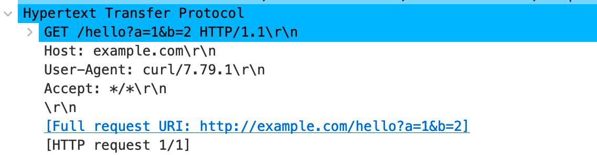
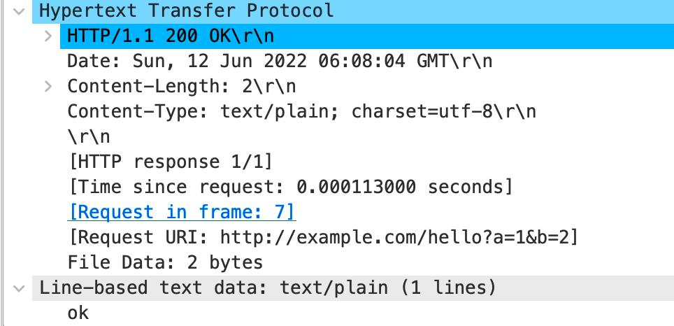
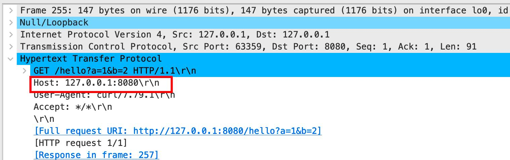
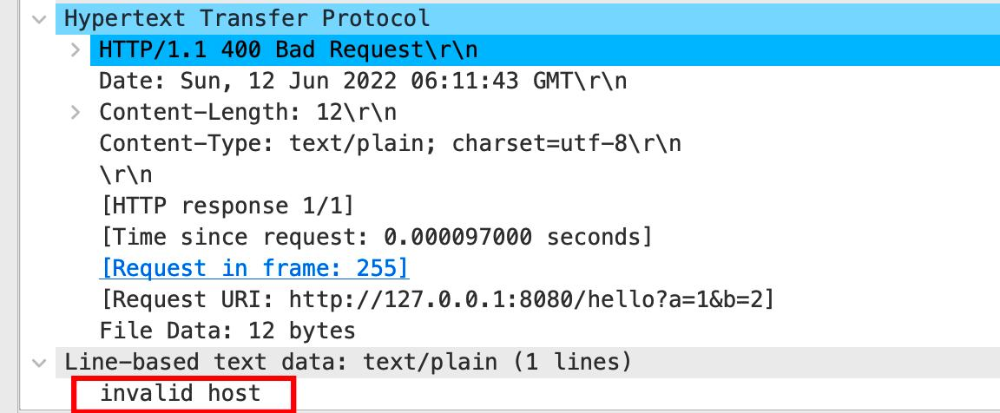

# 开发调试之流量抓包

在日常开发中，我们的应用经常需要远程调用其他的服务的接口。可能，我们经常会遇到，按照别人给的 API 文档编写的 RPC 调用过程代码，总是不能正常的获取响应。
在这个时候，通过抓包来分析对比是一种非常快捷有效的调试手段，下面用几种典型场景来介绍一下。

## 场景1：下游是一个 HTTP Server
如下是简化后的 HTTP Server API 的实现，该 Server 要求必须以指定的主机名访问（相当于同一个 Server 上有部署多个虚拟主机）。

```go
// 简化的下游 HTTP Server API
package main

import (
	"log"
	"net/http"
)

func main() {
	http.HandleFunc("/hello", func(w http.ResponseWriter, r *http.Request) {
		if r.Host != "example.com" {
			w.WriteHeader(400)
			w.Write([]byte("invalid host"))
			return
		}
		// 参数的解析这⾥忽略掉了
		w.Write([]byte("ok"))
	})
	log.Println(http.ListenAndServe(":8080", nil))
}

```

给我们的文档可能是这样的：
```bash
# API 文档

# curl 'http://127.0.0.1:8080/hello?a=1&b=2' -H 'Host: example.com'

输出：
ok
```

在我们开发过程中，我们可能就忽略掉了 Host 这个参数，导致我们接口总是调不通。那针对这种 HTTP 接口我们可以采用如下手段抓包。

### 1.1 wireshark

这是非常老牌和经典的抓包工具了，可以让我们看到网络流中的每一个字节，通过此工具，我们可以将程序发送的字节流和 curl 命令的字节流进行对比来发现问题。网络上的资料非常多，在此就不做过多介绍了。

下面是成功的Request 和Response:





下面是异常时候的 Request 和 Response (不一样的地方已经用红框标记出来)：





### 1.2. nc 命令

nc 即 netcat，是一个功能强大的网络命令。我们可以用 nc 命令来创建一个 server 或者 proxy 来实现抓包的功能。

#### 1.2.1 基本用法

由于上述 HTTP Server 已经是监听了 :8080 端口，所以此时我们可以利用 nc 监听 :8090 端口：

```bash
# 利用 nc 启动一个 server

nc -l 127.0.0.1 8090
```

然后，我们将本来该发往 :8080 端口的请求，发送到 :8090,即：

```bash
# 发送应该正常的情况
curl 'http://127.0.0.1:8090/hello?a=1&b=2' -H 'Host: example.com'
# 注意上述端口已经由 8080 修改为 8090
```

上述 curl 命令执行后，其命令窗口不会有任何输出，会一直阻塞，但是在 nc 的命令终端窗口，会将 Request 信息打印出来：

```bash
# nc 命令终端(正常)
#nc -l 127.0.0.1 8090
GET /hello?a=1&b=2 HTTP/1.1
Host: example.com
User-Agent: curl/7.79.1
Accept: */*
```

如此，再修改程序发送请求的 IP+Port 为此地址，并发送请求，会得到这样的结果：

```bash
# nc 命令终端(异常)
nc -l 127.0.0.1 8090
GET /hello?a=1&b=2 HTTP/1.1
Host: 127.0.0.1:8090
User-Agent: curl/7.79.1
Accept: */*
```

通过对两者 Request 信息的对比，我们也可以发现 Host 参数的不一样，帮我们定位到原因。

?> # 使用 GDP 框架的需要修改 servicer 文件的 Resource 部分：<br />
<br />
修改前：<br />
[[Resource.Manual.default]<br />
Host = "127.0.0.1"<br />
Port = 8080 <br />
<br />
修改为代理 Server 的 IP+Port：<br />
[[Resource.Manual.default]]<br />
Host = "127.0.0.1"<br />
Port = 8090<br />

#### 1.2.2 高级用法

利用 nc 命令创建一个支持 tcp_dump 的 proxy：

```bash
# tcp_proxy.sh
#!/bin/sh -e

if [ $# != 3 ]
then
    echo "usage: $0 <src-port> <dst-host> <dst-port>"
    exit 0
fi

TMP=`mktemp -d`
BACK=$TMP/pipe.back
SENT=$TMP/pipe.sent
RCVD=$TMP/pipe.rcvd
trap 'rm -rf "$TMP"' EXIT
mkfifo -m 0600 "$BACK" "$SENT" "$RCVD"
sed 's/^/ => /' <"$SENT" &
sed 's/^/<=  /' <"$RCVD" &
nc -l  "$1" <"$BACK" | tee "$SENT" | nc "$2" "$3" | tee "$RCVD" >"$BACK"
```

```bash
# 启动此 Proxy:
# 
./tcp_proxy.sh 8090 127.0.0.1 8080
# 参数说明：
# 8090-proxy 监听的端口
# 127.0.0.1 8080 :源地址和端口
```

之后往此 proxy 发送请求：

```bash
# tcp_proxy.sh 运行效果：
 #./tcp_proxy.sh 8090 127.0.0.1 8080
 => GET /hello?a=1&b=2 HTTP/1.1
 => Host: 127.0.0.1:8090
 => User-Agent: curl/7.79.1
 => Accept: */*
 =>
<=  HTTP/1.1 400 Bad Request
<=  Date: Sun, 12 Jun 2022 06:50:21 GMT
<=  Content-Length: 12
<=  Content-Type: text/plain; charset=utf-8
<=
<=  invalid host
```

可以看到，已将 Request 和 Response 都输出到终端上，可供我们对比分析用。

### 1.3 proxydump 工具
这是我用 Go 写的一个小工具（[访问地址](https://github.com/fsgo/proxydump)），其功能和上述 tcp_proxy.sh 基本类似，比如 windows 等没有 nc 命令的环境可以使用。

```bash
# 安装 proxydump 工具
go install github.com/fsgo/proxydump@master
```

启动 proxy

```bash
proxydump -l ":8090" -dest "127.0.0.1:8080"
```

使用过程和上述 nc 命令类似，这里就不再赘述。
该工具还支持使用 -req 和 -resp 来将请求和响应数据写入到指定的文件里，以方便进行再次分析。还支持 Plugin 机制实时以解析出复杂的数据。

小结：虽然上述是以 HTTP Server 下游作为例子，来说明如何抓包分析，但是上述几种工具也可以用于其他 TCP 协议的抓包分析。

## 2.场景 2：下游是一个 Redis Server

Redis 在日常中用的也是非常的多，有时候，我们也需要查看通过抓包来分析程序命令执行的情况。上述介绍的几种工具是可以用于抓包分析的，这里介绍其他的抓包方案。

### 2.1 Redis Monitor 命令

monitor 命令可以打印出 Redis Server 接收到的命令。
使用此命令的限制就是需要 Redis Server 支持此命令，我们使用的线上 BRPD 集群是不支持的，若要使用，需要我们使用自己搭建 Redis 环境。

下面演示下：

1. 启动 Redis Server：

```bash
# redis-server
# 默认监听的是 127.0.0.1:6379
```

2. client 终端-监听：

```bash
# redis-cli
127.0.0.1:6379> MONITOR
OK
# 下面的内容会在下列读写命令执行后输出
1655018645.926800 [0 127.0.0.1:50348] "set" "a" "b"
1655018825.405799 [0 127.0.0.1:50348] "get" "a"
```

3. client 终端-读写：

```bash
# redis-cli
127.0.0.1:6379>set a b
OK
127.0.0.1:6379>get a
"b"
```

### 2.2 EchoInterceptor

GDP 框架的 Redis Client 支持  Interceptor 能力，可以对 Redis 的 Cmd （Request） 和 Result ( Response )进行拦截处理。
Redis 的 EchoIntercpetor 实现的功能为对请求的 Cmd 和 Result 打印输出，这样我们在开发调试的时候，可以在终端日志里看到 Redis 命令的执行情况。

```go
# 在 main.go 里注册 EchoInterceptor:
import (
    "os"
    
    "icode.baidu.com/baidu/gdp/redis"
)

func main(){
   // 其他逻辑
}

func init(){
   // 当需要 Debug  Redis 的时候，注册此功能
   if os.Getenv("DebugRedis")=="true"{
       redis.RegisterInterceptor((&redis.EchoCmdInterceptor{}).Interceptor())
   }
}
```

在终端日志总看到的效果：

```bash
# stdout 日志：
2022/06/12 15:41:21.726578 interceptor.go:129: Redis AfterProcess [cost=113.15977ms]: set abc def: OK
2022/06/12 15:41:21.726626 interceptor.go:129: Redis AfterProcess [cost=113.212134ms]: set abc def: OK
```

## 3.总结
上述介绍了wireshark、nc、proxydump、Redis-Monitor、Redis-EchoInterceptor 这几种不同的抓包的方法和手段。当我们遇到了怎么调试也调试不对的情况的时候，可以选择一种合适的方法来分析可能出错的原因，帮助我们快速的定位到原因。
