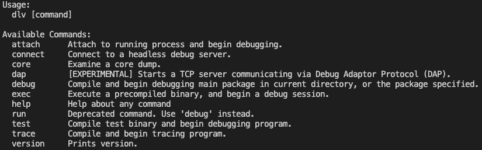
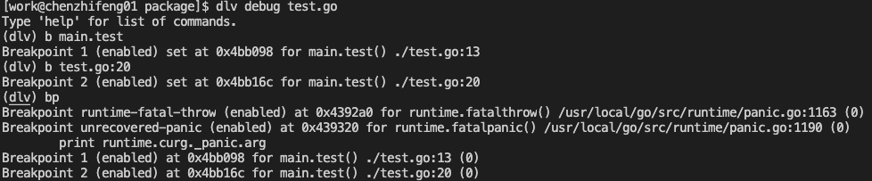
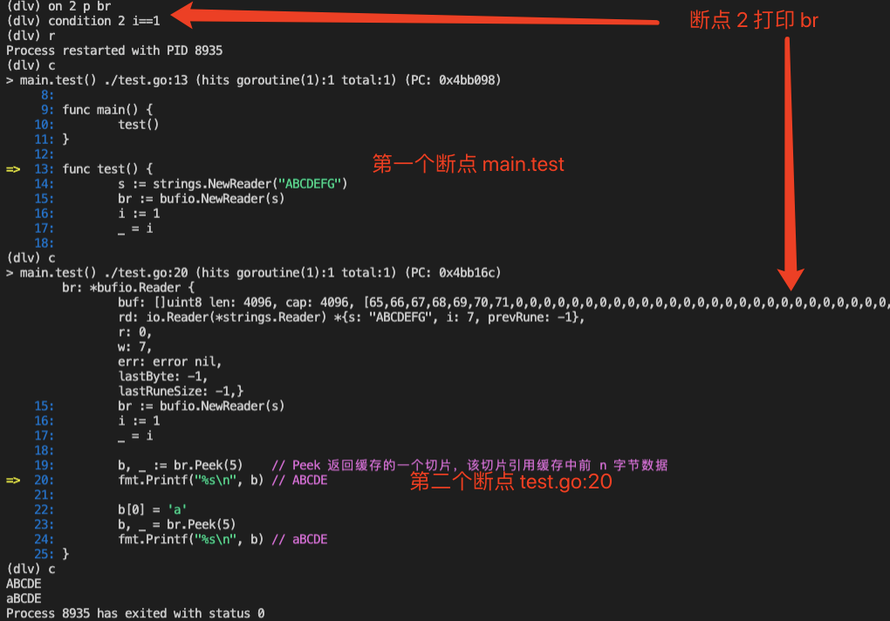
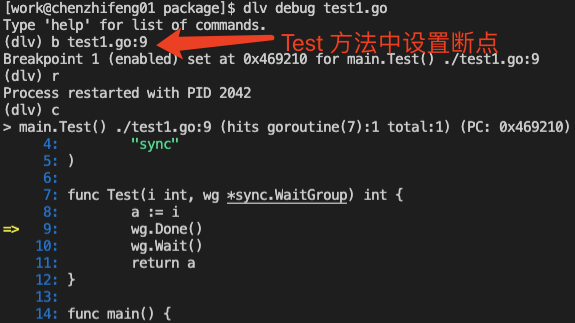
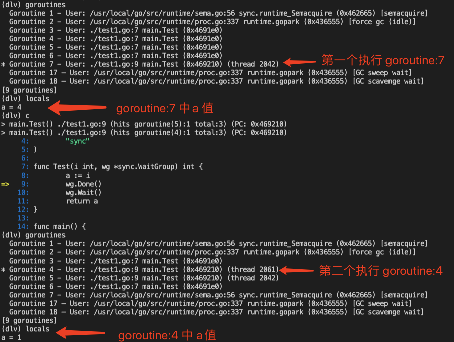
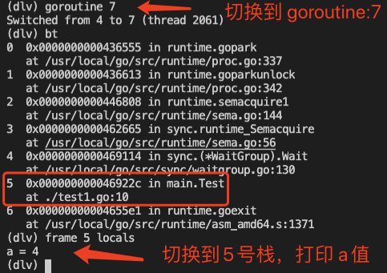
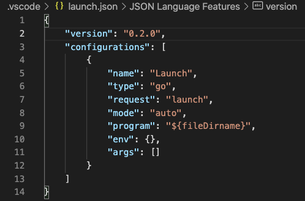
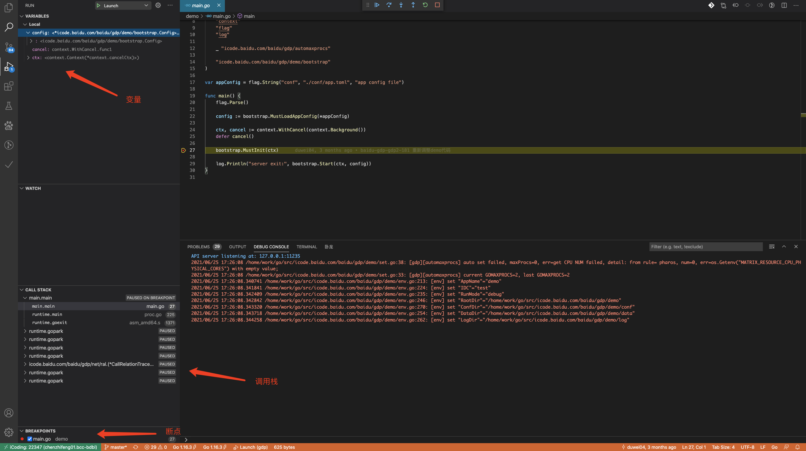

# 如何使用 dlv 调试 Go 代码

利用调试工具进行代码分析是一种很好的手段，在遇到问题时能快速定位分析。gdb 可以调试 Go 程序，但是对于 Go， `dlv （delve）`对于局部引用变量和 goroutine 的打印更友好，vscode 也支持的调试，本文介绍使用 dlv 来调试 Go 程序并介绍在 vscode 下的配置和使用。

## 1. 使用 `Delve` 调试

### 1.1 安装 `Delve`

```bash
# go get 方式安装 dlv

go get -u github.com/go-delve/delve/cmd/dlv
```

```bash
# $GOPATH 方式安装

git clone https://github.com/go-delve/delve.git $GOPATH/src/github.com/go-delve/delve
cd $GOPATH/src/github.com/go-delve/delve
make install
```

### 1.2 进入调试模式



dlv 功能较多，下面是一些常用的功能：

**dlv 调试模式:**

1. `dlv attach [pid]`：可以对正在运行的进程直接进行调试。
2. `dlv debug [xxx.go]`：运行 `dlv debug test.go` 会先编译go源文件，同时执行attach命令进入调试模式，该命令会在当前目录下生成一个名为debug的可执行二进制文件，退出调试模式会自动被删除。
3. `dlv trace [xxx.go] [func name]`：可以追踪函数的调用轨迹。
4. `dlv exec [bin]` ：直接从二进制文件启动调试模式。如果要带参数执行需要添加--，如 `dlv exec executable_file -- -f xxx.conf`
5. `dlv core [bin] [xxx.panic]`：调试 core文件，默认不会产生 core 文件，想让 Go 程序生成 core 文件，需要配置一个环境变量：`export GOTRACEBACK=crash`
6. `dlv test [package name]`：用来调试测试代码的。因为测试代码都是某一个包里面，是以包为单位的。


### 1.3 调试模式命令

关于dlv内的调试命令，和 gdb 差不多，可以使用help查看所有命令 `(dlv) help`

**一些常用命令:**

- `b (break)`：打断点
- `r (restart)`：重启当前进程
- `c (continue)`：继续执行到断点处
- `bp`：查看所有断点
- `on` ：当运行到某断点时执行相应命令，断点可以是名称(在设置断点时可命名断点)或者编号，例如：`on 3 p i`表示运行到断点3时打印- 变量i。
- `cond (condition)` ：有条件的断点，表达式成立才会被中断，当expression为true时指定的断点将被中断，程序将继续执行
- `n (next)`：逐行执行代码，不进入函数内
- `s (step)`：逐行执行代码，遇到函数会跳进内部
- `stepout`：当使用s命令进入某个函数后，执行它可跳出函数
- `si (step-instruction)`：单步单核执行代码，如果不希望多协程并发执行可以使用该命令，这在多协程调试时极为方便restart
- `args`：查看被调用函数所传入的参数值
- `locals`：查看所有局部变量
- `clear`：清除单个断点
- `clearall`：清除所有断点
- `list`：打印当前断点位置的源代码，list后面加行号可以展示该行附近的源代码，要注意该行必须是代码行而不能是空行。
- `bt`：打印当前栈信息。
- `frame`：切换栈。
- `regs`：打印寄存器内容。
- `sources`：打印所有源代码文件路径
- `source`：执行一个含有dlv命令的文件,source命令允许将dlv命令放在一个文件中，然后逐行执行文件内的命令。
- `trace`：类似于打断点，但不会中断，同时会输出一行提示信息。


### 1.4 调试一段 Go 代码

```go
// test.go

package main
 
import (
    "bufio"
    "fmt"
    "strings"
)
 
func main() {
    test()
}
 
func test() {
    s := strings.NewReader("ABCDEFG")
    br := bufio.NewReader(s)
    i := 1
    _ = i
 
    b, _ := br.Peek(5)    // Peek 返回缓存的一个切片，该切片引用缓存中前 n 字节数据
    fmt.Printf("%s\n", b) // ABCDE
 
    b[0] = 'a'
    b, _ = br.Peek(5)
    fmt.Printf("%s\n", b) // aBCDE
}
```

打两个断点



在断点 2 处打印 br 并设置条件中断



### 1.5 `goroutine` 间的调试

```go
// test1.go

package main
 
import (
    "sync"
)
 
func Test(i int, wg *sync.WaitGroup) int {
    a := i
    wg.Done()
    wg.Wait()
    return a
}
 
func main() {
    wg := &sync.WaitGroup{}
    wg.Add(5)
    for i := 0; i < 5; i++ {
        go Test(i, wg)
    }
    wg.Wait()
}
```



在 Test 方法中设置一个断点并不退出，连续 continue 两次，<font  color="red">查看两个 goroutine 编号分别是 7 和 4，其中局部变量 a 值分别是 4 和 1</font>



dlv 默认会一直在主协程上执行，为打印 Test 函数中的临时变量 a，需要进行协程切换，<font  color="red">先执行 goroutine 7 表示切换到7号协程上</font>，然后 bt 命令查看当前协程的栈状态，<font  color="red">执行 `frame 5 locals` 切换到5号栈上并打印栈上的变量</font>。



## 2. 使用 vscode（icoding） 调试

我们一般使用 IDE 提供的 dlv 调试工具调试比较方便，vscode 集成了 dlv 进行调试 Go 代码，默认配置如下：



 在执行入口代码如下 main,go ，选好断点后按 F5 执行，可能出现 【Version of Delve is too old for this version of Go】错误，可能是 Go 版本过高不兼容导致，升级 dlv 即可。

调式页面如下：



