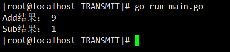

# 调用 .so 文件

Go 1.8 提供了一个创建共享库的新工具：**Plugins！** 只能在 Linux 和 MacOS 下使用。其可以应用如下场景：

- 通过plugin我们可以很方便的对于不同功能加载相应的模块并调用相关的模块；
- 也可以针对不同语言（英文、汉语、德语……）加载不同的语言so文件，进行不同的输出；
- 还可以把编译出的文件给不同的编程语言用（如：c/java/python/lua等）。

以下记录一个Golang调用 .so 文件实现动态化编程的小例子：

## 创建 Plugin 文件

首先创建一个 go文件 `aplugin.go`:

```go
package main

func Add(x, y int) int {
	return x+y
}

func Subtract(x, y int) int {
	return x-y
}
```

## 编译 Plugin 文件

接下来生成 so 文件：
```bash
go build -buildmode=plugin -o aplugin.so aplugin.go
```

到此就得到了 so 文件，可以进行函数的调用测试了。

## 应用 Plugin

新建一个 `main.go` 文件：
```bash
package main
 
import (
	"fmt"
	"plugin"
)
 
func main() {
	ptr, err := plugin.Open("aplugin.so")
	if err != nil {
		fmt.Println(err)
	}
 
	Add, _ := ptr.Lookup("Add")
	sum := Add.(func(int, int) int)(5, 4)
	fmt.Println("Add结果：", sum)
	
	Sub,_ := ptr.Lookup("Subtract")
	sub := Sub.(func(int,int)int)(9,8)
	fmt.Println("Sub结果：",sub)
}
```

结果如下：



## 总结
- `plugin` 包可导出（首字母大写）函数和变量的main包;
- 一个 plugin 只会被初始化一次，并且不会被关闭;
- plugin 的操作都是协程安全的;
- plugin 需要先调用 `Open()` 方法打开 so 文件，再调用 `Lookup()` 方法进行函数和变量的调用。
