这节课，我们来讨论一下 Functional Options 这个编程模式。这是一个函数式编程的应用案例，编程技巧也很好，是目前 Go 语言中最流行的一种编程模式。

但是，在正式讨论这个模式之前，我们先来看看要解决什么样的问题。

## 配置选项问题

在编程中，我们经常需要对一个对象（或是业务实体）进行相关的配置。比如下面这个业务实体（注意，这只是一个示例）：

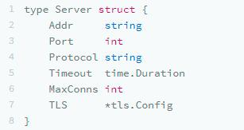

在这个 Server 对象中，我们可以看到：

- 要有侦听的 IP 地址 Addr 和端口号 Port ，这两个配置选项是必填的（当然，IP 地址和端口号都可以有默认值，不过这里我们用于举例，所以是没有默认值，而且不能为空，需要是必填的）。
- 然后，还有协议 Protocol 、 Timeout 和MaxConns 字段，这几个字段是不能为空的，但是有默认值的，比如，协议是 TCP，超时30秒 和 最大链接数1024个。
- 还有一个 TLS ，这个是安全链接，需要配置相关的证书和私钥。这个是可以为空的。

所以，针对这样的配置，我们需要有多种不同的创建不同配置 Server 的函数签名，如下所示：

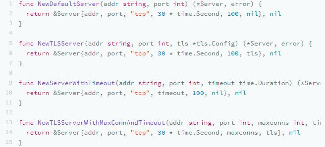

因为 Go 语言不支持重载函数，所以，你得用不同的函数名来应对不同的配置选项。

## 配置对象方案

要解决这个问题，最常见的方式是使用一个配置对象，如下所示：

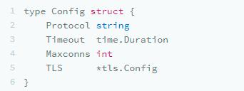

我们把那些非必输的选项都移到一个结构体里，这样一来， Server 对象就会变成：

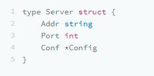

于是，我们就只需要一个 NewServer() 的函数了，在使用前需要构造 Config 对象。

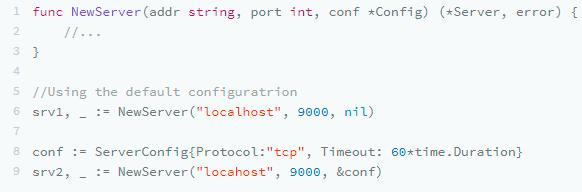

这段代码算是不错了，大多数情况下，我们可能就止步于此了。但是，对于有洁癖的、有追求的程序员来说，他们会看到其中不太好的一点，那就是Config 并不是必需的，所以，你需要判断是否是 nil 或是 Empty—— Config{ }会让我们的代码感觉不太干净。

## Builder 模式

如果你是一个 Java 程序员，熟悉设计模式的一定会很自然地使用 Builder 模式。比如下面的代码：

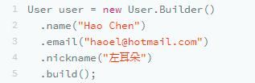

仿照这个模式，我们可以把刚刚的代码改写成下面的样子（注：下面的代码没有考虑出错处理，其中关于出错处理的更多内容，你可以再回顾下第二节课）：

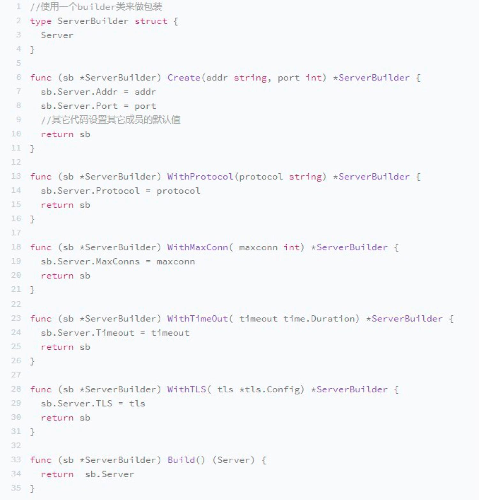

这样一来，就可以使用这样的方式了：

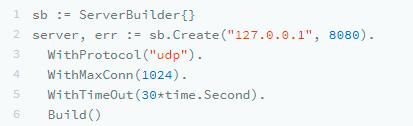

这种方式也很清楚，不需要额外的 Config 类，使用链式的函数调用的方式来构造一个对象，只需要多加一个 Builder 类。你可能会觉得，这个 Builder 类似乎有点多余，我们似乎可以直接在Server 上进行这样的 Builder 构造，的确是这样的。但是，在处理错误的时候可能就有点麻烦，不如一个包装类更好一些。

如果我们想省掉这个包装的结构体，就要请出 Functional Options 上场了：函数式编程。

## Functional Options

首先，我们定义一个函数类型：

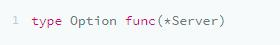

然后，我们可以使用函数式的方式定义一组如下的函数：

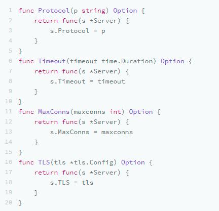

这组代码传入一个参数，然后返回一个函数，返回的这个函数会设置自己的 Server 参数。例如，当我们调用其中的一个函数 MaxConns(30) 时，其返回值是一个 func(s* Server) { s.MaxConns = 30 } 的函数。

这个叫高阶函数。在数学上，这有点像是计算长方形面积的公式为： rect(width, height) = width * height; 这个函数需要两个参数，我们包装一下，就可以变成计算正方形面积的公式：square(width) = rect(width, width) 。也就是说，squre(width)返回了另外一个函数，这个函数就是rect(w,h) ，只不过它的两个参数是一样的，即：f(x) = g(x, x)。

好了，现在我们再定一个 NewServer()的函数，其中，有一个可变参数 options ，它可以传出多个上面的函数，然后使用一个 for-loop 来设置我们的 Server 对象。

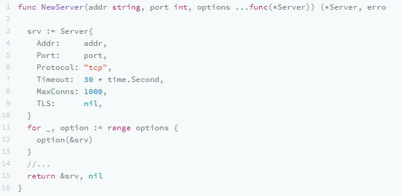

于是，我们在创建 Server 对象的时候，就可以像下面这样：

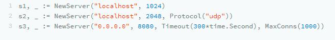

怎么样，是不是高度整洁和优雅？这不但解决了“使用 Config 对象方式的需要有一个 config 参数，但在不需要的时候，是放 nil 还是放 Config{}”的选择困难问题，也不需要引用一个 Builder 的控制对象，直接使用函数式编程，在代码阅读上也很优雅。

所以，以后，你要玩类似的代码时，我强烈推荐你使用 Functional Options 这种方式，这种方式至少带来了 6 个好处：

- 直觉式的编程；
- 高度的可配置化；
- 很容易维护和扩展；
- 自文档；
- 新来的人很容易上手；
- 没有什么令人困惑的事（是 nil 还是空）。