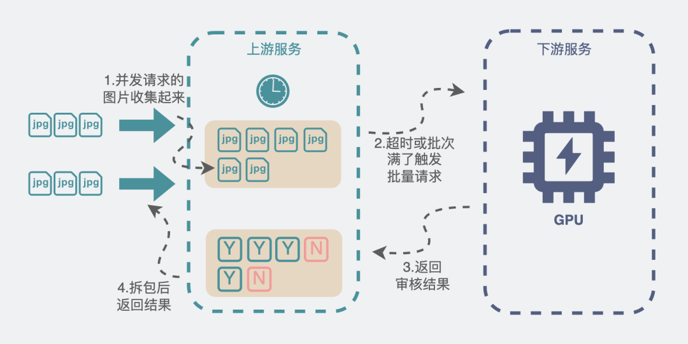

# Nagle算法

> 本文节选：[https://mp.weixin.qq.com/s/3PHLC7_ThViWx_gEKAQF2Q](https://mp.weixin.qq.com/s/3PHLC7_ThViWx_gEKAQF2Q)

我们熟悉的TCP协议里，有个算法叫Nagle算法，设计它的目的，就是为了避免一次传过少数据，提高数据包的有效数据负载。

当我们想要发送一些数据包时，数据包会被放入到一个缓冲区中，不立刻发送，那什么时候会发送呢？

数据包会在以下两个情况被发送：

缓冲区的数据包长度达到某个长度（MSS）时。
或者等待超时（一般为`200ms`）。在超时之前，来的那么多个数据包，就是凑不齐MSS长度，现在超时了，不等了，立即发送。
这个思路就非常值得我们参考。我们完全可以自己在代码层实现一波，实现也非常简单。

1.我们定义一个带锁的全局队列（链表）。

2.当上游服务输入一个视频和它对应的N张图片时，就加锁将这N张**图片数据**和一个**用来存放返回结果的结构体**放入到全局队列中。然后死循环读这个结构体，直到它有结果。就有点像阻塞等待了。

3.同时在服务启动时就起一个**线程A**专门用于**收集**这个全局队列的图片数据。**线程A**负责发起调用下游服务的请求，但只有在下面两个情况下会发起请求

当收集的图片数量达到xx张的时候
距离上次发起请求过了xx毫秒（超时）
4.调用下游结束后，再根据一开始传入的数据，将调用结果拆开来，送回到刚刚提到的**用于存放结果的结构体**中。

5.第2步里的死循环因为**存放返回结果的结构体**，有值了，就可以跳出死循环，继续执行后面的逻辑。



这就像公交车站一样，公交车站不可能每来一个顾客就发一辆公交车，当然是希望车里顾客越多越好。上游每来一个请求，就把请求里的图片，也就是乘客，塞到公交车里，公交车要么到点发车（向下游服务发起请求），要么车满了，也没必要等了，直接发车。这样就保证了每次发车的时候公交车里的顾客数量足够多，发车的次数尽量少。


大体思路就跟上面一样，如果是用go来实现的话，就会更加简单。

比如第1步里的**加锁全局队列**可以改成**有缓冲长度的channel**。第2步里的"**用来存放结果的结构体**"，也可以改成**另一个无缓冲channel**。执行 res := <-ch， 就可以做到**阻塞等待**的效果。

而核心的仿Nagle的代码也大概长下面这样。
```go
func CallAPI() error {
    size := 100
    // 这个数组用于收集视频里的图片，每个 IVideoInfo 下都有N张图片
    videoInfos := make([]IVideoInfo, 0, size)
    // 设置一个200ms定时器
    tick := time.NewTicker(200 * time.Microsecond)
    defer tick.Stop()
  // 死循环
    for {
        select {
        // 由于定时器，每200ms，都会执行到这一行
        case <-tick.C:
            if len(videoInfos) > 0 {
                // 200ms超时，去请求下游
                limitStartFunc(videoInfos, true)
                // 请求结束后把之前收集的数据清空，重新开始收集。
                videoInfos = make([]IVideoInfo, 0, size)
            }
        // AddChan就是所谓的全局队列
        case videoInfo, ok := <-AddChan:
            if !ok {
                // 通道关闭时，如果还有数据没有去发起请求，就请求一波下游服务
                limitStartFunc(videoInfos, false)
                videoInfos = make([]IVideoInfo, 0, size)
                return nil
            } else {
                videoInfos = append(videoInfos, videoInfo)
                if videoInfos 内的图片满足xx数量 {
                    limitStartFunc(videoInfos, false)
                    videoInfos = make([]IVideoInfo, 0, size)
                    // 重置定时器
                    tick.Reset(200 * time.Microsecond)
                }
            }
        }
    }
    return nil
}
```

通过这一操作，上游每来一个请求，都会将视频里的图片收集起来，堆到一定张数的时候再统一请求，大大提升了每次batch call的图片数量，同时也减少了调用下游服务的次数。真·一举两得。

优化的效果也比较明显，上游服务支持的qps从原来不稳定的3q~15q变成稳定的90q。下游的接口耗时也变得稳定多了，从原来的过山车似的飙到15s变成稳定的500ms左右。处理的图片的速度也从原来20qps提升到350qps。

到这里就已经大大超过业务需求的预期（40qps）了，够用就好，多一个qps都是浪费。

