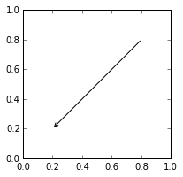

# 使用 style 来配置 pyplot 风格


```python
import matplotlib.pyplot as plt
import numpy as np

%matplotlib inline
```

`style` 是 `pyplot` 的一个子模块，方便进行风格转换， `pyplot` 有很多的预设风格，可以使用 `plt.style.available` 来查看：


```python
plt.style.available
```


    [u'dark_background', u'bmh', u'grayscale', u'ggplot', u'fivethirtyeight']


```python
x = np.linspace(0, 2 * np.pi)
y = np.sin(x)

plt.plot(x, y)

plt.show()
```


    

    


例如，我们可以模仿 `R` 语言中常用的 `ggplot` 风格：


```python
plt.style.use('ggplot')

plt.plot(x, y)

plt.show()
```


    

    


有时候，我们不希望改变全局的风格，只是想暂时改变一下分隔，则可以使用 `context` 将风格改变限制在某一个代码块内：


```python
with plt.style.context(('dark_background')):
    plt.plot(x, y, 'r-o')
    plt.show()
```


    

    


在代码块外绘图则仍然是全局的风格。


```python
with plt.style.context(('dark_background')):
    pass
plt.plot(x, y, 'r-o')
plt.show()
```


    

    


还可以混搭使用多种风格，不过最右边的一种风格会将最左边的覆盖：


```python
plt.style.use(['dark_background', 'ggplot'])

plt.plot(x, y, 'r-o')
plt.show()
```


    

    


事实上，我们还可以自定义风格文件。

自定义文件需要放在 `matplotlib` 的配置文件夹 `mpl_configdir` 的子文件夹 `mpl_configdir/stylelib/` 下，以 `.mplstyle` 结尾。

`mpl_configdir` 的位置可以这样查看：


```python
import matplotlib
matplotlib.get_configdir()
```


    u'c:/Users/Jin\\.matplotlib'


里面的内容以 `属性：值` 的形式保存：

```
axes.titlesize : 24
axes.labelsize : 20
lines.linewidth : 3
lines.markersize : 10
xtick.labelsize : 16
ytick.labelsize : 16
```

假设我们将其保存为 `mpl_configdir/stylelib/presentation.mplstyle`，那么使用这个风格的时候只需要调用：

    plt.style.use('presentation')
