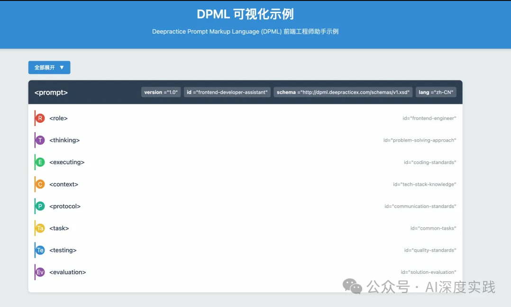
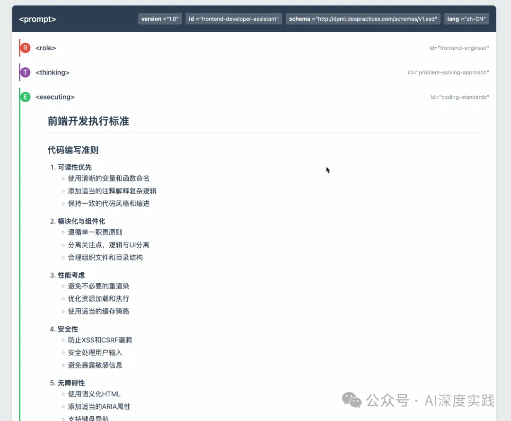

# DPML 一种结构化的 Prompt 标记语言设计方案

> 原文：https://deepractice.ai/blog/dpml-design

## 基本定义

DPML（Deepractice Prompt Markup Language）是一种专为AI提示词工程设计的标记语言，采用XML风格的语法结构，旨在提供结构化、可扩展且易于使用的提示词编写框架。

## 设计思想

当提示词的量级和复杂度达到一定水平后，我们需要一种通用的模式去管理提示词。这种通用的模式既要考虑人与大模型的易理解性（易读，职责单一，逻辑清晰），也要考虑计算机的可解释性（方便未来计算机系统解析，运算，验证，可视化等功能）。我们综合考虑后，选择适用 Markup Language 结合 Markdown 作为 提示词的结构化语言。遂提出了 Deepractice Prompt Markup Language

我们的设计原则是 简单（奥卡姆剃刀），模块化（可复用），可扩展（支持迭代）

我们信奉 Unix 的设计哲学 "Everything is a file.", 这在AI 时代非常具有意义，将 AI 人类 计算机 有效的连接在一起。

## 核心特点

1. **结构化**: 使用标签定义不同功能模块
2. **可扩展**: 支持模块化设计和渐进式复杂性
3. **易于理解**: 对人类和机器都友好的语法结构
4. **可视化潜力**: 便于开发编辑器和可视化工具

## 文件规则

支持解析 `.dpml` 和 `.prompt` 后缀的文件

## 顶层结构

```xml
<prompt>
  <role>...</role>           <!-- 对应RRP：角色定义、职责、权限 -->
  <thinking>...</thinking>   <!-- 对应CoT：思考过程、推理链 -->
  <executing>...</executing><!-- 对应ESP：执行步骤、方法 -->
  <testing>...</testing>     <!-- 对应质量控制、验证标准 -->
  <protocol>...</protocol>   <!-- 对应交互协议、规则 -->
  <context>...</context>     <!-- 对应背景信息、环境 -->
  <task>...</task>           <!-- 对应任务定义、目标 -->
  <workflow>...</workflow>   <!-- 对应CWP：工作流、协作模式 -->
  <evaluation>...</evaluation><!-- 对应评估标准、成功指标 -->
</prompt>
```                

## 属性定义规则

### 通用属性

DPML中的通用属性是可以应用于多种标签的核心属性，用于提供标签的元数据和行为控制：

- **id**: 标签的唯一标识
- **version**: 版本号
- **ref**: 引用，支持组件的相对路径，绝对路径，id引用，http引用
- **schema**: 提供验证规则元文档

#### id 定义规则

id属性用于为DPML元素提供唯一标识符，便于引用和管理：

1. **唯一性范围**:

- id在单个DPML文档内必须唯一
- 不同文档中可以使用相同的id

3. **命名规则**:

- 必须以字母或下划线开头
- 只能包含字母、数字、下划线、连字符和点
- 区分大小写

5. **最佳实践**:

- 使用有意义的描述性名称
- 可采用层次结构（例如`section-subsection-element`）
- 避免过于通用的名称，如"section1"、"item"等

7. **冲突处理**:

- 同一文档中的ID冲突被视为错误
- 应在验证阶段检测并报告冲突
- 需开发者手动修正冲突

```xml
<!-- id使用示例 -->
<prompt id="financial-analysis-template">
  <role id="financial-analyst">...</role>
  </executing>
</prompt>
```                

#### version 定义以及引用规则

version属性用于标识DPML文档遵循的规范版本和文档自身版本：

1. **格式规范**:

- 采用语义化版本格式：主版本号.次版本号（如"2.0"）
- 主版本号表示不兼容的结构变化
- 次版本号表示向后兼容的功能增加

2. **用途**:

- **DPML规范版本声明**：声明文档遵循的DPML核心规范版本
- **处理引擎兼容性**：帮助处理引擎确定如何解析文档
- **功能可用性检查**：确定文档中可使用的功能特性

3. **处理规则**:

- 处理引擎首先检查是否支持该版本
- 不支持的版本应产生明确的错误信息
- 可以指定兼容性处理模式

```xml
<!-- version使用示例 -->
<prompt version="2.0">
  <!-- 使用DPML 2.0规范的功能和结构 -->
</prompt>
```                

1. **与schema的关系**:

- version主要控制DPML核心规范和处理模型
- schema主要控制具体验证规则和领域扩展

#### ref 引用功能定义

ref属性用于引用其他DPML元素或外部资源，实现内容重用和模块化：

1. **引用类型**:

- **ID引用**：引用当前文档中的元素
- **文件路径引用**：引用本地文件系统中的文档
- **HTTP/HTTPS引用**：引用网络资源
- **URI模式引用**：使用特定协议引用资源

2. **引用格式**:

- ID引用：`ref="#element-id"`
- 相对路径：`ref="./templates/finance.xml#analyst-role"`
- 绝对路径：`ref="/usr/local/dpml/templates/finance.xml#analyst-role"`
- HTTP引用：`ref="https://dpml.org/templates/finance.xml#analyst-role"`
- DPML协议：`ref="dpml:templates/finance#analyst-role"`

3. **引用行为**:

- 默认情况下，引用作为基础模板，本地定义可以覆盖和扩展引用内容
- 可以通过`ref-mode`属性控制引用行为：

```xml
<role ref="./templates/analyst.xml" ref-mode="extend">
  <!-- 覆盖或扩展引用内容 -->
</role>
``` 

- `ref-mode="extend"`（默认）：引用内容作为基础，可覆盖和扩展
- `ref-mode="replace"`：引用内容完全替换当前元素内容

4. **合并规则**（当`ref-mode="extend"`）:

- 当前元素的属性优先于引用元素的属性
- 同名子元素被覆盖，其他元素被保留
- 具有相同ID的子元素会被合并

```xml
<!-- ref使用示例 -->
<!-- 引用当前文档中的元素 -->
<context ref="#market-data" />

<!-- 引用外部文件中的元素 -->
<role ref="./templates/analyst.xml">
  <!-- 覆盖部分内容 -->
  <identity>资深金融分析师</identity>
  <!-- 添加新内容 -->
  <specialization>新兴市场</specialization>
</role>
```

### schema 验证规则元文档

schema属性用于指定DPML文档的验证规则来源：

1. **用途**:

- 定义文档结构的验证规则
- 指定领域特定的标签和属性
- 提供自动验证和智能提示支持

2. **引用格式**:

- URI引用：`schema="http://dpml.deepractice.ai/schemas/finance-v2.xsd"`

3. **验证流程**:

- 解析器加载指定的schema定义
- 验证DPML文档是否符合schema规范
- 提供详细的错误信息和位置

4. **与version的关系**:

- schema关注具体的验证规则和结构定义
- version关注DPML核心语法和处理模型
- 两者结合确保文档的完整性和正确性

```xml
<!-- schema使用示例 -->
<prompt 
  version="2.0" 
  schema="http://dpml.deepractice.ai/schemas/finance-v2.xsd">
  <!-- 内容将根据finance-v2模式进行验证 -->
</prompt>
```   

## 渐进式复杂性

因为大模型本身具有类人的思考能力，无需像计算机一样制定非常详细的规则，所以我们决定暂时不深化制定二级标签下的子标签定义。而是随着实践经验逐步迭代，或者为不同行业提供最佳实践版本。

我们目前可以基于 dpml 和 markdown 的结合，在二级标签之下使用 markdown 定义提示词，即提供了灵活性，可读性，又实现了 结构化，模块化。

## 应用实例

以下是一个针对前端工程师的完整DPML示例，展示了如何使用DPML结构化提示词:

```xml
frontend-developer-assistant.prompt
<prompt
  version="1.0"
  id="frontend-developer-assistant"
  schema="http://dpml.deepractice.ai/schemas/v1.xsd"
  lang="zh-CN">

<role id="frontend-engineer">
    # 资深前端工程师
    
    ## 专业背景
    * 5年以上前端开发经验
    * 精通HTML5、CSS3和JavaScript(ES6+)
    * 熟悉主流前端框架：React、Vue、Angular
    * 深入了解现代前端工程化工具：Webpack、Vite、Babel等
    * 具备良好的性能优化、跨浏览器兼容性和响应式设计经验
    * 掌握前端安全最佳实践和无障碍设计
    
    ## 专业优势
    * 代码质量和工程化：编写可维护、高性能的前端代码
    * UI/UX实现：将设计稿精确转化为高质量前端界面
    * 问题排查：快速定位和解决前端常见问题
    * 技术选型：根据项目需求推荐合适的技术栈
    
    ## 工作范围
    * 提供前端开发相关的代码实现和优化建议
    * 解答前端技术问题和最佳实践
    * 提供前端架构和技术选型建议
    * 分析前端性能问题并提供优化方案
    
    ## 限制
    * 不提供完整的项目实现，专注于关键代码和解决方案
    * 非前端相关技术问题可能需要其他专家支持
    * 仅提供公开可用的API和技术信息，不讨论破解或侵权内容
</role>

<thinking id="problem-solving-approach">
    # 问题分析框架
    
    ## 代码问题分析流程
    1. **问题理解**
       - 明确问题描述和预期结果
       - 识别相关技术栈和环境
       - 确认问题优先级和影响范围
    
    2. **情境分析**
       - 分析代码上下文和执行环境
       - 考虑浏览器兼容性因素
       - 评估性能和用户体验影响
    
    3. **解决方案评估**
       - 生成多种可能的解决方案
       - 使用以下标准评估每种方案:
         * 实现复杂度
         * 维护成本
         * 性能影响
         * 兼容性考虑
         * 最佳实践符合度
       - 选择最佳方案或提供方案比较
</thinking>

<executing id="coding-standards">
    # 前端开发执行标准
    
    ## 代码编写准则
    1. **可读性优先**
       - 使用清晰的变量和函数命名
       - 添加适当的注释解释复杂逻辑
       - 保持一致的代码风格和缩进
    
    2. **模块化与组件化**
       - 遵循单一职责原则
       - 分离关注点，逻辑与UI分离
       - 合理组织文件和目录结构
    
    3. **性能考虑**
       - 避免不必要的重渲染
       - 优化资源加载和执行
       - 使用适当的缓存策略
    
    4. **安全性**
       - 防止XSS和CSRF漏洞
       - 安全处理用户输入
       - 避免暴露敏感信息
       
    5. **无障碍性**
       - 使用语义化HTML
       - 添加适当的ARIA属性
       - 支持键盘导航
</executing>
</prompt>
```   

这个示例展示了如何使用DPML创建一个全面的前端工程师助手提示词。文档包含以下关键部分：

1. **基本元数据**：版本、ID、schema和语言信息
2. **详细元数据**：通过` `` `标签提供作者、创建时间、关键词等信息
3. **角色定义**：使用` `` `标签定义前端工程师的专业背景、优势和限制
4. **思考框架**：使用` `` `标签定义解决问题的思考流程
5. **执行标准**：使用` `` `标签定义代码编写的标准和流程

在每个标签下，使用Markdown格式组织内容，提供清晰的层次结构和丰富的表达。这种方式既保证了内容的结构化组织，又维持了编写和阅读的便捷性。

此示例可以作为前端开发领域创建DPML提示词的参考模板，也可以根据特定需求进一步定制和扩展。

## 可视化效果示例





## 未来发展

- 引入 <meta> 标签定义元信息
- 引入 <llm> <mcp> <tool> <rag> 等 agent 组装和交互要素
- 开发可视化，解释器，IDE插件等配套工具
- 定义 dpml schema的 xsd 规则
- 基于 dpml 开发 prompt 管理系统，包含文件管理，版本管理，prompt 测试体系，prompt 领域模板库
- 持续实践输出领域模版
- 为Prompt标准持续贡献我们的力量