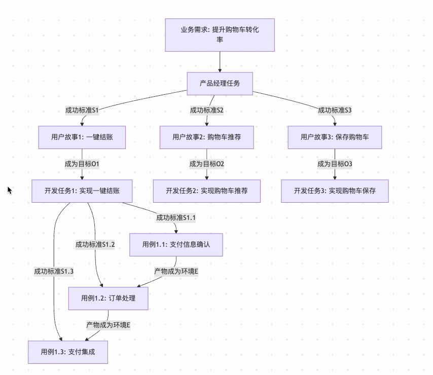

# AI 工作流任务框架：OES

> 原文：https://deepractice.ai/blog/oes-framework

在人工智能迅速发展的今天，我们逐渐发现一个有趣的现象：即使是最先进的AI，也常常在执行任务时"南辕北辙"、"答非所问"或"丢三落四"。明明是强大的语言模型，为何在实际工作流中表现却不尽如人意？本文将探讨AI工作流的核心挑战，并介绍一个新的解决方案——Deepractice OES工作流任务框架。

## AI工作流的困境

### 当AI遇到记忆与认知限制

与人类不同，AI存在严格的上下文窗口限制。无论多么先进的模型，都无法同时处理超出其上下文窗口的信息。这就像是一个只能看到眼前一小块区域的工作者，在处理复杂任务时必然顾此失彼。

更严峻的是，AI没有人类那样的工作记忆和长期记忆区分。每次会话中断或切换，AI就会"遗忘"之前的工作环境，下次再交流时需要重新建立上下文——想象一下，如果你的同事每天早上来上班都忘记了昨天的所有工作，需要你重新解释一遍！

### 碎片化信息与隐含假设

在实际工作中，我们通常无法一次性提供完整的工作背景和条件。当我们说"优化这段代码"时，人类同事自然理解需要考虑性能、可读性、安全性等多方面因素，但AI却可能仅关注执行速度而忽略其他关键维度。

AI被迫在碎片化的信息中工作，不得不做出大量隐含假设。这些假设往往与我们的实际期望不符，导致交付的成果偏离预期。

### 任务独立性与连贯性的矛盾

当AI执行多步骤任务时，常常出现"目标漂移"现象——随着对话的推进，AI逐渐偏离最初设定的目标。在一个步骤完成后，下一个步骤缺乏对整体目标和前序工作的完整理解。

同时，AI任务之间的转移成本极高。从一个AI助手切换到另一个，或从一个会话转到新会话时，几乎所有上下文都需要重建，这极大降低了工作效率。

## OES框架：AI工作流的容器化解决方案

面对这些挑战，我们需要一种全新的工作框架，这就是OES框架——借鉴Docker容器思想打造的AI工作流解决方案。

### 什么是OES框架？

OES代表三个核心要素：

- **目标(Objective)**: 明确定义AI任务的具体预期结果
- **环境(Environment)**: 容器化封装AI执行任务所需的全部上下文、约束和资源
- **成功标准(Success Criteria)**: 客观定义任务完成的验收条件

OES框架不是简单地改进提示词，而是从根本上重构AI工作流的结构，将每个AI任务视为独立、可复用的"工作容器"。

### 目标(O)：AI的定向指南针

在OES框架中，目标不仅回答"做什么"，还包括"为什么做"和"边界在哪里"。一个结构化的目标能够：

- 防止AI在执行过程中"任务漂移"
- 减少AI做出错误隐含假设的空间
- 提供决策优先级框架
- 使AI能够自我评估执行进度

例如，从"优化这段代码"到"优化此代码段的内存占用，将峰值内存使用降至50MB以下，同时保持执行速度不变或提高"，AI的行动路径会清晰许多。

### 环境(E)：AI的工作容器

环境是OES框架中最具创新性的元素，它将Docker容器化思想引入AI工作流。一个完整的环境容器包含：

- **信息资源层**：任务相关的知识、参考资料和数据
- **约束条件层**：技术约束、业务规则和资源限制
- **执行规范层**：风格指南、质量标准和工作流程
- **上下文关联层**：前序任务输出和整体工作地图

通过环境容器化，我们解决了AI工作中的核心问题：

- **任务原子化**：每个任务成为独立可执行的单元，减少外部依赖
- **执行一致性**：相同环境产生相同结果，不同AI基于同一环境能给出一致方案
- **沟通成本降低**：减少澄清和返工，提高首次成功率
- **任务转移效率**：支持跨AI、跨会话的无缝任务交接

#### 环境容器示例：移动应用程序的登录功能开发

让我们看一个具体的环境容器示例，这是为"实现移动应用的用户登录功能"任务准备的环境：

```
环境(E)：移动应用登录功能开发

【信息资源层】
- 技术栈：React Native 0.68，TypeScript 4.5，Redux管理状态
- 设计规范：应用UI设计文件(Figma链接)，登录流程原型图
- 现有组件：已有的表单组件库和样式指南
- API文档：认证服务API规范v2.3，包含端点、参数和响应格式
- 安全指南：公司OAuth2.0实现标准，密码存储策略

【约束条件层】
- 兼容性：必须支持iOS 13+和Android 9+
- 性能要求：冷启动登录流程不超过2秒
- 安全限制：不得在本地存储未加密的用户凭证
- 离线功能：必须支持离线模式下的基本功能访问
- 法规遵从：符合GDPR数据处理要求，包含隐私政策确认

【执行规范层】
- 代码风格：遵循团队ESLint配置，使用函数式组件
- 测试标准：单元测试覆盖率>80%，包含E2E登录流程测试
- 文档要求：组件文档，状态管理逻辑说明
- 审核流程：提交前需经过安全团队的认证流程评审
- 国际化：支持文本外部化，兼容RTL布局

【上下文关联层】
- 前序任务：用户数据模型设计(已完成)，提供用户对象结构
- 依赖服务：依赖认证微服务v3.2(测试环境已部署)
- 后续任务：此登录模块将被用户个人资料模块依赖
- 工作流位置：属于用户账户管理史诗的一部分
- 相关决策：产品团队决定采用社交登录作为备选方案
```

这个环境容器为AI提供了执行任务的完整上下文，无需多轮对话澄清。不同的AI或会话都能基于这个环境独立完成任务，并保持一致的技术方向和质量标准。当任务从设计转到实现，或从一个开发者转到另一个时，环境容器确保了知识的完整传递。

### 成功标准(S)：防止AI敷衍了事

成功标准为AI设立明确的完成门槛，解决AI"表面符合"的倾向问题。一个有效的成功标准包括：

- **结果验收标准**：功能完整性、性能指标和质量要求
- **完整性检查清单**：覆盖所有必要组件和边缘情况
- **质量评估框架**：可维护性、可扩展性和用户体验标准
- **验证与测试方法**：如何客观验证任务是否成功

成功标准不仅说明"什么是好"，还要明确"什么是不可接受"，设定明确的质量门槛。通过多层次的成功标准（基础达标、预期品质、卓越表现），AI能理解"及格"和"优秀"的区别。

#### 成功标准示例：开发缓存管理类

以下是为"开发一个高效的内存缓存管理类"任务设定的简单成功标准：

```
成功标准(S)：缓存管理类开发

【基础功能要求】
- 通过所有提供的单元测试用例(20个测试用例，覆盖基本操作)
- 实现指定的公共接口(get、set、remove、clear、size)
- 满足基本性能要求(10,000项存取操作<500ms)
- 代码中包含必要的Javadoc注释

【质量要求】
- 通过技术leader的代码审查，无严重问题
- 遵循项目代码风格指南(变量命名、缩进、格式等)

【不可接受条件】
- 单元测试未全部通过
- 未通过代码审查
```

这个简单明确的成功标准为AI提供了清晰的目标门槛。AI不仅知道要实现哪些功能，还了解质量标准和评判方式。通过强调单元测试通过和代码审查这两个关键验证手段，确保了AI不会仅仅交付表面上可用但实际上问题重重的代码。

"不可接受条件"部分明确界定了底线，帮助AI理解某些问题是绝对不能出现的，无论其他方面做得多好。这防止了AI在追求某些指标时忽视基本质量保障。

## OES框架的任务网络：原子性与连接性

OES框架的真正威力在于它支持构建完整的任务网络，每个任务既是独立的原子单元，又能与其他任务形成结构化连接。

### 垂直连接：层级分解关系

**父任务的成功标准(S) → 子任务的目标(O)**

这种转化确保子任务直接服务于父任务的完成标准，建立目标的层级传递和一致性。例如，"开发响应迅速、安全、易维护的支付API"可分解为三个子任务，分别针对性能、安全性和可维护性。

### 水平连接：顺序依赖关系

**兄任务的目标(O)与结果 → 弟任务的环境(E)组成部分**

前序任务的成果成为后续任务的环境要素，建立任务间的信息流和依赖关系。例如，UI设计任务的成果自然成为前端开发任务环境的一部分。

### 实例：产品开发的OES任务网络

以下是一个电商平台开发过程中的任务连接网络示例，展示了从需求到实现的完整链路：

1. **产品经理任务**：将业务需求转化为用户故事
2. **开发团队任务**：基于用户故事开发功能
3. **开发子任务**：将每个用户故事拆解为具体用例实现



在这个网络中，我们可以看到OES框架的两种连接关系：

1. **垂直连接示例**：
    - 产品经理的成功标准（完善的用户故事）成为开发任务的目标
    - 开发任务的成功标准（功能实现要求）成为具体用例的目标
2. **水平连接示例**：
    - 用例1.1（支付信息确认）的产物成为用例1.2（订单处理）的环境组成部分
    - 用例1.2（订单处理）的产物成为用例1.3（支付集成）的环境组成部分

通过这种结构化的任务连接，团队能够：

- 确保从业务需求到代码实现的完整追溯
- 保持各层级目标的一致性
- 减少任务间的信息丢失
- 支持团队成员间的无缝协作

每个任务都是独立可执行的原子单元，同时又通过OES元素的转化与其他任务紧密相连，形成一个完整的工作网络。这种方法特别适合AI工作流，因为它明确了每个任务的边界和连接点，大大减少了上下文丢失和任务漂移的风险。

通过这种双向连接，OES框架支持构建既结构化又灵活的AI工作流网络，使复杂项目变得可管理，同时保持整体目标一致性。

## 实践OES框架的方法

### 从单个任务开始

首先尝试将单个AI任务结构化为OES格式：

```
任务：[简要描述]

目标(O)：
- [明确具体的预期结果]
- [目标的边界和约束]
- [目标的价值和意义]

环境(E)：
- 背景：[任务相关的背景信息]
- 资源：[可用的数据、工具、参考]
- 约束：[技术、业务、资源限制]
- 规范：[风格、质量、流程要求]
- 关联：[与其他任务的关系]

成功标准(S)：
- 基础达标：[最低要求和基本功能]
- 预期品质：[符合项目整体质量标准]
- 卓越表现：[超越基本期望的卓越水平]
```

### 构建任务网络

随着单个任务的成功实践，逐步扩展到任务网络：

1. 识别父子任务关系，将父任务的成功标准转化为子任务目标
2. 梳理任务执行顺序，确保前序任务成果纳入后续任务环境
3. 建立任务关系图，直观展示垂直和水平连接
4. 验证连接完整性，确保没有信息断点或目标冲突

## OES框架的未来展望

OES框架希望通过引入环境的方式重构AI工作流的任务体系。随着AI能力的不断提升，我们需要更结构化、更系统化的方法来充分发挥其潜力。

Docker改变了软件部署方式，OES同样希望能改变AI应用方式。通过目标明确化、环境容器化和成功标准具体化，我们能够构建更高效、更可靠的AI工作流，最终实现人机协作的最佳状态。

未来，我们期待OES框架的标准化工具、环境模板库和最佳实践的出现，进一步简化框架应用并提升AI工作效率。

## 结语

在AI技术飞速发展的今天，如何有效管理和组织AI工作流将成为决定AI实际价值的关键因素。OES框架通过借鉴容器化思想，为AI工作流提供了一种结构化、系统化的解决方案。

正如Docker解决了"在我电脑上能运行"的问题，OES框架解决了"在我的会话中能理解"的问题。通过这种范式转变，我们将能更充分地释放AI的潜力，构建真正高效、可靠的智能工作流。
