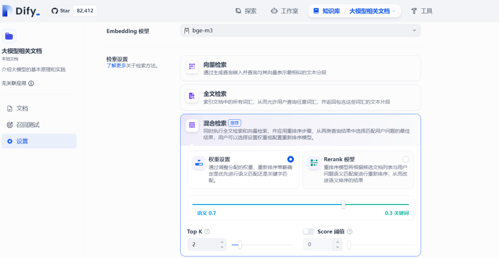
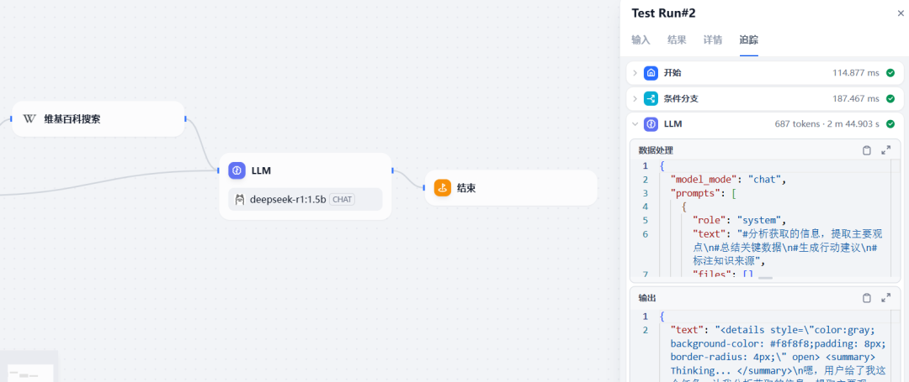

# 本地部署DeepSeek+DiFy平台构建智能体应用

> 在大模型实际应用落地时候，利用智能体平台，构建本地的向量化知识库，基于RAG知识增强技术和大模型的推理能力，提升效率。本文简要介绍RAG、大模型微调和大模型蒸馏的特点，通用智能体平台，并在本地部署DiFy智能体平台，利用本地部署的DeepSeek模型和知识库构建智能体应用。

## 1、RAG、微调和蒸馏

大模型的落地使用主要有RAG、微调和蒸馏几种方式，每种方式有各自的特点和适用场景。

### 1.1 RAG介绍

RAG（Retrieval-Augmented Generation）检索增强生成是一种将外部知识检索与大语言模型生成能力结合的混合架构。其核心思想是通过检索外部知识库（如文档、数据库、网页等），弥补大模型静态训练数据的局限性；在生成答案时直接依赖检索到的证据，减少模型凭空编造内容的可能性，降低幻觉风险。RAG无需重新训练模型，仅需更新知识库即可适配不同专业领域（如医疗、法律）。类似将大模型视为一个“推理专家”，而RAG系统为其配备了一个“实时资料库助手”。在回答问题时，助手先查找相关资料，专家再结合资料生成最终答案。不过RAG依赖检索质量，若知识库不完整或检索策略不当，可能影响效果。


RAG的典型流程分为数据准备、检索阶段、增强生成三个阶段：

- 数据准备阶段：构建可供检索的高质量知识库，包括数据收集、数据预处理和数据向量化。数据收集包括私域内专业文档（PDF/Text）、数据库、网页、API实时数据等；数据预处理将长文本切分为语义连贯的片段（如每段512词），并清洗数据，形成标准化格式；向量化（Embedding）则是使用嵌入模型（如BERT、Sentence-BERT）将文本块转为稠密向量（dense vector），并存储至向量数据库（如FAISS、Milvus、Pinecone等）。
- 检索阶段：从知识库中快速找到与用户问题最相关的文本片段，包括用户查询向量化、相似性检索。用户查询向量化是使用与知识库相同的嵌入模型，将用户问题转为向量；相似性检索计算查询向量与知识库向量的相似度（余弦相似度、欧氏距离），返回Top-K相关片段（通常K=3~10）；重排序使用交叉编码器（Cross-Encoder）对Top-K结果精细排序，提升相关性判断。其中检索算法又分为稠密检索、稀疏检索和混合检索。
- 增强生成阶段：将检索到的证据融入生成过程，输出最终答案，包括上下文构造和生成控制。上下文构造是将检索到的文本片段与用户问题拼接为提示（Prompt）；生成控制则约束模型仅基于检索内容生成，避免偏离证据（通过提示工程或模型微调实现）。

### 1.2 大模型微调

大模型微调（Fine-tuning）是一种迁移学习技术，通过在预训练大模型（如GPT、BERT、LLAMA等）的基础上，使用领域特定数据进行额外训练，使模型适应特定任务（如医疗问答、法律文本分析、代码生成等）。其核心思想是复用通用知识（预训练阶段获得）并注入领域专有知识，从而在少量数据下实现高性能。类似理解为将预训练模型视为“通才”，通过微调将其转变为“专才”。


大模型微调的典型流程分为数据准备、模型选择与配置、微调训练、评估与部署四个阶段：

- 数据准备：构建与目标任务匹配的高质量训练集。通过收集数据、标注数据，并对数据进行去噪和清洗、标准化格式、与预训练模型匹配等数据预处理方式，确保微调数据与真实应用场景分布一致。
- 模型选择与配置：选择合适的预训练模型并配置微调策略。微调策略分为全参数微调和参数高效微调（PEFT），常用方法包括LoRA（Low-Rank Adaptation）注入低秩矩阵，仅训练新增参数、Adapter在Transformer层间插入小型适配模块、Prefix-Tuning在输入前添加可学习前缀向量。
- 微调训练：通过迭代优化，使模型适应目标任务。
- 评估部署：验证模型性能并部署到生产环境。建立评估指标如准确率、F1值、Recall率以及人工评分，对比微调模型与基线模型的实际效果，迭代优化模型。

### 1.3 大模型蒸馏

大模型蒸馏是一种模型压缩技术，通过将复杂的大模型中的知识迁移到更轻量的小模型，在减少模型体积和计算资源需求的同时，尽可能保留原模型的性能。其核心思想是让学生模型不仅学习训练数据的标签（硬标签），还模仿教师模型的输出分布（软标签）或中间特征。


大模型蒸馏的典型流程分为教师模型训练、知识迁移和学生模型训练三个阶段：

- 教师模型训练：训练一个高性能的大模型（教师），作为知识来源。教师模型通常为参数量大、结构复杂的模型（如BERT、GPT-3、ResNet-152），并且在目标任务（分类、生成等）上达到高精度。
- 知识迁移设计：定义学生模型需要模仿的知识类型及迁移方式，包括输出层知识迁移（软标签蒸馏）、中间层知识迁移（特征蒸馏）和关系知识迁移关键方法。软标签教师模型输出的概率分布（如分类任务中各类别的概率）；特征匹配是强制学生模型的中间层特征（如Transformer隐藏状态、CNN特征图）与教师模型对齐；关系匹配是捕捉教师模型中样本间的关系（如样本对之间的相似性）。
- 学生模型训练：利用教师模型的知识和训练数据，训练轻量化的学生模型。

### 1.4 智能体概念

智能体（AI Agent）是一种能够感知环境、自主决策并执行任务的智能系统，其核心特征包括自主性、交互性、适应性、目标导向性等。其基本组成包括：

- 感知（Perception）：感知是Agent与外部世界互动的桥梁，负责收集和解析环境数据。
- 规划（Planning）：规划是Agent的决策大脑，把目标拆解成可执行的步骤，制定实现目标的策略。
- 记忆（Memory）：记忆分为短期和长期，允许Agent存储和检索信息，支持学习和长期知识积累。短期记忆，能在对话中记住用户的问题和偏好，提供即时的个性化服务。长期记忆，会存储先前研究的数据和结果，用于新项目，加速发现过程。
- 工具使用（Tools Use）：工具使用是指Agent利用外部资源或工具增强其能力。这些工具可以是API、软件库、硬件设备或其他服务。
- 行动（Action）：行动是Agent执行任务和与环境互动的具体行为。它基于规划和记忆执行具体动作，完成任务并响应环境。


智能体的发展依赖于大模型、强化学习、多模态融合等技术，尤其是大模型显著提升了其自然交互与复杂推理能力。

## 2、通用智能体平台选择

在实际的应用落地时候，利用智能体平台，构建本地的向量化知识库，基于RAG知识增强技术和大模型的推理能力，提升问题分析和处理的效率。通用的智能体平台有很多，比如开源的DiFy、LangChain、CherryStudio等，商业版的有Coze、腾讯混元等。各平台有不同的特性，以下是DiFy、LangChain和Coze平台的特性对比。

1）易用性  
DiFy提供可视化界面和低代码配置，支持非技术人员参与开发，适合快速构建生产级应用；LangChain学习曲线陡峭，需熟悉模块化组件（如Chains、Agents）和编程接口，适合技术背景较强的开发者；Coze通常提供拖拽式界面和预置模板，强调快速部署AI Bot，适合轻量级应用开发。


2）功能特性  
DiFy集成RAG引擎、Agent框架和多模型支持；支持Prompt编排、数据操作和API集成；提供LLMOps全生命周期管理。LangChain模块化设计（Model I/O、Retrieval、Agents等），支持复杂链式调用和动态代理交互，开源生态丰富。Coze专注于Bot开发，集成对话管理、插件市场和多模态交互，提供预训练工作流和自动化部署工具。


3）社区生态  
DiFy社区处于早期阶段，依赖官方文档和企业支持，集成第三方工具较少。LangChain开源社区活跃，GitHub Star超8.7万，支持多语言版本（Python/JS），集成向量数据库、工具和插件丰富。Coze为大厂产品，依赖官方生态支持，插件市场和应用模板丰富，但社区贡献有限。


4）开源性质  
DiFy完全开源（Apache 2.0协议），允许代码修改和二次开发，社区版功能受限，企业版需商业授权。LangChain完全开源（Apache 2.0协议），社区贡献活跃，支持自定义模块和工具集成，但缺乏统一的产品化支持。Coze为为闭源商业平台，提供云服务和API调用，扩展性依赖官方接口。


5）问题分类  
Dify擅长处理企业级应用开发，如知识库问答、自动化工作流和API服务部署。LangChain适用于需深度定制的问题，如多模型协作、复杂逻辑链设计。Coze聚焦对话场景（如客服、娱乐Bot），支持多平台分发和轻量化交互。

6）模型支持  
Dify兼容最广泛，支持OpenAI、Anthropic、Llama系列等商业/开源模型，可本地部署或调用云端API。LangChain通过模块化接口连接多种模型（如Hugging Face、Azure OpenAI），灵活性高但需开发者配置。Coze优先集成字节生态模型（如豆包系列），对国产模型（如GLM、MoonShot）支持较好，但扩展性受限。

## 3、DiFy智能体平台本地化部署

### 3.1 DeepSeek本地化部署

1）在本地运行deepseek模型

```
ollama run deepseek-r1:1.5b
```

2）在本地运行Embedding模型

```
ollama pull bge-m3
```

### 3.2 Dify平台部署

#### 3.2.1 克隆Dify代码仓库

克隆Dify源代码至本地环境。

```
#git clone https://github.com/langgenius/dify.git --branch 0.15.3
Cloning into 'dify'...
remote: Enumerating objects: 144842, done.
remote: Counting objects: 100% (1116/1116), done.
remote: Compressing objects: 100% (505/505), done.
remote: Total 144842 (delta 926), reused 613 (delta 611), pack-reused 143726 (from 3)
Receiving objects: 100% (144842/144842), 78.11 MiB | 1.94 MiB/s, done.
Resolving deltas: 100% (106284/106284), done.
Note: checking out 'ca19bd31d42fb87c83b91541c473ebae85e9d14e'.
```

#### 3.2.2 启动 Dify

1）进入 Dify 源代码的 Docker 目录

```
cd dify/docker
```

2）复制环境配置文件

```
cp .env.example .env
```

3）启动 Docker 容器

```
#docker-compose --version
docker-compose version 1.28.6, build 5db8d86f

#如果版本是 Docker Compose V2，使用以下命令：
docker compose up -d
#如果版本是 Docker Compose V1，使用以下命令：
docker-compose up -d
```

启动报错，需要配置合适的docker镜像源

```
#docker-compose up -d
Creating network "docker_default" with the default driver
Creating network "docker_ssrf_proxy_network" with driver "bridge"
Creating network "docker_milvus" with driver "bridge"
Creating network "docker_opensearch-net" with driver "bridge"
Pulling web (langgenius/dify-web:0.15.3)...
ERROR: Get https://registry-1.docker.io/v2/: read tcp 192.168.112.110:60148->52.1.121.53:443: read: connection reset by peer
```

如果提示NGINX端口冲突，修改相应的配置文件

```
ERROR: for docker_nginx_1  Cannot start service nginx: driver failed programming external connectivity on endpoint docker_nginx_1 (87803a54cea3e36c8628fdd2e3a9795cfe7696e952fefeabedc3089bdf9b4843): Bind for 0.0.0.0:80 failed: port is already allocated
```

进入到dify文件夹下

```
cd /dify/docker
vi .env
#找到 EXPOSE_NGINX_PORT 在780行，改成你需要的端口默认是80 ps：
#------------------------------
#Docker Compose Service Expose Host Port Configurations
#------------------------------
EXPOSE_NGINX_PORT=10080
EXPOSE_NGINX_SSL_PORT=443
#保存退出
:wq!
```

再执行命令

```
[root@tango-01 docker]# docker-compose up -d
Creating network "docker_default" with the default driver
Creating network "docker_ssrf_proxy_network" with driver "bridge"
Creating network "docker_milvus" with driver "bridge"
Creating network "docker_opensearch-net" with driver "bridge"
Creating docker_weaviate_1   ... done
Creating docker_web_1        ... done
Creating docker_ssrf_proxy_1 ... done
Creating docker_db_1         ... done
Creating docker_redis_1      ... done
Creating docker_sandbox_1    ... done
Creating docker_api_1        ... done
Creating docker_worker_1     ... done
Creating docker_nginx_1      ... done
```

最后检查是否所有容器都正常运行：

```
[root@tango-01 docker]# docker ps
CONTAINER ID        IMAGE                              COMMAND                  CREATED             STATUS                          PORTS                                           NAMES
2dae908116e8        nginx:latest                       "sh -c 'cp /docker-e…"   49 seconds ago      Up 46 seconds                   0.0.0.0:10080->80/tcp, 0.0.0.0:10443->443/tcp   docker_nginx_1
6265cf210cf0        langgenius/dify-api:0.15.3         "/bin/bash /entrypoi…"   51 seconds ago      Up 11 seconds                   5001/tcp                                        docker_worker_1
d942f95f499c        langgenius/dify-api:0.15.3         "/bin/bash /entrypoi…"   51 seconds ago      Up 11 seconds                   5001/tcp                                        docker_api_1
12faac266945        langgenius/dify-sandbox:0.2.10     "/main"                  56 seconds ago      Restarting (2) 14 seconds ago                                                   docker_sandbox_1
5a259dcc231b        redis:6-alpine                     "docker-entrypoint.s…"   56 seconds ago      Up 51 seconds (healthy)         6379/tcp                                        docker_redis_1
3217f01bdbc7        postgres:15-alpine                 "docker-entrypoint.s…"   56 seconds ago      Up 52 seconds (healthy)         5432/tcp                                        docker_db_1
345e4ad02636        langgenius/dify-web:0.15.3         "/bin/sh ./entrypoin…"   56 seconds ago      Up 51 seconds                   3000/tcp                                        docker_web_1
89be23ea9754        ubuntu/squid:latest                "sh -c 'cp /docker-e…"   56 seconds ago      Up 50 seconds                   3128/tcp                                        docker_ssrf_proxy_1
b8ed98f311c2        semitechnologies/weaviate:1.19.0   "/bin/weaviate --hos…"   56 seconds ago      Up 51 seconds                                                                   docker_weaviate_1
```

在这个输出中，应该可以看到包括3个业务服务api/worker/web，以及6个基础组件weaviate/db/redis/ nginx/ssrf_proxy/ sandbox。

4）登录DiFy平台：http://xx.xx.xx.xx/install，默认端口是80


登录进入主界面


### 3.3 构建智能体

#### 3.3.1 大模型接入

在Dify中，按模型的使用场景将模型分为以下4类：

- 系统推理模型：在创建的应用中，用的是该类型的模型。智聊、对话名称生成、下一步问题建议用的也是推理模型。已支持的系统推理模型供应商：OpenAI、Azure OpenAI Service、DeepSeek、Anthropic、Hugging Face Hub、Replicate、Xinference、OpenLLM、讯飞星火、文心一言、通义千问、Minimax、ZHIPU(ChatGLM)等
- Embedding模型。在知识库中，将分段过的文档做Embedding用的是该类型的模型。在使用了知识库的应用中，将用户的提问做Embedding处理也是用的该类型的模型。已支持的Embedding模型供应商：OpenAI、ZHIPU(ChatGLM)、Jina AI(Jina Embeddings)、Rerank模型等。
- Rerank模型：用于增强检索能力，改善LLM的搜索结果。已支持的 Rerank 模型供应商：Cohere、Jina AI(Jina Reranker)等
- 语音转文字模型。将对话型应用中，将语音转文字用的是该类型的模型。已支持的语音转文字模型供应商：OpenAI等

1）在设置中添加大模型，本地部署选择ollama


2）选择Ollama，添加本地部署的DeepSeek模型


注：Ollama默认绑定到127.0.0.1:11434，需通过环境变量OLLAMA_HOST修改监听地址：打开系统设置 → 搜索并进入编辑账户环境变量。在用户变量中新建或修改变量：

- 变量名：OLLAMA_HOST
- 变量值：`xx.xx.xx.xx:11434` 或 `host.docker.internal:11434`

3）配置Embedding模型


查看模型列表


#### 3.3.2 创建知识库

1）在DiFy平台创建知识库


2）导入文件，定义切分规则和模型


3）配置Embedding模型



4）查看导入的文件详情


#### 3.3.3 创建智能体应用

1）在DiFy平台创建工作流并运行


2）运行智能体，输出结果

 

DiFy平台工具集相对还是少了一些，有些第三方工具调用比如飞书文档需要额外授权，体验上也会差一些。

---

> 参考资料：

1. https://docs.dify.ai/zh-hans
2. https://blog.csdn.net/m0_56255097/article/details/143693499