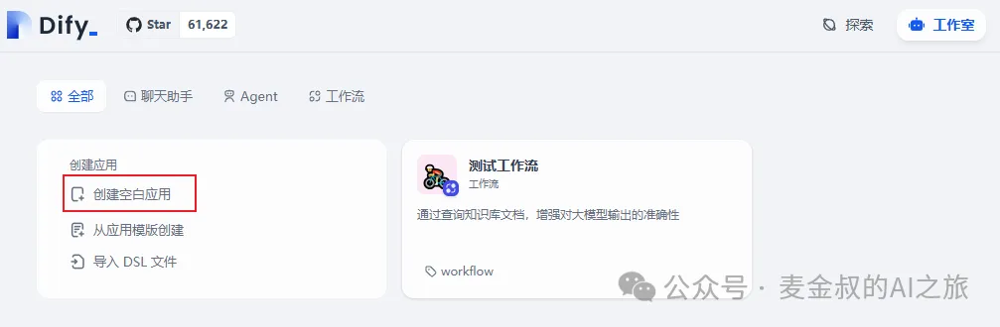
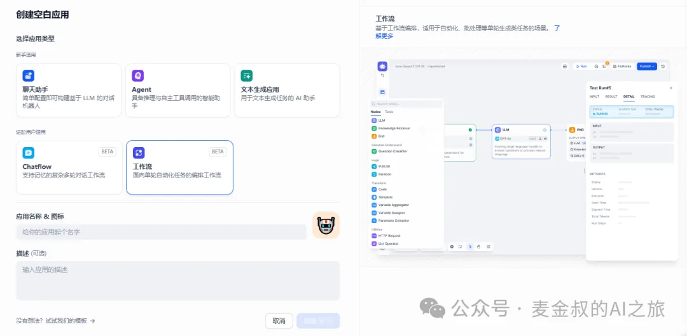
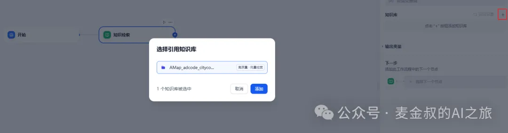
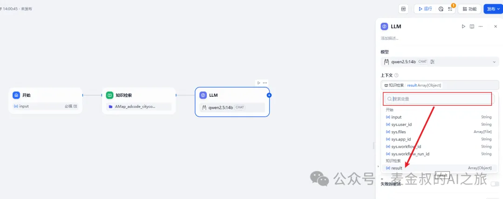
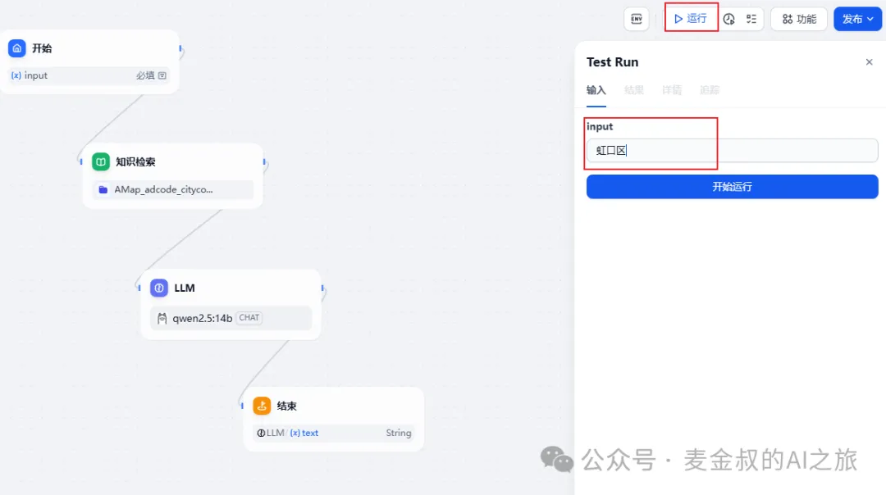
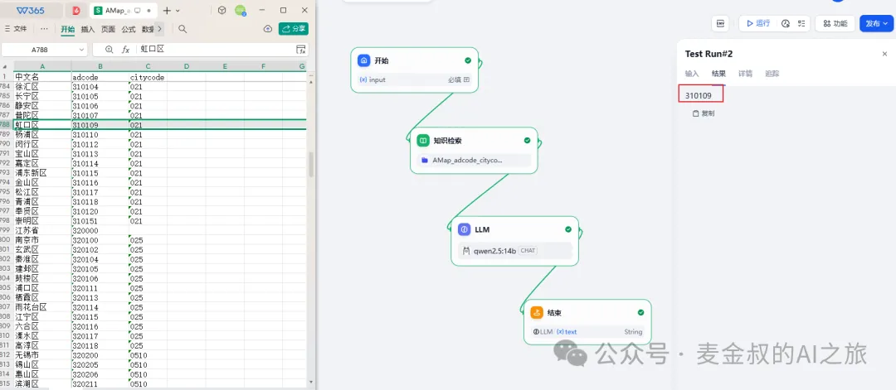
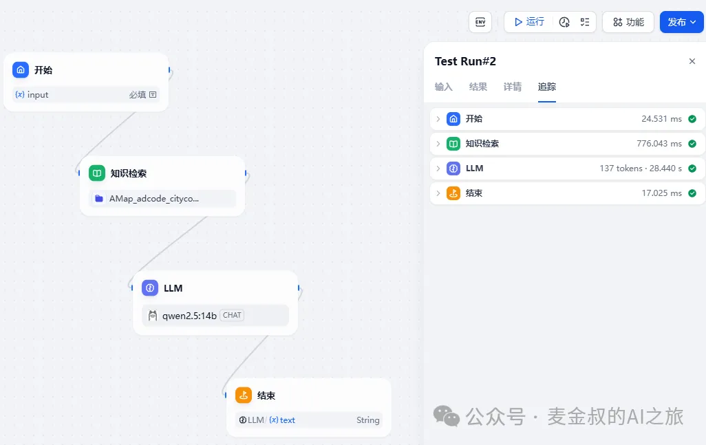

# 知识库检索
## **01.** 动手做一做

进入Dify，选择创建空白应用。

这次我们选择工作流，输入应用名字，点击"创建"。

可以看到一个空白画布，和coze不同。Dify只给出一个开始节点。那我们就点击选择"知识检索"。这时"开始"节点和新增的"知识检索"就链接起来了。

右侧配置项，点击"知识库"右边的"+"号，选择创建的知识库。如果此时没有知识库，那应该先去知识库那里，上传一个知识库。

这里还有一个需要注意的地方，需要给出查询的变量，即从知识库里查询什么内容。如果选的是chatflow，那这里可以直接选sys.query。而我们选的是workflow，就在"开始"节点添加一个变量，例如博主用的是文本类型，变量名称叫input。

接着，继续添加一个LLM节点。此时，模型博主先用`qwen2.5:14b`，上下文选择知识检索。

  而关键的SYSTEM里面，其实就是系统提示词，填入以下内容：根据用户输入`{input}`和知识检索的结果 `{上下文}`，输出用户期望得到的adcode。只需要给出准确的adcode的值，禁止出现 “think” 相关内容。

注意，因为复制的关系，里面还缺少一些内容。就是在"用户输入"后，需要输入{，这时系统会提示变量，选择"开始"的变量input，而"检索结果"后，也同样输入{，根据系统提示，选择"上下文"。这里一定要按指导操作。

这样就完成流程了，再添加一个"结束"节点。并添加输出变量，选择LLM的text。

点击"发布"，保存。提示"操作成功"。就可以进行测试了。

## **02.** 测试并定位问题

点击"运行"按钮。

等待流程运行完毕，就能得到结果。

可以看到得到的是我们期望的结果。如果没有得到结果，我们可以通过"追踪"来查询原因。

至此一个简单的通过输入地区名，获得对应的adcode的值的流程就完成了。（为了一次讲解一个点，这个流程简化到了极致，实际应用，会继续用这个adcode，进行天气的查询等操作。并将天气预报结果，作为"每日小报应用"的一个模块。）

## **03.** 原理讲解

现在我们已经完成了最简单的从知识库定向检索内容流程，让大模型不再自由发挥。那这背后的原理是什么呢？

如果你只想应用，不太想知道内幕细节，那这个章节完全可以跳过忽略了。

别看上面我们操作就是新增一个知识库，并上传了一个文档，但这背后的原理实现还是很复杂的。感谢无数背后的大佬们的辛苦付出。

这个过程叫RAG（Retrieval - Augmented Generation），中文意为==检索增强生成==。它是一种将信息检索与大语言模型（LLM）相结合的技术架构，旨在提升大语言模型回答的准确性、可靠性和时效性。
  

简单的原理实际分为四大块：

**1、 预处理**

**格式转换：** 将用户上传的文档，如PDF，WORD，CSV或者Markdown文件，统一转换为文本格式。如是富文本格式，还需要提取文字内容，表格也转化成文本。

**文本清洗：** 将上一步得到的文本内容，进一步做处理，删除多余的标签或空格，特殊符号，换行符等。字母也做统一大小写转换，防止查询时的不匹配。

**分词处理：** 将文本内容进行分割，如中文按词组做分割等。

**2、 向量化**

**嵌入模型：** Dify利用预训练的Embedding Model，将经过预处理的内容转换为向量数据。这个过程实际上也是大语言模型的一个分支，但比较专注于词语或者句子的语义向量化表达。  

**向量生成：** 对于每个文档内的片段或者句子，嵌入模型都会生成对应的向量。这些向量表达了语义关联性，为后续相似度计算提供基础。

**3、 构建索引**

**向量索引：** 为实现高效检索，Dify会通过构建向量索引，来达到查询优化。如使用 HNSW(Hierarchical Navigable Small World)图，能在高维向量空间中快速找到与所要查询的向量最相似的向量结果，极大提高检索效率。

**索引存储：** 构建完的索引被存在数据库中，后续使用时，通过查询数据库，获得索引对应的原始文本内容。并有机会通过局部内容的设置，来控制那些不想被检索到的内容。

**4、 查询输出**

**查询向量化：** 当用户输入查询内容时，Dify同样使用一致的嵌入模型，将输入内容转为向量表达。通过相似度计算，获得相似的一组结果。

**排序筛选：** 对一批查询结果相似度做得分标记，并根据召回策略等进行结果动态筛选。

**文本提取：** 根据筛选后的向量结果，提取对应的原始内容，输出返回给用户。

## **总结**

今天在本地的环境上，开始了真正的AI应用开发，并初步体验了第一个核心功能点"知识检索"。这是后续的复杂功能的一个重要的内容，所以一定要练习，并真正运行得到结果。

同时，我们也简单学习了解了RAG的基本原理和处理过程。通过对外部知识的特供，让RAG为大语言模型提供更准确和专业的信息，避免模型训练用的语料不是针对性的问题。