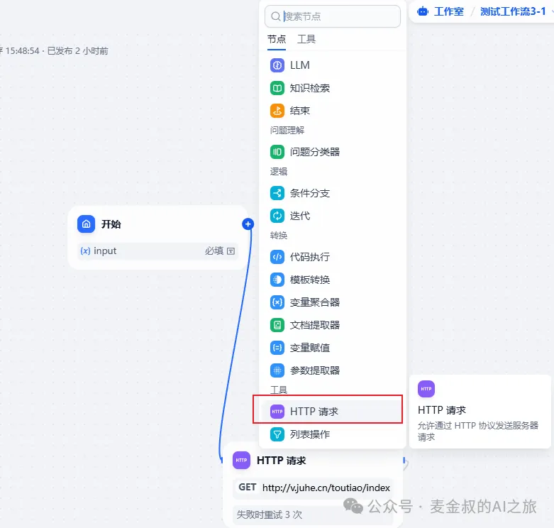
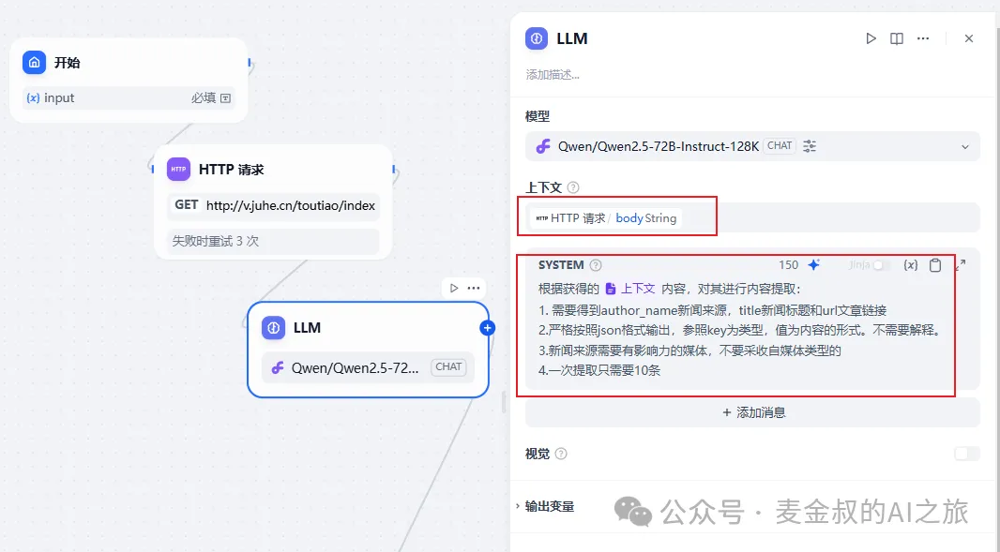
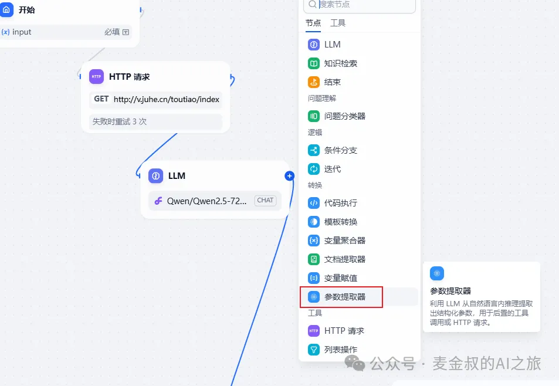
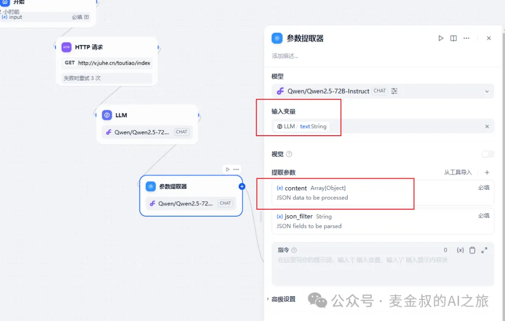
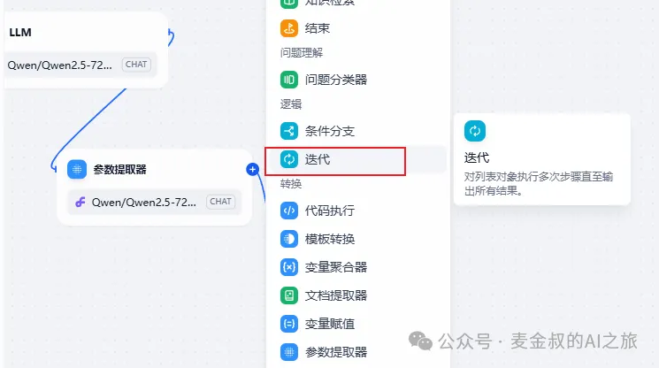
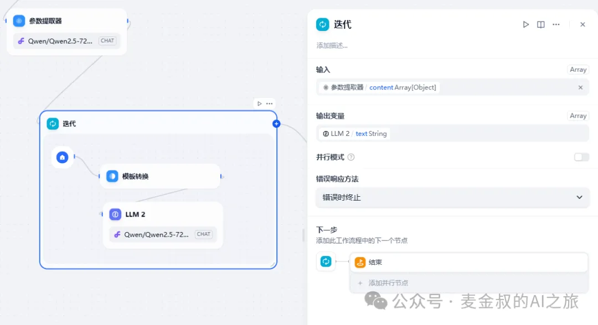
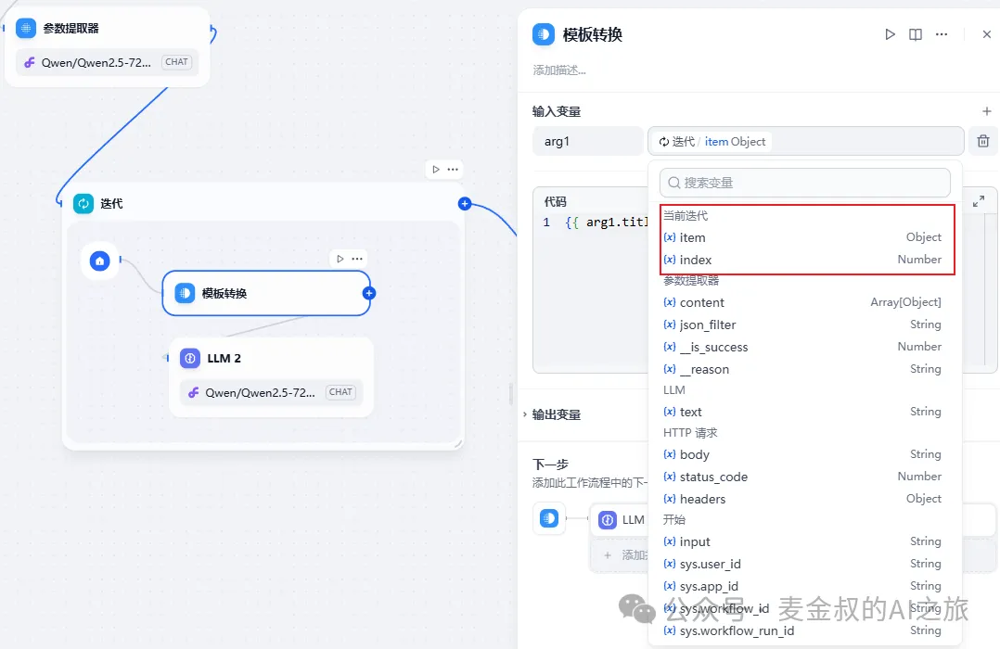
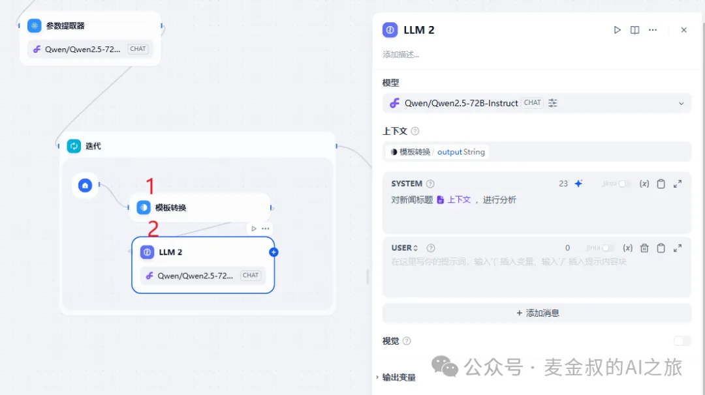

# 循环处理

## **01.** 动手做一做

今天的任务会新开一个workflow，完成后可以合并至"每日智选"应用内。

再复习一下"每日智选"的内容，通过获取天气API，得到天气信息，输出到图片和语音中。而现在最主要的内容，是热点新闻和解读。接下来会获取每日热点新闻10条，然后填充进结果图。

添加节点"HTTP请求"，配置该节点为获取热点新闻。

接着在其后，添加节点"LLM"，设置如下，上下文选择"HTTP请求"的请求结果。提示词填写：

根据获得的 上下文 内容，对其进行内容提取：

1. 需要得到author_name新闻来源，title新闻标题和url文章链接
2. 严格按照json格式输出，参照key为类型，值为内容的形式，不需要解释。
3. 新闻来源需要有影响力的媒体，不要采收自媒体类型的。
4. 一次提取只需要10条。

因大语言模型输出的结果为非结构化数据，需要使用"参数提取器"，进行转化。添加节点后，设置输入为"LLM"的output，输出修改为对象数组，如下图：

现在我们一共得到10组包含新闻标题的数据。如何处理呢？这就是今天的重点，添加新节点"迭代"

整个迭代(或者叫循环)，是以数据组来驱动的，所以这个节点的输入就是一个对象数组。

"迭代"节点内部，所有的节点，都会在对象数组的元素上进行处理，因此"迭代"的开始，隐含的参数就是循环的下标index和元素item。

获取到其中的元素之后，我们就使用"模版转换"，之前的教程已经介绍过，将标题内容和原始网址对应的内容，再次利用"LLM"处理，做摘要的提取。这里就省略了。

经过循环对每条新闻的处理，我们就获得了"每日智选"主体内容的文案，剩下的工作就是，对图片布局的规划了。

希望今天的动手内容，也能跟着麦金叔做下来。

## **02.** 补充说明

截止今天为止，"每日智选"AI小应用的大部分功能都已经实现。

大家也能举一反三，能将所学知识真正的应用到自己工作中。

当然，自己做一个新的类似的AI应用开发，还会遇到各种各样的问题。但万事开头难，只要动手开始做了，你就已经成功了一半。

我相信你们肯定听过这句话：打败你的不是AI，而是会用AI的人。希望你能花点时间，跟着这些简单的例子练一练，也成为那个打败别人的会AI的人。

## **总结**

今天学习一个重要的新的组件"迭代"。它实际上是编程中非常重要并常用的一个思想。

不管你要处理一大堆数据也好，还是读一堆书也好，都是要通过遍历的方法去"处理"它。