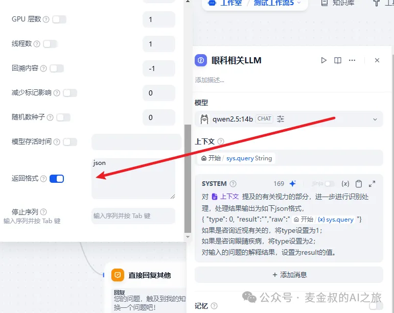

# 条件分支

## **01.** 动手做一做

今天的任务基于智能分诊应用"医小助"。在"问题分类器"的"分类2"后新增一个"LLM"节点。


如图所示，添加提示词内容:
```
对 {{上下文}} 提及的有关视力的部分，进一步进行识别处理，处理结果输出为如下json格式:{ "type": 0, "result":"","raw":"{{sys.query}}"} 
如果是咨询近视有关的，将type设置为1；
如果是咨询眼睛疾病，将type设置为2；
对输入的问题的解释结果，设置为result的值。
```
这次我们把大模型的输出格式修改一下，如下图



接着添加"代码"节点，将上一步生成的JSON结果，提取问题类别type，注意输入和输出的变量和类型


现在我们就可以根据问题类型，来进入不同分支了。添加新节点"条件分支"。


这样根据所匹配的结果，才能有不同的分支来承接。因此这里为了简化，直接都添加"回复"，来测试流程是否正确。


保存之后，我们进行测试，如下：


可以看到，我们的对话，走到了正确的分支。

## **02.** 补充说明

今天学的条件分支，与上次的迭代，都是编程思想里面最重要的基础概念。

 大家一定要能掌握，才能在今后的AI应用开发中，游刃有余的处理复杂的场景。

正如之前课程一直强调的：打败你的不是AI，而是会用AI的人。麦金叔希望，你花点时间，动手练一练，成为那个打败别人的人。

## **总结**

今天学习一个重要的新的组件"条件分支"。有了它在AI应用开发的"拖线条"过程中，才能真正应对复杂场景。它比问题分类器还要简单，都不需要利用大模型的能力，就能做好分类处理。