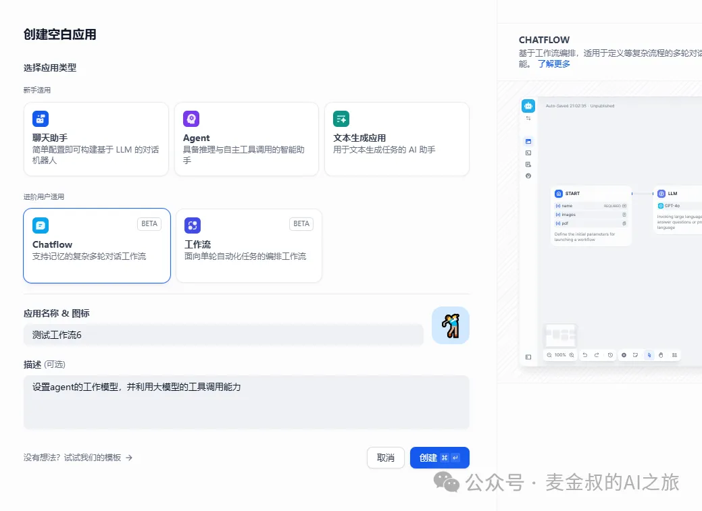
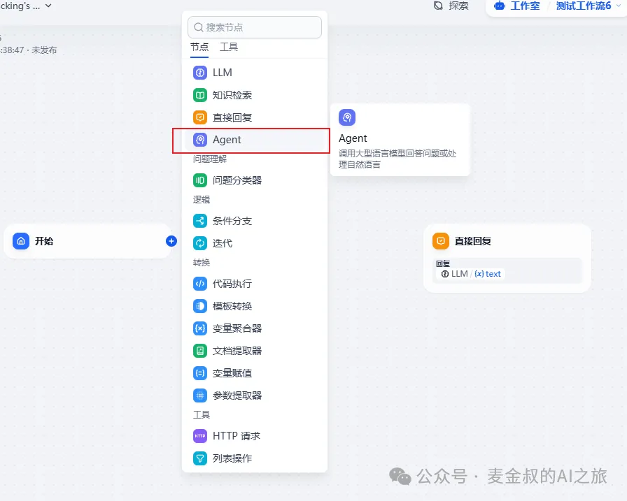
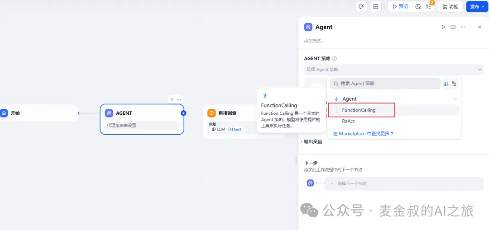
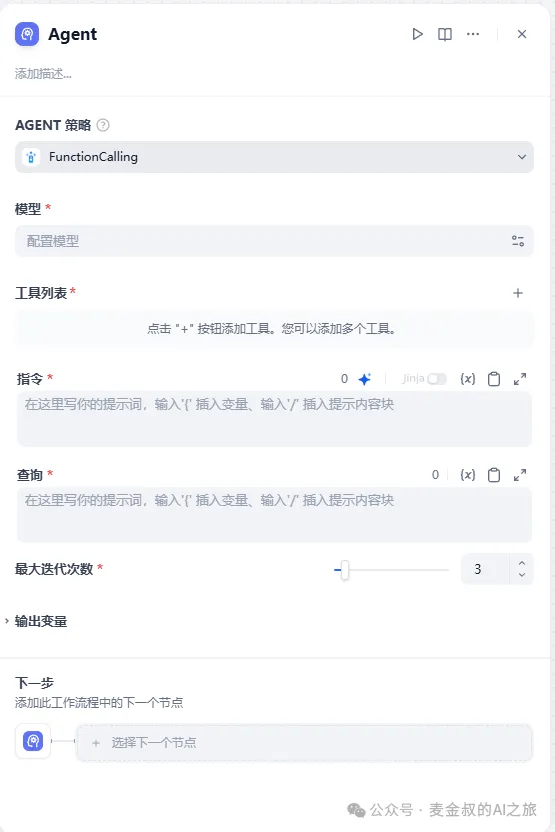
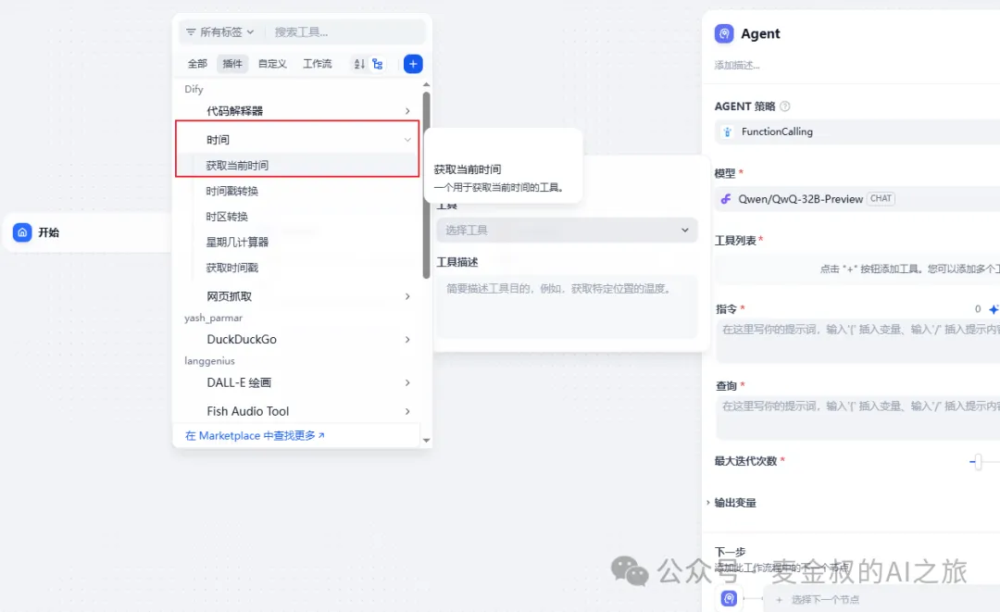
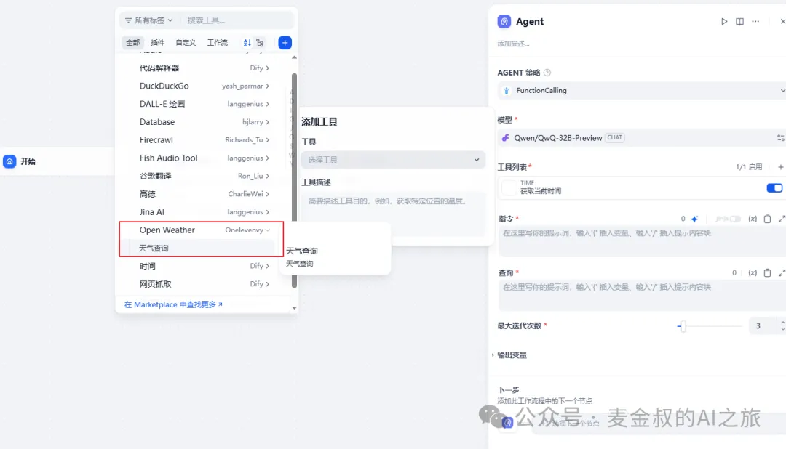
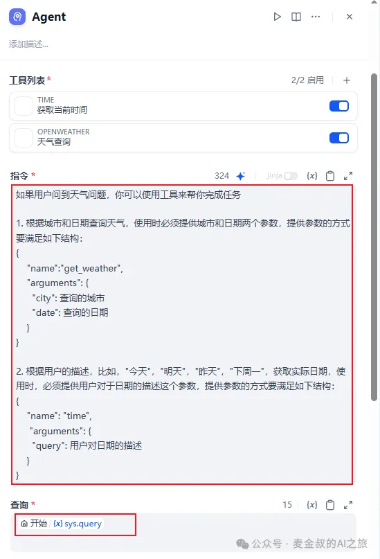
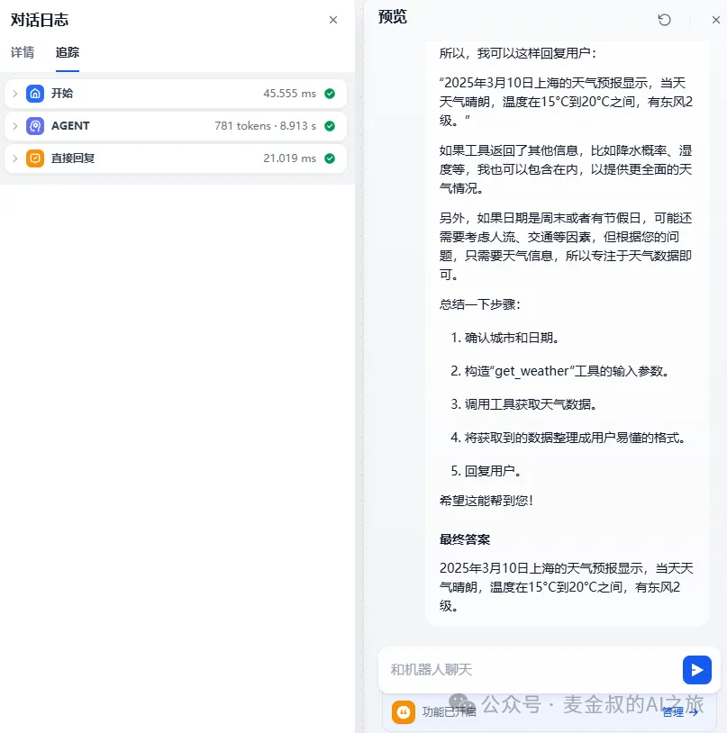

# 工具调用

## **01.** 动手做一做

今天的任务需要重开一个对话应用。当条件成熟之后，才能将今日所学集成进之前的AI应用开发中。



将默认生成的3个节点中的第2个删除。并添加"Agent"节点。



接着对该节点做配置，按下图步骤进行设置。



 选择完Function Callinging之后，就会出现真实的配置。



首先需要手动选择一个配置的大语言模型。这里需要注意，不是所有的大模型都内在支持Function Calling，所以这就要求我们对大模型基础有一定的了解。比方说这一段时间非常热门的DeepSeek模型，就并没有支持Function Calling。

然后添加大模型调用的工具。这里添加了时间获取和查询天气这两个工具。





"指令"输入框中添加如下内容：

如果用户问到天气问题，你可以使用工具来帮你完成任务。

1. 根据城市和日期查询天气，使用时必须提供城市和日期两个参数，提供参数的方式要满足如下结构：
```json
{
   "name":"get_weather",
   "arguments": {
     "city": 查询的城市
     "date": 查询的日期
   }
}
```

2. 根据用户的描述，比如，"今天"，"明天"，"昨天"，"下周一"，获取实际日期，使用时，必须提供用户对于日期的描述这个参数，提供参数的方式要满足如下结构：
```json
{
   "name": "time",
    "arguments": {
     "query": 用户对日期的描述
   }
}
```
  
而"查询"输入框，可以直接用"输入节点"的用户输入。如下图所示：



最后将"Agent节点"，与"回复节点"连接，输出修改为Agent的TEXT。保存之后，我们进行测试，如下：



如果你动手做完了，测试的时候并没有得到跟上述结果一样的内容，那说明你的操作并没有问题，只是细节需要进一步打磨。

这也是今天的内容设置为"高级"的原因。接着，试着自己去调用不同的大模型，修改提示词。然后查看运行日志，以得到当中的各个步骤符合预期。

## **02.** 补充说明

今天学的Agent，对于普通人来说非常有难度。

 需要自行补充有关大模型的基础能力的知识。

**什么是Function Calling**

大语言模型的Function Calling能力允许模型调用外部函数或服务，以扩展其自身的能力，执行它本身无法完成的任务。以下是一些Function Calling的使用场景：

| **使用场景** | **说明**                                                             |
| -------- | ------------------------------------------------------------------ |
| 增强能力     | 大模型通过Function Calling可以调用外部工具或服务，例如实时数据检索、文件处理、数据库查询等，从而扩展其能力。     |
| 实时数据访问   | 由于大模型通常基于静态数据集训练，不具备实时信息。Function Calling允许模型访问最新的数据，提供更准确、更及时的回答。 |
| 提高准确性    | 在需要精确计算或特定领域知识时，大模型可以通过调用专门的函数来提高回答的准确性，例如调用数学计算函数、翻译服务或专业知识库。     |

虽然有上述能力扩展，但是它不像工作流那般定义清晰。这种隐式的调用，考验着AI应用开发者对于大模型的理解，并需要不断的迭代优化，才能最终获得期望的效果。

## **总结**

今天学习一个新的组件"Agent"，并将工具模式设置为了"Function Calling"。有了它在AI应用开发中，能增强大模型的能力，可以对模型训练后发布之后的知识进行更新补充，不会再出现回答结果明显有时间断档的问题。

但是，这个能力又是一柄双刃剑。如果不了解其概念和知识，会发现很难驾驭它。