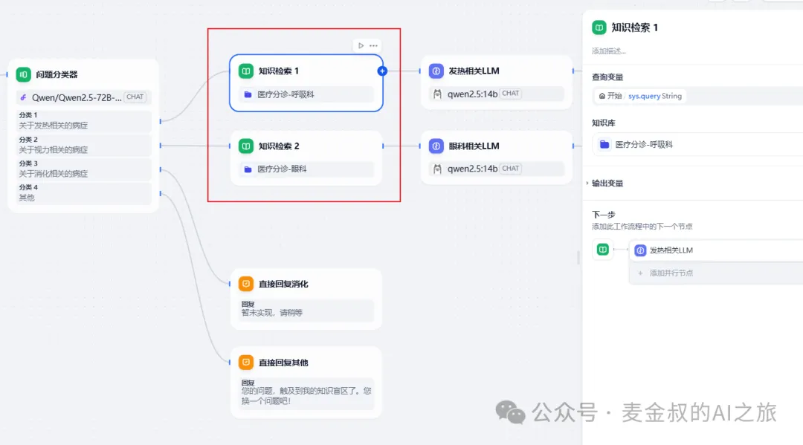
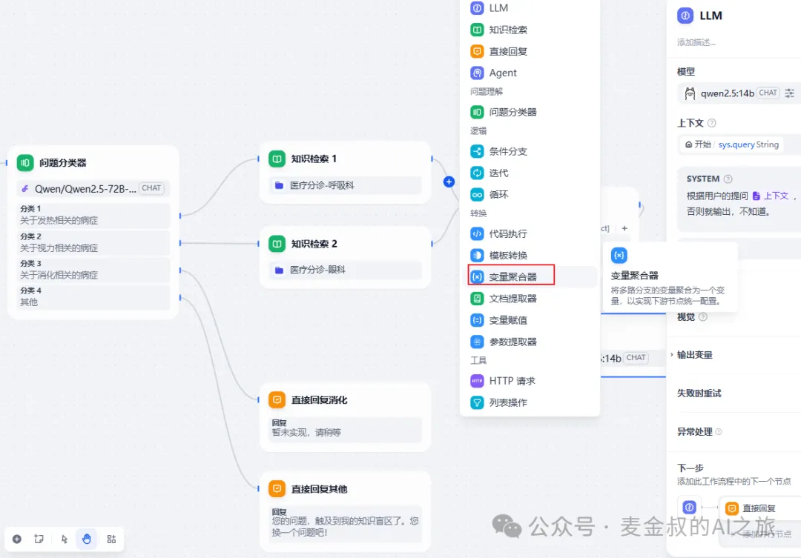
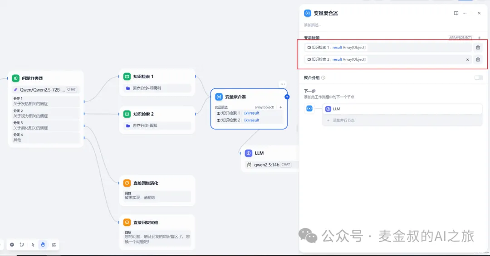
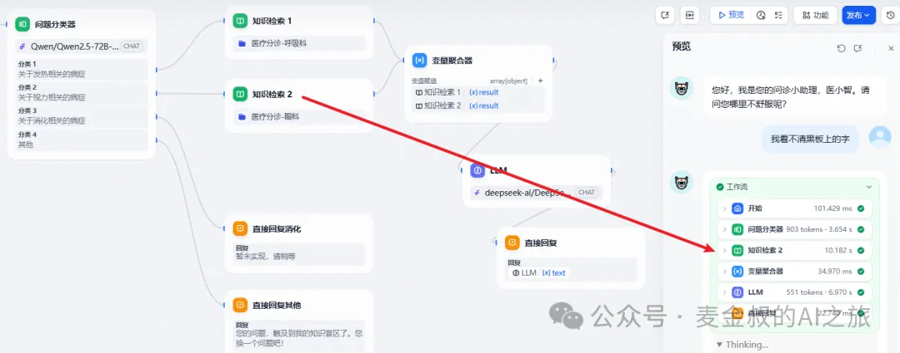

# 结果聚合

## **01.** 动手做一做

今天的任务基于"医小助"。之前我们先对用户的输入，进行了问题分类。将用户提问，转变为是否为"发热"和"眼科"或者其他的分类之后，再进行处理。

为了提高对问题识别的准确性，我们将进一步使用RAG的方法，对分诊的规范文档的知识进行查询后，再使用LLM进行识别和回答。

但是如果按照之前的工作流，后面会分别接两个相同的"LLM"节点。我们希望对此进行优化，就需要用到今天的主题"变量聚合器"。

因此在"知识检索"和"LLM"节点之间，添加一个新的节点"变量聚合器"。

接着删除第二个"知识检索"和"LLM"节点之间的连线，然后连接第二个"知识检索"和"变量聚合器"节点。最后按下图进行设置

 保存后，进行测试。

## **02.** 补充说明

变量聚合节点是工作流程中的一个关键节点，它负责整合不同分支的输出结果，确保无论哪个分支被执行，其结果都能通过一个统一的变量来引用和访问。这在多分支的情况下非常有用，可将不同分支下相同作用的变量映射为一个输出变量，避免下游节点重复定义。

它跟问题分类器正好相反，一个是从一个节点拆分成多个分支，另一个则是把多个分支聚合到一个节点。除了对问题分类器后的workflow做聚合，它还可以对前面学的分支条件做多路聚合。

但是需要注意的是，它本身是支持聚合多种数据类型的，但同一时间却只能聚合同一种数据类型的变量，否则会出现类型不匹配。

如果各个分支上的结果格式不一样，那需要利用模版，或者代码做一下转换，确保类型的一致后，就可以继续用了。

## **总结**

今天学习一个新的组件"变量聚合器"，有了它在AI应用开发中，能合并各种分支条件，以达到"条条大路通罗马"的效果。