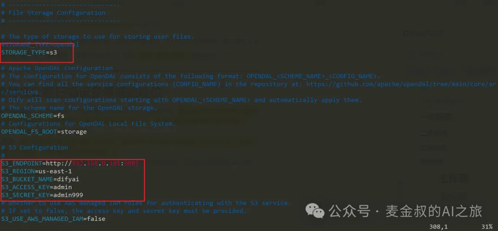
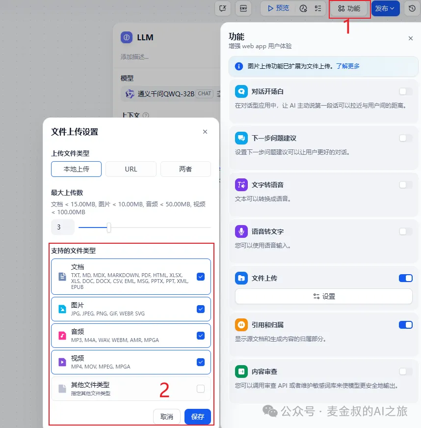
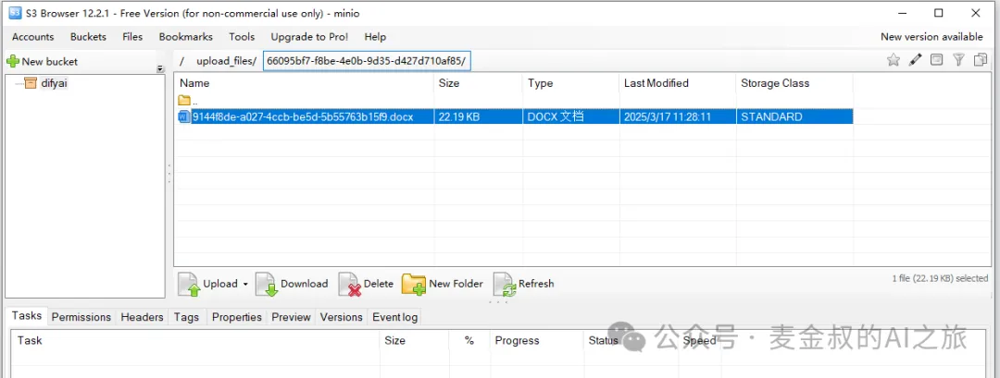

# 对象存储

## **01.** 动手做一做

今天的动手实验，与运维相关。如果不感兴趣，可以划走。

首先，需要让Dify知道使用对象存储方式来保存文件。

进入到项目下的docker目录，打开由.env.example文件复制而来的.env文件。找到文件存储配置段，大概在第293行，改动STORAGE_TYPE为S3。

S3除了可以是AWS的S3服务，还可以是兼容S3的对象存储，如Minio等。注意这里，如果对象存储服务是Minio，S3_ENDPOINT需要为实际Minio的API地址，S3_BUCKET_NAME可以改为实际用的桶名，如difyai。而ACCESS_KEY和SECRET_KEY，分别是Minio的用户名和密码，并非像S3使用的KEY。

接着，需要重新启动Dify所有服务。使用命令docker compose restart。

如果测试没有生效，可以reload环境变量文件，或者简单点重启Linux服务器。

上述操作完成之后，接下来就是使用部分。

将Chatflow的应用设为允许文件上传，按下图所示步骤进行设置。

## **02.** 测试说明

运行Chatflow应用，开启新的对话，在对话框右侧点击附件，即可上传文件。

去对象存储服务器检查一下，是否文件按预期上传。

在difyai的对象桶里面，能看到已经在upload_files的目录，在其中存在一个文件，但是文件名会被修改为UUID表示的key，如上图所示。

同样，如果创建知识库，并上传文档。部分内容也会处理后存储进对象存储服务中。

## **总结**

今天学习了将Dify服务的文件改为对象存储方式，可以更好的在企业内部满足多人使用的场景。