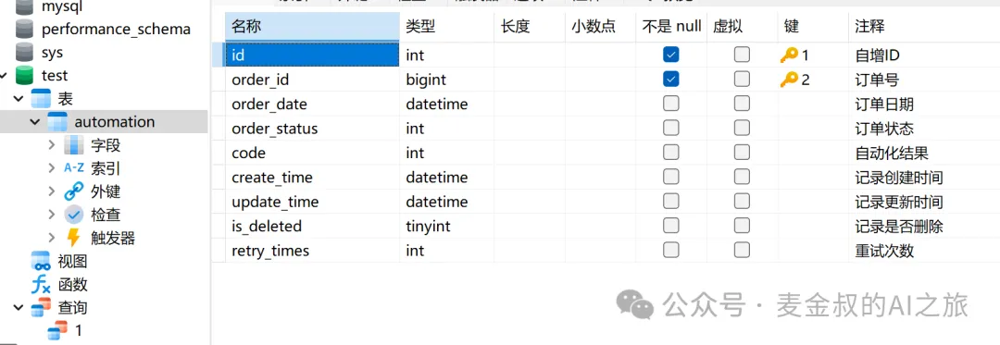
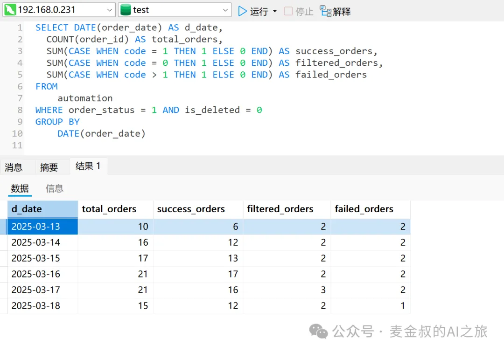
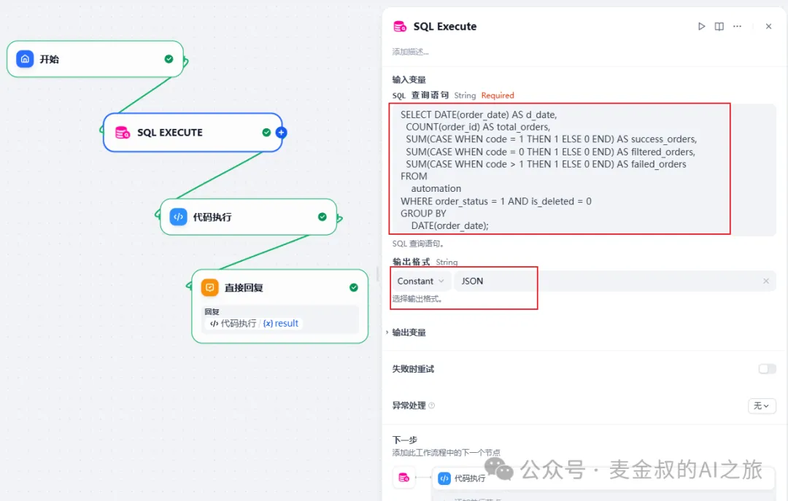
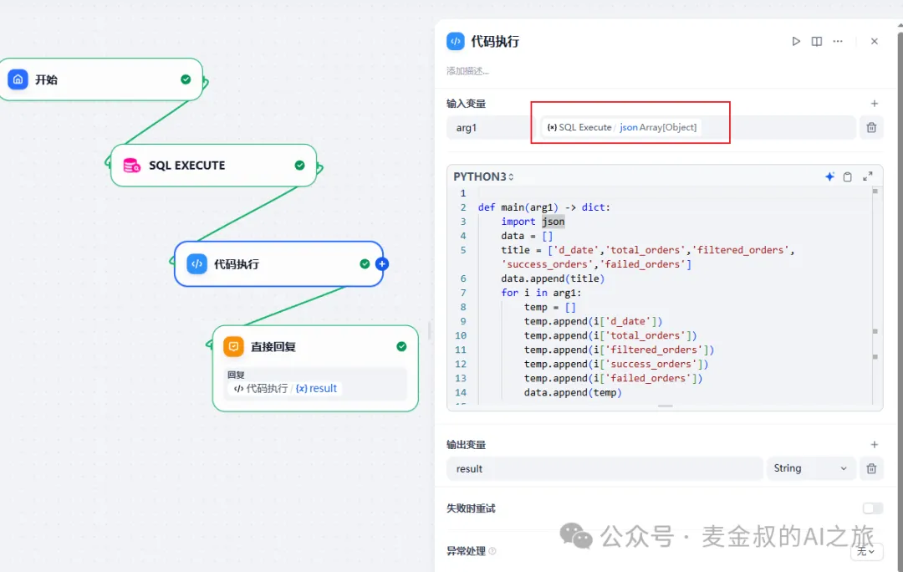
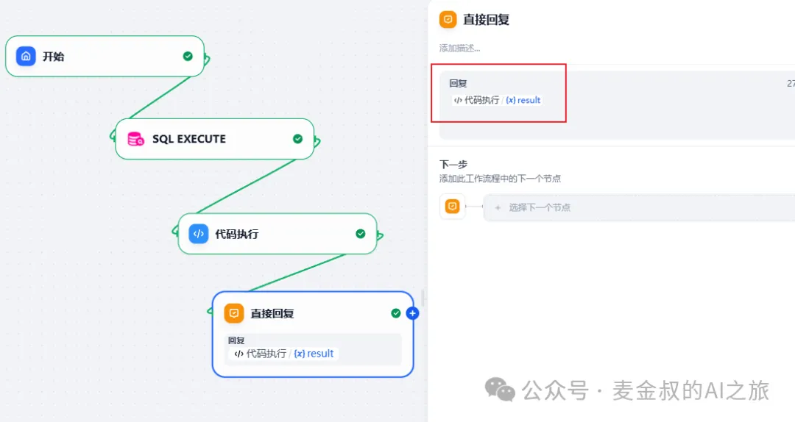
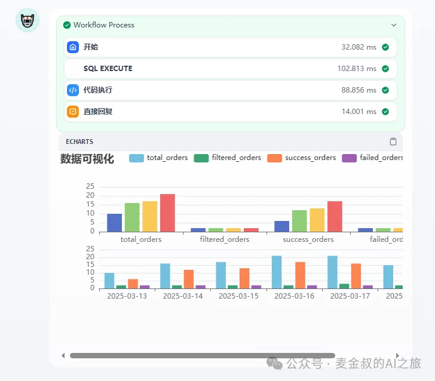

# 数据可视化

## **01.** 动手做一做

今天的动手实验，需要有处理数据的代码能力。如果对你来说难度太大，建议收藏慢慢学习。

首先，我们简化核心步骤，把不相干的节点全部删除。掌握了之后，可以集成进前面课程有关数据SQL的部分(如数据库查询)。

既然是和数据相关，那准备的部分必然涉及到数据库。假设我们有一个数据表名为automation，记录了企业中，对订单进行自动化处理的情况。

该表设计的思路是，针对每个订单，都会进行自动化处理，并记录处理结果。并且按业务规则，运行失败时会进行一定次数的重试，以避免因资源等环境问题导致的暂时失败，而影响可以自动化的任务。

记录自动化处理的结果字段为code，0表示不符合自动化处理条件，1表示自动化处理成功，大于1的值表示自动化程序内部的错误。

我们需要按照订单的日期来查询按天统计的订单处理情况。查询语句和结果如下图所示。

有了上述准备之后，开始进行Dify应用开发。

添加"SQL Execute"节点(如果没有，需要安装插件后，进入工具选择，见之前的博文)，修改设置为：
1. SQL查询语句：同sql query语句
2. 输出格式：选Constant，JSON

新增"代码执行"节点，输入变量选上一个"SQL Execute"的json，代码内容需要对SQL查询工具输出的JSON数据进行转换，然后将变形后的数据，按照echarts的模版进行输出。

最后"回复"节点的输入就选择"代码执行"的结果。

保存之后，进行测试。因为这个简化流程没有"LLM"节点，也不依赖输入，所以可以直接执行，其结果如下：

## **02.** 补充说明

为了聚焦数据可视化的处理方法，这个流程做了最大程度的简化。所以实际生产过程中，需要理解其中的方法，进行改写变形。

1. 示例数据查询语句是写死的。
	改进点：利用文生SQL，让大语言模型生成合适的SQL，并开放查询时间范围参数。比如查询一周内，或者一个月内的数据。

2. echarts图表是写死的。
	改进点：可以预先定义echarts的图表样式，如折线图，或者柱状图，饼图等，以适配不同的业务需求。

希望各位网友能发挥主观能动性，进行更贴合业务需要的开发。当然，越是复杂的可视化，对开发和使用echarts的能力要求也越高。

## **总结**

今天学习了将数据进行可视化生成，让AI有了图表的展示能力，更贴合企业用户的使用需求。因为示例代码较长，截图不便，想参考学习的朋友，扫描下方小助手的微信号，发送"可视化"，以获得DSL文件。