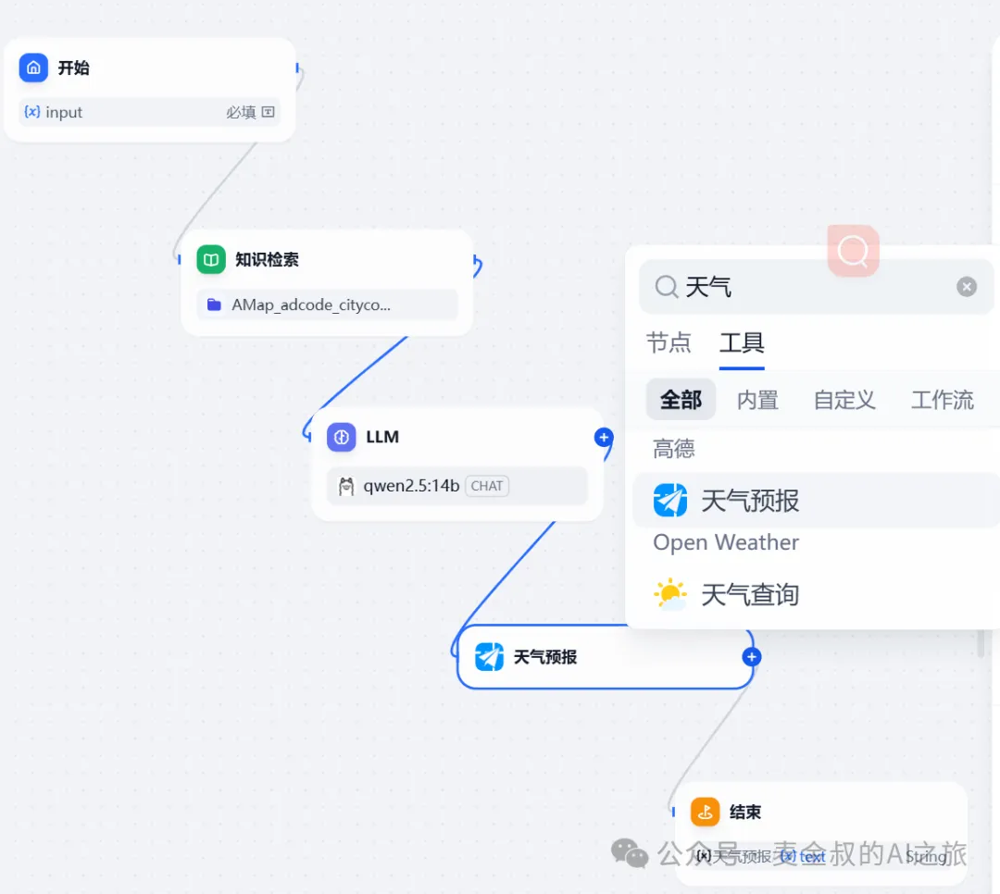
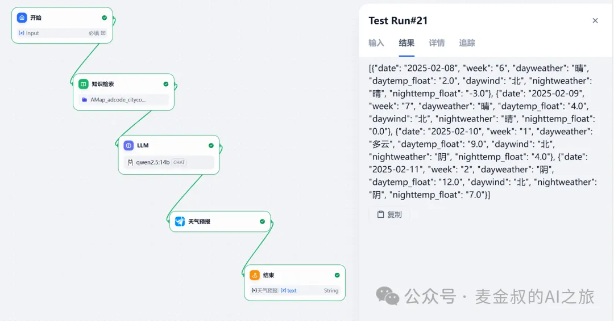
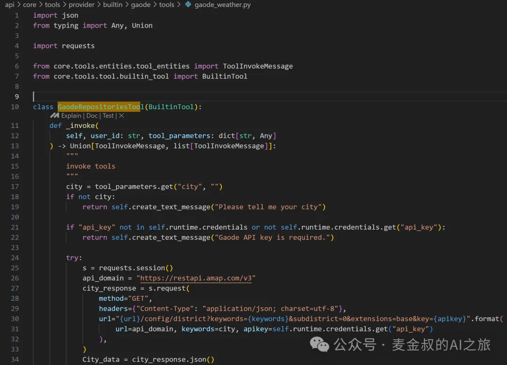

# 联网工具

## **01.** 动手做一做

基于上一节课的流程，在大模型节点后新增一个工具节点，选择搜索"天气"，点中"高德天气预报"。

选择这个主要是前面知识库的地区名和code对照表，就是高德的。另外这个接口也比较简单，输入就是一个adcode，输出就是今天该地区的天气结果。

添加之后，连接LLM节点和新增节点，再连接新增节点和结束节点。修改参数(一定要先连接)，"天气预报"的输入，选择"LLM"的text。然后把结束节点的输出也改为"天气预报"的text。

点击"发布"，保存。提示"操作成功"。就可以进行测试了。测试如下：

## **02.** 工具使用与开发

一个正常应用的流程，其实都是非常复杂的。都需要经历很多步的操作，才能最终完成一项任务。

对于除大模型以外的工作，都需要工具进行配合。比如，大模型不可能直接得到今天某地的天气结果，需要通过API实时查询才行。那么通过LLM和天气预报工具进行结合，便实现了整个过程。

今天的任务，有现成的工具能使用。但是如果没有现有的工具，或者现有工具无法满足需求，就需要进行定制化开发。

基于Dify良好的设计，真要增加插件功能，还不算太难。不过这不是这一篇的重点，大概介绍一下吧。如果有兴趣，后面可以详谈。

通过扩展BuiltinTool类，将处理逻辑封装进"invoke tools"。最后返回create_text_message对象，包含处理后的数据或者异常信息，即可。

## **总结**

今天在上次的工作流基础上，进一步增加外部工具获取数据的过程。并简单了解，实现类似功能的方法。为今后自己实际业务的开发奠定基础。