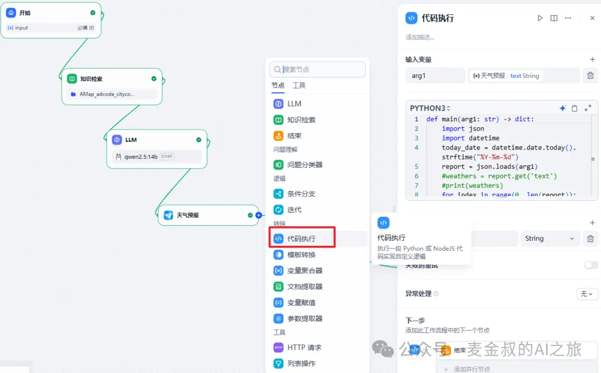
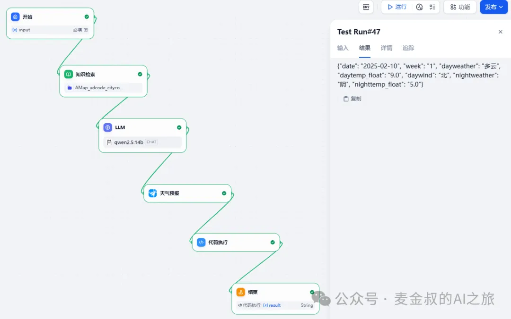
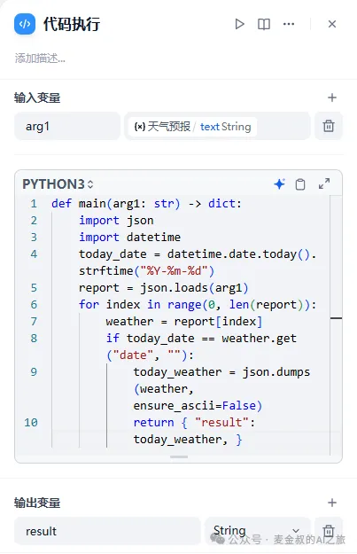

# 代码处理

## **01.** 动手做一做

基于上一节课的流程，在"天气预报"节点之后，新增一个"代码执行"的节点。

添加之后，连接"天气预报"节点和新增节点；再连接新增节点和结束节点。新增参数(一定要先连接)，"代码执行"的输入，选择"天气预报"的text。然后把结束节点的输出也改为"代码执行"的text。

点击"发布"，保存。提示"操作成功"。就可以进行测试了。测试如下：

## **02.** 代码执行的开发与调试

今天的任务，需要有一定的代码能力，但不是非常复杂，都只是简单的数据转换提取操作而已。难度提示为"中级"。

代码节点支持Python和JavaScript，这次课程以Python为例。

简单讲解一下：定义一个main函数，接受输入字符串，然后输出一个字典。

注意main的参数名一定要与输入变量定义的名字一致，否则会报错，而输出因为定义了字典，所以必须按照return {"result": 字符串}的格式给出，一定要严格按照这个规则执行。

因为输入的是字符串，所以根据数据内容，假如是JSON字符串格式，就需要对其进行JSON对象的转换。本例中4天的天气数据，是按数组的形式传输的。那么就可以遍历数组，找出其中关键字date与今天日期匹配的那个对象，再将其输出为字符串即可。如果是其他的格式，也可以通过正则表达式进行关键内容的提取。

类似开发就根据业务需求进行处理即可。这里麦金叔要特别提一下调试的问题。在Dify的沙箱环境里面执行Python脚本，其错误提示还是比较粗糙的，对开发定位要求比较高，往往有点"丈二和尚摸不着头脑"。所以麦金叔建议，还是先在本地的电脑调试完成（可以单步Debug，不比看那乱七八糟的报错要便捷的多），再复制进Dify的代码节点，否则比较浪费时间。

当然，今天的课程虽然对普通人来说略微有点难度，但总体来说，对于有代码经验的人来说，也不算特别难。只要多学习别人的流程里面的代码，再结合自己动手实践，相信很快就能掌握。

## **总结**

今天在上次的工作流基础上，进一步增加利用Python来处理数据的过程，让我们得到的数据越来越接近真实可用的状态。同时，代码节点可以充当很多功能节点的粘合剂，进行各种数据或者流程的转换，这在实际应用中也是必不可少的功能。希望大家再接再厉，跟着麦金叔踏实的走好每一步。