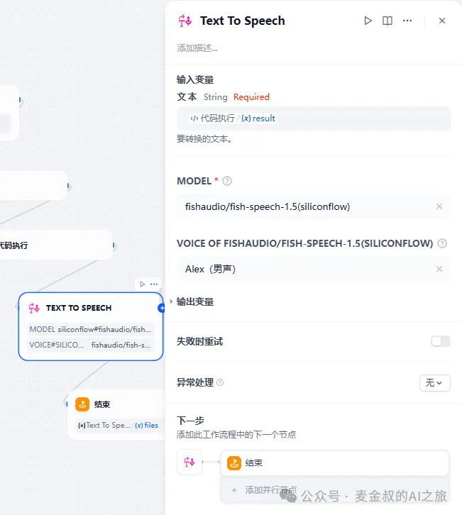
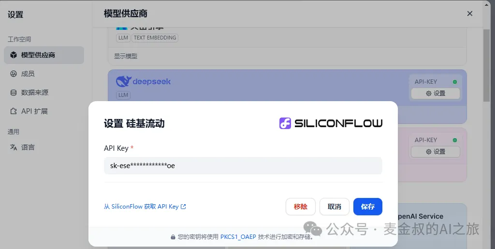
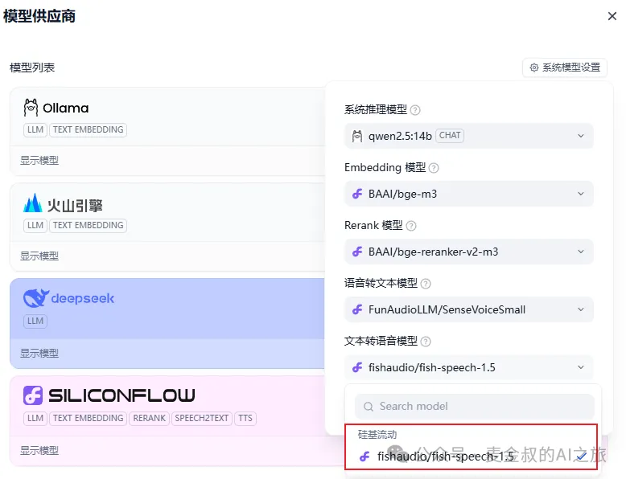
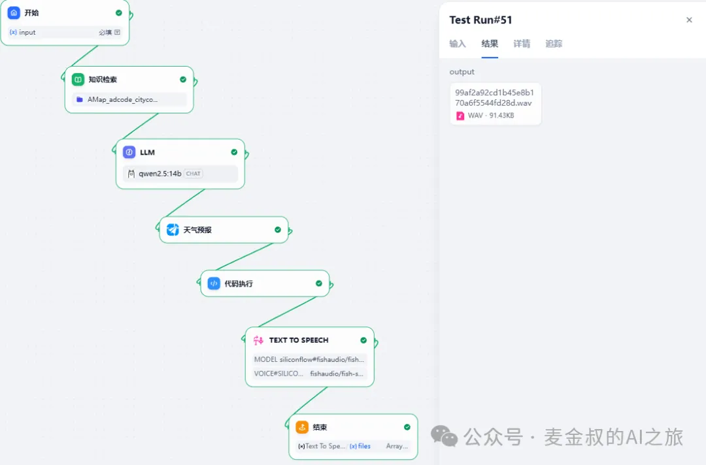

# 生成语音

## **01.** 动手做一做

基于上一节课的流程，在"代码执行"节点之后，新增一个"Text To Speech"的节点。



添加之后，连接"代码执行"节点和新增节点；再连接新增节点和结束节点。新增参数(一定要先连接)，"Text To Speech"的输入，选择"代码执行"的text。

TTS节点需要有模型，这里选择SiliconCloud的fish-speech-1.5。

硅基流动配置非常简单，直接点配置弹出对话框后，跟着"从SiliconFlow获取API Key"的向导，打开官网，注册后创建API Key，然后复制到Dify的配置框，即可。



新增模型之后，在"系统模型设置"的文本转语音模型，选中fishaudio。



同时新增节点，记得选择声音的类型，包括了4男4女的备选声音，可以都测试一下，看看是否满足自己的需要。

"结束"节点的输出改为"Text To Speech"的files（这里注意不要再选成text了）。

点击"发布"，保存。提示"操作成功"。就可以进行测试了。测试如下：



结果输出是一个wav文件的下载链接，点击下载后，使用本地音频播放软件打开就可以检查内容。

## **02.** 补充说明

今天的任务，非常简单，经过前几天的学习，应该操作起来很是得心应手了。

但注意一下，硅基流动的这个TTS模型是收费的，需要先充值才能使用。还有很多模型可以免费，或者限免使用。不过使用费用还算可以接受吧，测试了几次，花掉3分钱。同时新用户进来就赠送13.99，够用一段时间了。

另外，今天的"代码执行"节点，也做了一下脚本更新。直接将JSON，格式化输出为播报文案。

```python
def main(arg1: str) -> dict:
    import json
    import datetime
    today_date = datetime.date.today().strftime("%Y-%m-%d")
    report     = json.loads(arg1)
    for index in range(0, len(report)):
        weather = report[index]
        if today_date == weather.get("date", ""):
            day_weather   = weather.get("dayweather", "")
            day_temp      = weather.get("daytemp_float", "")
            night_weather = weather.get("nightweather", "")
            night_temp    = weather.get("nighttemp_float", "")
            day_temp_f    = float(day_temp)
            day_temp_i    = round(day_temp_f)
            night_temp_f  = float(night_temp)
            night_temp_i  = round(night_temp_f)
            res = "今日天气，白天%s，温度%d摄氏度，晚上%s，气温%d摄氏度" % (day_weather, day_temp_i, night_weather, night_temp_i)
            #today_weather = json.dumps(weather, ensure_ascii=False)
            return { "result": res, }
```

## **总结**

今天在上次的工作流基础上，进一步增加利用TTS来对获取内容进行语音生成处理，如果各位朋友有做播客的，那这一期就非常对你的胃口，操作也很简单。