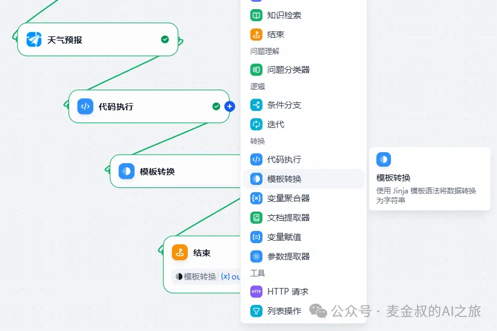
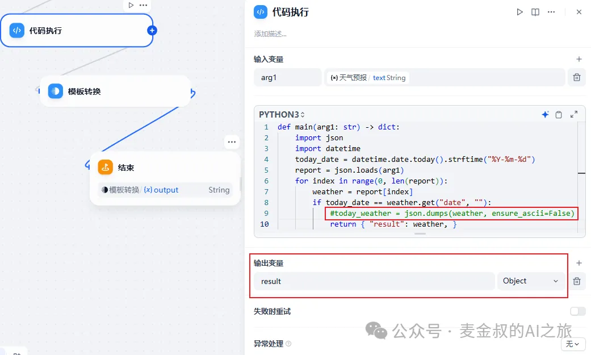
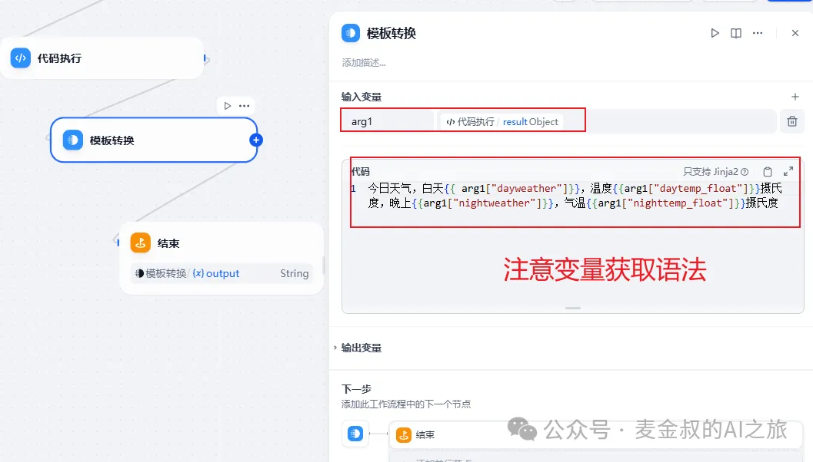
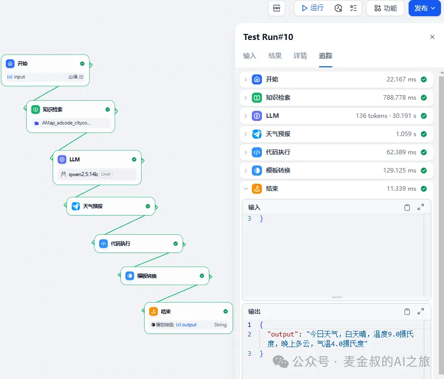

# 使用模版

## **01.** 动手做一做

基于上上一节课的流程，在"代码执行"节点之后，新增一个"模版转换"的节点。



添加之后，连接"代码执行"节点和新增节点，再连接新增节点和结束节点（这里先移除语音输出处理，后面会加回来，要多路生成不同的内容）。新增参数(一定要先连接)"模版转换"的输入，选择"代码执行"的Object。这里注意，需要将"代码执行"节点也做一些调整。



输出的时候，要按字典而非之前的字符串输出。输出变量也选对象输出。

新增节点修改参数，输入模版内容，不变的内容和动态内容分开，动态内容的值需要有双大括号转义。



点击"发布"，保存。提示"操作成功"。就可以进行测试了。测试如下：



结果输出是一个按模版填入动态获取内容的整段文案结果。

## **02.** 补充说明

今天的任务，也非常简单，但为什么是中级水平呢？原因是，这里的Jinja模版的使用，也需要一定的编程经验。

Jinja原本是Python的模板引擎，最初是为Flask框架开发的，功能非常强大，可以动态生成网页，XML，CSV或者Markdown文本。

所以，在实际项目中，利用模板转换的功能，将中间数据，通过模板渲染成需要的格式，才能体现它真正的威力，千万不要被本文例子中的简单写法迷惑，觉得它过于简单哦。

下面例子展示了循环，判断等处理能力。

```
<ul>
	
	
	<p>小计金额：{{ item.total }}</p>
	
	<p>无需付费。</p>
	
	
</ul>
```

## **总结**

今天在上次的工作流基础上，进一步增加利用模板进行数据的转换处理，可以定制以固定格式呈现的内容，并插入动态值，生成完整的内容。