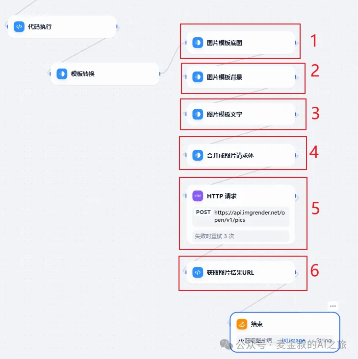
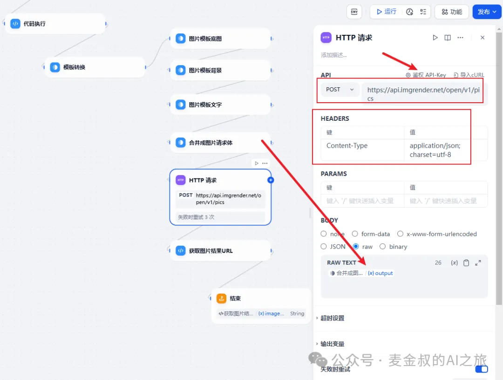

# 图片生成(上)

## **01.** 动手做一做

大家通过之前的教程，已经有了基本的使用Dify节点的能力，所以这一节课，就一次性多来点。不过因为加的东西有点多，涉及到的知识有点过载，所以还是分两篇吧。

基于上一节课的流程，在"模版转换"节点之后，再新增四个"模版转换"的节点，之后来一个"HTTP请求"和"代码执行"节点。

添加之后，以上节点都连起来，然后按下面图示，进行设置。（如有需求，可扫描文末助手添加好友，发送"Dify图片制作"，获取DSL文件）

其中，编号1，2，3实际上是拼凑出一个JSON请求体，供"HTTP请求"节点使用。注意每段都不是正常的JSON完整体，有缺闭口的，有多一个逗号或者闭合大括号的。但在最后一次Jinja模版拼凑(编号4)之后，就是一个完整的JSON了。

最后经过HTTP请求(编号5。如果不会，也不用担心，下篇会手把手教，所以为了防止走失，还是关注一下吧)之后，再在"代码执行"(编号6)里把结果图片的地址解析出来，整个流程就算结束了。

点击"发布"，保存。提示"操作成功"，就可以进行测试了。测试如下：

结果输出是一个图片结果的URL。手动打开URL得到一张图内容如下：

## **02.** 补充说明

今天的任务，一样非常简单，但为什么是中高级水平呢？原因是，这里需要超级耐心和仔细，并且要有http请求的基本概念。

同时还有两个第三方服务，一个是imgrender，另一个是figma。

下篇，麦金叔会仔细讲解里面涉及到的东西，请大家耐心等待一天。保证能让小白都会使用的。

## **总结**

今天在上次的工作流基础上，进一步将文案内容，生成到带有底图背景的图片中，最终成品如何，就依赖各位的设计能力了。