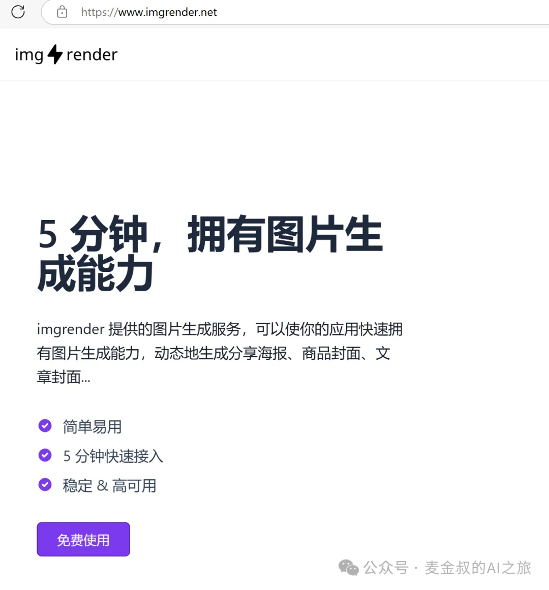
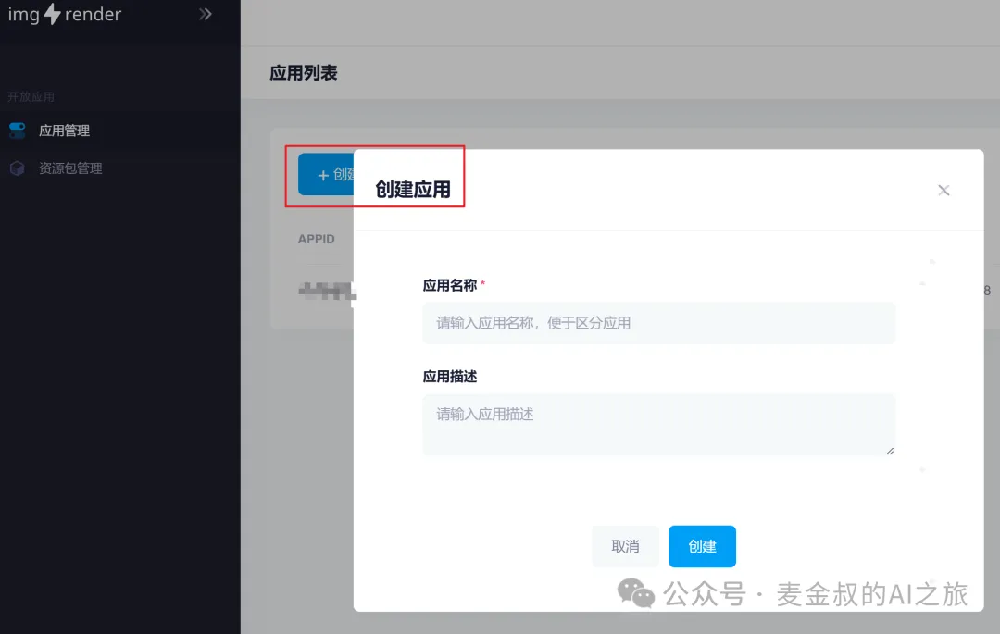
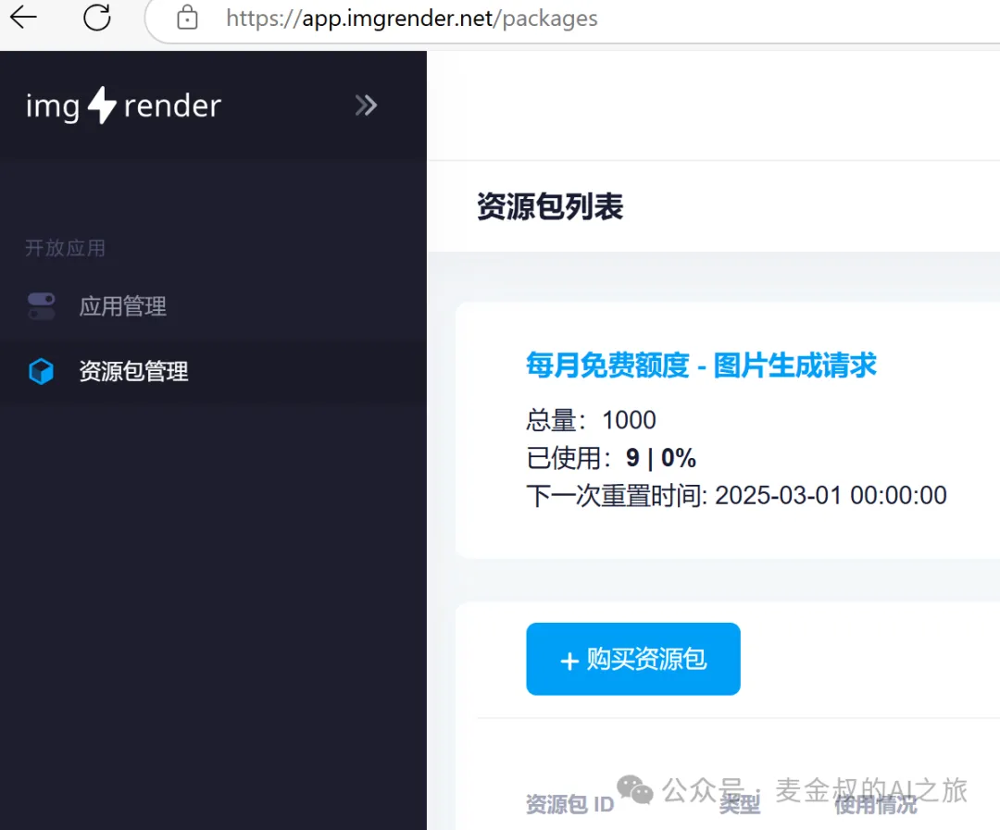
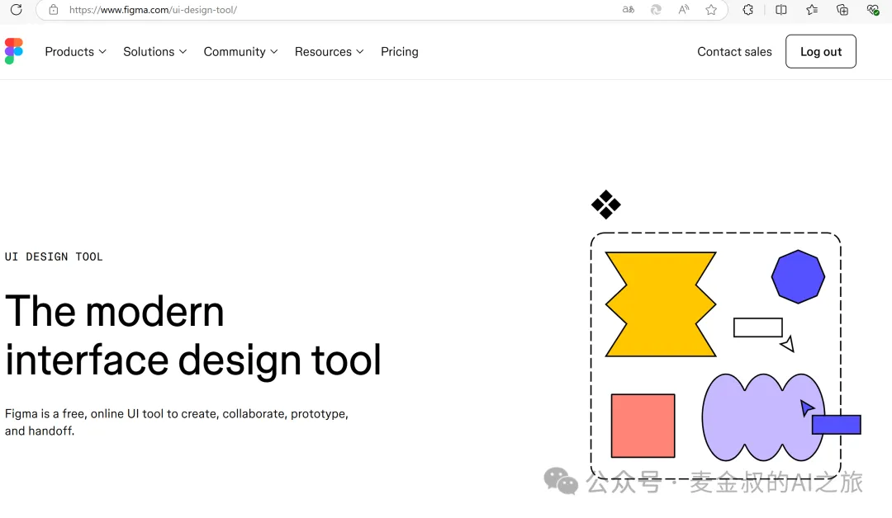
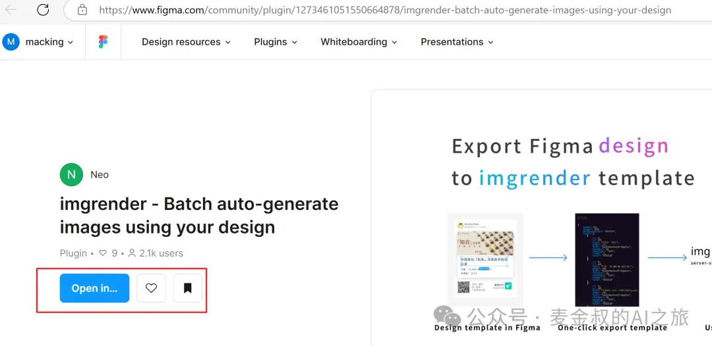
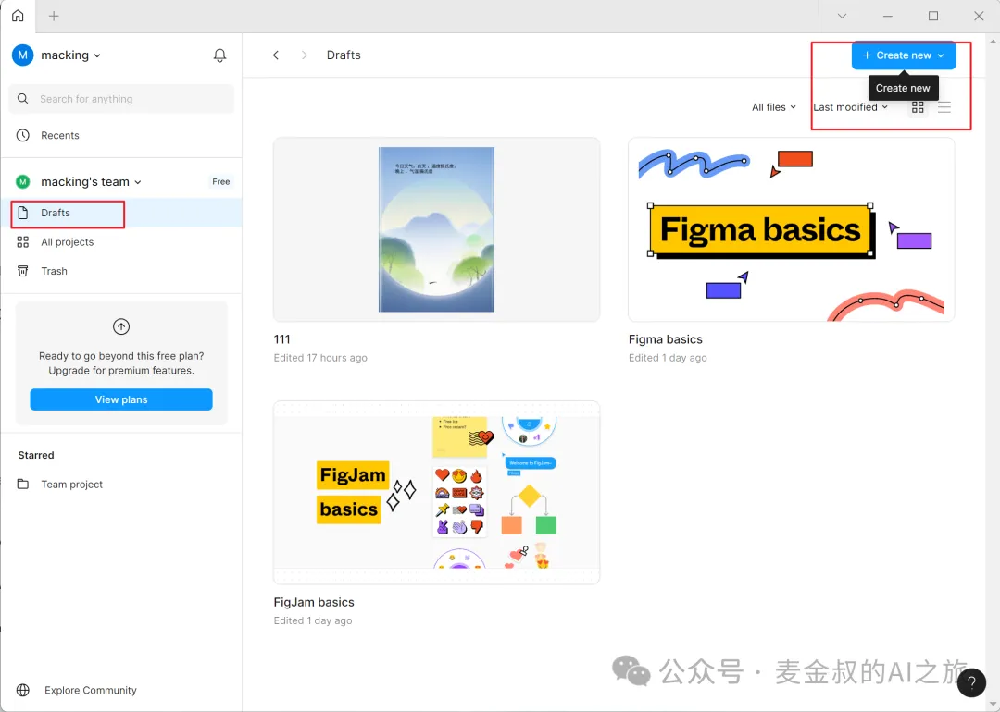
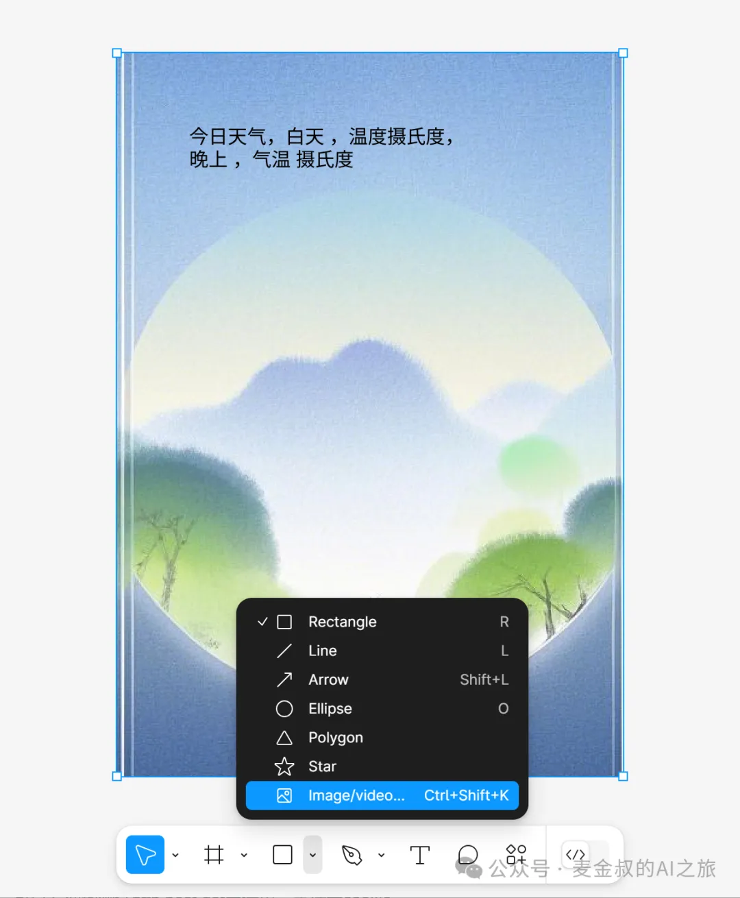
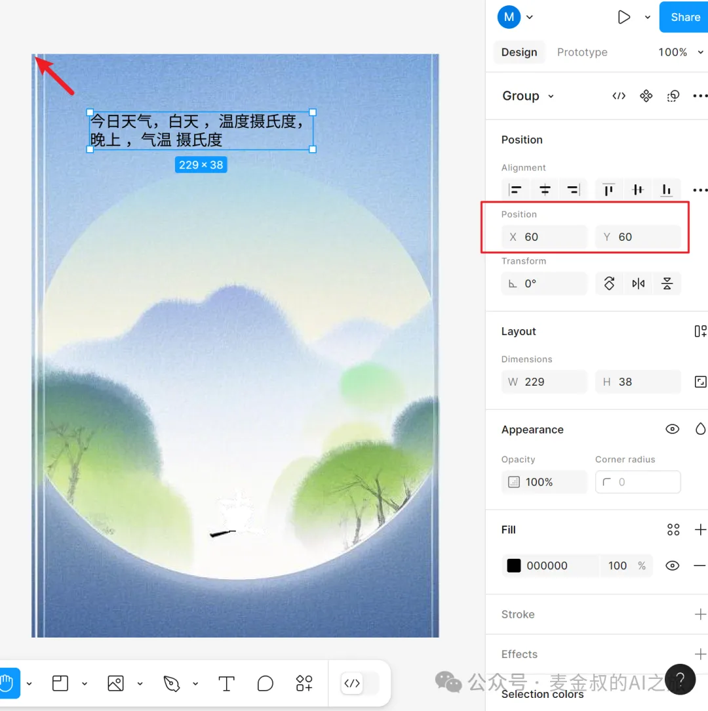
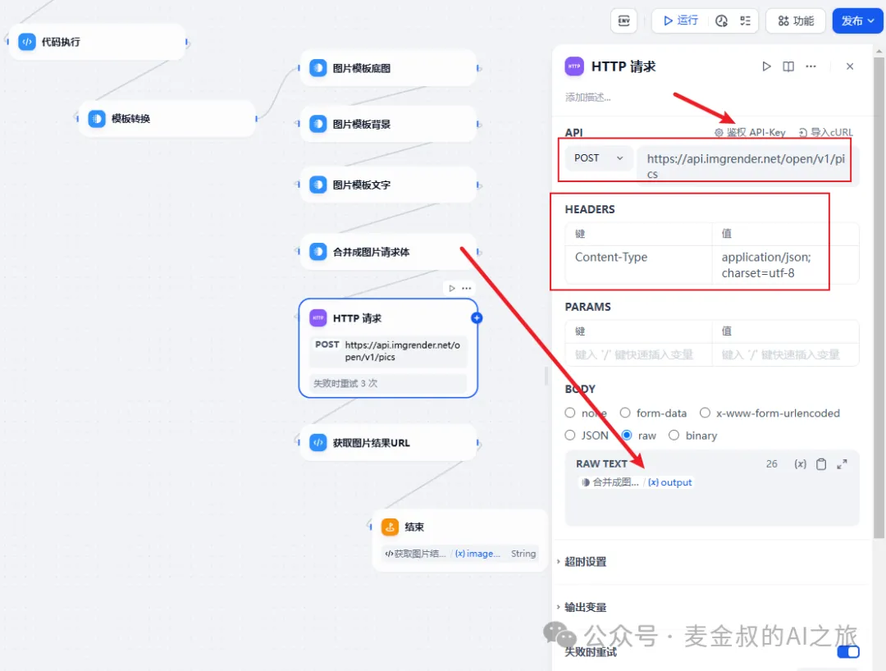

# 图片生成(下)
## **01.** 环境准备

大家通过昨天的教程，已经知道如何生成图片，并看到了最终效果。但是为什么要按照这样的流程进行编写，还是知其然，不知其所以然。

那今天麦金叔就给大家还原一下真相。

因为前面也提到了，这次的动手依赖两个第三方的服务工具。因此，如果想自己动手的，先把账号注册好吧。

### img render

按图所示注册img render，点击"免费使用"，会跳转登录页面，这里需要创建账号，国内无使用障碍。



注册成功后直接来到了控制台页面，此时按图创建应用。



 继续点击新创建的一串数字APPID的应用，打开"应用详情"。可以看到现在API密钥这里是空的，点击右方"新增密钥"，获得一条记录。页面显示一长串数字字母的字符串，右边有个复制按钮，点一下复制保存到安全的地方，留着备用。

再说一下，这个服务宣称是免费，但实际上是每个账号每月有1000次的免费处理次数，正常使用基本上算免费了。但如果你的业务需求量很大，可以购买资源包，也不贵，一张图5厘，已经蛮良心的了。



### figma

按图所示注册figma，这个是美丽国的服务工具，虽然有一些不好的名声，但是在设计SaaS服务领域还是发展很快的。我们用它纯属"白嫖"，不用有太多顾虑。



注册后，下载一个包装的桌面版。然后记住这个插件，等下就要用，Batch auto-generate images using your design

 (https://www.figma.com/community/plugin/1273461051550664878)



工具和插件都准备好之后，我们就继续回到Dify里面。

## **02.** 流程拆解

还记得昨天那6大步骤么？

### 图片模板请求体构造

昨天只说了需要构建一个图片模板的请求体JSON。但这个JSON为何是这样构建的呢？如果靠手写那肯定是不现实的，好在方法也很简单。

我们先在figma里做一个图片的布局，如示例里面，有一个背景图，再有一段文案（为了教学，尽量简单处理了，实际应用时，只是元素对象多一点而已）。先新建一个"Design file"



在空白画布上添加一个Section，注意将Dimensions的W和H（即图片的宽和高）设置为你最终生成的图片的分辨率大小。并将Posion的X和Y都设置为0，即左上角对齐原点。

好了，图片第一层为背景层，准备好一张与图片大小一致的底图，通过工具栏的Image进行插入。Position也设置为0，这样就对齐了。



在背景图上添加"TEXT"，并将其拖拽到画布合适的位置，注意文本的Posion位置，和长宽值，是否合适。可以事先添加与文案长度差不多的文字内容，来观察是否能一行显示，还是要多行。一定要确保最终生成时不要超出背景图片的区域。



本文的示例就这两个元素，实际工作，需要酌情修改设计。这一步如果有设计师朋友帮忙，那就小菜一碟了。

有了设计稿，现在利用上面让准备的插件，就能将设计转化成JSON。选中整个设计，左上角的菜单，转到Plugins菜单项，点击"imgrender - Batch auto-generate"。便会打开一个小对话框，点"Output"按钮。如果提示"Successful!"字样，就说明好了。

这时，需要打开一个文本编辑软件，按Ctrl V就可看到全部内容。如果过程中有问题，看提示解决。大概是导出只能是一层，如果设计放在多层，是不能全部导出的。

```json
{
	"width": 420,
	"height": 600,
	"backgroundColor": "#ffffff",
	"images": [{
		"x": 0,
		"y": 0,
		"width": 420,
		"height": 600,
		"url": "背景图URL",
		"zIndex": 1
	}],
	"texts": [{
		"x": 60,
		"y": 60,
		"text": "文案文案文案文案文案",
		"width": 240,
		"font": "SourceHanSansSC-Normal",
		"fontSize": 16,
		"textAlign": "left",
		"zIndex": 4,
		"color": "#000000"
	}]
}
```

有了这个设计模板JSON，现在就可以去Dify的模板节点去拼接了。

拆分成几个部分就行了，记得images里面的url改为一个imgrender服务能访问到的公网背景图片路径。

texts里面的元素，text部分，用Jinja模板语法，将前序节点的输出string替换为上述JSON里面的"文案文案文案文案文案"。

### HTTP请求构造

再坚持一下，马上就要成功了。

"HTTP请求"按上篇中的截图设置。

API方法选择POST，地址为imgrender的服务地址：https://api.imgrender.net/open/v1/pics ，添加鉴权API-key，改为自定义，Header项填入X-API-Key，key就粘贴前面新建应用时得到的新增密钥。

保存后，继续设置HTTP请求。  
HEADERS增加key为 `Content-Type，value为application/json; charset=utf-8`

BODY，选择raw，值框中输入/ 后选择合并完的output  



如果有使用HTTP服务的经验，这一点非常容易做。

### 获取结果图片

这个"代码执行"节点，继续使用Python，代码非常简单，就是从imgrender的API请求结果中，获得图片URL。

好了，今天的内容终于结束了。其中最繁琐的是图片模板的处理。全程无尿点，累并快乐着。

## **总结**

今天在对有预期效果的工作流上，详细解释了其中节点的设计思路，并完整详细的讲解了操作过程最后利用图片生成服务得到了我们期望的带背景和文案的结果图片。还是昨天麦金叔说的，最终成品效果如何，就依赖设计能力了。