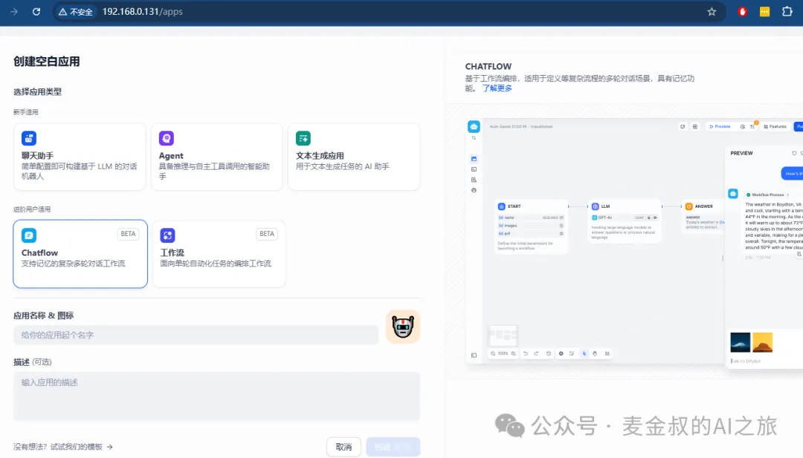
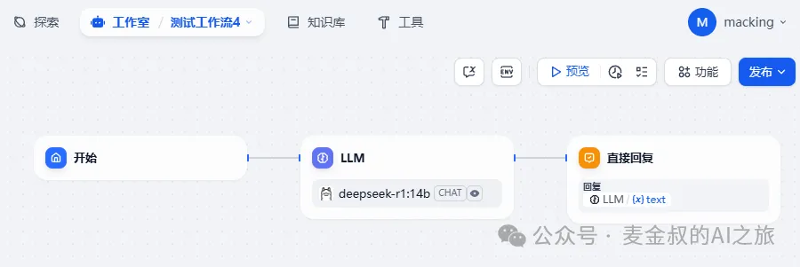
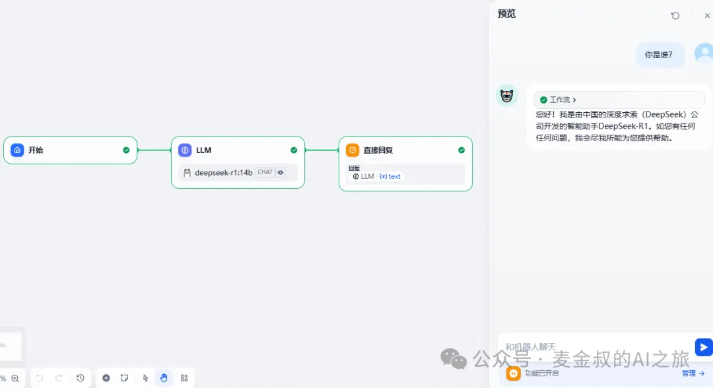
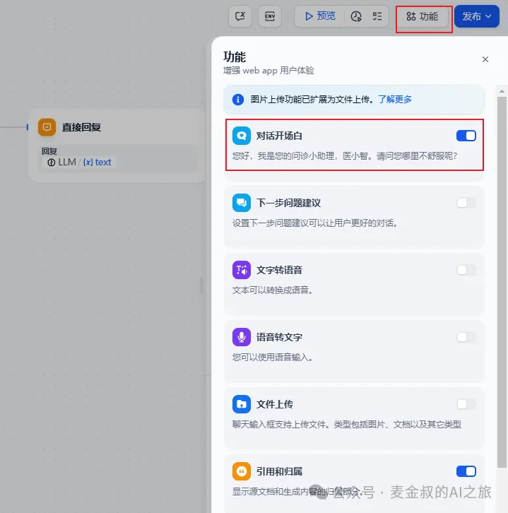
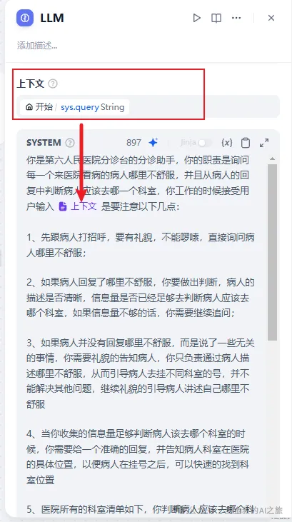
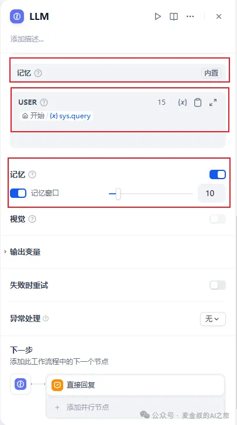
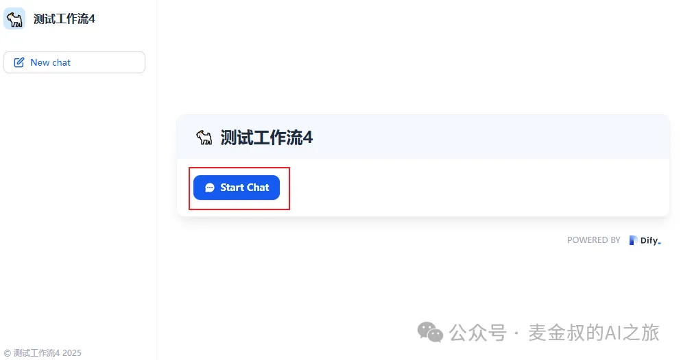
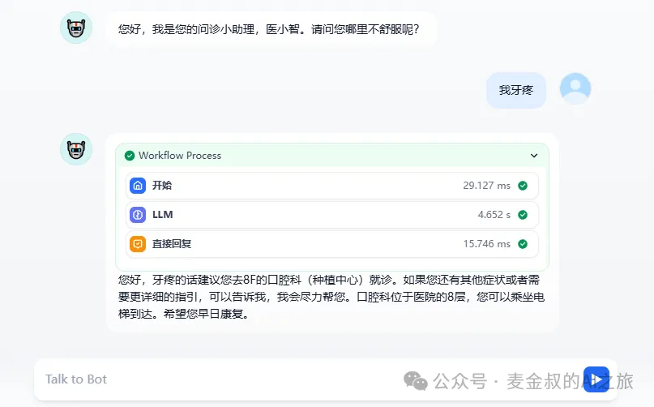
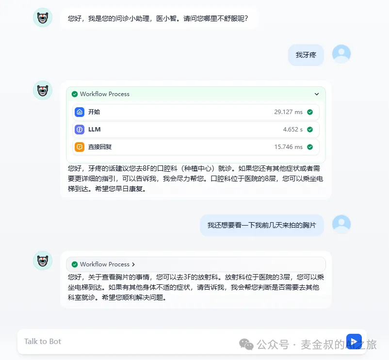
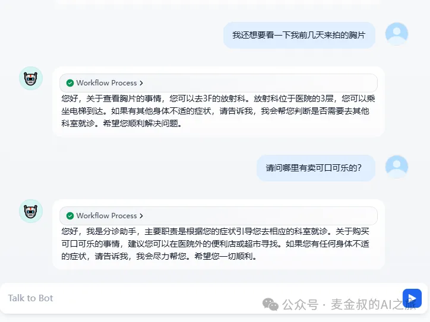

# 对话记忆

## **01.** 动手做一做

暂时先将之前的案例放一放，大家需要新建一个对话流。放心，之前的图文生成和语音项目还未最终完成，但已经变得有点复杂了。如果是刚开始学的同学，可能有点跟不上。所以，我们为了降低难度，先再开启一个新项目，把没学的内容补齐。

今天我们来动手做一做智能医疗分诊助手"医小智"的开发。

还是老规矩，这次我们选新建空白应用，类型用"Chatflow"。这其实和Workflow是差不多的，只是有一点差异，Chatflow是基于对话的，并且内置了记忆能力，即能将多轮对话的历史记忆保存并传递给下一轮对话。

新创建完成，自动会添加三个节点："开始"，"LLM"和"直接回复"。

此时，就已经可以点击"预览"，进行对话调试了。

好了，准备工作就绪，我们正式开始项目开发。

"医小智"是一台放在医院大门口的机器人，它将代替问诊台的服务人员，初步判断来医院就诊的客人，属于什么病因，引导客人去相应的科室挂号就诊。

首先，需要在客人说之前，要有欢迎和引导语。点击右上"功能"，开启"对话开场白"。这里输入的是“您好，我是您的问诊小助理，医小智。请问您哪里不舒服呢？”

接着，需要对"LLM"节点做深入的设置。

在"上下文"这里设置变量值，选择"开始"的用户输入sys.query。这里注意一下，Chatflow内置了很多输入参数，可以直接用，不像工作流，输入的参数需要自己定义。

在SYSTEM提示词这里，通过输入/符号，将上下文代入。

因为Chatflow内置了"记忆"，就不需要手动选择能力。并在下面记忆这里打开它，设置合适的窗口大小。

完成之后，点击"发布"进行保存，就可以进行测试了。

点击"发布"按钮后，选择"运行"。会开启一个新的页面，点"Start Chat"，即开启对话。

得到机器人的欢迎词后，我们输入第一轮的对话。

可以继续对话。

但是如果用户对话输入不相干内容，看智能客服如何应对？

今天的动手做就完成了。下面讲解一下里面关键的知识点。

## **02.** 补充说明

今天的应用非常简单，但是效果却非常棒。有同学会很好奇，这也太神奇了吧，都不需要用Function Call或者RAG就能为指定的医院提供个性化的门诊导流服务。

那为什么仅仅是用Prompt提示词，就可以完成呢？这里就不得不介绍一下大语言模型的基础能力知识，Transformer架构了。

而Transformer模型是基于自注意力机制的深度学习模型。能让AI理解你的提问，并回答准确，就需要计算机模仿人类的行为。

在你阅读一本书的时候，当读到某个句子，你的大脑会自动关注句子中的关键词，并将这些关键词与前面提到的信息联系起来，从而理解整个句子的含义。自注意力机制就是模仿这种人类阅读理解过程的一种算法。

简单来说，自注意力机制允许模型在处理序列数据（如句子）时，自动找出序列中各个元素之间的关联。它能够让模型在处理某个位置的信息时，同时考虑到整个序列中的其他相关信息，而不仅仅是附近的信息。

自注意力机制是一种强大的序列建模技术，它通过计算元素之间的相似度，让模型能够聚焦于重要的信息，并忽略无关的噪声。这种机制在自然语言处理、计算机视觉、语音处理等领域都有着广泛的应用和显著效果。

它为序列数据的处理提供了新的思路和方法，使得模型能够更好地理解和利用序列中的信息，从而推动人工智能技术的进步和发展。

原理讲解比较无趣，如果不感兴趣可以忽略。

## **总结**

今天又开启了一种新应用类型 -- "Chatflow"的学习。它封装了和对话相关的能力。但它本质上依然是一种workflow，之前学的那些技能，也都能放进去。

通过"医小智"的实战，让你可以做出最简单的客服对话类智能体，后续会结合Dify的能力，补充进更为复杂的功能，让真正的变成一个能落地的AI应用。