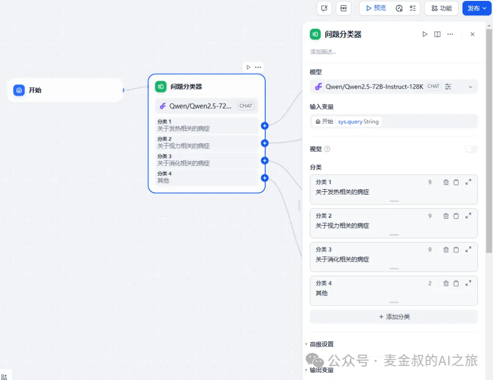
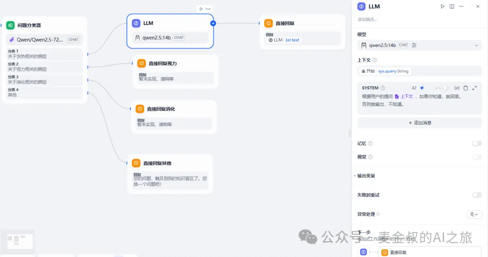
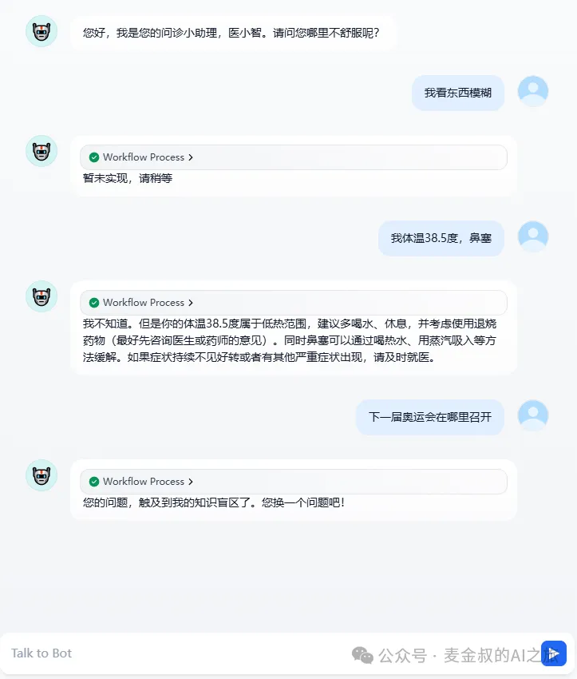

# 问题分类

## **01.** 动手做一做

上次课的分诊应用，只有关键的一步，利用了大语言模型内在的自注意力机制，就能完成识别症状与导流的工作。

今天我们来要来增加这个智能医疗分诊助手"医小智"的能力。

因为在实际的场景中，有可能还是要确定大致问题的范围，然后再做出更加精准的判断。所以，就需要用到Dify的另一个组件"问题分类器"。

在上一课的流程基础上，我们在"开始"之后添加一个"问题分类器"，分类器同样也是需要选择一个大语言模型的，但是组件会约束大语言模型去匹配给定的分支的结果。

然后在每个分支后都能添加一个行动，可以是直接回复，也可以调用"LLM"，进一步对前面对话所获取的"信息"，和当前节点给予的"要求"，再来一轮对话。

为了演示效果，麦金叔只对其中一个分支，做第二轮的大语言模型对话，其他分支，或回答"暂未实现，请稍等"，或回答"您的问题，触及到我的知识盲区了。您换一个问题吧！"。

以下是分别给出问话，走到不同分支的演示。

好了，今天的知识点也非常简单，跟上节课的比，就是将一次大语音模型的对话，拆分出先对问题做出分类，然后后面再接着处理。

## **02.** 补充说明

我们知道，大语言模型在问题回答上，可能还存在着差异。但是对给定一段信息，做信息分类，或者做总结，其置信度已经非常高了。

因此将一个复杂场景的应用，进行分而自治，拆分为几个简单场景，这样能更大程度的提高结果的准确性。

Dify的问题分类器能够高效，灵活地适应不同业务场景的需求。如果还需要进一步优化，可以通过增加领域特异性训练数据或者微调预训练模型，来作为分类器的模型基座，以提升效果。

## **总结**

今天又学习一种新的组件"问题分类器"。用好它可以将一个全局的对话，约束到一个小范围内继续讨论。

通过对"医小智"的更精细化调教实战，让它真正的变成一个能落地的AI应用。