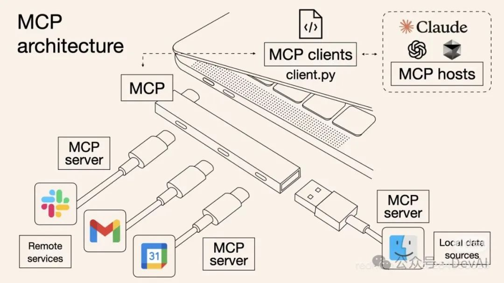
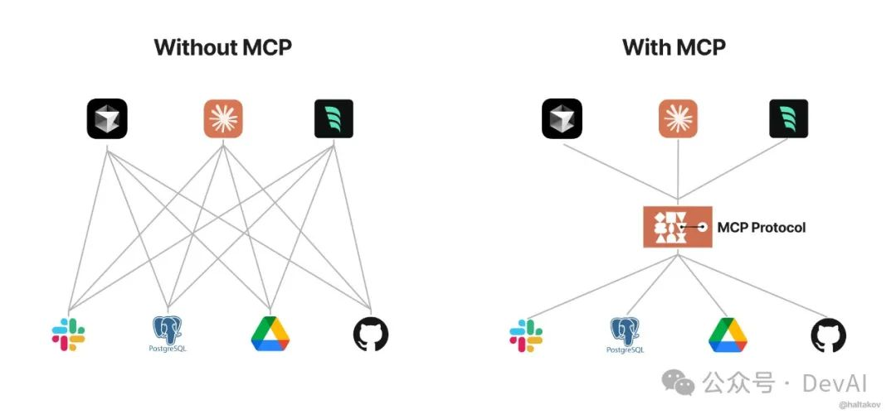
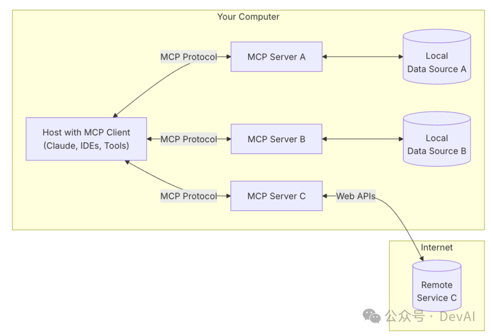
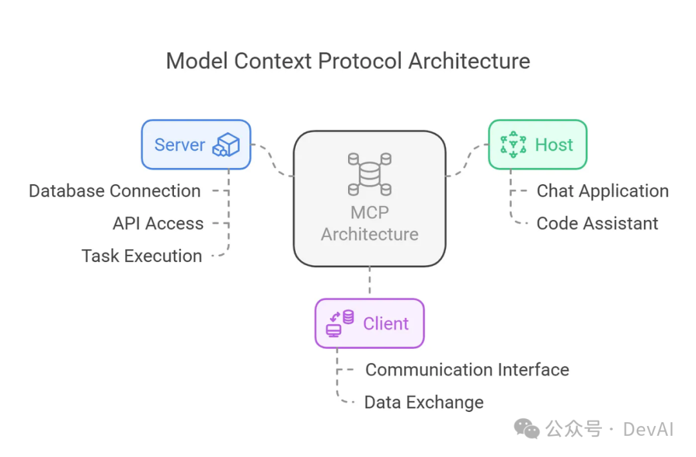
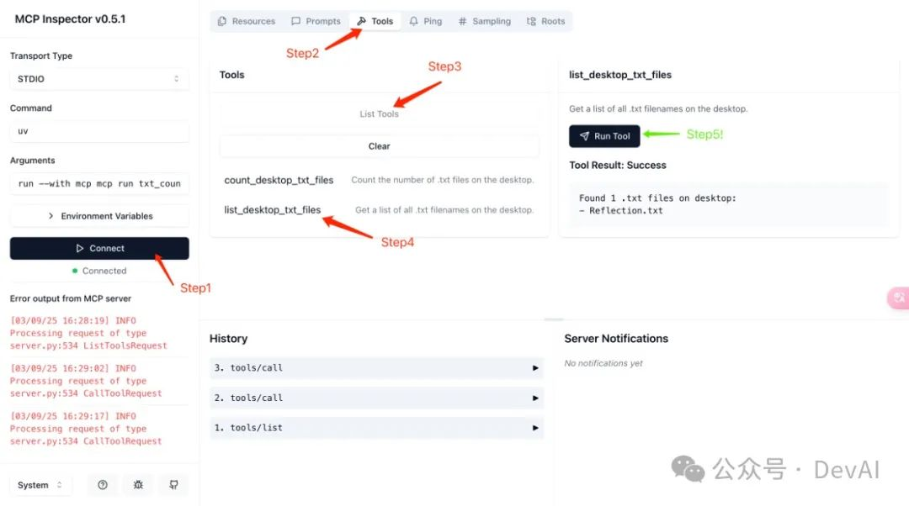
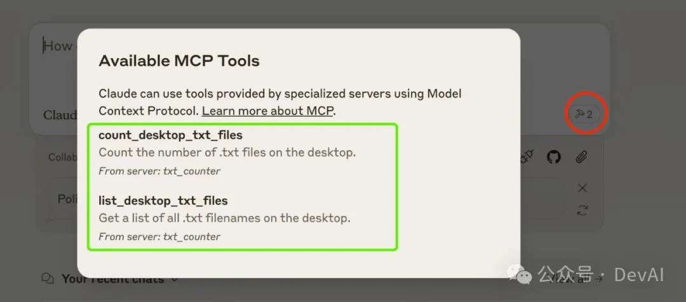
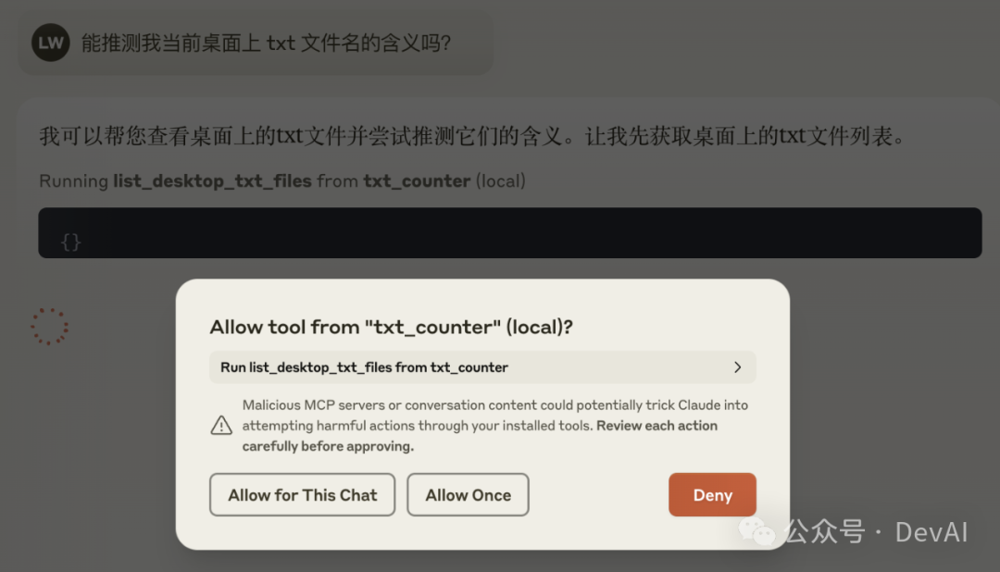
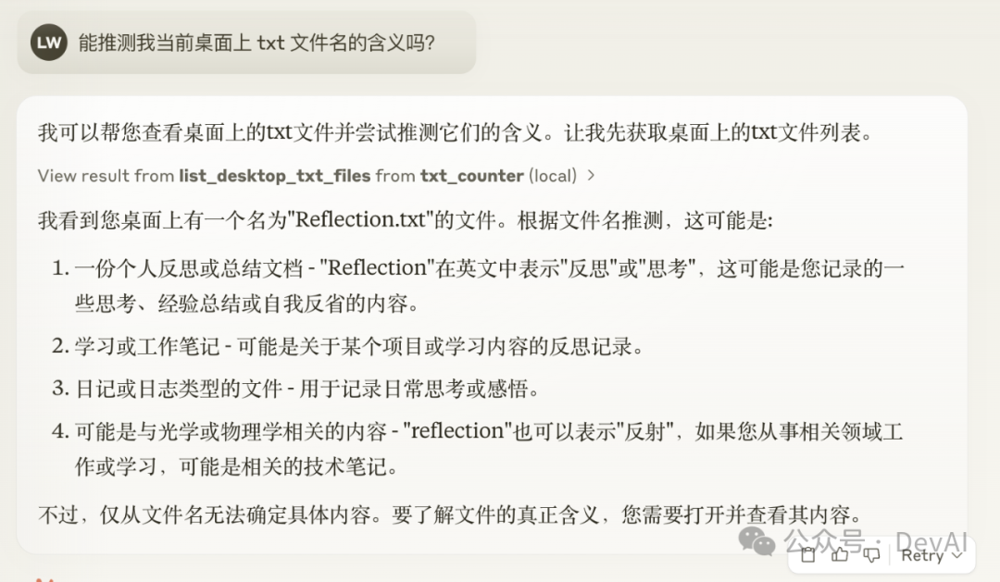

# MCP (Model Context Protocol) 介绍

> 文章来源：[MCP (Model Context Protocol)，一篇就够了](https://mp.weixin.qq.com/s/rmR8H6ocCd1E3hvbgb0__Q)

最近 MCP 这个关键词逐渐活跃在我所浏览的一些文章及评论区中。突然发现我对它仅有粗糙的理解，我决定深入学习并记录一下。

在阅读这篇文章前，我也简单地浏览了现有介绍 MCP 的文章。我发现大部分文章停留在“翻译” https://modelcontextprotocol.io/ 网站中的内容，或者花时间在绝大部分用户不关心的技术细节上（还有一些纯 AI 文）。

因此，我将从使用者的角度出发，分享实用内容，并以一个示例展示 MCP 的开发过程与实际应用作为结尾。本篇旨在回答以下三个问题：

- 什么是 MCP？
- 为什么需要 MCP？
- 作为用户，我们如何使用/开发 MCP？

当然，一篇文章远远不足以讲透 MCP 的所有概念，只能尽力萃取最重要的内容供大家阅读，欢迎讨论。

## 1. What is MCP?

MCP 起源于 2024 年 11 月 25 日 Anthropic 发布的文章：[Introducing the Model Context Protocol](https://www.anthropic.com/news/model-context-protocol)。

MCP （Model Context Protocol，模型上下文协议）定义了应用程序和 AI 模型之间交换上下文信息的方式。这使得开发者能够**以一致的方式将各种数据源、工具和功能连接到 AI 模型**（一个中间协议层），就像 USB-C 让不同设备能够通过相同的接口连接一样。MCP 的目标是创建一个通用标准，使 AI 应用程序的开发和集成变得更加简单和统一。

所谓一图胜千言，我这里引用一些制作的非常精良的图片来帮助理解：



可以看出，MCP 就是以更标准的方式让 LLM Chat 使用不同工具，更简单的可视化如下图所示，这样你应该更容易理解“中间协议层”的概念了。Anthropic 旨在实现 LLM Tool Call 的标准。



> 💡 为保证阅读的流畅性，本文将 MCP Host / Client / Server 的定义后置。初学者/用户可暂不关注这些概念，不影响对 MCP 的使用。

## 2. Why MCP?

我认为 MCP 的出现是 prompt engineering 发展的产物。更结构化的上下文信息对模型的 performance 提升是显著的。我们在构造 prompt 时，希望能提供一些更 specific 的信息（比如本地文件，数据库，一些网络实时信息等）给模型，这样模型更容易理解真实场景中的问题。

**想象一下没有 MCP 之前我们会怎么做**？我们可能会人工从数据库中筛选或者使用工具检索可能需要的信息，手动的粘贴到 prompt 中。随着我们要解决的问题越来越复杂，**手工**把信息引入到 prompt 中会变得越来越困难。

为了克服手工 prompt 的局限性，许多 LLM 平台（如 OpenAI、Google）引入了 `function call` 功能。这一机制允许模型在需要时调用预定义的函数来获取数据或执行操作，显著提升了自动化水平。

但是 function call 也有其局限性（我对于 function call vs MCP 的理解不一定成熟，欢迎大家补充），我认为重点在于 **function call 平台依赖性强**，不同 LLM 平台的 function call API 实现差异较大。例如，OpenAI 的函数调用方式与 Google 的不兼容，开发者在切换模型时需要重写代码，增加了适配成本。除此之外，还有安全性，交互性等问题。

**数据与工具本身是客观存在的**，只不过我们希望将数据连接到模型的这个环节可以更智能更统一。Anthropic 基于这样的痛点设计了 MCP，充当 AI 模型的"万能转接头"，让 LLM 能轻松得获取数据或者调用工具。更具体的说 MCP 的优势在于：

- **生态** - MCP 提供很多现成的插件，你的 AI 可以直接使用。
- **统一性** - 不限制于特定的 AI 模型，任何支持 MCP 的模型都可以灵活切换。
- **数据安全** - 你的敏感数据留在自己的电脑上，不必全部上传。（因为我们可以自行设计接口确定传输哪些数据）

## 3. 用户如何使用 MCP？

对于用户来说，我们并不关心 MCP 是如何实现的，通常我们只考虑如何更简单地用上这一特性。

具体的使用方式参考官方文档：[For Claude Desktop Users](https://modelcontextprotocol.io/quickstart/user)。这里不再赘述，配置成功后可以在 Claude 中测试：`Can you write a poem and save it to my desktop?` Claude 会请求你的权限后在本地新建一个文件。

并且官方也提供了非常多现成的 MCP Servers，你只需要选择你希望接入的工具，然后接入即可。

- [Awesome MCP Servers](https://github.com/punkpeye/awesome-mcp-servers)
- [MCP Servers Website](https://mcpservers.org/)
- [Official MCP Servers](https://github.com/modelcontextprotocol/servers)

比如官方介绍的 `filesystem` 工具，它允许 Claude 读取和写入文件，就像在本地文件系统中一样。

## 4. MCP Architecture 解构

这里首先引用官方给出的架构图。



MCP 由三个核心组件构成：Host、Client 和 Server。让我们通过一个实际场景来理解这些组件如何协同工作：

假设你正在使用 Claude Desktop (Host) 询问："我桌面上有哪些文档？"

1. **Host**：Claude Desktop 作为 Host，负责接收你的提问并与 Claude 模型交互。
2. **Client**：当 Claude 模型决定需要访问你的文件系统时，Host 中内置的 MCP Client 会被激活。这个 Client 负责与适当的 MCP Server 建立连接。
3. **Server**：在这个例子中，文件系统 MCP Server 会被调用。它负责执行实际的文件扫描操作，访问你的桌面目录，并返回找到的文档列表。

整个流程是这样的：你的问题 → Claude Desktop(Host) → Claude 模型 → 需要文件信息 → MCP Client 连接 → 文件系统 MCP Server → 执行操作 → 返回结果 → Claude 生成回答 → 显示在 Claude Desktop 上。

这种架构设计使得 Claude 可以在不同场景下灵活调用各种工具和数据源，而开发者只需专注于开发对应的 MCP Server，无需关心 Host 和 Client 的实现细节。



## 5. 原理：模型是如何确定工具的选用的？

在学习的过程中，我一直好奇一个问题：**Claude（模型）是在什么时候确定使用哪些工具的呢**？好在 Anthropic 为我们提供了详细的[解释](https://modelcontextprotocol.io/quickstart/server#what%E2%80%99s-happening-under-the-hood)：

当用户提出一个问题时：

1. 客户端（Claude Desktop / Cursor）将你的问题发送给 Claude。
2. Claude 分析可用的工具，并决定使用哪一个（或多个）。
3. 客户端通过 MCP Server 执行所选的工具。
4. 工具的执行结果被送回给 Claude。
5. Claude 结合执行结果构造最终的 prompt 并生成自然语言的回应。
6. 回应最终展示给用户！

> MCP Server 是由 Claude 主动选择并调用的。有意思的是 Claude 具体是如何确定该使用哪些工具呢？以及是否会使用一些不存在的工具呢（幻觉）？

## 6. 总结

MCP (Model Context Protocol) 代表了 AI 与外部工具和数据交互的标准建立。通过本文，我们可以了解到：

1. **MCP 的本质**：它是一个统一的协议标准，使 AI 模型能够以一致的方式连接各种数据源和工具，类似于 AI 世界的"USB-C"接口。
2. **MCP 的价值**：它解决了传统 function call 的平台依赖问题，提供了更统一、开放、安全、灵活的工具调用机制，让用户和开发者都能从中受益。
3. **使用与开发**：对于普通用户，MCP 提供了丰富的现成工具，**用户可以在不了解任何技术细节的情况下使用**；对于开发者，MCP 提供了清晰的架构和 SDK，使工具开发变得相对简单。

MCP 还处于发展初期，但其潜力巨大。更重要的是生态吧，基于统一标准下构筑的生态也会正向的促进整个领域的发展。

以上内容已经覆盖了 MCP 的基本概念、价值和使用方法。对于技术实现感兴趣的读者，以下**附录提供了一个简单的 MCP Server 开发实践**，帮助你更深入地理解 MCP 的工作原理。

## Appendix A：MCP Server 开发实践

在了解 MCP 组件之后，很容易发现对绝大部分 AI 开发者来说，我们只需要关心 Server 的实现。因此，我这里准备通过一个最简单的示例来介绍如何实现一个 MCP Server。

MCP servers 可以提供三种主要类型的功能：

- Resources（资源）：类似文件的数据，可以被客户端读取（如 API 响应或文件内容）
- Tools（工具）：可以被 LLM 调用的函数（需要用户批准）
- Prompts（提示）：预先编写的模板，帮助用户完成特定任务

本教程将主要关注工具（Tools）。

### A.I 使用 LLM 构建 MCP 的最佳实践

在开始之前，Anthropic 为我们提供了一个基于 LLM 的 MCP Server 的[最佳开发实践](https://modelcontextprotocol.io/tutorials/building-mcp-with-llms)，总结如下：

1. 引入 domain knowledge （说人话就是，告诉他一些 MCP Server 开发的范例和资料）

	- 访问 https://modelcontextprotocol.io/llms-full.txt 并复制完整的文档文本。（实测这个太长了，可以忽略）
	- 导航到 MCP [TypeScript SDK](https://github.com/modelcontextprotocol/typescript-sdk) 或 [Python SDK](https://github.com/modelcontextprotocol/python-sdk) Github 项目中并复制相关内容。
	- 把这些作为 prompt 输入到你的 chat 对话中（作为 context）。

2. 描述你的需求

	- 你的服务器会开放哪些资源
	- 它会提供哪些工具
	- 它应该给出哪些引导或建议
	- 它需要跟哪些外部系统互动

给出一个 example prompt:

```
... （这里是已经引入的 domain knowledge）

打造一个 MCP 服务器，它能够：

- 连接到我公司的 PostgreSQL 数据库
- 将表格结构作为资源开放出来
- 提供运行只读 SQL 查询的工具
- 包含常见数据分析任务的引导
```

剩下的部分也很重要，但是偏重于方法论，实践性较弱，我这里就不展开了，推荐大家直接看[官方文档](https://modelcontextprotocol.io/tutorials/building-mcp-with-llms)。

### A.II 手动实践

本节内容主要参考了官方文档：[Quick Start: For Server Developers](https://modelcontextprotocol.io/quickstart/server)。你可以选择直接跳过这部分内容或者进行一个速读。

这里我准备了一个简单的示例，使用 Python 实现一个 MCP Server，用来**统计当前桌面上的 txt 文件数量和获取对应文件的名字**（你可以理解为一点用都没有，但是它足够简单，主要是为了难以配置环境的读者提供一个足够短的实践记录）。以下实践均运行在我的 MacOS 系统上。

**Step1. 前置工作**

- 安装 Claude Desktop。
- Python 3.10+ 环境
- Python MCP SDK 1.2.0+

**Step2. 环境配置**

由于我使用的是官方推荐的配置：

```
# 安装 uv
curl -LsSf https://astral.sh/uv/install.sh | sh

# 创建项目目录
uv init txt_counter
cd txt_counter

# 设置 Python 3.10+ 环境
echo "3.11" > .python-version

# 创建虚拟环境并激活
uv venv
source .venv/bin/activate

# Install dependencies
uv add "mcp[cli]" httpx

# Create our server file
touch txt_counter.py
```

> **Question**: 什么是 `uv` 呢和 `conda` 比有什么区别？
> **Answer**: 一个用 Rust 编写的超快速 (100x) Python 包管理器和环境管理工具，由 Astral 开发。定位为 pip 和 venv 的替代品，专注于速度、简单性和现代 Python 工作流。

**Step3. 构造一个 prompt**

```
"""
... （这里是已经引入的 domain knowledge）
"""

打造一个 MCP 服务器，它能够：
- 功能：
    - 统计当前桌面上的 txt 文件数量
    - 获取对应文件的名字

要求：
- 不需要给出 prompt 和 resource 相关代码。
- 你可以假设我的桌面路径为 /Users/{username}/Desktop
```

- Domain Knowledge 复制于 MCP Python SDK 的 [README 文件](https://raw.githubusercontent.com/modelcontextprotocol/python-sdk/refs/heads/main/README.md)

**Step4. 实现 MCP Server**

以下代码由 Claude 3.7 直接生成。当然，这主要是因为我的需求足够简单，当你需要实现一个复杂的 MCP Server 时，你可能需要多步的引导和 Debug 才能得到最终的代码。

```python
import os
from pathlib import Path
from mcp.server.fastmcp import FastMCP

# 创建 MCP Server
mcp = FastMCP("桌面 TXT 文件统计器")

@mcp.tool()
defcount_desktop_txt_files() -> int:
    """Count the number of .txt files on the desktop."""
    # Get the desktop path
    username = os.getenv("USER") or os.getenv("USERNAME")
    desktop_path = Path(f"/Users/{username}/Desktop")
    
    # Count .txt files
    txt_files = list(desktop_path.glob("*.txt"))
    returnlen(txt_files)

@mcp.tool()
deflist_desktop_txt_files() -> str:
    """Get a list of all .txt filenames on the desktop."""
    # Get the desktop path
    username = os.getenv("USER") or os.getenv("USERNAME")
    desktop_path = Path(f"/Users/{username}/Desktop")
    
    # Get all .txt files
    txt_files = list(desktop_path.glob("*.txt"))
    
    # Return the filenames
    ifnot txt_files:
        return"No .txt files found on desktop."
    
    # Format the list of filenames
    file_list = "\n".join([f"- {file.name}"for file in txt_files])
    returnf"Found {len(txt_files)} .txt files on desktransform: translateY(\n{file_list}"

if __name__ == "__main__":
    # Initialize and run the server
    mcp.run()
```

任务非常简单，只需要调用非常基本的 `os` 就可以完成。

**Step5. 测试 MCP Server**

（官方没有这一步，但是我非常推荐大家这么做）

```
$ mcp dev txt_counter.py
Starting MCP inspector...
Proxy server listening on port 3000

🔍 MCP Inspector is up and running at http://localhost:5173 🚀
```

之后进入到给出的链接中，你大概能按下图进行操作：



如果成功，你应该能像我一样看到对应的输出（`Tool Result`）～

**Step6. 接入 Claude**

最后一步就是把我们写好的 MCP 接入到 Claude Desktop 中。流程如下：

```
# 打开 claude_desktop_config.json (MacOS / Linux)
# 如果你用的是 cursor 或者 vim 请更换对应的命令
code ~/Library/Application\ Support/Claude/claude_desktop_config.json
```

在配置文件中添加以下内容，记得替换 `/Users/{username}` 为你的实际用户名，以及其他路径为你的实际路径。

```json
{
  "mcpServers":{
    "txt_counter":{
      "command":"/Users/{username}/.local/bin/uv",
      "args":[
        "--directory",
        "/Users/{username}/work/mcp-learn/code-example-txt",// 你的项目路径（这里是我的）
        "run",
        "txt_counter.py"// 你的 MCP Server 文件名
      ]
    }
  }
}
```

- `uv` 最好是绝对路径，推荐使用 `which uv` 获取。

配置好后重启 Claude Desktop，如果没问题就能看到对应的 MCP Server 了。



**Step7. 实际使用**

接下来，我们通过一个简单的 prompt 进行实际测试：

```
能推测我当前桌面上 txt 文件名的含义吗？
```

它可能会请求你的使用权限，如图一所示，你可以点击 `Allow for This Chat`





看起来我们 MCP Server 已经正常工作了！

### A.III MCP Server Debug

Debug 是一个非常复杂的话题，这里直接推荐官方的教程：

- Official Tutorial: [Debugging](https://modelcontextprotocol.io/docs/tools/debugging)
- Official Tutorial: [Inspector](https://modelcontextprotocol.io/docs/tools/inspector)

## Reference

- [MCP Official Docs](https://modelcontextprotocol.io/)
- [MCP Python SDK](https://github.com/modelcontextprotocol/python-sdk)
- [MCP Available Server](https://github.com/modelcontextprotocol/servers)
- Blog: [What is Model Context Protocol? (MCP) Architecture Overview](https://medium.com/@tahirbalarabe2/what-is-model-context-protocol-mcp-architecture-overview-c75f20ba4498)
- Blog: [LLM Function-Calling vs. Model Context Protocol (MCP)](https://www.gentoro.com/blog/function-calling-vs-model-context-protocol-mcp)


​