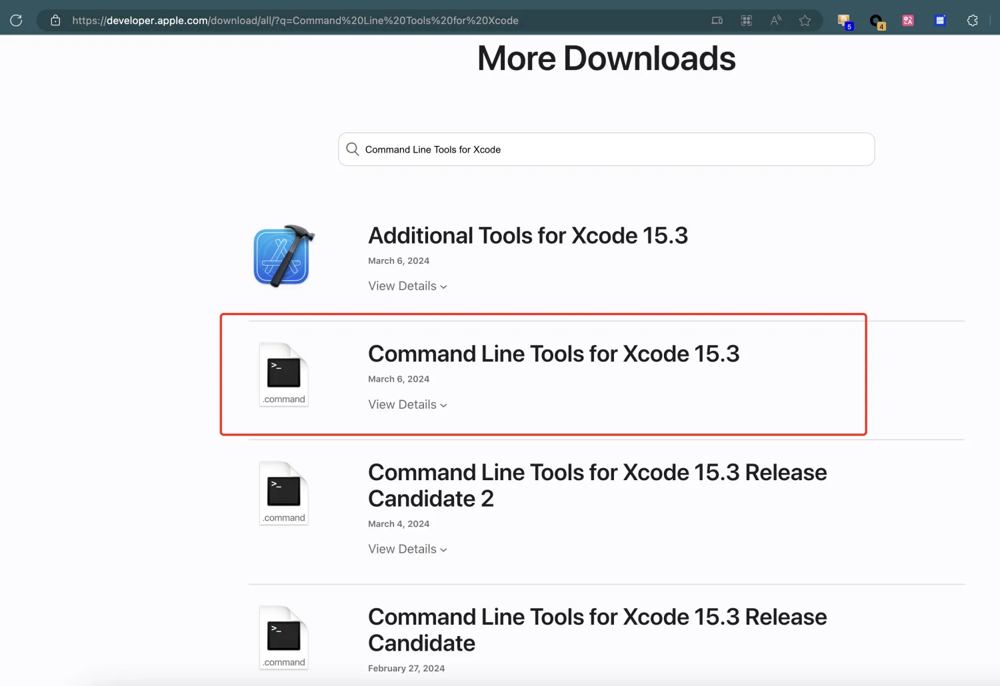
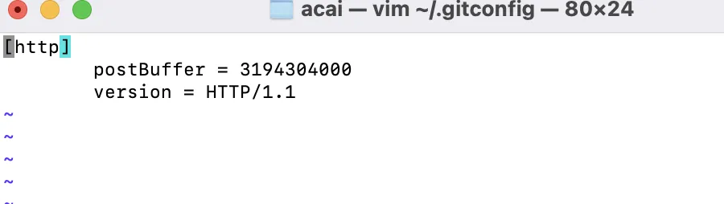

# 安装 Homebrew

> 官网地址：[https://brew.sh/zh-cn/](https://brew.sh/zh-cn/)

## 自动安装

首先可以尝试自动安装方法，直接一行命令就行：

```bash
/bin/zsh -c "$(curl -fsSL https://gitee.com/cunkai/HomebrewCN/raw/master/Homebrew.sh)"
```

如果不行，再尝试手动安装方法

## 手动安装

首先，需要确保系统中安装了 bash、git 和 curl (对于 macOS 用户，系统自带 bash、git 和 curl)，对于 macOS 用户需额外要求安装 Command Line Tools (CLT) for Xcode。在命令行输入 `xcode-select --install` 安装 CLT for Xcode 即可。

接着，在终端输入以下几行命令设置环境变量：

```bash
export HOMEBREW_INSTALL_FROM_API=1
export HOMEBREW_API_DOMAIN="https://mirrors.tuna.tsinghua.edu.cn/homebrew-bottles/api"
export HOMEBREW_BOTTLE_DOMAIN="https://mirrors.tuna.tsinghua.edu.cn/homebrew-bottles"
export HOMEBREW_BREW_GIT_REMOTE="https://mirrors.tuna.tsinghua.edu.cn/git/homebrew/brew.git"
export HOMEBREW_CORE_GIT_REMOTE="https://mirrors.tuna.tsinghua.edu.cn/git/homebrew/homebrew-core.git"
```

> 注：自 brew 4.0 起，HOMEBREW_INSTALL_FROM_API 会成为默认行为，无需设置；大部分用户无需再克隆 homebrew/core 仓库，故无需设置 HOMEBREW_CORE_GIT_REMOTE 环境变量。但若需要运行 brew 的开发命令或者 brew 安装在非官方支持的默认 prefix 位置，则仍需设置 HOMEBREW_CORE_GIT_REMOTE 环境变量；如果不想通过 API 安装，可以设置 HOMEBREW_NO_INSTALL_FROM_API=1。

最后，在终端运行以下命令以安装 Homebrew / Linuxbrew（从清华镜像源安装）：

```bash
git clone --depth=1 https://mirrors.tuna.tsinghua.edu.cn/git/homebrew/install.git brew-install

/bin/bash brew-install/install.sh

rm -rf brew-install
```

这样在首次安装的时候也可以使用镜像。

安装成功后需将 brew 程序的相关路径加入到环境变量中：  
以下针对基于 Apple Silicon CPU 设备上的 macOS 系统（命令行运行 `uname -m` 应输出 arm64）上的Homebrew：

```bash
if test -r ~/.bash_profile;then echo 'eval "$(/opt/homebrew/bin/brew shellenv)"' >> ~/.bash_profile;else touch ~/.bash_profile && echo 'eval "$(/opt/homebrew/bin/brew shellenv)"' >> ~/.bash_profile;fi

if test -r ~/.zprofile;then echo 'eval "$(/opt/homebrew/bin/brew shellenv)"' >> ~/.zprofile;else touch ~/.zprofile && echo 'eval "$(/opt/homebrew/bin/brew shellenv)"' >> ~/.zprofile;fi
```

## 一些错误的解决方式

`Error downloading Command Line Tools for Xcode: The network connection was lost.`  
很明显网络问题，建议手动安装 Command Line Tools for Xcode：  
访问 [Command Line Tools for Xcode](https://developer.apple.com/download/all/?q=Command%20Line%20Tools%20for%20Xcode) 然后下载最新的 dmg 安装包安装就行:  


`error: Rpc failed; curl 92 HTTP/2 stream 5 was not closed cleanly: CANCEL (err 8)`  
`error: Rpc failed; curl 18 transfer closed with outstanding read data remaining`  
这两个是网络问题，建议使用国内源进行安装，也就是使用上面的教程，不过建议你也把 git 的缓冲区调大。  
加大缓冲区：编辑 `~/.gitconfig` 文件，编写内容如下：  



`执行 brew -v 没反应`  

执行上面说的 “安装成功后需将 brew 程序的相关路径加入到环境变量中” 里的命令。