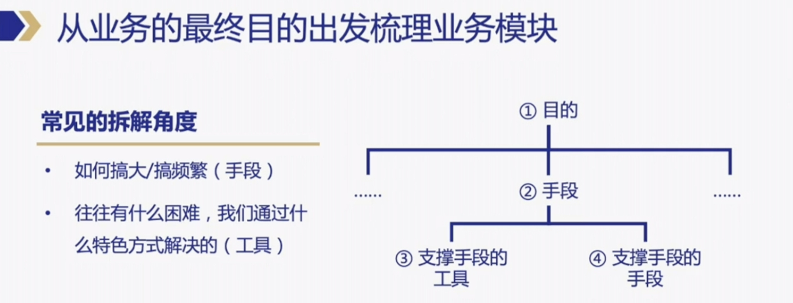
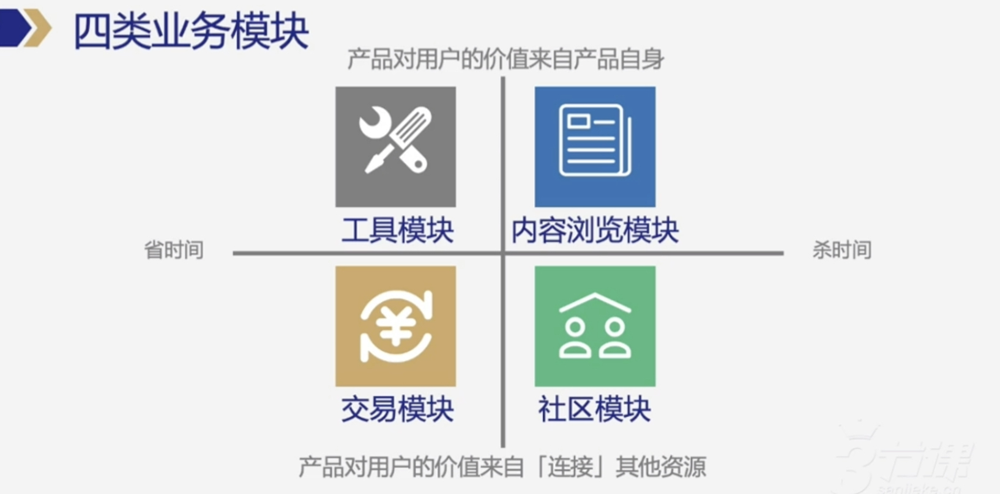
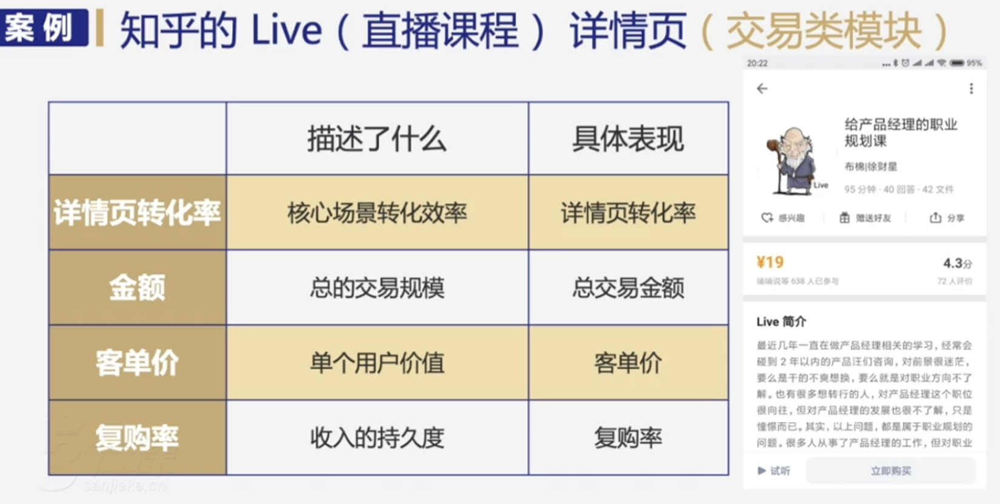
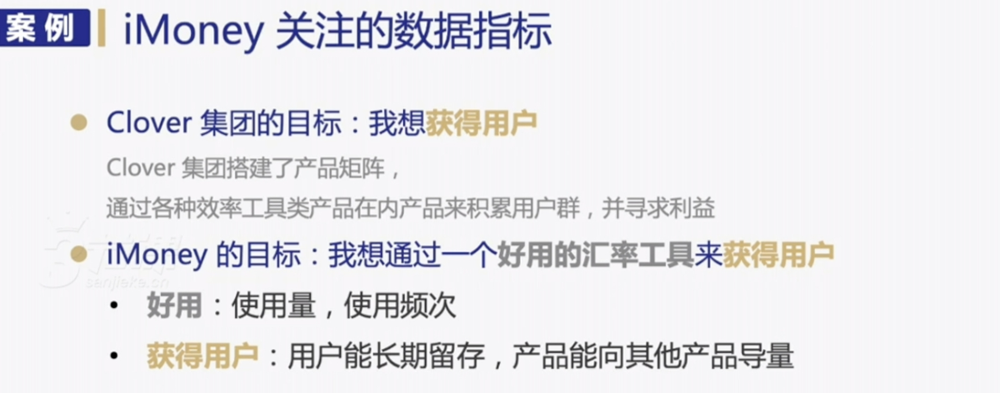

##   一、指标建模-指标选取

> 简介：如何选取适当数据指标，才能合理地抽象、概括、还原业务实际，并对你的后续动作形成参考？本节将为你讲解。

### 1.1 指标选取O1-拆解业务模块
> 该视频内容主要讲解了如何针对不同产品选择数据指标的方法论，包括从业务最终目的出发梳理业务模块，根据业务模块判断其类型，然后根据业务模块所属类型选择对应的数据指标。通过案例演示了如何通过最终目的反推业务流程，分离出各个模块，并针对不同模块选择合适的数据指标。最后，通过两个案例演练，进一步加深了对方法论的理解和应用。

### 1.2 指标选取02-判断模块类型

> 该视频内容主要介绍了如何通过业务目的来拆解产品，将其分为不同的业务模块。视频中详细介绍了四种类型的业务模块：工具类、内容浏览类、交易类和社区类，并给出了相应的案例进行解析。同时，视频还强调了业务模块的划分是一个主观的过程，不同的人可能会有不同的拆分结果，但核心在于对业务的理解和切入角度。

### 1.3 指标选取03-根据模块类型，选取数据指标

> 该段视频内容主要介绍了工具类产品的三大评估指标：使用量、频次与目标达成率。首先，将产品拆分为不同的业务模块，并确定每个模块的类型。然后，根据不同类型的模块选择对应的数据指标。对于工具类模块，主要关注使用量、频次和目标达成率三个指标，其中使用量描述产品的累积使用量，频次描述用户使用产品的频率，目标达成率则评估产品是否能够达成用户的预期目标。最后，通过这些指标来评估工具类产品的优劣。

#### 1.3.1 工具类产品的用户满意度指标

> 该段视频内容讲述了工具类产品的用户满意度指标，包括使用量、目标达成率和频次。对于大面儿的产品，使用量、目标达成率和频次三个指标可以衡量满意度。而对于具体的产品，需要根据产品特点选择三个指标，如使用量、目标达成率和频次。

#### 1.3.2 交易类模块的评估指标

> 该段视频内容介绍了评估交易类模块的三个关键指标：转化率、交易规模和客单价，并解释了复购率作为衡量收入持久度的重要性。此外，还介绍了内容浏览类模块的四个关键指标：总浏览数、浏览广度、浏览时长和内容互动。

#### 1.3.3 内容互动与社区模块评估：发布量、互动量与关系密度的探讨

> 该段视频内容探讨了内容互动与社区模块评估的关键指标，包括发布量、互动量和关系密度。发布量是社区话题的源头和活力的体现，互动量能够提升社区活力，关系密度则描述用户之间的紧密联系。在微信的看一看模块中，转发数是最主要的互动形式，能够促进更多人浏览和时长。对于社区社交类模块，发布量、互动量和关系密度是观察的三个关键指标。例如在脉脉的直言板块中，发布量是评估匿名吐槽数量的指标。

#### 1.3.4 内容与关系密度的观察指标

> 该段视频内容主要介绍了内容与关系密度的观察指标，包括发布量、互动量、关系密度等。其中，关系密度的观察指标选取了每天发布的直言涉及到的公司数量，以衡量用户和用户之间产生关系的可能性。此外，还提到了不同类型社区的关系密度衡量方式，如地理位置、话题、标签等。

#### 1.3.5 数据指标选择通用方法论

> 该段视频内容介绍了如何选择数据指标的通用方法论，包括从业务目的出发梳理业务模块、判断模块类型、选择不同数据指标以及考虑指标在产品中的表现形式。通过案例演示了如何衡量不同模块的表现情况，并总结了整个方法论的运作流程。

### 1.4 指标选取O4【案例】iMoney数据指标选取

> 该视频内容讲述了如何使用实战案例AI Money产品进行指标拆解，首先明确了产品的目标，然后根据工具属性和用户获取两个方面，通过使用量和频次来评判工具是否好用，同时关注长期留存指标和导量指标，以评估产品对整个集团产品矩阵的贡献价值。

### 1.5 指标选取05【案例】闲鱼数据指标选取

> 该视频内容主要围绕闲鱼产品案例进行拆解，通过分析买家与卖家的需求，介绍了闲鱼的产品功能模块，包括内容浏览模块、社区模块和工具模块，并给出了相应的指标选择方式。同时，通过案例分析，强调了闲鱼作为二手交易平台的目标，即承载阿里的ctoc交易流量，满足买家和卖家的需求，并最终实现交易的完成。

### 1.6 指标选取06小结

> 该视频内容主要介绍了数据指标建模的各个方面，包括数据指标的定义、常见的数据指标、如何选择合适的数据指标，以及针对不同业务模块类型选择合适的指标等。视频还强调了通用方法论在实际应用中的重要性和注意事项，以及如何结合自己业务情况选择最能表现业务健康程度的指标。

