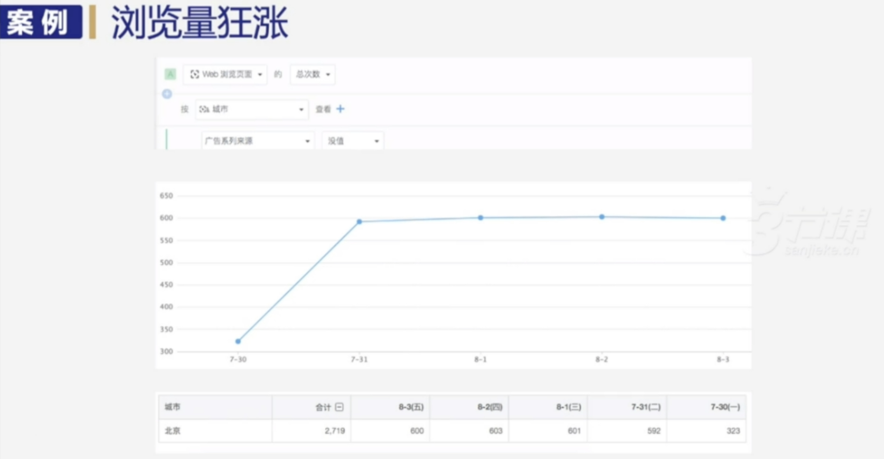

## 二、数据分析方法①

> 简介：遇到复杂的问题时，许多同学都会遇到[不知道要什么数据]、[看到数据无从下手]、[拿到数据看不出什么]的问题。针对这些，我们向你介绍常见且相对通用的 9 种数据分析方法。

### 2.0 数据分析基础概述

> 数据分析基础导论，讲解了如何应用数据分析解决工作中遇到的问题，如dau下降、平台优化等。同时强调了建立业务问题与数据工具之间的对应关系，介绍了九种常见的数据分析方法。数据分析需要反复思考和揣摩，以挖掘数据背后的意义，形成对业务的洞察。

#### 2.0.1 数据分析基础课程导论

> 该段视频内容介绍了数据分析基础课程导论，主要介绍了课程内容以及日常工作中遇到的一些问题，如如何解决dau下降的原因、如何证明新采购的内容对平台有价值、如何优化电商平台、如何分配绩效、如何投放广告等。

#### 2.0.2 数据分析：从业务问题到数据工具的桥梁

> 该段视频介绍了数据分析在业务场景中的重要性，强调了建立业务问题与数据工具之间的对应关系，并介绍了九种常见的数据分析方法，旨在帮助观众更好地应用数据分析解决实际问题。

#### 2.0.3 数据分析基础：从观测到洞察的桥梁

> 该段视频内容介绍了数据分析基础，即如何将数据工具与业务问题建立连接的桥梁，通过观测数据形成业务洞察。数据分析需要反复思考和揣摩，以挖掘数据背后的意义，形成对业务的洞察。

### 2.1 数据分析基础01-对比分析

> 这段视频全面介绍了对比分析在数据分析中的重要性，并通过实际案例强调了对比分析的三个问题：比什么、怎么比、如何解读对比结果。视频还介绍了数据对比中的“度量衡”问题，特别是如何看待绝对值和比例，以及如何进行环比和同比的比较。最后，视频讲解了如何选择合适的对比对象，包括与自身历史数据对比、与同行业对比以及与不同业务线对比等方面。

#### 2.1.1 对比分析：基础与重要性

> 这段视频主要讲述了对比分析在数据分析中的重要性，通过实际案例说明了对比的必要性，并强调了对比分析的三个问题：比什么、怎么比、如何解读对比结果。

#### 2.1.2 对比分析法的数字类型解析

> 这段视频介绍了在对比分析中常见的两种数字类型：绝对值和比例值。绝对值是本身具有价值的数字，如销售金额；比例值则需要通过除法转换为百分比才有价值，如活跃占比和注册转化率。单独看绝对值或比例值可能无法真实反映情况，需要结合使用。

#### 2.1.3 数据对比中的“度量衡”问题

> 该段视频内容主要介绍了数据对比中的“度量衡”问题，特别是如何看待绝对值和比例，以及如何进行环比和同比的比较。视频强调了理解数据的真实含义，而不是仅仅看数字的大小，同时明确了环比和同比的概念和定义，指出在进行数据比较时需要注意的细节。

#### 2.1.4 数据分析中的环比与同比：深入理解

> 该视频内容深入阐述了数据分析中的环比与同比概念，通过实际案例解释了它们的计算方法和应用场景。环比是当前时间范围与相邻的上一个时间范围的数据进行对比，而同比则是当前时间范围在上级时间范围中相同位置的数据进行对比。同比常用于销售、酒店、餐饮等受季节性影响的行业，通过与去年同期数据的比较来评估业绩。

#### 2.1.5 数据对比：与上层时间范围之间的较量

> 该段视频内容主要讲解了数据对比中的同比和环比的比较方法和使用场景。在比较分析时，首先需要确定上层时间范围和当前观察的时间范围，然后回到上层实验方案中寻找对应位置的数据进行比较。环比通常用于分析短期连续性数据，例如活动效果等；而同比则适用于观察长期数据集，例如产品运营历史数据等。在选择使用场景时，需要根据数据特点来选择同比或环比。

#### 2.1.6 如何选择合适的对比对象

> 该段视频内容主要讲述了在数据分析中如何选择合适的对比对象，包括与自身历史数据对比、与同行业对比以及与不同业务线对比等方面。通过对比可以更好地了解数据的变化情况，并进一步探究其原因，以做出相应的决策。

### 2.2 数据分析基础02-多维度拆解

> 第0段：该视频探讨了如何通过多维度拆解启动数据，洞察业务背后的原因和趋势，以解决业务问题。 第1段：视频强调了多维度拆解数据指标的重要性，通过不同视角和维度观察数据，可以获取更多信息。 第2段：视频详述了多维度拆解方法在指标和业务流程分析中的应用，适用于了解单一指标构成、针对流程进行拆解和还原行为场景等场景。

#### 2.2.1 多维度拆解：启动数据背后的业务洞察
> 该段视频内容是关于多维度拆解：启动数据背后的业务洞察，主要讲述了一种思维方式，用于解决业务问题。通过案例分析，展示了如何使用多维度拆解方法来分析启动数据，包括按照不同设备、启动来源和城市进行拆分，从而洞察业务背后的原因和趋势。

#### 2.2.2 多维度拆解：透过现象看本质
> 视频内容主要讲述了多维度拆解数据指标的重要性，通过不同视角和维度去观察同一个数据指标，可以分析出更多的信息。以APP启动和支付订单为例，展示了如何从不同角度去拆解这些指标，并强调了针对整个流程进行拆解的必要性。

#### 2.2.3 多维度拆解：指标与业务流程的深度解析
> 该段视频内容主要讲述了多维度拆解方法在指标和业务流程分析中的应用。通过多维度拆解，可以深入了解单一指标的构成和比例情况，观察不同渠道或地区在业务流程上的转化率和漏斗表现，以及还原具体行为发生时的场景信息。这种方法适用于需要了解单一指标构成比例、针对流程进行拆解和还原行为场景等场景。

### 2.3 数据分析基础03-数据涨跌移动如何处理

> 该视频内容为数据涨跌异动实战案例分析，强调了分析数据涨跌的重要性，并通过多个案例展示了如何通过数据分析找出涨跌背后的原因，同时分享了业务洞察与假设构建、策略调整、技术故障识别和维度拆解等实用的建议和技巧。

#### 2.3.1 数据涨跌异动实战案例导读
> 该段视频内容是关于数据涨跌异动实战案例的导读，强调了数据涨跌在日常观察中的重要性，并解释了为什么需要分析每一次涨跌的原因。视频推荐不仅要关注跌，也要关注涨，并分析清楚背后的原因，以便更好地了解产品和运营策略的效果。最后，通过一个案例来讲解在日常工作中数据的涨跌异动分析是如何运作的。

#### 2.3.2 数据分析的初步探索：寻找收入下跌的原因

> 该视频内容是关于一家公司收入下跌10%的初步原因探索。首先排除了活动、促销和搜索结果页的影响，接着通过周同比和月同比数据确定下跌是个例。之后排除了服务挂掉和技术问题，怀疑是渠道问题，最后发现百度渠道流量下跌了20%，需要进一步查询。同时还需要从地区和城市角度检查是否有区域性影响。

#### 2.3.3 电商营收下跌原因分析：以陕西和浙江为例

> 该段视频内容主要讲述了电商营收下跌的原因分析，以陕西和浙江为例，通过数据同比分析、多维度拆解等方法，找到了问题所在，并提出了解决方案。具体而言，主要探讨了营收下跌与当地仓储、宣传活动、市场等方面的关系，并针对陕西和浙江的流量低了不少的问题，提出了关键词投放计划消耗完等解决方案。

#### 2.3.4 数据分析中的业务洞察与假设构建

> 这段视频内容主要讲述了在数据分析中，业务洞察与假设构建的重要性。通过老民的案例，强调了试错、积累经验、行业洞察在假设形成中的作用。同时，还分享了一些常见的假设方向，如活动影响、版本相关、渠道影响等，为数据分析提供了实用的建议。

#### 2.3.5 策略调整与技术故障的识别

> 该段视频内容主要介绍了如何通过策略调整、技术故障识别和维度拆解等手段解决数据涨跌问题。其中，策略调整和技术故障识别是常见的两种类型，通过观察关键指标数据的变化，可以确定问题原因。此外，维度拆解可以叠加使用，更快速地查清数据涨跌背后的真实原因。

#### 2.3.6 分析异常流量：从城市到浏览器的深入探究

> 该段视频内容主要分析了异常流量来源，发现异常流量全部来自北京，且大部分使用Safari和Chrome浏览器，其中未知版本的Safari浏览器是典型爬虫特征，因此判断异常流量是由爬虫造成的，而非真实用户访问。

### 2.4 数据分析基础04-漏斗观察

> 该视频内容主要讲述了漏斗模型在用户行为和业务流程分析中的应用，包括时间窗口设置、关注中间步骤、数据偏差和反思注意事项等方面。通过漏斗模型的应用，可以深入了解用户行为，优化业务流程，提高业务效果。

#### 2.4.1 漏斗模型概述与时间窗口的重要性

> 漏斗模型是一连串向后影响的用户行为，通过观察可以分析业务流程。时间窗口对漏斗模型观察很重要，设置不当会导致数据不准确。

#### 2.4.2 漏斗分析中的时间窗口设置

> 该段视频内容主要讲述了在漏斗分析中，时间窗口设置的两个关键点。首先，时间窗口的设置需要与产品的形态、观察的功能或运营策略密切相关，以决定其范围。其次，漏斗分析具有严格的顺序性，不同的漏斗不能混用，否则会引入无关信息或丢失有价值的信息。

#### 2.4.3 漏斗分析：关注中间步骤的重要性

> 该段视频内容主要介绍了漏斗分析中的关注中间步骤的重要性，以及如何避免在漏斗分析中的常见误区。视频强调了不能只关注第一步和最后一步，需要全面观察用户的整个流程，并且指出了计算逻辑的两种方式。此外，视频还以一个在线课程为例，说明了如何根据不同的角色选择观察漏斗的方式。

#### 2.4.4 漏斗分析：关注点与数据偏差

> 该段视频内容主要介绍了漏斗分析的关注点与数据偏差。漏斗分析是业务目标在漏斗的终点，按人去看漏斗最符合业务需求。但按事件去算漏斗会出现偏差，因为用户完成事件顺序和时间会有所不同。最后当数据不符合预期时，应进行自查，问自己问题，很多时候问题已经解决。

#### 2.4.5 漏斗模型应用的反思与注意事项

> 该段视频内容讲述了漏斗模型应用的反思与注意事项，包括业务流程与漏斗不一致、适用场景以及常见问题等。在漏斗模型应用中，需要时刻注意数据指标的符合情况，以及业务流程的明确性和纷繁复杂度。同时，使用漏斗模型时需要注意避免四个常见问题，以确保分析的准确性和有效性。

### 2.5 数据分析基础05-如何评估渠道质量，确定投放优先级

> 该视频介绍了如何评估渠道质量，包括通过关键事件衡量用户规模、质量及新用户转化情况，以及通过转化率和目标用户重要性评估渠道质量的方法。视频强调了质量评估在渠道管理中的重要性，并给出了实际应用建议。

#### 2.5.1 渠道质量评估：分类与属性

> 该段视频内容主要介绍了渠道质量评估的分类与属性。首先介绍了渠道的分类方式，即按照来源和媒介进行划分，并解释了来源和媒介的定义及作用。接着阐述了渠道质量评估中的“质量”概念，强调了质量与数量的区别，并探讨了评估渠道质量的方法。最后，视频总结了
渠道质量评估的重要性和实际应用。

#### 2.5.2 渠道质量评估的衡量方式

> 该段视频内容主要介绍了如何通过关键事件去衡量不同渠道的质量，包括用户规模、用户质量以及新用户转化情况。此外，视频还提到在设置关键事件时需要有一定的门槛和区分度，并且具体落实到实操中，可以通过查看关键事件发生时用户的来源来评估渠道质量。

#### 2.5.3 渠道质量评估：转化率与目标用户的重要性

> 该段视频内容介绍了如何通过转化率和目标用户的重要性来评估不同渠道的质量。对于P2P借款产品，衡量渠道带来的新用户是否为目标用户的最佳标准是看他最后是否借款成功。通过计算借款成功占激活总数的占比，可以更全面地评估各个渠道的表现，并根据转化率高低调整投放优先级。

### 2.6 数据分析基础06-分布分析

> 该视频介绍了分布分析的方法，通过观察事件在不同维度中的分布情况，可以更全面地理解数据。这种方法适用于已知用户完成指定事件的情况，可以将用户按照不同维度划分成不同群体进行后续维护或分析。此外，还可以将事件次数拆分到不同维度上，更清楚地了解事件本身的发生情况。

### 2.7 数据分析基础07-用户留存分析

> 该视频介绍了用户留存分析的原理、应用与精准留存的方法，包括群体划分和精准留存两种方法，通过观察不同群体的留存差异，评估产品功能或内容的粘性以及不同用户群体的联系，适用于验证产品的长期价值和短期内评估产品功能或内容的粘性。

#### 2.7.1 留存分析的原理与意义

> 这段视频讲述了用户留存分析的原理与意义，包括留存的计算方法、短期和长期观察的用途，以及月留存和日留存的选择依据。同时，视频也强调了留存分析在验证产品长期价值中的重要性，并指出了大盘留存的局限性。

#### 2.7.2 留存分析的精准方法

> 该段视频介绍了精准留存的方法，即通过过滤用户D或根据用户属性划分群体，观察不同群体之间的留存区别，以区分不同功能或内容对留存的影响。以小说阅读网站为例，通过筛选特定类型小说的用户，可以发现不同类型内容的吸引力和留存率，进而评估不同内容频道的运营质量。

#### 2.7.3 用户留存分析：从群体划分到精准留存的原理与应用

> 这段视频内容讲述了用户留存分析的原理与应用，包括群体划分和精准留存两种方法。通过观察不同群体的留存差异，可以评估产品功能或内容的粘性以及不同用户群体的联系。用户留存分析适用于验证产品的长期价值和短期内评估产品功能或内容的粘性。

### 2.8 数据分析基础08-功能内容上线后，如何评估？

> 该视频讲述了如何评估产品功能和内容上线后的价值，包括观察用户行为变化、营收增长和留存率等指标，以及使用漏斗分析和用户分群等方法。同时，也介绍了如何通过分析主播类型和用户好友数量来评估某项功能的实际效果，以及产品功能或内容对产品形态变迁的价值评估方法。

#### 2.8.1 功能/内容上线后的价值评估

> 该段视频内容主要讲述了如何评估功能或内容上线后的价值，包括其带来的用户增长、营收增长、活跃度提升等方面的价值，以及通过漏斗分析和用户分群等方法进行评估。

#### 2.8.2 评估功能或内容上线价值的策略

> 该视频内容主要介绍了如何评估功能或内容上线价值，通过观察用户在特定行为（如会员付费、留存等)中的表现，来评估产品功能和内容对特定指标的影响。同时，也提到了如何观察一个主播对于平台的价值，包括其留存率、用户回访率等指标。

#### 2.8.3 主播类型与平台留存价值的评估

> 该段视频内容主要讲述了主播类型与平台留存价值的评估。通过分析不同类型主播的留存情况，评估其对整个平台的贡献价值，并提出了一些运营建议。此外，还介绍了如何通过观察用户好友数量的分布图来评估某项功能的实际效果。

#### 2.8.4 评估产品功能或内容对产品形态变迁的价值

> 该段视频内容主要介绍了评估产品功能或内容对产品形态变迁的价值的两种方法：一是通过分析用户行为分布的变化，观察产品在用户使用时间段的分布是否拓宽；二是通过精准留存的方法，评估产品功能或内容对用户留存率的贡献。

