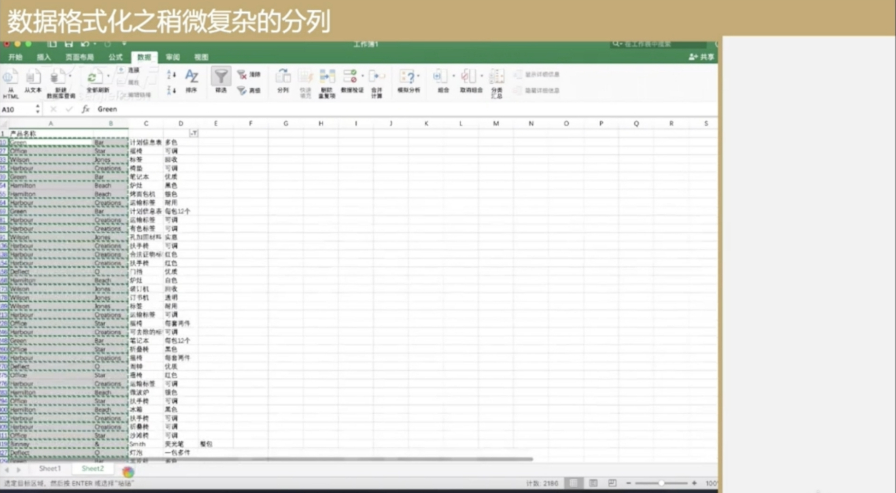
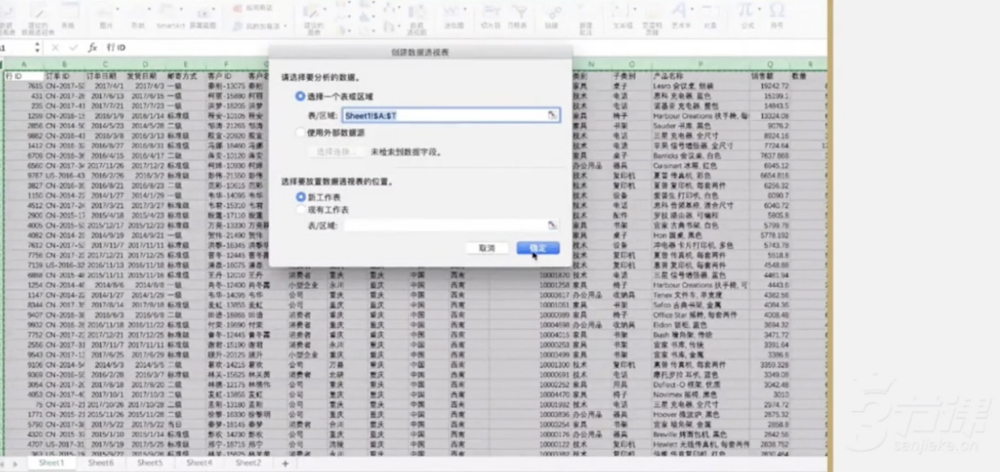

## 三、数据处理

> 简介：以 Excel 为主要载体，首先介绍如何通过它导入、清洗、处理数据;随后简要介绍如何借助表、图的形式，快速呈现数据间的关系，并希望对你洞察业务产生帮助。

### 3.1 数据处理01-导入文本文档

> 该视频介绍了如何通过Excel进行基础数据处理，包括将纯文本文件导入Excel并利用制表符进行列分裂，以便进行数据分析。

### 3.2 数据处理02-格式化简单的分列

> 该视频介绍了如何在Excel中进行分列操作，特别是针对包含分类和ID的数据。通过使用分裂工具，可以根据分割符号将数据分列，并提取所需的部分。同时，还提醒了在进行分裂操作时要注意避免覆盖其他数据，正确插入空白列以避免数据覆盖。

### 3.3 数据处理03-格式化复杂的分列

> 该视频介绍了Excel中复杂数据分列的技巧，包括处理包含空格和逗号的品牌名、产品名和规格，辨别脏数据，以及处理大规模脏数据的方法。同时，也解释了分列问题的出现和解决方法，包括数字前后有空格和品牌名中间有空格等问题。

#### 3.3.1 Excel数据处理：复杂场景处理

> 该视频内容是关于在EXc中处理复杂数据场景的教程，具体针对的是将产品名称列中的品牌名、产品名和规格分离并分列。视频中展示了如何使用分列功能处理包含空格和逗号的数据，并指出了处理过程中可能出现的脏数据问题。此外，还介绍了一些辨别脏数据的技巧。

#### 3.3.2 Excel数据分列问题与处理策略概述

> 该视频内容是关于Exc数据分列问题与处理策略的概述。视频首先解释了分列问题的出现，并指出了问题数据可能出现在D列和E列。接着，视频介绍了处理大规模脏数据的方法，并提出了两种需要处理的情况：数字前后有空格和品牌名中间有空格。最后，视频展示了如何使用Exc的查找替换工具来处理这两种情况，并强调了替换时需要注意空格的添加。

查找存在规则的字符串，然后替换掉干扰字符。

品牌名里面有多个空格的情况
#### 3.3.3 Excel数据分列技巧与常见问题解析-续

> 该段视频内容主要介绍了Excl数据分列技巧与常见问题解析，包括数字后面的空格、品牌名中间有空格等问题，并提供了相应的解决方法。通过筛选、查找替换、复制粘贴等操作，可以解决数据分列中的问题，提高数据处理效率。

筛选出有问题的行

新建sheeft，然后滤重粘贴，过滤出真正有问题的品牌名，然后逐个修正原始数据。

### 3.4 数据处理04-数据清晰（筛选、排序、去重）

> 该视频内容主要介绍了如何通过Excel筛选和排序功能快速发现并处理异常数据，包括对数量列进行求和、筛选异常数据、排序以及去重等操作。同时提醒用户在处理中文字符时要校验结果，避免出现排序错误。

这里看到滤重之后的非预期的数据。

通过排序的方式验证数据是否正常。（`中文字符排序有坑，需要重点注意，主要原因是多音字导致。`）

### 3.5 数据处理05-数据的二次处理（以留存为例）

> 1. 该视频提供了在Excel中计算留存率的方法，包括筛选用户数据、去重处理和留存计算。 2. 该视频还介绍了如何使用VLOOKUP函数在Excel中快速查找匹配的值，并进行数据处理，从而计算留存率。

#### 3.5.1 Excel数据处理与留存计算基础

> 该段视频内容介绍了如何通过Exc处理数据来计算留存。首先筛选出2016年和2017年的用户，然后去重处理以避免重复数据干扰。最后，对处理后的数据进行留存计算。

通过订单信息筛选出不同年份的数据，然后负责客户ID复制到新表

按列进行去重

#### 3.5.2 Excel `VLOOKUP`函数介绍

> 这段视频介绍了如何使用Excel的VLOOKUP函数来计算留存率，并解释了VLOOKUP函数的基本原理和参数设置。通过使用VLOOKUP函数，可以快速地在一个表格中查找匹配的值，并进行相应的数据处理。

### 3.6 数据处理06-快速呈现：`数据透视表`

> 该视频内容介绍了如何使用Excel数据透视表进行业务数据分析。通过数据透视表，用户可以根据需求自由选择需要的数据字段，灵活地进行数据的重组和展示。数据透视表不仅可以快速汇总、计算和查看大量数据，还可以通过拖拽字段、设置筛选等方式，从不同维度对数据进行深入分析。通过数据透视表，用户可以轻松地完成对数据的筛选、排序、分组和计算等操作，提高工作效率。

全选，然后插入一个透视表

### 3.7 数据处理07-表不如图Ece常见图表

> 该视频内容主要讲述了在数据分析中，数据可视化是一个非常重要的环节。通过数据可视化，可以更好地认知和理解数据，发现数据之间的规律和趋势。视频中详细介绍了折线图、柱状图和饼图这三种常见的数据可视化图表，以及它们在数据分析中的应用场景和优缺点。

### 3.8 数据处理O8-数据可视化(Circle Packing、Beeswarm)

> 该视频介绍了使用Rule Graphs进行高级数据可视化的方法。首先上传数据，然后选择图表类型，例如Circle Packing或分群图。接着，将数据维度添加到图表中，例如日期、销售金额或类别，以生成有意义的图表。最后，还可以对数据进行分组，以发现更有趣的情况。通过这些图表，可以清晰地看出公司订单的发展趋势和成长情况。

**参考**
- https://app.rawgraphs.io/

### 3.9 数据处理09-数据可视化（借助高德地图进行地理位置可视化）

> 这段视频是关于如何使用高德地图数据可视化工具进行操作的教程。视频首先介绍了这款工具的免费和易用性，然后详细演示了如何从创建项目、上传数据到创建可视化项目的过程。重点介绍了如何查看数据、调整点的大小和颜色等细节，以及如何使用热力图表示不同热度的方法。

**参考**
- https://lbs.amap.com/

### 3.10 数据处理10-五个数据工具特色功能展示

> 该视频介绍了Google Analytics的自动化功能，包括自动发送数据报表和设置自定义提醒，以及如何使用自定义指标和用户画像等工具来深入了解受众特征。这些功能可以帮助团队更方便、更有效地监测产品数据表现，及时发现问题并解决。

#### 3.10.1 Google Analytics自动化邮件功能介绍

> 该段视频内容介绍了Google Analytics的自动化邮件功能，它可以帮助团队成员自动发送数据报表，以便团队成员能够更方便、更有效地查看产品的数据表现。此外，该功能还可以设置自定义提醒，当指标波动超出预期范围时自动发出告警。

#### 3.10.2 谷歌分析自动化提醒功能详解

> 该段视频内容介绍了谷歌分析的自动化提醒功能，包括如何设置提醒条件、如何选择对比范围以及如何保存提醒。通过自定义提醒，用户可以监测一些日常不怎么观测但对业务有影响的指标，并在指标发生波动时及时知道并解决问题。同时，数据统计工具还提供了备注功能，方便团队之间共享知识。

#### 3.10.3 自定义指标与转化率计算

> 该段视频内容主要讲述了如何通过自定义指标与转化率计算来监控业务数据，以及如何利用这些工具来沉淀团队的业务信息。同时，还介绍了如何使用自定义指标来观察自己想了解的指标，并如何通过四则运算来组合出最终的指标。最后，还提到了如何使用用户画像等工具来深入了解受众特征。

