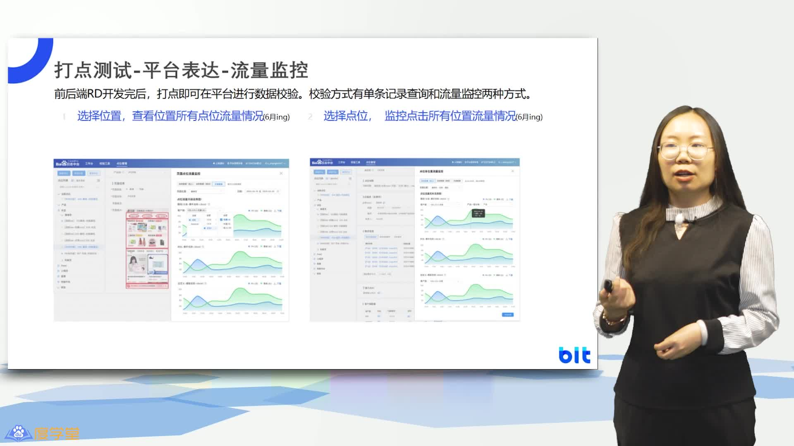

## 四、打点原理及规范

> 该视频为打点原理与实践的讲解，涵盖了打点基础知识、买点日志采集、存储和处理的过程，以及打点在业务和外部数据中的应用。其中，重点讲解了四W规则，即谁、什么时候、在哪里、通过什么方式做了什么。该视频还介绍了埋点的常见场景和位置选择，以及参数设计表达、数据传输存储与统计验证的过程。此外，还讲解了数据分析流程中的需求表达和设计环节，以及流量监控的概念和常见触发事件。

### 4.1 打点原理及规范

该视频介绍了打点原理及规范，包括埋点基础知识、打点操作方法、核心注意事项以及练习部分。

#### 4.1.1 打点原理及规范概述

该段视频内容主要介绍了打点原理及规范，包括埋点基础知识、如何添加打点、打点的一些核心注意事项以及练习部分。其中，重点讲解了买点日志的概念及其数据采集、回传、存储和处理的过程。另外，还介绍了业务数据和外部数据来源。

### 4.2 用户行为四W分析规则详解

该段视频详细讲解了用户行为四W分析规则，包括谁、做了什么、何时、何地以及如何记录用户行为，并强调了精准数据分析和营销的重要性。

#### 4.2.1 买点四W规则详解

该段视频详细解释了买点四W规则，即谁、什么时候、在哪里、通过什么方式做了什么。这四个W和一个H分别对应用户属性、触发时间、地点和触发行为。在记录用户行为时，需要明确这些信息，以便进行精准的数据分析和营销。

#### 4.2.2 用户行为日志记录之四W介绍

该段视频内容介绍了用户行为日志记录的四W买点，包括who、what、when、how，并详细阐述了各个元素的重要性，以及买点采集和位置。

### 4.3 埋点原理及方案优缺点

该视频介绍了埋点的场景和位置选择，总结了每个位置的优缺点，并介绍了埋点数据流程的五个步骤。

#### 4.3.1 埋点原理及场景选择

该段视频内容介绍了埋点的常见场景和位置选择，包括前端发送请求的请求点、后端接受请求的点、服务端发送请求的点和前端接受请求并展示的点。视频还总结了每个位置的优点和缺点，并指出具体使用需根据业务需求进行选择。最后，视频介绍了埋点数据流程的核心五个步骤，包括数据需求挖掘等。

### 4.4 数据驱动的购买决策指南

该视频讲述了如何通过数据分析来进行购买决策，重点讲解了如何采集四W买点，清晰地表达数据需求，并介绍了方案设计和参数转化的实例。

#### 4.4.1 数据分析四W买点采集

该视频内容为数据分析四W买点采集，讲解了如何清晰地表达数据需求，包括统计指标、位置范围等，并以发现频道为例进行了方案设计和参数转化。

### 4.5 参数化设计解析

该视频讲述了参数化设计表达的方法，包括抽象通用逻辑和补充私有逻辑，以及如何利用框架区域、核心信息、事件大类、个性化表达和触发时机进行优化。

#### 4.5.1 参数设计表达

该段视频讲述了如何进行参数设计表达，包括抽象通用逻辑和补充私有逻辑，框架分为黄色、蓝色和灰色区域，核心信息有位置ID和位置名称，蓝色区域为事件大类，包括展现、停留时长和点击，灰色区域为个性化表达。触发时机也是一个重要的概念。

### 4.6 数据分析流程与存储统计

该视频介绍了数据分析过程中数据传输存储与统计验证的流程及细节，重点讲解了打点信息与方案设计之间的对应关系以及日志解析时可能存在的数据加工验证问题。

#### 4.6.1 数据传输存储与统计验证

该段视频内容主要讲解了数据传输存储与统计验证的过程，包括参数设计、数据传输存储以及统计验证的流程以及相关细节。其中重点强调了打点信息与方案设计之间的对应关系，以及日志解析时可能存在的数据加工验证问题。

### 4.7 统计打点与数据分析全解

该段视频全面解析了统计打点与数据分析流程，包括买点实现步骤、需求表达与设计、打点参数设计与校验等环节。

#### 4.7.1 买点实现流程

该段视频内容主要讲解了买点实现的两个重要步骤：首先是基于日志数据的统计逻辑和差距存在的原因，其次是具体讲解如何在实际平台上添加一个买点，包括前置准备和操作流程。其中，前置准备包括打点基础知识和打点管理平台的使用，操作流程包括需求表达、位置管理、点位管理、事件管理和参数管理等环节。

#### 4.7.2 数据分析流程梳理

该段视频内容主要介绍了数据分析流程中的需求表达和设计环节，包括如何清晰表达统计需求、设计内容在平台上的管理和表达、打点平台的信息表达和关联关系等。

#### 4.7.3 打点参数设计与校验

该段视频介绍了打点参数设计与校验的流程，包括事件管理、打点ID、参数设计、客户端配置、审批流以及核心参数校验等内容。平台支持对常见事件和时机的全局了解，参数设计是最重要的部分，需要清楚地表达需求，避免信息传输错误导致数据验证出错。审批流要求较高，以确保打点信息的准确性。

### 4.8 数据监控与校验流程

该段视频介绍了数据校验工具的使用方法，以及如何通过流量监控功能来分析数据量级和异常情况，还介绍了打点报告和常见触发事件。

#### 4.8.1 数据校验与流量监控

该段视频介绍了数据校验和流量监控的内容。数据校验工具可以用来验证数据信息是否完整、正确以及符合预期，而打点报告则可以整体评估二三十条数据的合规性。此外，流量监控功能可以支持页面负责人查看当前和历史数据流，分析数据量级情况。

#### 4.8.2 流量监控与触发事件

该段视频内容介绍了流量监控的概念和常见触发事件，以及如何通过监控数据来发现异常情况。还介绍了常见打点触发事件的推荐清单，以及注意事项，以便于进行全覆盖测试和避免数据统计差异。最后给出了一个练习题，帮助听众巩固所学信息。

