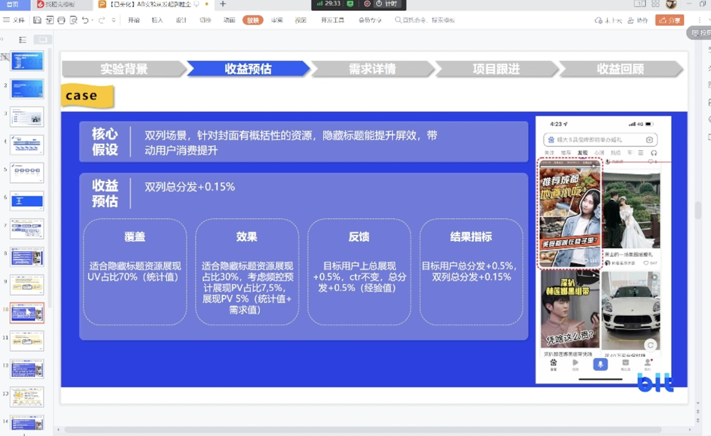
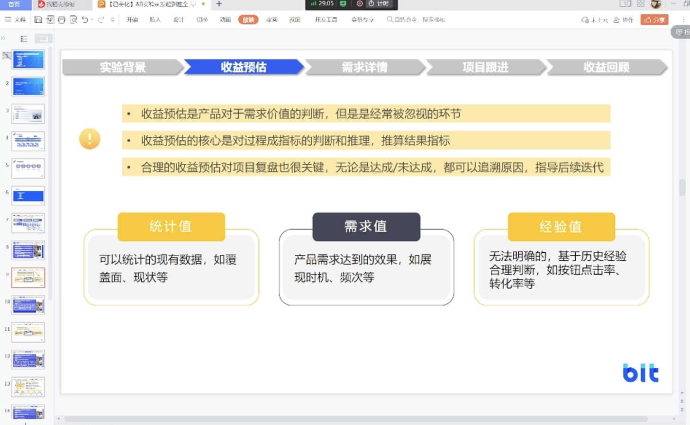
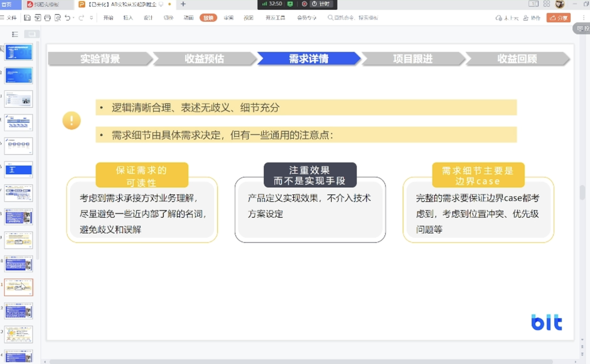

## 五、AB实验从发起到推全

> 该视频内容主要介绍了AB实验的设计思路与执行过程，包括实验背景与目标设定、实验效果反馈与优化、实验中的经验值与预估、边界case的考量、不同角色的职责、实验效果评估与优化、实验复盘与评估、实验策略与年轻用户收益预估以及实验设计思路与执行的过程和实验效果评估与策略优化的方法和思路等内容。

### 5.1 AB实验设计策略

该段视频主要讲述了AB实验设计策略的内容。首先介绍了AB实验的重要性及其与AA方法的区别。其次，详细描述了AB实验的作用和进行实验的步骤。此外，还讲述了实验背景与目标设定的内容，并展示了一个具体案例来应用这些指标。

#### 5.1.1 ab实验及其重要性

该段视频内容主要介绍了AB实验及其重要性。首先介绍了为什么要做AB实验，其次介绍了AB实验和AA方法的区别，然后详细介绍了AB实验的作用，最后介绍了如何进行AB实验的步骤。

#### 5.1.2 实验背景与目标设定

该段视频内容讲述了实验背景与目标设定的内容。首先介绍了实验背景的重要性，即基于对用户需求的理解来分析为什么要做这个实验以及如何进行实验。然后，介绍了目标设定的过程，包括结果指标和过程指标，其中结果指标是实验的最终目的，而过程指标则是通过推导来验证核心假设是否符合预期。最后，以一个具体的案例展示了如何应用这些指标。

### 5.2 实验设计经验分享

该视频讲述了实验设计中的反馈与优化，特别是双列频道优化的案例。介绍了双列频道的定义和目标，通过用户访谈发现的问题，提出假设和核心指标，讨论了收益预估的常见值，并强调了其在项目复盘中的重要性。还讲述了实验中的经验值与预估的重要性，以及如何利用经验值做出决策，并考虑各个环节的漏斗情况来找出问题。同时，强调了需求表达的清晰性和考虑细节的重要性。

#### 5.2.1 实验效果反馈与优化

该段视频内容主要讲述了实验效果反馈与优化的重要性，特别是针对双列频道进行优化的案例分析。首先介绍了双列频道的定义和目标，然后通过用户访谈发现了问题，并提出了假设和核心指标。接着进行了收益预估的介绍和常见值的讨论。最后强调了收益预估在项目复盘中的重要性。

#### 5.2.2 实验中的经验值与预估

该段视频内容讲述了实验中的经验值与预估的重要性。经验值可以帮助我们判断无法明确判断的东西，基于历史经验和类似实验的预估值来做出决策。同时，预估实验收益需要考虑各个环节的漏斗情况，以便在实验结果与预期不一致时找出问题所在。在需求详情部分，重要的是表达清晰合理、没有歧义，并充分考虑细节，包括需求的可读性和产品效果的定义。

### 5.3 边界情况考量与项目进展

该视频讲述了产品经理在确定需求时，应注重边界情况的考量，包括技术实现的可行性、推荐系统的优先级、网络环境等细节，以确保功能实现更加完整。同时，在项目跟进中，产品经理需明确各方角色与分工，把控项目进度和效果。

#### 5.3.1 需求细节与边界case的考量

该段视频内容讲述了产品经理在确定需求时，应注重边界case的考量，包括技术实现的可行性、推荐系统的优先级、网络环境等细节，以确保功能实现更加完整。同时，在项目跟进中，产品经理需明确各方角色与分工，把控项目进度和效果。

### 5.4 数据后台系统功能及职责介绍

该段视频内容主要介绍了实验过程中不同角色的职责，包括客户端、服务端、QA等，其中服务端起到承上启下的作用，最终将整理好的数据传输给客户端以实现最终效果。此外，还介绍了项目进度把控的流程及当时项目中各方的职责。

#### 5.4.1 实验过程中的角色与职责

该段视频内容介绍了实验过程中不同角色的职责，包括客户端、服务端、QA等。其中，服务端起到承上启下的作用，对策略数据进行处理和传输，同时整合可能策略拿不到的信息，最终将整理好的数据传输给客户端。客户端根据服务端提供的数据实现最终效果。此外，还介绍了项目进度把控的流程，包括需求立项、发布需求、各方确定排期、产品开发、测试等环节。最后介绍了当时项目中各方的职责，如交互视觉负责产出模板样式等。

### 5.5 实验复盘与效果优化

该段视频内容主要讲述了实验复盘与效果优化的重要性，包括如何评估实验效果、解释实验收益来源和合理性，以及回顾实验结果与过程指标。同时介绍了在复杂产品中如何通过实验找到有效功能和策略，并避免无关用户稀释整体收益。最后强调了实验结果和过程指标符合预期时，探索新的增长点的重要性。视频中还讲述了实验复盘与评估的内容，包括过程指标的对比、反转实验的作用以及实验结果的分析，并探讨了实验结果不达标的原因及改进方法。

#### 5.5.1 实验效果评估与优化

该段视频内容主要讲述了实验效果评估与优化的重要性，包括如何判定实验的效果、实验收益的来源和解释的合理性、以及实验结果与过程指标的回顾等方面。同时，还介绍了在复杂的产品中，如何通过实验找到有效的功能和策略，以及如何避免无关用户稀释整体收益。最后，提到了实验结果和过程指标都符合预期的情况，并强调了探索新的增长点的重要性。

#### 5.5.2 实验复盘与评估

该段视频内容讲述了实验复盘与评估的内容，包括过程指标的对比、反转实验的作用以及实验结果的分析。以一个具体实验为例，探讨了实验结果不达标的原因以及如何改进。视频中强调了数据分析和实验结果对产品优化和迭代的重要性。

### 5.6 年轻用户策略优化的实验方法

该视频讲述了年轻用户策略优化的实验方法，包括实验策略与收益预估的关系、实验设计思路与执行过程、实验效果评估与策略优化方法和思路等。通过案例分析，强调了实验关键点、实验手段、目标用户、目标资源等细节，并分享了一个策略相关的案例。同时，提出了扩大覆盖面、增加资源、精细化的推荐等方案，以提升实验效果。

#### 5.6.1 实验策略与年轻用户收益预估

该段视频内容主要讲述了实验策略与年轻用户收益预估的关系，包括封面策略的迭代和年轻用户消费体验的提升等。通过案例分析，强调了实验背景、目标、收益预估和需求详情等关键点，并探讨了如何判定实验结果是否符合预期。最后分享了一个策略相关的案例，旨在说明除了功能项目以外，策略项目同样重要。

#### 5.6.2 实验设计思路与执行

该段视频内容是关于一个实验设计思路与执行的过程。首先，进行了收益预估和统计调研，包括覆盖情况、目标用户、内容效果、反馈等。其次，介绍了实验手段、目标用户、目标资源等细节，并进行了退场设计和标签准确率、召回率的评估。最后，分析了实验结果指标，包括年轻用户feed du、总媒体时长和总展现量等，并发现激活了一部分兴趣但未带动点击。大盘指标持平符合预期。通过队列的展现uv占比、展现量、人均效果等分析典型问题，发现用户覆盖较少。

#### 5.6.3 实验效果评估与策略优化

该段视频内容主要介绍了实验效果评估与策略优化的方法和思路。通过分析实验数据和用户反馈，评估实验效果是否符合预期，从而进行策略优化。在策略优化方面，提出了扩大覆盖面、增加资源、精细化的推荐等方案，以提升实验效果。同时，强调了执行决定下限，思维决定上限的理念，鼓励大家进行深入的业务交流和探讨。

