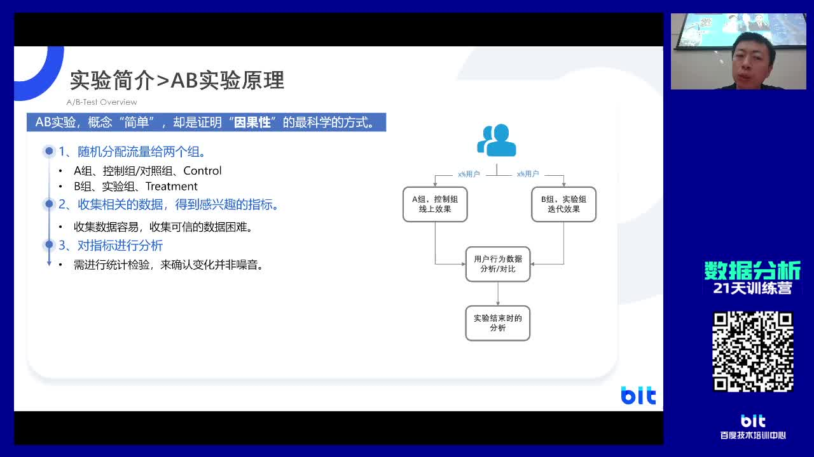
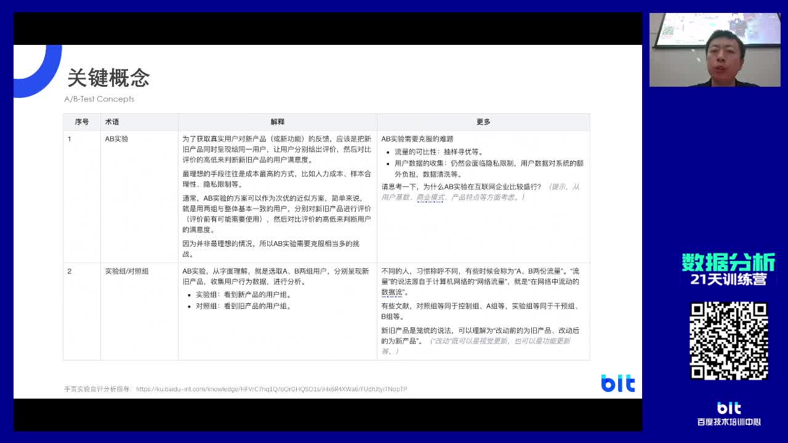
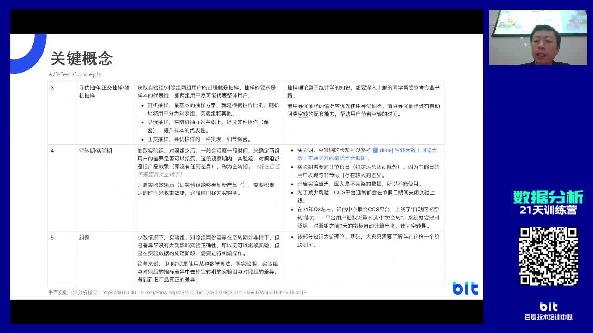
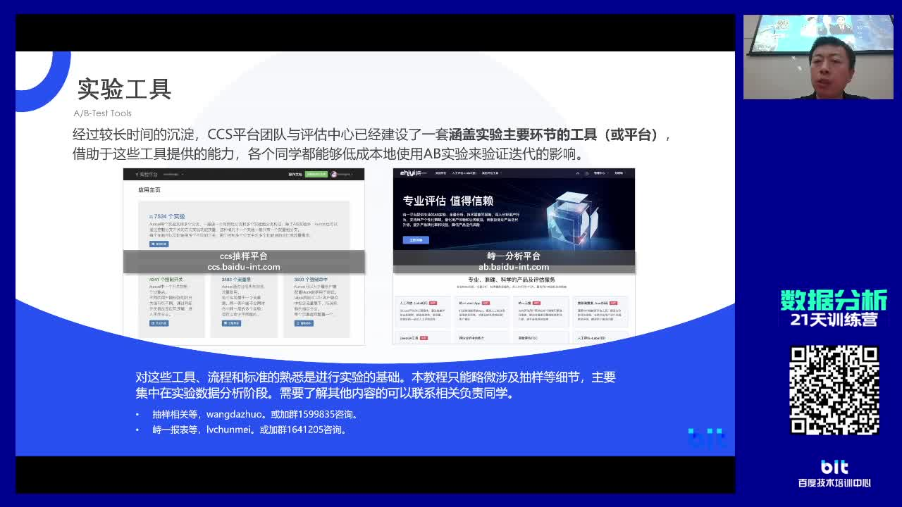
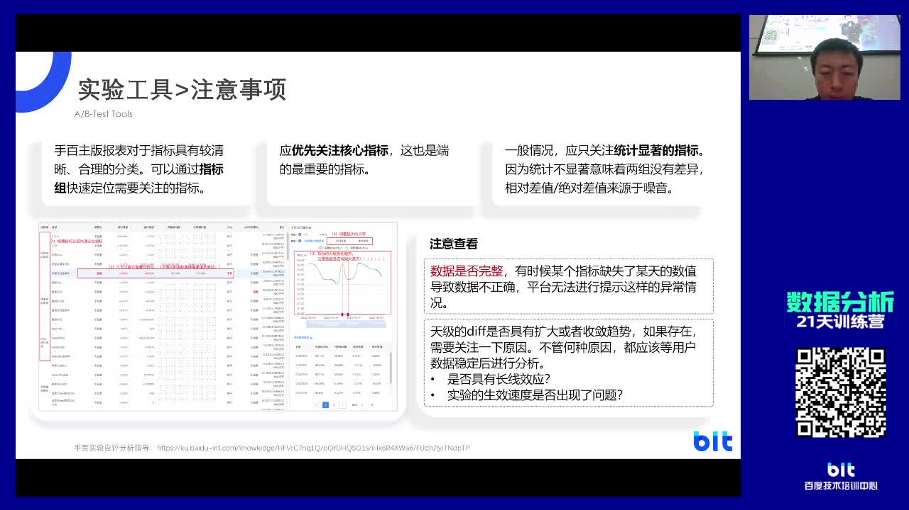
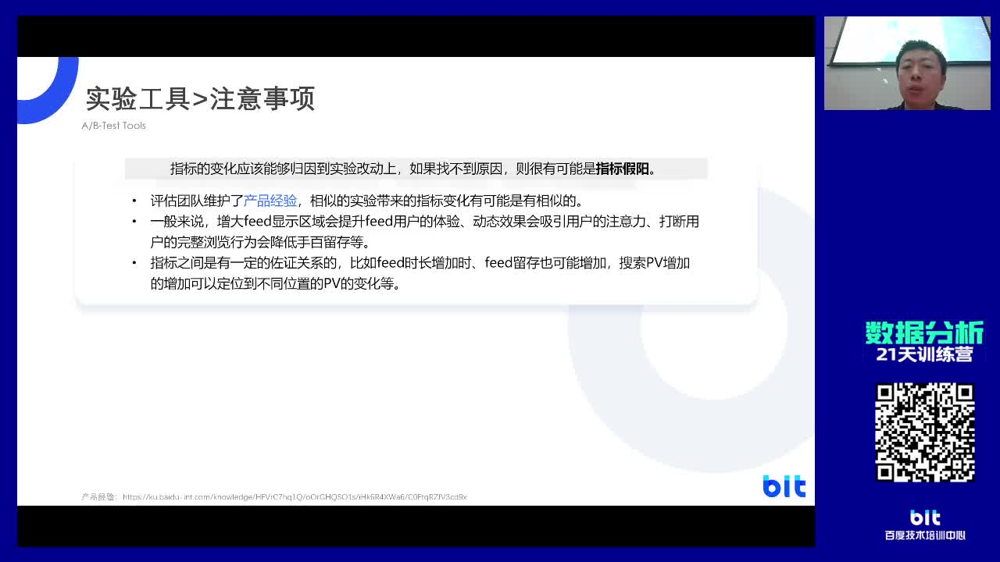
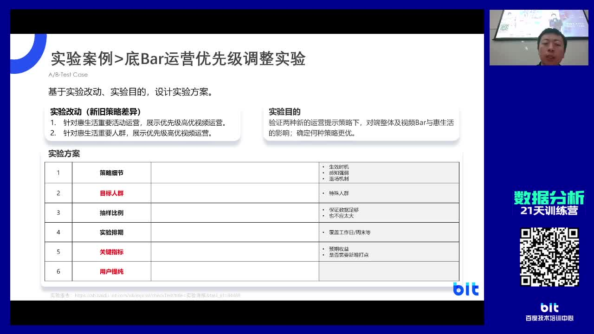
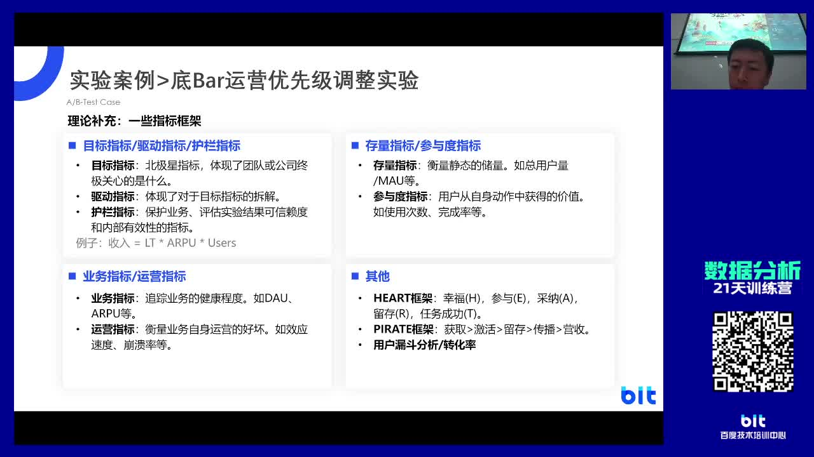
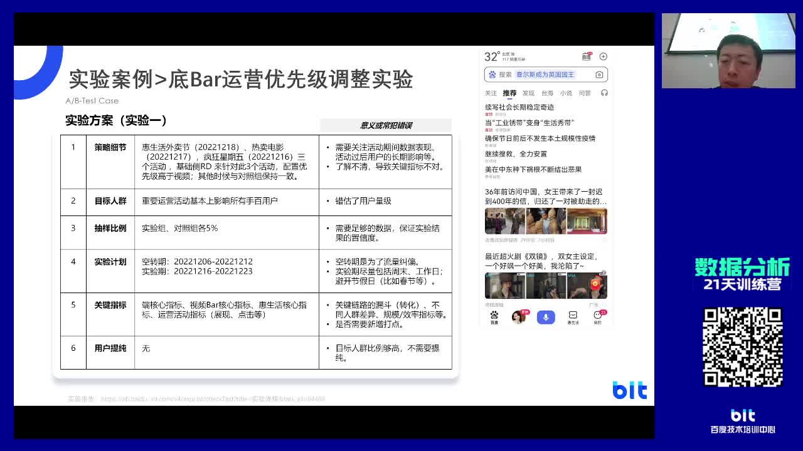
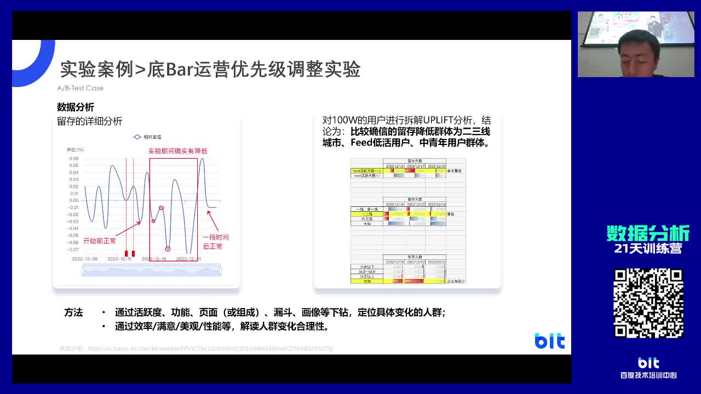

## 六、AB实验基础原理与实战案例

> 该视频内容主要介绍了AB实验的概念、流程、实验态度、实验指标选择、数据分析方法、实验分析方法和常见问题解答等方面。通过分享案例和实践经验，强调了保持谦逊和谨慎、选择合适的指标、收集可信数据和进行统计检验的重要性，并推荐使用成熟的系统工具来进行分析，以提高效率和减小出错概率。

### 6.1 AB实验基础与实战案例

该段视频介绍了AB实验的基础知识和实战案例，包括实验态度、实验原理、关键概念和AB实验在互联网产品中的应用特点，并介绍了实验设计、流量分割、实验效果评估等实验相关概念，还介绍了使用成熟系统工具进行分析的方法和工具介绍。

#### 6.1.1 AB实验概述及案例展示

该段视频内容介绍了AB实验的概念、流程以及案例，并分享了简单的工具来评估产品上的AB实验效果。其中一个案例是必应搜索的改动使得广告收入增加了12%，另一个案例是百度APP会员界面的改动，但实际上对于用户体验和收入的影响有限。

#### 6.1.2 实验态度及指标选择

该段视频介绍了实验态度的重要性，包括保持谦逊和谨慎，通过数据和AB实验来验证自己的判断。还介绍了选择合适的指标对于产品优化至关重要，不同的指标意味着侧重点不同。最后强调了收集可信数据和进行统计检验的重要性。

#### 6.1.3 AB实验及其重要性

该段视频内容主要介绍了AB实验及其重要性，包括实验原理、关键概念（实验组与对照组、实验期与空转期、用户意志性）以及AB实验在互联网产品中的应用特点等。

#### 6.1.4 AB实验及其重要性

该段视频内容介绍了AB实验的出发点、实验组和对照组的概念、不同的抽样方法对数据结论的影响、空转期和实验期的概念以及纠偏方案。

#### 6.1.5 AB实验及其相关概念

该段视频介绍了AB实验及其相关概念，包括实验设计、流量分割、实验效果评估、提纯、显著性检验、因果性和相关性的区别、多维分析和uplift等。还介绍了如何使用成熟的系统工具来进行分析，以提高效率和减小出错概率。

#### 6.1.6 AB实验工具介绍

AB实验工具介绍了抽样工具和数据分析工具，包括simple抽样手百app的ccs抽样和质疑分析平台。使用这些工具可以方便地进行实验，减轻压力和成本。在使用工具分析时需要注意只看显著的指标，注意数据是否完整和实验的地府是否有明显趋势。

### 6.2 AB实验常见效应及注意事项

该段视频讲述了AB实验的常见效应及注意事项，包括尝鲜效应、累计效应、学习效应等，还讨论了指标变化归因分析和实验中的注意事项。

#### 6.2.1 AB实验常见效应及注意事项

该段视频内容讲了AB实验常见效应及注意事项，包括尝鲜效应、累计效应、学习效应和指标变化的归因分析。需要注意的事项有关注重要的指标和与实验变化相关的直接指标，以及找到指标变化与产品改动之间的关联性，避免假阳性结果。

### 6.3 AB实验之运营策略改动案例

该视频介绍了通过增大显示面积、动态效果和工具分析来提升用户Feed体验，以及多维分析和uplift工具发掘用户意志性和不同用户表现，最后通过一个app底霸运营优先级调整的实验案例，展示了AB实验的过程和重要性。

#### 6.3.1 实验案例分析

该段视频内容为实验案例分析，介绍了如何通过增大显示面积提升用户Feed体验和动态效果对用户注意力的影响，以及如何使用工具进行自评分析。还介绍了通过多维分析或uplift工具发掘用户意志性和不同用户表现。最后通过一个app底霸运营优先级调整的实验案例，展示了ab实验的过程和重要性。

### 6.4 指标设计到应用全解析

该段视频介绍了如何选择和定义实验指标，以及如何运用漏斗分析和转化率等方法进行关键点定义，同时以搜索和手百app为例，常用指标包括PV、时长、满意PV、有效PV和阅读深度等。

#### 6.4.1 AB实验之实验指标选择

该段视频介绍了如何选择实验指标，好的指标应具备简单、稳定、通用和与公司目标统一等特点，并举例说明了不同指标在不同特点上的优劣。同时介绍了如何基于产品形态或产品改动去定义指标，以及如何运用漏斗分析、转化率等方法来定义指标。

#### 6.4.2 指标定义与产品理解

该段视频内容介绍了指标定义与产品理解的关系，以搜索和手百app为例，通过漏斗分析和转化率的定义，阐述不同产品的关键行为或策略的关键点可能定义出来的指标也不一样。常用指标包括页面的PV、时长、满意PV、有效PV和阅读深度等。最后留了两个练习题供观众思考。

### 6.5 实验策略中的数据分析应用

该段视频介绍了实验数据分析的方法和关键指标，包括北极星指标、漏斗指标和运营弹窗等，同时讲解了实验策略和实验期选择的细节，并强调了通过下钻分析确定指标变化原因的重要性。还讲述了如何进行实验分析，包括拆解实验流程、分析指标数据以及总结实验过程中的常见错误，并推荐了相关书籍供读者深入了解ab实验的方方面面。

#### 6.5.1 实验数据分析方法总结

该段视频内容为实验数据分析方法总结，重点关注北极星指标、漏斗指标、运营弹窗等关键指标，以及实验策略、实验期的选择等细节。通过下钻分析，可以找到指标变化的原因，避免出现大的问题，推荐实验同学早引入评估或抽样同学，保证数据获取的正确性。

#### 6.5.2 实验分析的详细过程

该段视频内容讲述了如何进行实验分析，包括拆解实验流程、分析指标数据以及总结实验过程中的常见错误。通过对于用户画像和产品线的分析，探究实验策略对于用户和产品的影响。推荐阅读关键迭代这本书，介绍ab实验的方方面面。在答疑环节中，等待大家提问。

### 6.6 AB实验设计与数据分析

该段视频介绍了AB实验设计与数据分析的视频内容，包括解答实验数据分析的样本量级、实验中的指标以及产品决策等问题，分享理论分析和实践经验。

#### 6.6.1 实验数据分析及问题解答

该段视频内容主要围绕实验数据分析的样本量级、实验中的指标以及产品决策等问题进行解答。针对不同问题，视频内容提供了理论分析和实践经验的分享，但对于某些问题，如产品定位和上线标准等，需要基于业务团队和管理层的决策。

