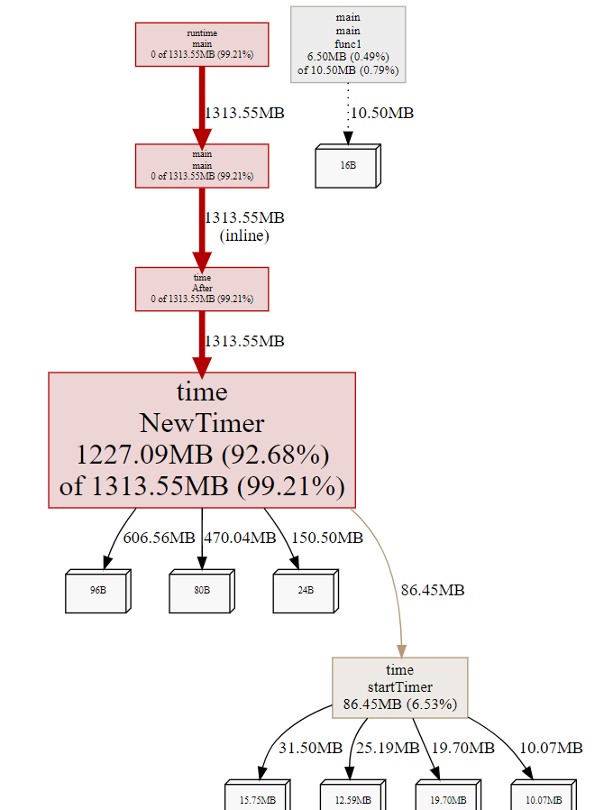
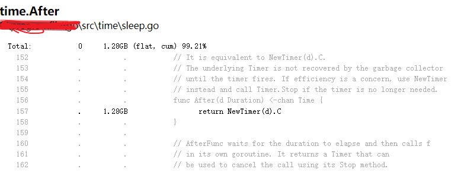
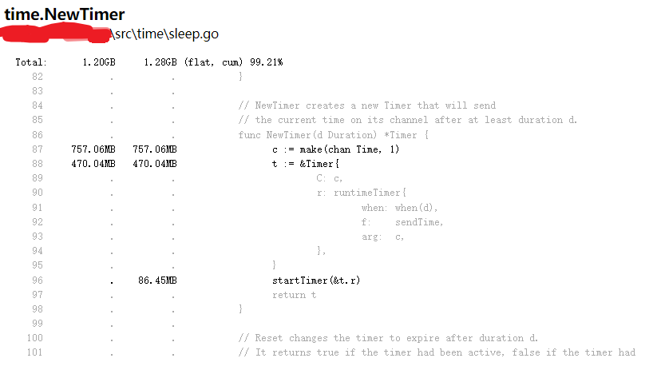

# 坑: time.After 导致内存泄露问题分析

Go 中 time.After 可能导致的内存泄露

## 一、Time 包中定时器函数

> go v1.20.4

### 定时函数：NewTicker，NewTimer 和 time.After 介绍

time 包中有 3 个比较常用的定时函数：`NewTicker`，`NewTimer` 和` time.After`：

- **NewTimer**: 表示在一段时间后才执行，默认情况下执行一次。如果想再次执行，需要调用 time.Reset() 方法，这时类似于 NewTicker 定时器了。可以调用 stop 方法停止执行。

```go
func NewTimer(d Duration) *Timer
// NewTimer 创建一个新的 Timer，它将至少持续时间 d 之后，在向通道中发送当前时间
// d 表示间隔时间
  
type Timer struct {
	C <-chan Time
	r runtimeTimer
}
```

重置 NewTimer 定时器的 `Reset()` 方法，它是定时器在持续时间 d 到期后，用这个方法重置定时器让它再一次运行，如果定时器被激活返回 true，如果定时器已过期或停止，在返回 false。

```go
func (t *Timer) Reset(d Duration) bool
```

- 用 Reset 方法需要注意的地方：

	- 如果程序已经从 t.C 接收到了一个值，则已知定时器已过期且通道值已取空，可以直接调用 time.Reset 方法;
	- 如果程序尚未从 t.C 接收到值，则要先停止定时器 t.Stop()，再从 t.C 中取出值，最后调用 time.Reset 方法。
	- 综合上面 2 种情况，正确使用 time.Reset 方法就是：
```go
if !t.Stop() {
	<-t.C
}
t.Reset(d)
```

- Stop 方法

```go
func (t *Timer) Stop() bool 
// 如果定时器已经过期或停止，返回 false，否则返回 true
```

Stop 方法能够阻止定时器触发，但是它不会关闭通道，这是为了防止从通道中错误的读取值。

为了确保调用 Stop 方法后通道为空，需要检查 Stop 方法的返回值并把通道中的值清空，如下：

```go
if !t.Stop() {
	<-t.C
}
```

- **NewTicker**: 表示每隔一段时间运行一次，可以执行多次。可以调用 stop 方法停止执行。
    `func NewTicker(d Duration) *Ticker`
    NewTicker 返回一个 Ticker，这个 Ticker 包含一个时间的通道，每次重置后会发送一个当前时间到这个通道上。
    `d` 表示每一次运行间隔的时间。
- **time.After**: 表示在一段时间后执行。其实它内部调用的就是 time.Timer 。
    `func After(d Duration) <-chan Time`

​ 跟它还有一个相似的函数 `time.AfterFunc`，后面运行的是一个函数。

NewTicker 代码例子：

```go
package main

import (
	"fmt"
	"time"
)

func main() {
	ticker := time.NewTicker(time.Second)
	defer ticker.Stop()
	done := make(chan bool)
	go func() {
		time.Sleep(10 * time.Second)
		done <- true
	}()
	for {
		select {
		case <-done:
			fmt.Println("Done!")
			return
		case t := <-ticker.C:
			fmt.Println("Current time: ", t)
		}
	}
}
```

## 二、time.After 导致的内存泄露

### 基本用法

`time.After` 方法是在一段时间后返回 `time.Time` 类型的 channel 消息，看下面源码就清楚返回值类型：

```go
// https://github.com/golang/go/blob/go1.20.4/src/time/sleep.go#LL156C1-L158C2
func After(d Duration) <-chan Time {
	return NewTimer(d).C
}

// https://github.com/golang/go/blob/go1.20.4/src/time/sleep.go#LL50C1-L53C2
type Timer struct {
	C <-chan Time
	r runtimeTimer
}
```

从代码可以看出它底层就是 `NewTimer` 实现。

一般可以用来实现超时检测：

```go
package main

import (
	"fmt"
	"time"
)

func main() {
	ch1 := make(chan string, 1)

	go func() {
		time.Sleep(time.Second * 2)
		ch1 <- "hello"
	}()

	select {
	case res := <-ch1:
		fmt.Println(res)
	case <-time.After(time.Second * 1):
		fmt.Println("timeout")
	}
}
```

### 有问题代码

上面的代码运行是没有什么问题的，不会导致内存泄露。

那问题会出在什么地方？

在有些情况下，select 需要配合 for 不断检测通道情况，问题就有可能出在 for 循环这里。

修改上面的代码，加上 for + select，为了能显示的看出问题，加上 pprof + http 代码,

`timeafter.go`：

```go
package main

import (
	"fmt"
	"net/http"
	_ "net/http/pprof"
	"time"
)

func main() {
	fmt.Println("start...")
	ch1 := make(chan string, 120)

	go func() {
		// time.Sleep(time.Second * 1)
		i := 0
		for {
			i++
			ch1 <- fmt.Sprintf("%s %d", "hello", i)
		}

	}()

	go func() {
		// http 监听8080, 开启 pprof
		if err := http.ListenAndServe(":8080", nil); err != nil {
			fmt.Println("listen failed")
		}
	}()

	for {
		select {
		case _ = <-ch1:
			// fmt.Println(res)
		case <-time.After(time.Minute * 3):
			fmt.Println("timeout")
		}
	}
}
```

在终端上运行代码：`go run timeafter.go`，

然后在开启另一个终端运行：`go tool pprof -http=:8081 http://localhost:8080/debug/pprof/heap` ，

运行之后它会自动在浏览器上弹出 pprof 的浏览界面，[http://localhost:8081/ui/](http://localhost:8081/ui/) 。

> 本机运行一段时间后比较卡，也说明程序有问题。可以在运行一段时间后关掉运行的 Go 程序，避免电脑卡死。

### 用pprof分析问题代码

在浏览器上查看 pprof 图，[http://localhost:8081/ui/](http://localhost:8081/ui/) ，

[](https://img2023.cnblogs.com/blog/650581/202305/650581-20230504001527738-1847834925.png)

从上图可以看出，内存使用暴涨（不关掉程序还会继续涨）。而且暴涨的内存集中在 time.After 上，上面分析了 time.After 实质调用的就是 time.NewTimer，从图中也可以看出。它调用 time.NewTimer 不断创建和申请内存，何以看出这个？继续看下面分析，

再来看看哪段代码内存使用最高，还是用 pprof 来查看，浏览 [http://localhost:8081/ui/source](http://localhost:8081/ui/source)

timeafter.go

[](https://img2023.cnblogs.com/blog/650581/202305/650581-20230504001527635-1404632194.png)

上面调用的 Go 源码 NewTimer，

[](https://img2023.cnblogs.com/blog/650581/202305/650581-20230504001527906-577332922.png)

[](https://img2023.cnblogs.com/blog/650581/202305/650581-20230504001527719-1067854218.png)

从上图数据分析可以看出最占用内存的那部分代码，src/time/sleep.go/NewTimer 里的 c 和 t 分配和申请内存，最占用内存。

如果不强行关闭运行程序，这里内存还会往上涨。

为什么会出现内存一直涨呢？

**在程序中加了 for 循环，for 循环都会不断调用 select，而每次调用 select，都会重新初始化一个新的定时器 Timer（调用time.After，一直调用它就会一直申请和创建内存），这个新的定时器会增加到时间堆中等待触发，而定时器启动前，垃圾回收器不会回收 Timer(Go源码注释中有解释)，也就是说 time.After 创建的内存资源需要等到定时器执行完后才被 GC 回收，一直增加内存 GC 却不回收，内存肯定会一直涨。**

**当然，内存一直涨最重要原因还是 for 循环里一直在申请和创建内存，其它是次要 。**

```go
// https://github.com/golang/go/blob/go1.20.4/src/time/sleep.go#LL150C1-L158C2

// After waits for the duration to elapse and then sends the current time
// on the returned channel. 
// It is equivalent to NewTimer(d).C.
// The underlying Timer is not recovered by the garbage collector
// until the timer fires. If efficiency is a concern, use NewTimer
// instead and call Timer.Stop if the timer is no longer needed.
func After(d Duration) <-chan Time {
	return NewTimer(d).C
}
// 在经过 d 时段后，会发送值到通道上，并返回通道。
// 底层就是 NewTimer(d).C。
// 定时器Timer启动前不会被垃圾回收器回收，定时器执行后才会被回收。
// 如果担心效率问题，可以使用 NewTimer 代替，如果不需要定时器可以调用 Timer.Stop 停止定时器。
```

在上面的程序中，`time.After(time.Minute * 3) `设置了 3 分钟，也就是说 3 分钟后才会执行定时器任务。而这期间会不断被 for 循环调用 time.After，导致它不断创建和申请内存，内存就会一直往上涨。

那怎么解决循环调用的问题？解决了，就可能解决内存一直往上涨的问题。

### 解决问题

既然是 for 循环一直调用 `time.After` 导致内存暴涨问题，那不循环调用 `time.After` 行不行？

修改后的代码如下：

```go
package main

import (
	"fmt"
	"net/http"
	_ "net/http/pprof"
	"time"
)

func main() {
	fmt.Println("start...")
	ch1 := make(chan string, 120)

	go func() {
		// time.Sleep(time.Second * 1)
		i := 0
		for {
			i++
			ch1 <- fmt.Sprintf("%s %d", "hello", i)
		}

	}()

	go func() {
		// http 监听8080, 开启 pprof
		if err := http.ListenAndServe(":8080", nil); err != nil {
			fmt.Println("listen failed")
		}
	}()
	// time.After 放到 for 外面
	timeout := time.After(time.Minute * 3)
	for {
		select {
		case _ = <-ch1:
			// fmt.Println(res)
		case <-timeout:
			fmt.Println("timeout")
			return
		}
	}
}
```

在终端上运行代码，`go run timeafter1.go`，

等待半分钟左右，在另外一个终端上运行 `go tool pprof -http=:8081 http://localhost:8080/debug/pprof/heap` ，

自动在浏览器上弹出界面 [http://localhost:8081/ui/](http://localhost:8081/ui/) ，我这里测试，界面没有任何数据显示，说明修改后的程序运行良好。

在 Go 的源码中 [After](https://github.com/golang/go/blob/go1.20.4/src/time/sleep.go#LL150C1-L158C2) 函数注释说了为了更有效率，可以使用 NewTimer ，那我们使用这个函数来改造上面的代码，

```go
package main

import (
	"fmt"
	"net/http"
	_ "net/http/pprof"
	"time"
)

func main() {
	fmt.Println("start...")
	ch1 := make(chan string, 120)

	go func() {
		// time.Sleep(time.Second * 1)
		i := 0
		for {
			i++
			ch1 <- fmt.Sprintf("%s %d", "hello", i)
		}

	}()

	go func() {
		// http 监听8080, 开启 pprof
		if err := http.ListenAndServe(":8080", nil); err != nil {
			fmt.Println("listen failed")
		}
	}()

	duration := time.Minute * 2
	timer := time.NewTimer(duration)
	defer timer.Stop()
	for {
		timer.Reset(duration) // 这里加上 Reset()
		select {
		case _ = <-ch1:
			// fmt.Println(res)
		case <-timer.C:
			fmt.Println("timeout")
			return
		}
	}
}
```

在上面的实现中，也把 NewTimer 放在循环外面，并且每次循环中都调用了 `Reset` 方法重置定时时间。

测试，运行 `go run timeafter1.go`，然后多次运行 `go tool pprof -http=:8081 http://localhost:8080/debug/pprof/heap` ，查看 pprof，我这里测试每次数据都是空白，说明程序正常运行。

## 三、网上一些错误分析

> for循环每次select的时候，都会实例化一个一个新的定时器。该定时器在多少分钟后，才会被激活，但是激活后已经跟select无引用关系，被gc给清理掉。换句话说，被遗弃的time.After定时任务还是在时间堆里面，定时任务未到期之前，是不会被gc清理的

上面这种分析说明，最主要的还是没有说清楚内存暴涨的真正内因。如果用 pprof 的 source 分析查看，就一目了然，那就是 NewTimer 里的 2 个变量创建和申请内存导致的。

---
## 四、参考

- [https://pkg.go.dev/time#pkg-overview](https://pkg.go.dev/time#pkg-overview)
- [https://github.com/golang/go/blob/go1.20.4/src/time/sleep.go](https://github.com/golang/go/blob/go1.20.4/src/time/sleep.go)
- [https://www.cnblogs.com/jiujuan/p/14588185.html](https://www.cnblogs.com/jiujuan/p/14588185.html) pprof 基本使用
- [《100 Go Mistakes and How to Avoid Them》](https://www.manning.com/books/100-go-mistakes-and-how-to-avoid-them) 作者：Teiva Harsanyi