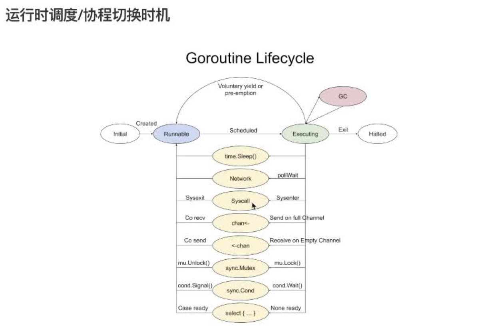

## 深入理解Golang

> 对Golang的语言特性、基础数据结构、内存管理、运行时调度等进行细致的讲解和深入的分析，帮助具备具备一定编程基础的同学，深入的了解和学习Golang。

### 1 Go语言切片与内存解析

该视频讲解了Go语言切片操作及底层原理，包括切片赋值、函数传递、内存分配和性能优化等内容。切片的底层原理包括指向数组的指针、长度和容量，切片长度超过原始数组容量时会重新分配数组。同时，还介绍了Go语言中slice和string转换的原理及性能优化，以及通过反射进行结构体与字符串之间转换的内存拷贝问题。

#### 1.1 Go语言基础与内存解析

该段视频讲述了Go语言的基础数据类型以及运行时的调度，包括数组、切片、结构体、指针、函数和接口等。同时，还介绍了公司内部项目构建的方法和工具。其中，重点讲解了数组的特性，以及切片和结构体的直传点问题。

#### 1.2 Go语言切片操作及内存结构

该段视频讲解了Go语言切片操作及内存结构，包括切片赋值、函数传递、内存分配等内容。切片看起来像引用，但实际上传的是结构，包括指向底层数组的指针、切片的长度和容量。

#### 1.3 切片底层原理及值拷贝

该视频讲解了切片的底层原理和值拷贝，切片有一个指向数组的指针，有自己的内存空间，修改切片中的值会直接影响原始数组。在切片长度超过原始数组容量时，会重新分配数组，且新数组的容量增长方式分为两种情况：小于1024时按倍增，大于1024时按1.5倍增长。

#### 1.4 Go语言slice与string转换原理

该段视频讲解了Go语言中slice和string转换的原理及性能优化。其中涉及slice和string的数据结构、引用类型和值类型的区别，以及转换过程中的内存拷贝问题。针对数据量和长度的不同，转换的耗时也有所差异。为了确保数据的不可修改性，slice和string之间的转换需要进行拷贝操作。

#### 1.5 Go切片与字符串转换的内存拷贝问题

该视频讲述了如何通过反射将结构体映射为字符串，以及字符串与切片之间的转换的内存拷贝问题。在进行这种零拷贝转换时需要注意底层内存的影响，尤其是在性能敏感的场景下。此外，视频还对不同转换方式的性能进行了对比分析。

### 2 Go语言接口与并发深入解析

该视频深入解析了Go语言接口底层结构、通道机制和并发原理。介绍了空接口、有函数接口的内存结构和类型判断，以及channel操作和调度机制，并讨论了select和switch语句的差异和线程调度原理。此外，还介绍了slice的底层结构和传递机制，以及Go语言运行时调度的相关知识。

#### 2.1 Go语言接口的底层结构

该段视频讲解了Go语言接口的底层结构，包括空的接口和带有函数的接口两种情况。空的接口只包含一个类型和一个数据，而有函数的接口则包含一个类型和函数列表。在有函数的接口中，虽然只有一个字节用于存储函数，但可以通过一些技巧放下多个函数。

#### 2.2 接口的内存结构和类型判断

该段视频内容讲解了接口的内存结构和类型判断，主要涉及到interface的内存结构，类型转换和类型断言。其中，interface包含一个类型和值，可以进行类型转换和类型断言。在进行类型转换时，会将接口函数列表拷贝到新的接口中，形成一个新的接口。此外，该视频还介绍了如何判断两个interface是否相等。

#### 2.3 知识点概要

该段视频内容主要讲解了Go语言中的接口（interface）和通道（channel）两个知识点。 1. 接口：空接口没有函数，因此可以接受任意类型的实现。在将类型转换为接口时，只拷贝接口对应的数据，而函数列表在初始化后可以复用。 2. 通道：通道本身是一个结构体，包含缓冲区（buffer）和接收队列（receive queue）。对已关闭的通道进行读写操作会引发panic。重复关闭通道会导致panic。

#### 2.4 Go语言接口与空接口使用

这段视频讲解了Go语言中的接口与空接口的使用，包括它们的特点和区别。具体来说，视频中提到了空接口没有函数列表，而结构体转为空接口时只是拷贝指针，因此空接口转换成本较低。同时，视频还强调了传递数据类型时需要思考传递的是值还是引用，以及为什么有时候需要传递指针而不是值。

#### 2.5 Go语言slice底层结构及传递机制

该段视频内容主要讲解了Go语言slice的底层结构及传递机制，包括slice的拷贝、类型转换、函数列表缓存以及slice的修改等。其中，slice的传递是通过拷贝其结构体进行的，包括数据位置、长度和容量等信息，但本质上仍然是传值。此外，视频还介绍了slice底层数据的存储方式以及slice的复用和修改等操作。最后，视频提到了实验的调度和安全问题。

#### 2.6 Go语言运行时调度深入解析

该段视频深入解析了Go语言运行时调度，包括slice的并发安全性、函数调度与让出CPU、goroutine模型以及系统调用对线程的影响。视频中提到，在某些特定版本中，死循环程序会卡住无法执行完，而在其他版本中可以执行完，这涉及到协程调度和系统调用的变化。
#### 2.7 Go语言channel操作及调度

该段视频讲解了Go语言的channel操作和调度机制，包括channel的发送和接收、阻塞和非阻塞、缓冲区设置以及select语句。还介绍了早期版本和现代版本的抢占式调度区别，以及channel之间如何进行切换和实现的设计。最后提到了特殊情况下的switch语句的调度。

#### 2.8 Go语言并发原理

该段视频讲解了Go语言中的并发原理，包括select语句和switch语句的行为差异，以及线程调度和抢占式执行的原理。其中，抢占式执行是通过信号机制实现的。

### 3 Go语言并发原理视频解析

该段视频讲述了Go语言中并发原理，重点讲解了goroutine和操作系统线程的关系以及如何通过系统调用实现阻塞。

#### 3.1 Go语言并发原理

该段视频讲述了Go语言中的并发原理，重点讲解了goroutine（g）和操作系统线程（m）的关系以及如何通过系统调用实现阻塞。其中，m是底层的操作系统线程，g是逻辑上的轻量级线程，p是g的队列。在执行死循环时，线程会被操作系统调度切走，切换到别的线程执行，再切回来仍会耗费CPU。这种行为会影响到垃圾回收（gc），拖慢其执行时间。

### 4 Go语言通道设计与优化

该段视频讲述了Go语言通道的缓冲机制、读写操作及队列管理等方面的设计与优化，还介绍了代码提交规范和项目构建流程，推荐了Go语言的调度机制、信号处理和代码测试等相关工具。

#### 4.1 channel设计和优化

该段视频内容主要讲述了channel的设计和优化，包括channel的缓冲机制、读写操作、队列管理等，以及代码提交规范和项目构建流程等。同时介绍了Go语言的调度机制和信号处理，以及代码测试和覆盖率等相关工具推荐。

### 5 编程常见问题及解决策略

该段视频介绍了如何通过代码检查和单元测试提高代码质量和覆盖率，演示了使用GoLand进行代码检查和单元测试，并分享了配置和使用Link和Felt等工具的方法。

#### 5.1 视频解析

该段视频内容主要介绍了如何通过代码检查和单元测试来提高代码质量和覆盖率，并演示了如何使用Google的开源工具GoLand进行代码检查和单元测试。最后还分享了如何配置和使用Link和Felt等工具来快速编写代码和提高代码覆盖率。

