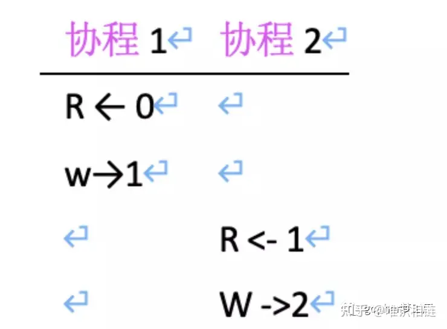
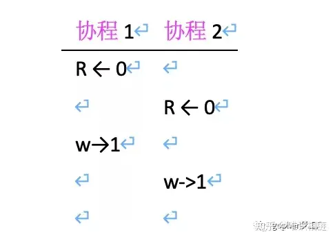
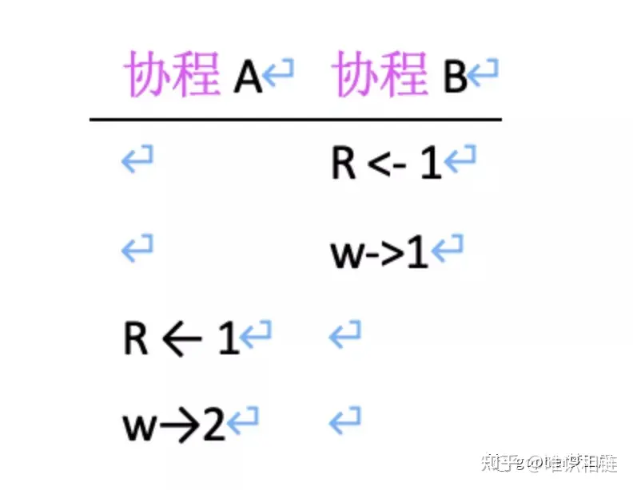
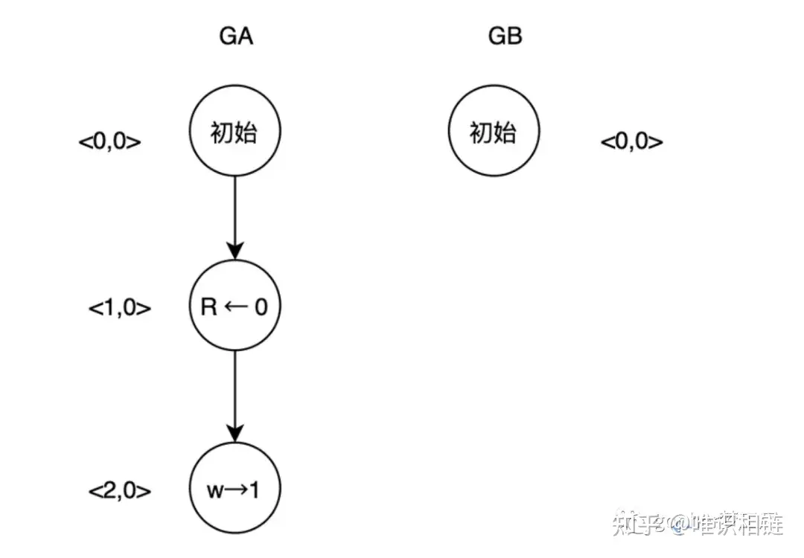
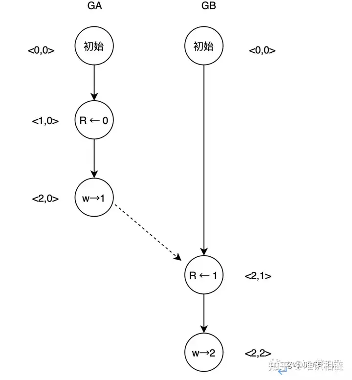
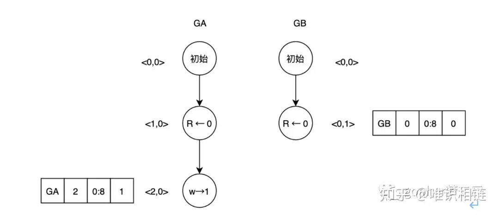
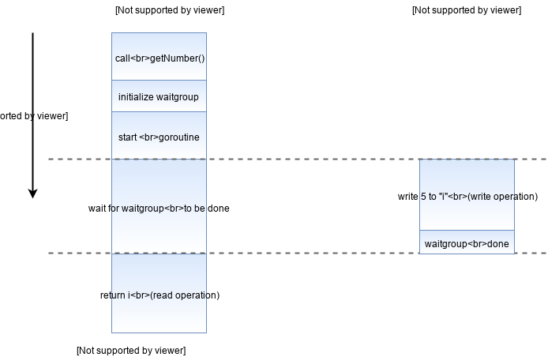
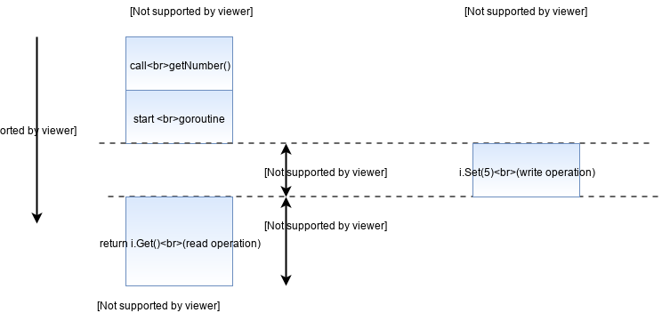
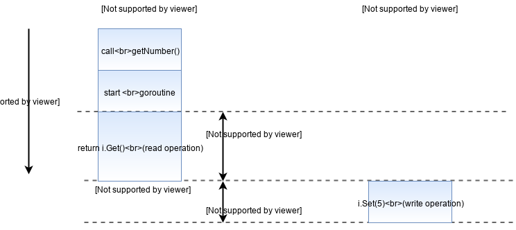

# Go语言数据争用与race原理

## 数据争用

数据争用（data race）在Go语言中指两个协程同时访问相同的内存空间，并且至少有一个写操作的情况。这种情况常常是并发错误的根源，也是最难调试的并发错误之一。

下例中的两个协程共同访问了全局变量count，乍看之下可能没有问题，但是该程序其实是有数据争用的，count的结果也是不明确的。

```go
var count = 0
func add() {
        count++
}
func main() {
    go add()
    go add()
}
```

count++操作看起来是一条指令，但是对CPU来说，需要先读取count的值，执行+1操作，再将count的值写回内存。大部分人期望的操作可能如下：R←0 代表读取到0，w→1代表写入count为1；协程1 写入数据1后，协程2再写入，count最后的值为2。

  


但是当两个协程并行时，情况开始变得复杂。如果执行的流程如下所示，那么count最后的值为1。



这两种情况告诉我们，当两个协程发生数据争用时，结果是不可预测的，这会导致很多奇怪的错误。

再举一Go语言中的经典数据争用错误。如下伪代码所示，在hash表中，存储了我们希望存储到Redis数据库中的数据（data）。但是由于Go语言使用range时，变量k是一个堆上地址不变的对象，该地址存储的值会随着range遍历而发生变化。如果此时我们将变量k的地址放入协程save，以提供并发存储而不堵塞程序，那么最后的结果可能是后面数据覆盖前面的数据，同时导致一些数据不被存储。并且每一次执行完的存储的数据也是不明确的。

```go
func save(g *data){
    saveToRedis(g)
}
func main() {
    var a map[int]data
    for _, k := range a{
        go save(&k)
    }
}
```

数据争用可谓是高并发程序中最难排查的问题，原因在于其结果是不明确的，而且出错可能是在特定的条件下。这导致很难复现相同的错误，在测试阶段也不一定能测试出问题。

## race数据争用检查详解

Go 1.1后提供了强大的race检查工具来排查数据争用问题。race可以使用在多个Go指令中，当检测器在程序中找到数据争用时，将打印报告。该报告包含发生race冲突的协程栈，以及此时正在运行的协程栈。

```bash
$ go test -race mypkg    
$ go run -race mysrc.go 
$ go build -race mycmd   
$ go install -race mypkg
```

下例中执行的go run -race 在运行时会直接报错，从报错后输出的栈帧信息中能看出具体发生冲突的位置。Read at表明读取发生在2_race.go文件的第，而Previous write表明前一个写入也是发生在2_race.go文件的第5行，从而非常快速地发现并定位数据争用问题。

```bash
» go run -race  2_race.go                                                   
==================
WARNING: DATA RACE
Read at 0x00000115c1f8 by goroutine 7:
  main.add()
     bookcode/concurrence_control/2_race.go:5 +0x3a
Previous write at 0x00000115c1f8 by goroutine 6:
  main.add()
      bookcode/concurrence_control/2_race.go:5 +0x56
```

竞争检测的成本因程序而异，对于典型的程序，内存使用量可能增加5~10倍，执行时间会增加2~20倍。同时，竞争检测器为当前每个defer和recover语句分配额外的8字节，在goroutine退出前，这些额外分配的字节不会被回收。这意味着，如果有一个长期运行的goroutine并定期有defer和recover调用，则程序内存的使用量可能无限增长。这些内存分配不会显示到runtime.ReadMemStats或runtime / pprof的输出中。

## race工具原理

race工具借助了ThreadSanitizer，ThreadSanitizer是谷歌为了应对内部大量服务器端C++代码的数据争用问题而开发的新一代工具，目前也被Go语言内部通过CGO的形式进行调用。从之前数据争用问题可以看出，当不同的协程访问同一块内存区域并且其中有一个写操作时，可能触发数据争用，也可能不触发。下例如果对count的访问用锁进行保护，那么就不会触发数据争用，因为一个协程对count的访问必须等待另一个协程的锁释放后才能开始。

```go
var count = 0
func add() {
        lock()
        count++
        unlock()
}
func main() {
    go add()
    go add()
}
```

在上例中，对count的访问可能出现两种情况。一种是协程A结束后，协程B继续执行。另一种是协程B结束后，协程A继续执行，如下所示。但是可以用符号→表示。如果A先发生，B后发生，那么A→B。



矢量时钟（Vector Clock）技术用来观察事件之间Happened-before的顺序，该技术在分布式系统中使用广泛，用于检测和确定分布式系统中事件的因果关系，也可以用于数据争用的探测。在Go程序中，有N个协程就会有该协程对应的N个[逻辑时钟](https://zhida.zhihu.com/search?q=%E9%80%BB%E8%BE%91%E6%97%B6%E9%92%9F&zhida_source=entity&is_preview=1)，而矢量时钟是所有这些逻辑时钟组成的数组，表示形式为 t = <t1, …, tn>。

以图来看一看矢量时钟技术。协程GA和GB初始化时都有一个逻辑时钟数组<0,0>。为了说明方便，指定数组<0,0>中的第1个数字都代表协程GA，第2个数字都代表协程GB，每个特定的事件都会增加自己的逻辑时钟。例如，当协程A完成count++操作时，其实际上执行了两个事件，一个事件是读取count的内容，另一个事件是写入数据到count变量中。因此当协程GA结束操作时，其矢量时钟为<2,0>。



图：矢量时钟技术

当加锁后，协程B能够观察到协程A已经释放了锁，其会更新内部对于协程A的逻辑时钟，并在后续的操作中，增加自己的逻辑时钟。因此，我们能够从矢量时钟的关系中看出是否有happened-before的关系。例如，图中的<1,0> 一定发生在<2,1>之前。



图：矢量时钟查看happened-before顺序  

在Go语言中，每个协程创建之初都会初始化矢量时钟，并在读取或写入事件时修改自己的逻辑时钟。

```go
func newproc1(){
	if raceenabled {
        newg.racectx = racegostart(callerpc)
    }
...
}
```

触发race事件主要有两种方式，一种方式是在Go语言运行时中大量（超过100处）注入触发事件，例如在数组、切片、map、通道访问时，如下为访问map时触发了访问map及当前key的写入事件。

```go
func mapaccess1(t *maptype, h *hmap, key unsafe.Pointer) unsafe.Pointer {
    if raceenabled && h != nil {
        callerpc := getcallerpc()
        pc := funcPC(mapaccess1)
		racereadpc(unsafe.Pointer(h), callerpc, pc)
        raceReadObjectPC(t.key, key, callerpc, pc)
    }
}
```

另外一种方式是依靠编译器自动插入。当加上race指令后，编译器会在可能发生数据争用的地方插入race相关的指令。在上例中加入race指令并查看汇编代码，可以看到调用了runtime.raceread及runtime.racewrite函数，触发了race事件。

```bash
» go tool compile -S  -race 2_race.go                                       jackson@jacksondeMacBook-Pro
"".add STEXT size=124 args=0x0 locals=0x18
        0x0032 00050 (2_race.go:5)      MOVQ    AX, (SP)
        0x0036 00054 (2_race.go:5)      CALL    runtime.raceread(SB)
        0x003b 00059 (2_race.go:5)      MOVQ    "".count(SB), AX
        0x0042 00066 (2_race.go:5)      MOVQ    AX, ""..autotmp_3+8(SP)
        0x0047 00071 (2_race.go:5)      LEAQ    "".count(SB), CX
        0x004e 00078 (2_race.go:5)      MOVQ    CX, (SP)
        0x0052 00082 (2_race.go:5)      CALL    runtime.racewrite(SB)
```

这些事件将触发逻辑时钟的更新，检查是否发生了数据争用。如果当前事件并没有数据争用，那么当前的事件为最新的事件，这时会存储当前事件的信息以在下一次检查时使用。保存的信息包含了协程ID、当前协程的逻辑时钟、接触位于当前位置偏移量，以及是写操作还是读操作。注意，为了节约内存，保存的事件信息存储的并不是向量时钟数组而是逻辑时钟。

如图所示，可以通过逻辑时钟判断是否发生数据争用。假设一开始协程GA先操作并写入count变量，那么其保存的数据中，第1个变量为协程GA的ID，第2个变量为当前协程的逻辑时钟2，第3个变量为接触的区域，为当前位置向后8字节，最后的1代表写入操作。而另一边由于并发执行，当协程GB执行到读取count操作时，其向量时钟为<0,1>，这时需要检查其是否与前一个写入操作发生了冲突。



图：通过逻辑时钟判断是否发生数据争用

根据以下4点判断是否发生冲突：

- 是否有一个操作是写操作
- 是否接触了同一片内存
- 是否是不同的协程
- 两个事件之间是否是happened-before关系

前3个条件都比较好判断，现在重点关注一下第4个判断条件。当前协程GB的向量时钟为<0,1>，而协程GA保存的信息只存储了逻辑时钟2，可以看作<2,X>。现在无法确定两个事件是happened-before关系，因为X可能是任意的，当X >1时，GA → GB；当X <1（例如0）时，二者之间没有任何前后顺序，因此发生了数据争用。

## 解决方案

`Go`提供了很多解决它的选择。所有这些解决方案的思路都是确保在我们写入变量时阻止对该变量的访问。一般常用的解决数据竞争的方案有：使用`WaitGroup`锁，使用通道阻塞以及使用`Mutex`锁，下面我们一个个来看他们的用法并比较一下这几种方案的不同点。

### 使用WaitGroup

解决数据竞争的最直接方法是（如果需求允许的情况下）阻止读取访问，直到写入操作完成：

```go
func getNumber() int {
	var i int
	// 初始化一个WaitGroup
	var wg sync.WaitGroup
	// Add(1) 通知程序有一个需要等待完成的任务
	wg.Add(1)
	go func() {
		i = 5
		// 调用wg.Done 表示正在等待的程序已经执行完成了
		wg.Done()
	}()
	// wg.Wait会阻塞当前程序直到等待的程序都执行完成为止
	wg.Wait()
	return i
}
```

下面是使用`WaitGroup`后程序执行的时间线：



### 使用通道阻塞

这个方法原则上与上一种方法类似，只是我们使用了通道而不是`WaitGroup`：

```go
func getNumber() int {
	var i int
  // 创建一个通道，在等待的任务完成时会向通道发送一个空结构体
	done := make(chan struct{})
	go func() {
		i = 5
		// 执行完成后向通道发送一个空结构体
		done <- struct{}{}
	}()
  // 从通道接收值将会阻塞程序，直到有值发送给done通道为止
	<-done
	return i
}
```

下图是使用通道阻塞解决数据竞争后程序的执行流程：


### 使用Mutex

到目前为止，使用的解决方案只有在确定写入操作完成后再读取`i`的值时才适用。现在让我们考虑一个更通常的情况，程序读取和写入的顺序并不是固定的，我们只要求它们不能同时发生就行。这种情况下我们应该考虑使用`Mutex`互斥锁。

```go
// 首先，创建一个结构体包含我们想用互斥锁保护的值和一个mutex实例
type SafeNumber struct {
	val int
	m   sync.Mutex
}

func (i *SafeNumber) Get() int {、
	i.m.Lock()                       
	defer i.m.Unlock()                    
	return i.val
}

func (i *SafeNumber) Set(val int) {
	i.m.Lock()
	defer i.m.Unlock()
	i.val = val
}

func getNumber() int {
	// 创建一个sageNumber实例
	i := &SafeNumber{}
  // 使用Set和Get代替常规赋值和读取操作。
  // 我们现在可以确保只有在写入完成时才能读取，反之亦然
	go func() {
		i.Set(5)
	}()
	return i.Get()
}
```

下面两个图片对应于程序先获取到写锁和先获取到读锁两种可能的情况下程序的执行流程：



---



### Mutex vs Channel

上面我们使用互斥锁和通道两种方法解决了并发程序的数据竞争问题。那么我们该在什么情况下使用互斥锁，什么情况下又该使用通道呢？答案就在你试图解决的问题中。如果你试图解决的问题更适合互斥锁，那么就继续使用互斥锁。。如果问题似乎更适合渠道，则使用它。

大多数`Go`新手都试图使用通道来解决所有并发问题，因为这是`Go`语言的一个很酷的特性。这是不对的。语言为我们提供了使用`Mutex`或`Channel`的选项，选择两者都没有错。

通常，当`goroutine`需要相互通信时使用通道，当确保同一时间只有一个`goroutine`能访问代码的关键部分时使用互斥锁。在我们上面解决的问题中，我更倾向于使用互斥锁，因为这个问题不需要`goroutine`之间的任何通信。只需要确保同一时间只有一个`goroutine`拥有共享变量的使用权，互斥锁本来就是为解决这种问题而生的，所以使用互斥锁是更自然的一种选择。

  