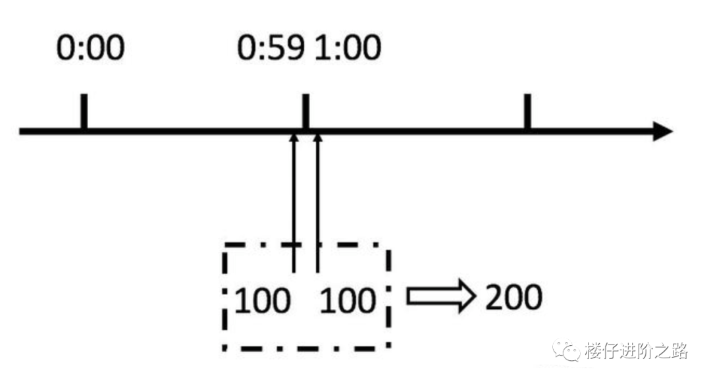
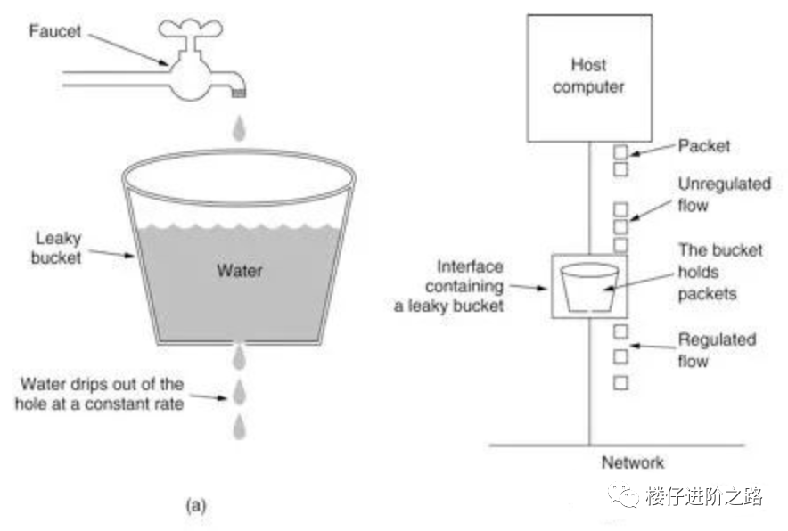

# Go限流的常见方法

最近做的项目需要对系统设计并发控制和流控，刚好趁这个时间，把Go的并发控制和限流策略整体梳理一下，因为篇幅原因，本章只整理限流方面的内容，后面再整理Go的并发控制内容。

## 1. 并发控制限流

利用channel的缓冲设定，我们就可以来实现并发的限制。我们只要在执行并发的同时，往一个带有缓冲的 channel 里写入点东西（随便写啥，内容不重要）。让并发的 goroutine在执行完成后把这个 channel 里的东西给读走。这样整个并发的数量就将控制在这个 channel的缓冲区大小上。

比如我们可以用一个 bool 类型的带缓冲 channel 作为并发限制的计数器。

```go
chLimit := make(chan bool, 1)
```

然后在并发执行的地方，每创建一个新的 goroutine，都往 chLimit 里塞个东西。

```go
for i, sleeptime := range input {
	chs[i] = make(chan string, 1)
	chLimit <- true
	go limitFunc(chLimit, chs[i], i, sleeptime, timeout)
}
```

这里通过 go 关键字并发执行的是新构造的函数。他在执行完后，会把 chLimit的缓冲区里给消费掉一个。

```go
limitFunc := func(chLimit chan bool, ch chan string, task_id, sleeptime, timeout int) {
	Run(task_id, sleeptime, timeout, ch)
	<-chLimit
}
```

这样一来，当创建的 goroutine 数量到达 chLimit 的缓冲区上限后。主 goroutine 就挂起阻塞了，直到这些 goroutine 执行完毕，消费掉了 chLimit 缓冲区中的数据，程序才会继续创建新的 goroutine 。我们并发数量限制的目的也就达到了。

完整代码：

```go
package main
import (
    "fmt"
    "time"
)
func Run(task_id, sleeptime, timeout int, ch chan string) {
    ch_run := make(chan string)
    go run(task_id, sleeptime, ch_run)
    select {
    case re := <-ch_run:
        ch <- re
    case <-time.After(time.Duration(timeout) * time.Second):
        re := fmt.Sprintf("task id %d , timeout", task_id)
        ch <- re
    }
}
func run(task_id, sleeptime int, ch chan string) {
 
    time.Sleep(time.Duration(sleeptime) * time.Second)
    ch <- fmt.Sprintf("task id %d , sleep %d second", task_id, sleeptime)
    return
}
func main() {
    input := []int{3, 2, 1}
    timeout := 2
    chLimit := make(chan bool, 1)
    chs := make([]chan string, len(input))
    limitFunc := func(chLimit chan bool, ch chan string, task_id, sleeptime, timeout int) {
        Run(task_id, sleeptime, timeout, ch)
        <-chLimit
    }
    startTime := time.Now()
    fmt.Println("Multirun start")
    for i, sleeptime := range input {
        chs[i] = make(chan string, 1)
        chLimit <- true
        go limitFunc(chLimit, chs[i], i, sleeptime, timeout)
    }
    for _, ch := range chs {
        fmt.Println(<-ch)
    }
    endTime := time.Now()
    fmt.Printf("Multissh finished. Process time %s. Number of task is %d", endTime.Sub(startTime), len(input))
}
```

运行结果：
```
Multirun start
task id 0 , timeout
task id 1 , timeout
task id 2 , sleep 1 second
Multissh finished. Process time 5s. Number of task is 3
```

## 2. 计数器

计数器是一种最简单限流算法，其原理就是：在一段时间间隔内，对请求进行计数，与阀值进行比较判断是否需要限流，一旦到了时间临界点，将计数器清零。这个就像你去坐车一样，车厢规定了多少个位置，满了就不让上车了，不然就是超载了，被交警叔叔抓到了就要罚款的，如果我们的系统那就不是罚款的事情了，可能直接崩掉了。

程序执行逻辑：
-   可以在程序中设置一个变量 count，当过来一个请求我就将这个数+1，同时记录请求时间。
-   当下一个请求来的时候判断 count 的计数值是否超过设定的频次，以及当前请求的时间和第一次请求时间是否在 1 分钟内。
-   如果在 1 分钟内并且超过设定的频次则证明请求过多，后面的请求就拒绝掉。
-   如果该请求与第一个请求的间隔时间大于计数周期，且 count 值还在限流范围内，就重置 count。

代码实现：

```go

package main
import (
    "log"
    "sync"
    "time"
)
type Counter struct {
    rate  int           //计数周期内最多允许的请求数
    begin time.Time     //计数开始时间
    cycle time.Duration //计数周期
    count int           //计数周期内累计收到的请求数
    lock  sync.Mutex
}
func (l *Counter) Allow() bool {
    l.lock.Lock()
    defer l.lock.Unlock()
    if l.count == l.rate-1 {
        now := time.Now()
        if now.Sub(l.begin) >= l.cycle {
            //速度允许范围内， 重置计数器
            l.Reset(now)
            return true
        } else {
            return false
        }
    } else {
        //没有达到速率限制，计数加1
        l.count++
        return true
    }
}
func (l *Counter) Set(r int, cycle time.Duration) {
    l.rate = r
    l.begin = time.Now()
    l.cycle = cycle
    l.count = 0
}
func (l *Counter) Reset(t time.Time) {
    l.begin = t
    l.count = 0
}
func main() {
    var wg sync.WaitGroup
    var lr Counter
    lr.Set(3, time.Second) // 1s内最多请求3次
    for i := 0; i < 10; i++ {
        wg.Add(1)
        log.Println("创建请求:", i)
        go func(i int) {
          if lr.Allow() {
              log.Println("响应请求:", i)
          }
          wg.Done()
        }(i)
        time.Sleep(200 * time.Millisecond)
    }
    wg.Wait()
}
```

输出：
```
2021/02/01 21:16:12 创建请求: 0
2021/02/01 21:16:12 响应请求: 0
2021/02/01 21:16:12 创建请求: 1
2021/02/01 21:16:12 响应请求: 1
2021/02/01 21:16:12 创建请求: 2
2021/02/01 21:16:13 创建请求: 3
2021/02/01 21:16:13 创建请求: 4
2021/02/01 21:16:13 创建请求: 5
2021/02/01 21:16:13 响应请求: 5
2021/02/01 21:16:13 创建请求: 6
2021/02/01 21:16:13 响应请求: 6
2021/02/01 21:16:13 创建请求: 7
2021/02/01 21:16:13 响应请求: 7
2021/02/01 21:16:14 创建请求: 8
2021/02/01 21:16:14 创建请求: 9
```

可以看到我们设置的是每200ms创建一个请求，明显高于1秒最多3个请求的限制，运行起来之后发现编号为 2、3、4、8、9 的请求被丢弃，说明限流成功。

那么问题来了，如果有个需求对于某个接口 /query 每分钟最多允许访问 200 次，假设有个用户在第 59 秒的最后几毫秒瞬间发送 200 个请求，当 59 秒结束后 Counter 清零了，他在下一秒的时候又发送 200 个请求。那么在 1 秒钟内这个用户发送了 2 倍的请求，这个是符合我们的设计逻辑的，这也是计数器方法的设计缺陷，系统可能会承受恶意用户的大量请求，甚至击穿系统。**这种方法虽然简单，但也有个大问题就是没有很好的处理单位时间的边界。**



  

不过说实话，这个计数引用了锁，在高并发场景，这个方式可能不太实用，我建议将锁去掉，然后将l.count++的逻辑通过原子计数处理，这样就可以保证l.count自增时不会被多个线程同时执行，**即通过原子计数的方式实现限流。**

## 3. 滑动窗口

滑动窗口是针对计数器存在的临界点缺陷，所谓 滑动窗口（Sliding window） 是一种流量控制技术，这个词出现在 TCP 协议中。滑动窗口把固定时间片进行划分，并且随着时间的流逝，进行移动，固定数量的可以移动的格子，进行计数并判断阀值。


上图中我们用红色的虚线代表一个时间窗口（一分钟），每个时间窗口有 6 个格子，每个格子是 10 秒钟。每过 10 秒钟时间窗口向右移动一格，可以看红色箭头的方向。我们为每个格子都设置一个独立的计数器 Counter，假如一个请求在 0:45 访问了那么我们将第五个格子的计数器 +1（也是就是 0:40~0:50），在判断限流的时候需要把所有格子的计数加起来和设定的频次进行比较即可。

那么滑动窗口如何解决我们上面遇到的问题呢？来看下面的图：


当用户在0:59 秒钟发送了 200个请求就会被第六个格子的计数器记录 +200，当下一秒的时候时间窗口向右移动了一个，此时计数器已经记录了该用户发送的 200 个请求，所以再发送的话就会触发限流，则拒绝新的请求。

其实计数器就是滑动窗口啊，只不过只有一个格子而已，所以想让限流做的更精确只需要划分更多的格子就可以了，为了更精确我们也不知道到底该设置多少个格子，**格子的数量影响着滑动窗口算法的精度，依然有时间片的概念，无法根本解决临界点问题。**

## **4. 漏桶**

漏桶算法（Leaky Bucket），原理就是一个固定容量的漏桶，按照固定速率流出水滴。用过水龙头都知道，打开龙头开关水就会流下滴到水桶里，而漏桶指的是水桶下面有个漏洞可以出水。如果水龙头开的特别大那么水流速就会过大，这样就可能导致水桶的水满了然后溢出。



一个固定容量的桶，有水流进来，也有水流出去。对于流进来的水来说，我们无法预计一共有多少水会流进来，也无法预计水流的速度。但是对于流出去的水来说，这个桶可以固定水流出的速率（处理速度），从而达到 流量整形 和 流量控制 的效果。

代码实现：

```go
type LeakyBucket struct {
    rate       float64 //固定每秒出水速率
    capacity   float64 //桶的容量
    water      float64 //桶中当前水量
    lastLeakMs int64   //桶上次漏水时间戳 ms
    lock sync.Mutex
}
func (l *LeakyBucket) Allow() bool {
    l.lock.Lock()
    defer l.lock.Unlock()
    now := time.Now().UnixNano() / 1e6
    eclipse := float64((now - l.lastLeakMs)) * l.rate / 1000 //先执行漏水
    l.water = l.water - eclipse                              //计算剩余水量
    l.water = math.Max(0, l.water)                           //桶干了
    l.lastLeakMs = now
    if (l.water + 1) < l.capacity {
        // 尝试加水,并且水还未满
        l.water++
        return true
    } else {
        // 水满，拒绝加水
        return false
    }
}
func (l *LeakyBucket) Set(r, c float64) {
    l.rate = r
    l.capacity = c
    l.water = 0
    l.lastLeakMs = time.Now().UnixNano() / 1e6
}
```

**漏桶算法有以下特点：**
-   漏桶具有固定容量，出水速率是固定常量（流出请求）
-   如果桶是空的，则不需流出水滴
-   可以以任意速率流入水滴到漏桶（流入请求）
-   如果流入水滴超出了桶的容量，则流入的水滴溢出（新请求被拒绝）

漏桶限制的是常量流出速率（即流出速率是一个固定常量值），**所以最大的速率就是出水的速率，不能出现突发流量。**

## **5. 令牌桶**

令牌桶算法（Token Bucket）是网络流量整形（Traffic Shaping）和速率限制（Rate Limiting）中最常使用的一种算法。典型情况下，令牌桶算法用来控制发送到网络上的数据的数目，并允许突发数据的发送。


我们有一个固定的桶，桶里存放着令牌（token）。一开始桶是空的，系统按固定的时间（rate）往桶里添加令牌，直到桶里的令牌数满，多余的请求会被丢弃。当请求来的时候，从桶里移除一个令牌，如果桶是空的则拒绝请求或者阻塞。

代码实现：

```go
type TokenBucket struct {
    rate         int64 //固定的token放入速率, r/s
    capacity     int64 //桶的容量
    tokens       int64 //桶中当前token数量
    lastTokenSec int64 //桶上次放token的时间戳 s
 
    lock sync.Mutex
} 
func (l *TokenBucket) Allow() bool {
    l.lock.Lock()
    defer l.lock.Unlock()
    now := time.Now().Unix()
    l.tokens = l.tokens + (now-l.lastTokenSec)*l.rate // 先添加令牌
    if l.tokens > l.capacity {
        l.tokens = l.capacity
    }
    l.lastTokenSec = now
    if l.tokens > 0 {
        // 还有令牌，领取令牌
        l.tokens--
        return true
    } else {
        // 没有令牌,则拒绝
        return false
    }
}
func (l *TokenBucket) Set(r, c int64) {
    l.rate = r
    l.capacity = c
    l.tokens = 0
    l.lastTokenSec = time.Now().Unix()
}
```

**令牌桶有以下特点：**
-   令牌按固定的速率被放入令牌桶中
-   桶中最多存放 B 个令牌，当桶满时，新添加的令牌被丢弃或拒绝
-   如果桶中的令牌不足 N 个，则不会删除令牌，且请求将被限流（丢弃或阻塞等待）

**令牌桶限制的是平均流入速率**（允许突发请求，只要有令牌就可以处理，支持一次拿3个令牌，4个令牌...），**并允许一定程度突发流量，所以也是非常常用的限流算法。**

## 6. httpserver频率限制

使用golang来编写httpserver时，可以使用官方已经有实现好的包：  

```go
import(
    "fmt"
    "net"
    "golang.org/x/net/netutil"
)
func main() {
    l, err := net.Listen("tcp", "127.0.0.1:0")
    if err != nil {
        fmt.Fatalf("Listen: %v", err)
    }
    defer l.Close()
    l = LimitListener(l, max)
    http.Serve(l, http.HandlerFunc())
    //bla bla bla.................
}
```

源码的基本思路就是为连接数计数，通过make chan来建立一个最大连接数的channel, 每次accept就+1，close时候就-1. 当到达最大连接数时，就等待空闲连接出来之后再accept。

## 7. Redis消息队列限流

我们都知道消息队列可以实现异步、解耦和削峰。使用Redis的List类型的消息队列，指定队列固定长度，开始会一直往队列塞数据，当下游消费能力不足，队列处于满员状态时，生产者的数据直接丢弃，以此实现限流。这里其实有个疑问，因为channel其实也可以理解为一个队列，那么channel是否也可以通过这种方式实现限流呢？

当消息队列满时，上游不能塞数据，会直接阻塞住，如果不想阻塞，那么就需要判断队列的长度，如果满员，就直接丢弃请求，那么每次往队列塞数据前，就需要判断队列的长度了，但是channel的长度大小其实是不知道的，所以从这个层面来看，channel应该不能通过改方式实现限流。

## 8. 总结

实现限流的方式，应该还有很多，就不再列举了，上面很多内容都是从网上摘抄的，自己整理一遍，印象也会更深刻一些，下面通过个人的理解，总结一下每种限流的优缺点，也便于以后选型。

**并发控制限流：**
-   优点：通过控制消费者的线程数，来控制消费者的并发数量；
-   缺点：感觉这种限流场景好Low，首先没有见过这么用，然后处理数据的数量，每个线程能执行多少，都没有一个确定的值，不是很好的限流方式。

**计数器：**
-   优点：固定时间段计数，实现简单，适用不太精准的场景；
-   缺点：对边界没有很好处理，导致限流不能精准控制。

**滑动窗口：**
-   优点：将固定时间段分块，时间比“计数器”复杂，适用于稍微精准的场景；
-   缺点：实现稍微复杂，还是不能彻底解决“计数器”存在的边界问题。

**漏桶：**
-   优点：可以很好的控制消费频率；
-   缺点：实现稍微复杂，单位时间内，不能多消费，感觉不太灵活。

**令牌桶：**
-   优点：可以解决“漏桶”不能灵活消费的问题，又能避免过渡消费，强烈推荐；
-   缺点：实现稍微复杂，其它缺点没有想到。

**httpserver频率限制：**
-   优点：实现简单，直接有第三方库支持，也能很好支持限流；
-   缺点：如果需要使用限流，我应该不会使用这种。

**Redis消息队列：**
-   优点：适用数据流动的场景，经常和异步和解耦结合使用，支持数据存储；
-   缺点：一般只能结合Redis使用，因为Redis是单进程单线程模型处理数据（现在已经支持多线程，但是命令执行部分其实还是单线程），如果用其它消息队列，就需要加锁来处理并发控制，就得不偿失了。

## 参考
- 参考1：https://blog.csdn.net/lengyue1084/article/details/113615790
- 参考2：https://blog.csdn.net/micl200110041/article/details/82013032