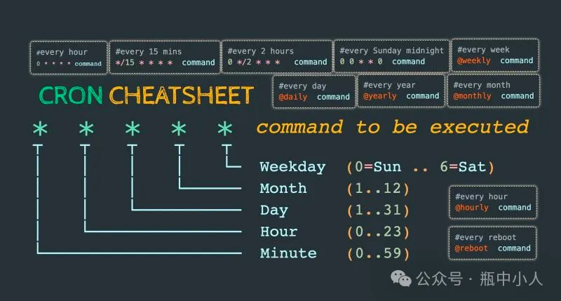
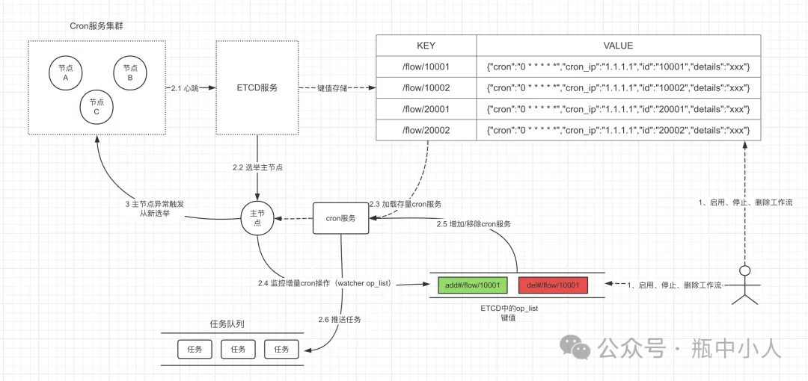

# Crontab周期工作流设计

> 电子书地址：[https://workflow-engine-book.shuwoom.com](https://workflow-engine-book.shuwoom.com)

在前面的流程建模章节，我们定义了Crontab时间触发器，使用时就是一个任务节点，看似很简单，但是背后要实现就复杂多了。这里的Crontab跟我们在Linux机器上的Cron服务是类似的，都是可以设置周期性的任务。但是不同的是，Linux上的Cron是单机的，而且只支持分钟级别。但是我们要实现的是在分布式集群下的Crontab服务，而且支持秒级别的。这需要通过选举算法选举出主节点，由这个主节点来提供Crontab服务。



接下来，我们从下面几节内容来介绍一个分布式Crontab任务调度是怎么设计实现的。



## Crontab表达式介绍

Crontab是Unix和类Unix（包括Linux）操作系统下的任务调度程序，允许用户在固定的时间和日期运行命令或者脚本。但是，传统的Crontab语法并不支持秒级别的任务调度。

```
*   *   *   *   *   *  
-   -   -   -   -   -  
|   |   |   |   |   |  
|   |   |   |   |   +---周(0-6)(Sunday=0)  
|   |   |   |   +-----月(1-12)  
|   |   |   +-------日(1-31)  
|   |   +---------小时(0-23)  
|   +-----------分钟(0-59)  
+-------------秒(0-59)
```

支持的语法格式包括：

1. 星号（`*`）：表示该字段可以匹配任何值。例如，小时字段中的星号表示每个小时都执行。
2. 逗号（`,`）：表示该字段可以匹配多个值。例如，小时字段中的 `1,3,5` 表示在第1、3、5小时执行。
3. 连字符（`-`）：表示该字段可以匹配一个范围内的值。例如，小时字段中的 `1-3` 表示在第1、2、3小时执行。
4. 除号（`/`）：表示该字段可以匹配每隔固定值的时间点。例如，分钟字段中的 `*/5` 表示每隔5分钟执行一次。
5. 星期字段中的特殊值：星期字段中，可以使用0表示周日，1表示周一，以此类推。
6. 月份字段中的特殊值：月份字段中，可以使用1-12表示1月至12月。

下面是一些例子

| 表达式              | 说明                  |
| ---------------- | ------------------- |
| `0 30 2 * * *`   | 每天的凌晨2点30分执行        |
| `0 0 17 * * 1,4` | 每周一和周四的下午5点执行       |
| `0 0 3 1,15 * *` | 每月的1号和15号的凌晨3点执行    |
| `0 */5 * * * *`  | 每隔5分钟执行一次           |
| `*/5 * * * * *`  | 每隔5秒钟执行一次           |
| `0 0 9-17 * * *` | 每天的9点至17点，每隔1小时执行一次 |

目前github上有很多开源实现的crontab第三方库来实现linux cron服务，下面我们使用beego的crontab工具库来实现：

```bash
go get github.com/beego/beego/v2/task
```

```go
package main

import (
	"context"
	"fmt"
	"time"

	"github.com/beego/beego/v2/task"
)

func main() {
	f := func(ctx context.Context) error {
		fmt.Println("running flow#10001...")
		returnnil
	}
	tk1 := task.NewTask("flow#10001", "*/4 * * * * *", f)

	task.AddTask("flow#10001", tk1)
	task.StartTask()
	defer task.StopTask()

	time.Sleep(10 * time.Second)

	task.DeleteTask("flow#10001")

	time.Sleep(10 * time.Second)
}
```

上面的示例代码，我们创建启动了一个`*/5 * * * * *`服务，这个服务每5秒回调用`f`函数，并在10秒后通过调用DeleteTask删除该cron服务。

然后，在命令行中执行以下命令：

```bash
go run main.go
```

如果一切正常，您应该会看到以下输出：

```
running flow#10001...   
running flow#10001...
```

## ETCD基础操作

ETCD是一个开源的、高可用的、分布式的键值存储系统，它用于共享配置和服务发现。ETCD是由CoreOS开发的，用于支持分布式系统的一致性和配置管理。它使用Raft一致性算法来保证数据的一致性和可靠性，提供了简单易用的API和客户端库，使得开发者可以轻松地实现分布式系统的功能。

这里介绍ETCD是因为，我们可以基于ETCD实现主节点选举，同时基于其租约(Lease)+KeepAlive机制，可以做到发生故障时，实现主备的快速切换，实现高可用的架构。Lease 是client 和 etcd server 之间存在一个约定， etcd server 保证在约定的有效期内（TTL），不会删除关联到此 Lease 上的 key-value。但如果未在有效期内续租，那么 etcd server 就会删除 Lease 和其关联的 key-value。基于Lease这个特性，就可以在服务发现场景中实现对故障节点的自动剔除。

下面我们介绍几个常用的功能：

### key值读、写和删除

```go
package main

import (
	"context"
	"fmt"
	"log"
	"time"
)

func main() {
	// 创建etcd客户端配置
	config := clientv3.Config{
		Endpoints:   []string{"localhost:2379"},
		DialTimeout: 5 * time.Second,
	}

	// 连接etcd
	client, err := clientv3.New(config)
	if err != nil {
		log.Fatal(err)
	}
	defer client.Close()

	// 设置键值
	ctx, cancel := context.WithTimeout(context.Background(), 5*time.Second)
	_, err = client.Put(ctx, "my-key", "my-value")
	cancel()
	if err != nil {
		log.Fatal(err)
	}

	// 获取键值
	ctx, cancel = context.WithTimeout(context.Background(), 5*time.Second)
	resp, err := client.Get(ctx, "my-key")
	cancel()
	if err != nil {
		log.Fatal(err)
	}

	// 输出获取到的键值
	for _, kv := range resp.Kvs {
		fmt.Printf("key: %s, value: %s\n", kv.Key, kv.Value)
	}

	// 删除键值
	ctx, cancel = context.WithTimeout(context.Background(), 5*time.Second)
	_, err = client.Delete(ctx, "my-key")
	cancel()
	if err != nil {
		log.Fatal(err)
	}
}
```

在此示例中，我们首先创建了一个etcd客户端配置，然后使用配置创建了一个etcd客户端。接下来，我们使用`Put`方法设置了一个键值对，然后使用`Get`方法获取该键对应的值，并输出到控制台。

然后，在命令行中执行以下命令：

```bash
go run main.go
```

如果一切正常，您应该会看到以下输出：

```
key: my-key, value: my-value
```

### key值watch操作

```go
package main

import (
	"context"
	"fmt"
	"log"
	"time"

	clientv3 "go.etcd.io/etcd/client/v3"
)

func main() {
	// 创建etcd客户端配置
	config := clientv3.Config{
		Endpoints:   []string{"localhost:2379"},
		DialTimeout: 5 * time.Second,
	}

	// 连接etcd
	client, err := clientv3.New(config)
	if err != nil {
		log.Fatal(err)
	}
	defer client.Close()

	// 创建一个watcher
	watcher := clientv3.NewWatcher(client)
	defer watcher.Close()

	// 启动一个goroutine，用于模拟键值的变更
	go func() {
		for i := 0; i < 5; i++ {
			time.Sleep(1 * time.Second)
			_, err := client.Put(context.Background(), "watch-key", fmt.Sprintf("value-%d", i))
			if err != nil {
				log.Fatal(err)
			}
		}
	}()

	// 监听键值变更
	ctx, cancel := context.WithCancel(context.Background())
	watchChan := watcher.Watch(ctx, "watch-key")

	// 处理watch事件
	for watchResp := range watchChan {
		for _, event := range watchResp.Events {
			fmt.Printf("Event received! Type: %s, Key: %s, Value: %s\n", event.Type, event.Kv.Key, event.Kv.Value)
		}
	}

	// 取消watch
	cancel()
}
```

在此示例中，我们首先创建了一个etcd客户端配置，然后使用配置创建了一个etcd客户端。接着，我们创建了一个watcher，并在另一个goroutine中模拟键值的变更。最后，我们监听键值变更，并输出watch事件的类型、键和值。

然后，在命令行中执行以下命令：

```bash
go run main.go
```


如果一切正常，您应该会看到类似以下的输出：

```
Event received!Type: PUT,Key: watch-key,Value: value-0   
Event received!Type: PUT,Key: watch-key,Value: value-1   
Event received!Type: PUT,Key: watch-key,Value: value-2   
Event received!Type: PUT,Key: watch-key,Value: value-3   
Event received!Type: PUT,Key: watch-key,Value: value-4
```

### lease续租

```go
package main

import (
	"context"
	"fmt"
	"log"
	"time"

	clientv3 "go.etcd.io/etcd/client/v3"
)

func main() {
	// 创建etcd客户端配置
	config := clientv3.Config{
		Endpoints:   []string{"localhost:2379"},
		DialTimeout: 5 * time.Second,
	}

	// 连接etcd
	client, err := clientv3.New(config)
	if err != nil {
		log.Fatal(err)
	}
	defer client.Close()

	// 创建一个租约
	lease, err := client.Grant(context.Background(), 5)
	if err != nil {
		log.Fatal(err)
	}

	// 使用租约设置键值
	_, err = client.Put(context.Background(), "lease-key", "lease-value", clientv3.WithLease(lease.ID))
	if err != nil {
		log.Fatal(err)
	}

	// 获取并输出键值
	resp, err := client.Get(context.Background(), "lease-key")
	if err != nil {
		log.Fatal(err)
	}
	for _, kv := range resp.Kvs {
		fmt.Printf("key: %s, value: %s\n", kv.Key, kv.Value)
	}

	// 等待租约过期
	fmt.Println("Waiting for lease to expire...")
	time.Sleep(6 * time.Second)

	// 再次获取并输出键值
	resp, err = client.Get(context.Background(), "lease-key")
	if err != nil {
		log.Fatal(err)
	}
	for _, kv := range resp.Kvs {
		fmt.Printf("key: %s, value: %s\n", kv.Key, kv.Value)
	}
}
```

在此示例中，我们首先创建了一个etcd客户端配置，然后使用配置创建了一个etcd客户端。接着，我们创建了一个租约，并使用租约设置了一个键值对。然后，我们获取并输出该键对应的值，等待租约过期，再次获取并输出该键对应的值，而此时由于过期无法获取到。

然后，在命令行中执行以下命令：

```bash
go run main.go
```


如果一切正常，您应该会看到类似以下的输出：

```
key: lease-key, value: lease-value   
Waiting for lease to expire...
```

因为key值被删除而无法获取到。

### keepAlive操作

```go
package main

import (
	"context"
	"fmt"
	"log"
	"time"

	clientv3 "go.etcd.io/etcd/client/v3"
)

func main() {
	// 创建etcd客户端配置
	config := clientv3.Config{
		Endpoints:   []string{"localhost:2379"},
		DialTimeout: 5 * time.Second,
	}

	// 连接etcd
	client, err := clientv3.New(config)
	if err != nil {
		log.Fatal(err)
	}
	defer client.Close()

	// 创建一个租约
	lease, err := client.Grant(context.Background(), 5)
	if err != nil {
		log.Fatal(err)
	}

	// 使用租约设置键值
	_, err = client.Put(context.Background(), "keepalive-key", "keepalive-value", clientv3.WithLease(lease.ID))
	if err != nil {
		log.Fatal(err)
	}

	// 创建一个KeepAlive
	keepAlive, err := client.KeepAlive(context.Background(), lease.ID)
	if err != nil {
		log.Fatal(err)
	}

	// 启动一个goroutine，处理KeepAlive响应
	go func() {
		for {
			select {
			case ka := <-keepAlive:
				if ka == nil {
					return
				}
				// 获取键值
				ctx, cancel := context.WithTimeout(context.Background(), 5*time.Second)
				resp, err := client.Get(ctx, "keepalive-key")
				cancel()
				if err != nil {
					log.Fatal(err)
				}

				// 输出获取到的键值
				for _, kv := range resp.Kvs {
					fmt.Printf("Received KeepAlive response=> key: %s, value: %s\n", kv.Key, kv.Value)
				}
			}
		}
	}()

	// 等待一段时间
	time.Sleep(10 * time.Second)

}
```

在此示例中，我们首先创建了一个etcd客户端配置，然后使用配置创建了一个etcd客户端。接着，我们创建了一个租约，并使用租约设置了一个键值对。然后，我们创建了一个KeepAlive，并启动一个goroutine处理KeepAlive响应。可以看到虽然keepalive-key设置了5秒的租约，但是因为使用了keepAlive机制，etcd会自动续约，所以我们可以一直读取到keepalive-key的值。

然后，在命令行中执行以下命令：

```bash
go run main.go
```

如果一切正常，您应该会看到类似以下的输出：

```
Received KeepAlive response=> key: keepalive-key, value: keepalive-value   Received KeepAlive response=> key: keepalive-key, value: keepalive-value   Received KeepAlive response=> key: keepalive-key, value: keepalive-value   Received KeepAlive response=> key: keepalive-key, value: keepalive-value   Received KeepAlive response=> key: keepalive-key, value: keepalive-value
```

### 主节点选举

```go
package main

import (
	"context"
	"fmt"
	"log"
	"os"
	"os/signal"
	"sync"
	"syscall"
	"time"

	"go.etcd.io/etcd/client/v3/concurrency"
)

func startElection(id int, wg *sync.WaitGroup) {
	defer wg.Done()

	// 创建etcd客户端配置
	config := clientv3.Config{
		Endpoints:   []string{"localhost:2379"},
		DialTimeout: 5 * time.Second,
	}

	// 连接etcd
	client, err := clientv3.New(config)
	if err != nil {
		log.Fatal(err)
	}
	defer client.Close()

	// 创建一个etcd会话
	session, err := concurrency.NewSession(client, concurrency.WithTTL(5))
	if err != nil {
		log.Fatal(err)
	}
	//defer session.Close()

	// 创建一个etcd选举器
	election := concurrency.NewElection(session, "/my-election/")

	// 创建一个信号处理器
	signalChan := make(chan os.Signal, 1)
	signal.Notify(signalChan, syscall.SIGINT, syscall.SIGTERM)

	// 开始选举
	for {
		err := election.Campaign(context.Background(), fmt.Sprintf("node-%d", id))
		if err != nil {
			log.Fatal(err)
		}

		// 检查是否成为主节点
		leader, err := election.Leader(context.Background())
		if err != nil {
			log.Fatal(err)
		}

		// 设置一个定时器来取消会话，模拟主节点宕机的情况
		go func() {
			time.Sleep(5 * time.Second)
			session.Close()
		}()

		if string(leader.Kvs[0].Value) == fmt.Sprintf("node-%d", id) {
			fmt.Printf("Node %d is the leader now\n", id)
		} else {
			fmt.Printf("Node %d is a follower\n", id)
		}

		// todo 启动cron服务
		runCronService(string(leader.Kvs[0].Value))

		// 等待信号或者会话过期
		select {
		case <-signalChan:
			closeCronService(string(leader.Kvs[0].Value))
			return
		case <-session.Done():
			fmt.Printf("Node %d session expired, restarting election\n", id)
			closeCronService(string(leader.Kvs[0].Value))
			return
		}
	}
}

func runCronService(node string) {
	// todo
	fmt.Println(node + " 启动定时任务服务...")
}

func closeCronService(node string) {
	// todo
	fmt.Println(node + " 关闭定时任务服务...")
}

func main() {
	var wg sync.WaitGroup

	// 模拟多个节点并发选举
	for i := 1; i <= 5; i++ {
		wg.Add(1)
		go startElection(i, &wg)
	}

	wg.Wait()
}
```

在这个示例中，我们创建了一个`startElection`函数，它接受一个节点ID和一个`sync.WaitGroup`作为参数。然后我们在`main`函数中启动多个goroutine来运行`startElection`函数，模拟多个节点并发选举，每次只有1个节点可以选举成为master。

同时选举成为master的主节点，会启动cron服务。同时我们通过session.Close操作模拟主节点宕机的情况下，是否会正常进行选举。

然后，在命令行中执行以下命令：

```bash
go run main.go
```

如果一切正常，您应该会看到类似以下的输出：

```
Node 3is the leader now   node-3启动定时任务服务...   
Node3 session expired, restarting election   
node-3关闭定时任务服务...   
Node5is the leader now   
node-5启动定时任务服务...   
Node5 session expired, restarting election   
node-5关闭定时任务服务...   
Node2is the leader now   
node-2启动定时任务服务...   
Node2 session expired, restarting election   
node-2关闭定时任务服务...   
Node4is the leader now   
node-4启动定时任务服务...   
Node4 session expired, restarting election   
node-4关闭定时任务服务...   
Node1is the leader now   
node-1启动定时任务服务...   
Node1 session expired, restarting election   
node-1 关闭定时任务服务...
```

## master-worker主从架构

前面我们介绍了分布式crontab任务调度中涉及到的几个关键功能的实现，下面，我们结合下图的master-worker主从架构来完整实现这一服务。整个架构分成如下三部分：

- 用户操作
	- 启用工作流。这时需要更新ETCD中的键值对，并且主节点需要添加该cron服务。
	- 停止、删除工作流。删除ETCD中对应的键值对，这时主节点的watcher机制会被触发并移除该cron服务。
- 主节点
	- 读取加载存量的cron服务
	- 通过etcd的watcher机制监控op_list键值变化。op_list会记录后续用户新增或移除的cron服务，如果新增一个cron服务工作流，用`add#工作流id`表示，如果移除一个cron服务工作流（删除或停止），用`del#工作流id`表示。
	- 如果op_list键值变化，则获取要新增或移除的cron服务，更新cron服务列表。
	- cron服务如果达到时间要求，则会触发创建工作流实例运行，并推送到任务队列。
- 各个节点
	- 上报心跳
	- 时刻进行选举


### 用户添加或移除cron操作

`AddOrDelCronOp`函数主要实现在用户添加或移除cron服务工作流时，更新对应的ETCD键值对。

除了设置工作流的详情信息键值，还需要将本次的操作更新到op_list键值，op_list键值的操作要基于分布式锁保证原子性，即每次操作只有一个线程可以处理。

```go
type cronVal struct {
	Cron    string `json:"cron"`
	Id      string `json:"id"` // workflow id
	Details string `json:"details"`
}

// AddOrDelCronOp 添加或移除cron服务操作
func AddOrDelCronOp(client *clientv3.Client, op string, workflowId, cron, details string) (err error) {
	// ================================
	// 添加新key值
	// ================================
	key := fmt.Sprintf("/flow/%s", workflowId)
	if op == "add" {
		ctx, cancel := context.WithTimeout(context.Background(), 5*time.Second)

		bs, _ := json.Marshal(cronVal{
			Cron:    cron, //
			Id:      workflowId,
			Details: details,
		})

		_, err = client.Put(ctx, key, string(bs))
		cancel()
		if err != nil {
			log.Fatal(err)
			return
		}
	} else if op == "del" {
		ctx, cancel := context.WithTimeout(context.Background(), 5*time.Second)
		_, err = client.Delete(ctx, key)
		cancel()
		if err != nil {
			log.Fatal(err)
			return
		}
	} else {
		err = errors.New("invalid operation")
		return
	}

	// ================================
	// 更新op_list
	// ================================
	// 获取键值
	ctx, cancel := context.WithTimeout(context.Background(), 5*time.Second)
	resp, err := client.Get(ctx, "op_list")
	cancel()
	if err != nil {
		log.Fatal(err)
		return
	}

	newVal := ""
	if len(resp.Kvs) > 0 {
		newVal = fmt.Sprintf("%s,%s#%s", string(resp.Kvs[0].Value), op, workflowId)
	} else {
		newVal = fmt.Sprintf("%s#%s", op, workflowId)
	}

	// 创建一个etcd会话
	session, err := concurrency.NewSession(client)
	if err != nil {
		log.Fatal(err)
	}
	defer session.Close()

	// op_list的操作要使用分布式锁保证原子性
	mutex := concurrency.NewMutex(session, "/lock/op_list")

	// 获取锁
	err = mutex.Lock(context.Background())
	if err != nil {
		log.Fatal(err)
		return
	}
	// 释放锁
	defer mutex.Unlock(context.Background())

	// 更新op_list
	ctx, cancel = context.WithTimeout(context.Background(), 5*time.Second)
	_, err = client.Put(ctx, "op_list", newVal)
	cancel()
	if err != nil {
		log.Fatal(err)
		return
	}

	return
}
```

### 加载存量cron服务

`LoadCronServiceByOne`函数通过beego的crontab模块添加一个cron后台任务，其中flowKey格式如前面的架构图：`/flow/10001`。

```go
// LoadCronServiceByOne 后台添加cron服务
func LoadCronServiceByOne(client *clientv3.Client, flowKey, nodeId string) {
	task.DeleteTask(flowKey)

	// 获取工作流的cron信息
	ctx, cancel := context.WithTimeout(context.Background(), 5*time.Second)
	resp, err := client.Get(ctx, flowKey)
	cancel()
	if err != nil {
		log.Fatal(err)
		return
	}
	if len(resp.Kvs) == 0 {
		return
	}

	var cv cronVal
	if err = json.Unmarshal(resp.Kvs[0].Value, &cv); err != nil {
		log.Fatal(err.Error())
		return
	}

	// 添加到cron服务
	tk := task.NewTask(flowKey, cv.Cron, func(ctx context.Context) error {
		fmt.Printf("[%s] running cron task %s...\n", nodeId, flowKey)
		returnnil
	})
	task.AddTask(flowKey, tk)
	fmt.Printf("[%s] load cron success, key:%s, expr:%s \n", nodeId, flowKey, cv.Cron)
}
```

`LoadExistedCronServices`函数通过etcd的键值对`/flow/`读取其下所有启用的crontab服务，并加载到后台。

注意由于该操作时初始化操作，同时也会把`op_list`键值重置清空。

```go
// LoadExistedCronServices 获取并加载存量的cron服务
func LoadExistedCronServices(client *clientv3.Client, nodeId string) {
	ctx, cancel := context.WithTimeout(context.Background(), 5*time.Second)
	// 先清空初始化op_list
	client.Delete(ctx, "op_list")

	resp, err := client.Get(ctx, "/flow/", clientv3.WithPrefix())
	cancel()
	if err != nil {
		log.Fatal(err)
		return
	}

	// 遍历cron服务
	for _, kv := range resp.Kvs {
		LoadCronServiceByOne(client, string(kv.Key), nodeId)
	}
}
```

### 监听增量cron变化

`MonitorKey`函数会监听`op_list`的键值变化。每次用户在添加或移除cron工作流时，就会触发该监听器。收到事件后会添加新的cron服务或者移除cron服务。注意由于该操作处理完后需要重置`op_list`键值，所以在捕获到事件时就需要获取分布式锁，并在处理完事件以后重置`op_list`并释放锁。

```go
// MonitorKey 监听op_list键值变化
func MonitorKey(client *clientv3.Client, nodeId, key string, ctx context.Context) {
	// 创建一个watcher
	watcher := clientv3.NewWatcher(client)
	defer watcher.Close()

	// 监听键值变更
	watchChan := watcher.Watch(ctx, key)

	// 创建一个etcd会话
	session, err := concurrency.NewSession(client)
	if err != nil {
		log.Fatal(err)
	}
	defer session.Close()

	// 处理watch事件
	for watchResp := range watchChan {
		// op_list的操作要使用分布式锁保证原子性
		mutex := concurrency.NewMutex(session, "/lock/op_list")

		// 获取锁
		err = mutex.Lock(context.Background())
		if err != nil {
			log.Fatal(err)
			return
		}

		for _, event := range watchResp.Events {
			if event.Type != clientv3.EventTypePut {
				continue
			}
			fmt.Printf("[%s] Event received! Key: %s, Value: %s\n", nodeId, event.Kv.Key, event.Kv.Value)

			for _, item := range strings.Split(string(event.Kv.Value), ",") {
				if item == "" {
					continue
				}
				arr := strings.Split(item, "#")
				op := arr[0]
				workflowId := arr[1]

				flowKey := fmt.Sprintf("/flow/%s", workflowId)
				if op == "add" {
					LoadCronServiceByOne(client, flowKey, nodeId)
				} else if op == "del" {
					task.DeleteTask(flowKey)
				}
			}

		}

		// 处理完所有操作后重置op_list
		client.Delete(context.Background(), "op_list")

		// 释放锁
		mutex.Unlock(context.Background())

	}
}
```

### 主节点选举

下面的函数是进行主节点选举的函数，选举成为主节点后，加载存量的cron服务，同时通过监听用户操作的`op_list`键值变化来加载或移除cron服务。

```go
func campaignLoop(client *clientv3.Client, nodeId string, wg *sync.WaitGroup) {
	defer wg.Done()
	// 创建一个etcd会话
	session, err := concurrency.NewSession(client, concurrency.WithTTL(5))
	if err != nil {
		log.Fatal(err)
	}
	defer session.Close()

	// 创建一个etcd选举器
	election := concurrency.NewElection(session, "/master/cron")

	// 创建一个信号处理器
	signalChan := make(chan os.Signal, 1)
	signal.Notify(signalChan, syscall.SIGINT, syscall.SIGTERM)

	// 开始选举
	for {
		err = election.Campaign(context.Background(), fmt.Sprintf("node-%s", nodeId))
		if err != nil {
			log.Fatal(err)
		}

		// 检查是否成为主节点
		leader, err := election.Leader(context.Background())
		if err != nil {
			log.Fatal(err)
		}

		// 设置一个定时器来取消会话，模拟主节点宕机的情况
		go func() {
			time.Sleep(8 * time.Second)
			session.Close()
		}()

		if string(leader.Kvs[0].Value) == fmt.Sprintf("node-%s", nodeId) {
			fmt.Printf("[%s] is the leader now\n", nodeId)
		} else {
			fmt.Printf("[%s] is a follower\n", nodeId)
		}

		// 加载存量的cron服务
		LoadExistedCronServices(client, nodeId)

		// 监控op_list键值变化
		ctx, cancel := context.WithCancel(context.Background())
		goMonitorKey(client, nodeId, "op_list", ctx)

		task.StartTask()

		// 等待信号或者会话过期
		select {
		case <-signalChan:
			task.StopTask()
			cancel()
			return
		case <-session.Done():
			fmt.Printf("[%s] session expired, restarting election\n", nodeId)
			task.StopTask()
			cancel()
			return
		}
	}
}
```

### main入口函数

下面是整个框架的入口函数，我们会模拟分布式集群多节点的情况，同时模拟用户移除cron的操作。

```go
package main

import (
	"fmt"
	"log"
	"sync"
	"time"

	clientv3 "go.etcd.io/etcd/client/v3"
)

var etcdClient *clientv3.Client

func main() {
	// 创建etcd客户端配置
	config := clientv3.Config{
		Endpoints:   []string{"localhost:2379"},
		DialTimeout: 5 * time.Second,
	}

	// 连接etcd
	var err error
	etcdClient, err = clientv3.New(config)
	if err != nil {
		panic(err.Error())
	}
	defer etcdClient.Close()

	// 1.模拟添加cron工作流操作
	err = AddOrDelCronOp(etcdClient, "add", "10001", "*/5 * * * * *", "cron job")
	if err != nil {
		log.Fatal(err.Error())
		return
	}

	// 模拟删除cron工作流操作，删除后，主节点后台就不会继续运行10001 cron任务
	go func() {
		time.Sleep(15 * time.Second)
		AddOrDelCronOp(etcdClient, "del", "10001", "", "")

	}()

	var wg sync.WaitGroup

	// 模拟分布式集群多个节点
	for i := 1; i <= 3; i++ {
		wg.Add(1)
		ip := fmt.Sprintf("%d.%d.%d.%d", i, i, i, i)
		go campaignLoop(etcdClient, ip, &wg)
	}

	wg.Wait()

}
```

然后，在命令行中执行以下命令：

```bash
go run main.go
```

如果一切正常，您应该会看到类似以下的输出：

```
key:/flow/10001, value:{"cron":"*/5 * * * * *","id":"10001","details":"cron job"}  
key:op_list, value:add#10001  
[3.3.3.3]is the leader now  
[3.3.3.3] load cron success, key:/flow/10001, expr:*/5*****  
[3.3.3.3] running cron task /flow/10001...  
[3.3.3.3] running cron task /flow/10001...  
[3.3.3.3] session expired, restarting election  
{"level":"warn","ts":"2024-03-09T14:28:16.92806+0800","logger":"etcd-client","caller":"v3@v3.5.12/retry_interceptor.go:62","msg":"retrying of unary invoker failed","target":"etcd-endpoints://0x14000297500/localhost:2379","attempt":0,"error":"rpc error: code = NotFound desc = etcdserver: requested lease not found"}  
[2.2.2.2]is the leader now  
[2.2.2.2] load cron success, key:/flow/10001, expr:*/5*****  
[2.2.2.2] running cron task /flow/10001...  
key:op_list, value:del#10001  
[2.2.2.2]Event received!Key: op_list,Value:del#10001  
[2.2.2.2] session expired, restarting election  
{"level":"warn","ts":"2024-03-09T14:28:24.972703+0800","logger":"etcd-client","caller":"v3@v3.5.12/retry_interceptor.go:62","msg":"retrying of unary invoker failed","target":"etcd-endpoints://0x14000297500/localhost:2379","attempt":0,"error":"rpc error: code = NotFound desc = etcdserver: requested lease not found"}  
[1.1.1.1]is the leader now  
[1.1.1.1] session expired, restarting election  
{"level":"warn","ts":"2024-03-09T14:28:33.009574+0800","logger":"etcd-client","caller":"v3@v3.5.12/retry_interceptor.go:62","msg":"retrying of unary invoker failed","target":"etcd-endpoints://0x14000297500/localhost:2379","attempt":0,"error":"rpc error: code = Canceled desc = context canceled"}
```

## 任务设计的最佳实践

在设计脚本类任务时，有一些最佳实践可以帮助我们提高任务的可靠性和可维护性。其中有两个关键概念是幂等性（Idempotency）和原子性（Atomicity）。

### 幂等性

幂等性是指一个操作可以被执行多次，但结果仍然与执行一次相同。设计幂等任务意味着即使任务失败并被重试，也不会导致数据不一致或其他副作用。这对于提高任务的可靠性和容错性非常重要。

以SQL为例，有些操作是天然具备幂等性的，它们无论执行多少次都不会改变状态。

```
查询语句，如 select * from table1 where col1 = 1  
  
更新语句，如 update table1 set col1 = 1 where col2 = 2  
  
删除语句，如 delete from user where id=2
```

### 原子性

原子性是指一个操作要么完全成功，要么完全失败。设计原子任务意味着任务在执行过程中不会产生不完整或不一致的结果。这有助于确保数据的完整性和准确性。

所以，在设计脚本类任务时，应注意实现幂等性和原子性。这将有助于提高任务的可靠性、容错性和可维护性。