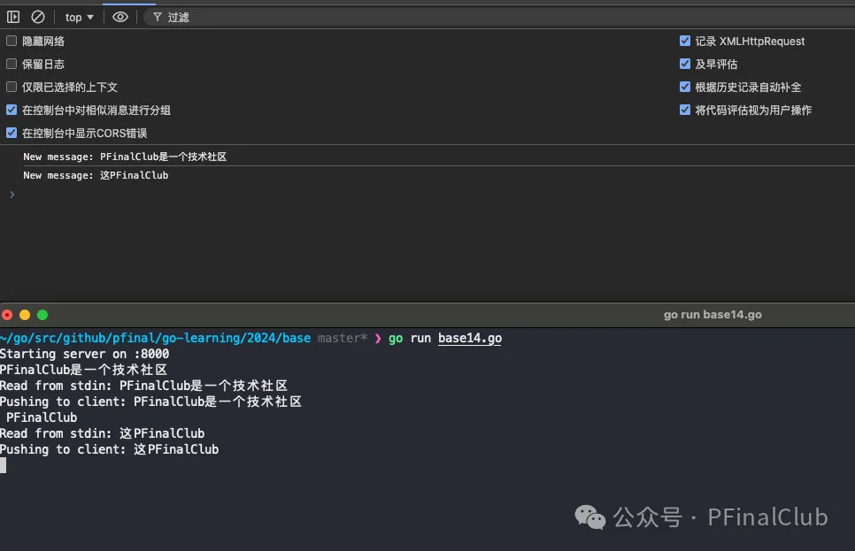

# 使用Go实现服务端事件推送SSE

## 背景

在对内部CRM项目进行优化时，我们发现项目中的站内信功能目前采用了WebSocket来实现消息推送。然而，对于站内信这种低频的推送场景来说，维护一个长连接的成本相对较高。WebSocket通常用于需要实时双向通信的应用，而我们需要的只是简单的单向推送。经过考虑，我们决定使用一种更轻量级的技术——Server-Sent Events（SSE）来实现站内信的推送。这种技术不仅可以减少服务器资源的消耗，还能简化实现过程。

## SSE 简介

Server-Sent Events（SSE）是一种允许服务器向浏览器推送实时更新的技术。与WebSocket不同，SSE是基于HTTP协议的，它通过在请求头中添加 Accept: text/event-stream 来标识这是一个SSE请求。SSE主要用于服务器向客户端单向推送事件，例如实时更新股票价格、社交媒体通知等。其优点在于实现简单、资源消耗低，尤其适合于低频率的事件推送。

## SSE与WebSocket 比较

### 1. 通信方式

- SSE 提供单向通信，即服务器向客户端推送数据，客户端无法直接向服务器发送数据。
- WebSocket 提供双向通信，允许服务器和客户端之间进行实时的数据交换。

### 2. 协议

- SSE 是通过标准的HTTP协议实现的，适合于大多数Web应用程序的需求。
- WebSocket 是一种独立的协议，需要在建立连接时进行协议升级。

### 3. 实现复杂度

- SSE 的实现相对简单，服务器只需维持一个HTTP连接即可推送数据。
- WebSocket 的实现较为复杂，涉及到协议握手和连接维护等操作。

### 4. 数据传输

- SSE 仅支持文本数据的传输，不支持二进制数据。
- WebSocket 支持传输文本数据和二进制数据，适用于更复杂的应用场景。

### 5. 连接限制

- SSE 的连接数受限于浏览器的限制，通常在6到10个连接之间。
- WebSocket 的连接限制较少，但管理多个WebSocket连接仍需额外的资源。

#### SSE与Websocket 相比较：

- SSE 提供单向通信，Websocket 提供双向通信；
- SSE 是通过 HTTP 协议实现的，Websocket 是单独的协议；
- 实现上来说 SSE 比较容易，Websocket 复杂一些；
- SSE 有最大连接数限制；
- WebSocket可以传输二进制数据和文本数据，但SSE只有文本数据；

## SSE与长轮询

长轮询是一种通信方法，由客户端定期访问服务器获取新数据；

当正在构建的应用程序涉及手工操作或执行计算量大的任务时，通常使用这种形式的通信；

例如，触发机器学习模型的训练，此时需要很长时间才能完成；在这种情况下，可能不需要经常检查这些任务的完成情况；

而SSE通常用于快速生成事件的应用程序中，例如，在YouTube视频上托管喜欢的实时计数，在UI上显示服务器日志文件或将通知推送到用户的电话，所有这些事件都近似于即时更新；

## 实现

以下是使用Golang实现SSE的基本步骤。

#### 实现步骤

##### 服务端

1. 创建HTTP服务器：使用Golang的net/http包创建一个简单的HTTP服务器。
2. 设置SSE响应头：在响应中设置适当的Content-Type，并确保连接保持打开状态。
3. 发送事件数据：持续向客户端发送数据，使用特定的格式，`data: <message>`。
4. 保持连接：确保连接持续，以便服务器可以持续推送更新。

```go
package main

import (
	"bufio"
	"fmt"
	"net/http"
	"os"
)

func SSEHandler(w http.ResponseWriter, r *http.Request) {
	// 设置SSE相关的响应头
	w.Header().Set("Content-Type", "text/event-stream")
	w.Header().Set("Cache-Control", "no-cache")
	w.Header().Set("Connection", "keep-alive")
	w.Header().Set("Access-Control-Allow-Origin", "*")

	// 检查是否支持Flush
	flusher, ok := w.(http.Flusher)
	if !ok {
		http.Error(w, "Streaming unsupported!", http.StatusInternalServerError)
		return
	}

	// 创建一个通道，用于将输入的数据发送到SSE
	inputChan := make(chan string)

	// 启动一个Goroutine来读取标准输入并发送到通道
	go func() {
		scanner := bufio.NewScanner(os.Stdin)
		for scanner.Scan() {
			text := scanner.Text()
			fmt.Println("Read from stdin:", text) // 输出读取到的内容
			inputChan <- text
		}
		close(inputChan)
	}()

	// 监听通道中的数据并推送到客户端
	for {
		select {
		case msg, ok := <-inputChan:
			if !ok {
				// 通道关闭，结束SSE
				fmt.Fprint(w, "data: Connection closed\n\n")
				flusher.Flush()
				return
			}
			fmt.Println("Pushing to client:", msg) // 输出即将推送的内容
			_, err := fmt.Fprintf(w, "data: %s\n\n", msg)
			if err != nil {
				// 推送失败，可能是客户端断开了连接
				fmt.Println("Client disconnected:", err)
				return
			}
			flusher.Flush()
		}
	}
}

func main() {
	http.HandleFunc("/events", SSEHandler)

	fmt.Println("Starting server on :8000")
	err := http.ListenAndServe(":8000", nil)
	if err != nil {
		fmt.Println("Error starting server:", err)
	}
}
```

##### 客户端

```js
const eventSource = new EventSource("http://localhost:8080/events");  
  
eventSource.onmessage = function(event) {  
  console.log("New message:", event.data);  
};  
  
eventSource.onerror = function() {  
  console.error("Error occurred while receiving events.");  
};
```

##### 效果如下图



通过开源库**eventsource** 直接支持了SSE，使用这个库构建服务器

##### 使用开源库

```go
package main  
  
import (  
    "fmt"  
    "log"  
    "net/http"  
    "time"  
  
    "gopkg.in/antage/eventsource.v1"  
)  
  
func main() {  
    es := eventsource.New(nil, nil)  
    defer es.Close()  
  
    http.Handle("/", http.FileServer(http.Dir("./public")))  
    http.Handle("/events", es)  
    go func() {  
        for {  
            // 每2秒发送一条当前时间消息，并打印对应客户端数量  
            es.SendEventMessage(fmt.Sprintf("hello, now is: %s", time.Now()), "", "")  
            log.Printf("Hello has been sent (consumers: %d)", es.ConsumersCount())  
            time.Sleep(2 * time.Second)  
        }  
    }()  
  
    log.Println("Open URL http://localhost:8080/ in your browser.")  
    err := http.ListenAndServe(":8080", nil)  
    if err != nil {  
        log.Fatal(err)  
    }  
}
```

**注意**

- SSE的连接限制：每个浏览器对SSE连接数有一定的限制，通常在6到10个之间。
- 超时处理：需要确保服务器不会超时关闭连接，同时客户端可能需要处理重新连接的逻辑。

## 总结

通过将站内信推送从WebSocket切换到SSE，我们能够实现更高效的低频推送。SSE的简单实现和低资源消耗使其成为处理此类场景的理想选择。未来，如果有更多的优化需求或技术挑战，持续探索和调整将是提升系统性能和用户体验的关键。