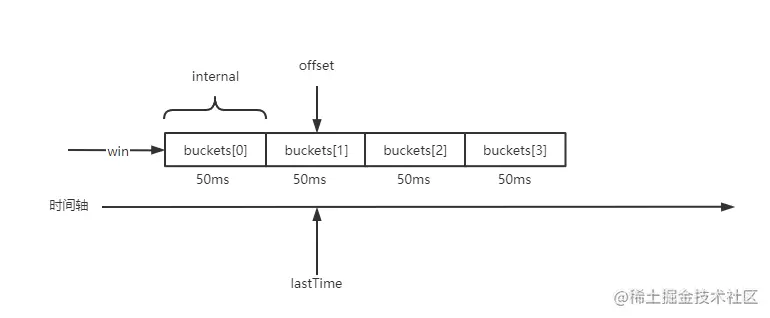

# 滑动窗口设计实现

> 文章节选自：[go-zero服务治理-自适应熔断器](https://juejin.cn/post/7028536954262126605)

## 滑动窗口设计

滑动窗口属于比较通用的数据结构，常用于最近一段时间内的行为数据统计。

它的实现非常有意思，尤其是如何模拟窗口滑动过程。先来看滑动窗口的结构体定义：

```go
RollingWindow struct {
	//互斥锁
	lock sync.RWMutex
	
	//滑动窗口数量
	size int
	
	//窗口，数据容器
	win *window
	
	//滑动窗口单元时间间隔
	interval time.Duration
	
	//游标，用于定位当前应该写入哪个bucket
	offset int
	
	//汇总数据时，是否忽略当前正在写入桶的数据
	//某些场景下因为当前正在写入的桶数据并没有经过完整的窗口时间间隔
	//可能导致当前桶的统计并不准确
	ignoreCurrent bool
	
	//最后写入桶的时间
	//用于计算下一次写入数据间隔最后一次写入数据的之间
	//经过了多少个时间间隔
	lastTime      time.Duration 
}
```



`window` **是数据的实际存储位置，其实就是一个数组，提供向指定 offset 添加数据与清除操作**。 **数组里面按照 internal 时间间隔分隔成多个 bucket。**

```go
//时间窗口
type window struct {
	//桶
	//一个桶标识一个时间间隔
	buckets []*Bucket
	//窗口大小
	size int
}

//添加数据
//offset - 游标，定位写入bucket位置
//v - 行为数据
func (w *window) add(offset int, v float64) {
	w.buckets[offset%w.size].add(v)
}

//汇总数据
//fn - 自定义的bucket统计函数
func (w *window) reduce(start, count int, fn func(b *Bucket)) {
	for i := 0; i < count; i++ {
		fn(w.buckets[(start+i)%w.size])
	}
}

//清理特定bucket
func (w *window) resetBucket(offset int) {
	w.buckets[offset%w.size].reset()
}

//桶
type Bucket struct {
	//当前桶内值之和
	Sum float64
	//当前桶的add总次数
	Count int64
}

//向桶添加数据
func (b *Bucket) add(v float64) {
	//求和
	b.Sum += v
	//次数+1
	b.Count++
}

//桶数据清零
func (b *Bucket) reset() {
	b.Sum = 0
	b.Count = 0
}
```

`window` 添加数据：

1. 计算当前时间距离上次添加时间经过了多少个 时间间隔，实际上就是过期了几个 bucket。
2. 清理过期桶的数据
3. 更新 offset，更新 offset 的过程实际上就是在模拟窗口滑动
4. 添加数据


```go
// 添加数据
func (rw *RollingWindow) Add(v float64) {
	rw.lock.Lock()
	defer rw.lock.Unlock()
	//获取当前写入的下标
	rw.updateOffset()
	//添加数据
	rw.win.add(rw.offset, v)
}

//计算当前距离最后写入数据经过多少个单元时间间隔
//实际上指的就是经过多少个桶
func (rw *RollingWindow) span() int {
	offset := int(timex.Since(rw.lastTime) / rw.interval)
	if 0 <= offset && offset < rw.size {
		return offset
	}
	//大于时间窗口时 返回窗口大小即可
	return rw.size
}

//更新当前时间的offset
//实现窗口滑动
func (rw *RollingWindow) updateOffset() {
	//经过span个桶的时间
	span := rw.span()
	//还在同一单元时间内不需要更新
	if span <= 0 {
		return
	}
	offset := rw.offset
	//既然经过了span个桶的时间没有写入数据
	//那么这些桶内的数据就不应该继续保留了，属于过期数据清空即可
	//可以看到这里全部用的 % 取余操作，可以实现按照下标周期性写入
	//如果超出下标了那就从头开始写，确保新数据一定能够正常写入
	//类似循环数组的效果
	for i := 0; i < span; i++ {
		rw.win.resetBucket((offset + i + 1) % rw.size)
	}
	//更新offset
	rw.offset = (offset + span) % rw.size
	now := timex.Now()
	//更新操作时间
	//这里很有意思
	rw.lastTime = now - (now-rw.lastTime)%rw.interval
}
```

`window` 统计数据：

```go
//归纳汇总数据
func (rw *RollingWindow) Reduce(fn func(b *Bucket)) {
	rw.lock.RLock()
	defer rw.lock.RUnlock()

	var diff int
	span := rw.span()
	//当前时间截止前，未过期桶的数量
	if span == 0 && rw.ignoreCurrent {
		diff = rw.size - 1
	} else {
		diff = rw.size - span
	}
	if diff > 0 {
		//rw.offset - rw.offset+span之间的桶数据是过期的不应该计入统计
		offset := (rw.offset + span + 1) % rw.size
		//汇总数据
		rw.win.reduce(offset, diff, fn)
	}
}
```

## 产品应用

### googleBreaker 结构体定义

```go
type googleBreaker struct {
	//敏感度，go-zero中默认值为1.5
	k float64
	//滑动窗口，用于记录最近一段时间内的请求总数，成功总数
	stat *collection.RollingWindow
	//概率生成器
	//随机产生0.0-1.0之间的双精度浮点数
	proba *mathx.Proba
}
```

可以看到熔断器属性其实非常简单，数据统计采用的是滑动时间窗口来实现。

### 熔断判断

1. 收集滑动窗口内的统计数据
2. 计算熔断概率

```go
//按照最近一段时间的请求数据计算是否熔断
func (b *googleBreaker) accept() error {
	//获取最近一段时间的统计数据
	accepts, total := b.history()
	//计算动态熔断概率
	weightedAccepts := b.k * float64(accepts)
	// https://landing.google.com/sre/sre-book/chapters/handling-overload/#eq2101
	dropRatio := math.Max(0, (float64(total-protection)-weightedAccepts)/float64(total+1))
	//概率为0，通过
	if dropRatio <= 0 {
		return nil
	}
	//随机产生0.0-1.0之间的随机数与上面计算出来的熔断概率相比较
	//如果随机数比熔断概率小则进行熔断
	if b.proba.TrueOnProba(dropRatio) {
		return ErrServiceUnavailable
	}

	return nil
}
```

### 熔断逻辑实现

#### 熔断器对外暴露两种类型的方法

1. 简单场景直接判断对象是否被熔断，执行请求后必须需手动上报执行结果至熔断器。

```go
func (b *googleBreaker) allow() (internalPromise, error)
```

2. 复杂场景下支持自定义快速失败，自定义判定请求是否成功的熔断方法，自动上报执行结果至熔断器。

```go
func (b *googleBreaker) doReq(req func() error, fallback func(err error) error, acceptable Acceptable) error
```

- `Acceptable` : 参数目的是自定义判断请求是否成功。`Acceptable func(err error) bool`

#### 完整实现

```go
//熔断方法
//返回一个promise异步回调对象，可由开发者自行决定是否上报结果到熔断器
func (b *googleBreaker) allow() (internalPromise, error) {
	if err := b.accept(); err != nil {
		return nil, err
	}

	return googlePromise{
		b: b,
	}, nil
}

//熔断方法
//req - 熔断对象方法
//fallback - 自定义快速失败函数，可对熔断产生的err进行包装后返回
//acceptable - 对本次未熔断时执行请求的结果进行自定义的判定，比如可以针对http.code,rpc.code,body.code
func (b *googleBreaker) doReq(req func() error, fallback func(err error) error, acceptable Acceptable) error {
	//判定是否熔断
	if err := b.accept(); err != nil {
		//熔断中，如果有自定义的fallback则执行
		if fallback != nil {
			return fallback(err)
		}

		return err
	}
	//如果执行req()过程发生了panic，依然判定本次执行失败上报至熔断器
	defer func() {
		if e := recover(); e != nil {
			b.markFailure()
			panic(e)
		}
	}()
	//执行请求
	err := req()
	//判定请求成功
	if acceptable(err) {
		b.markSuccess()
	} else {
		b.markFailure()
	}

	return err
}

//上报成功
func (b *googleBreaker) markSuccess() {
	b.stat.Add(1)
}

//上报失败
func (b *googleBreaker) markFailure() {
	b.stat.Add(0)
}

//统计数据
func (b *googleBreaker) history() (accepts, total int64) {
	b.stat.Reduce(func(b *collection.Bucket) {
		accepts += int64(b.Sum)
		total += b.Count
	})

	return
}
```