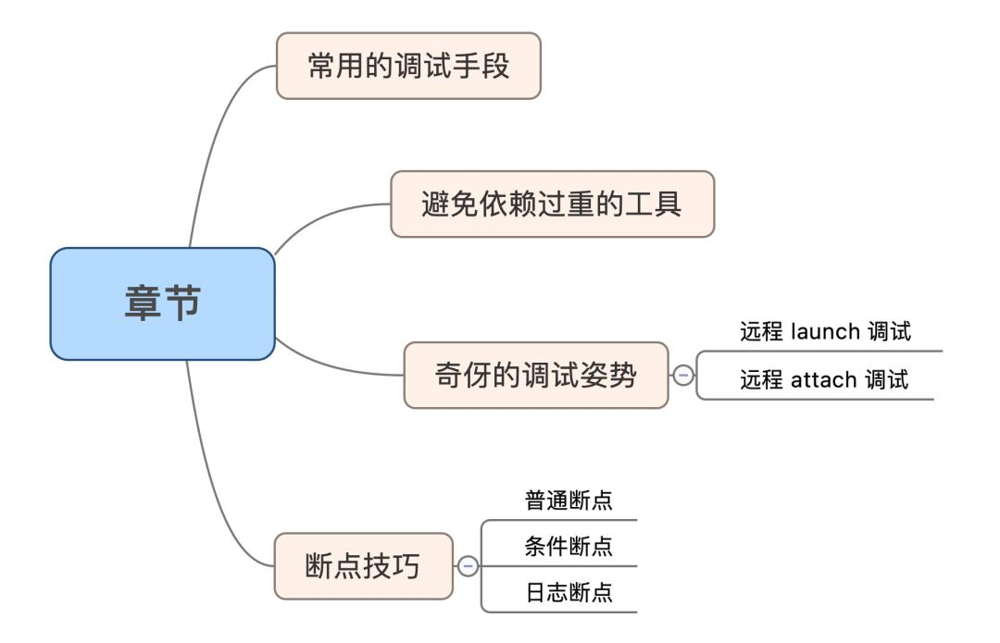
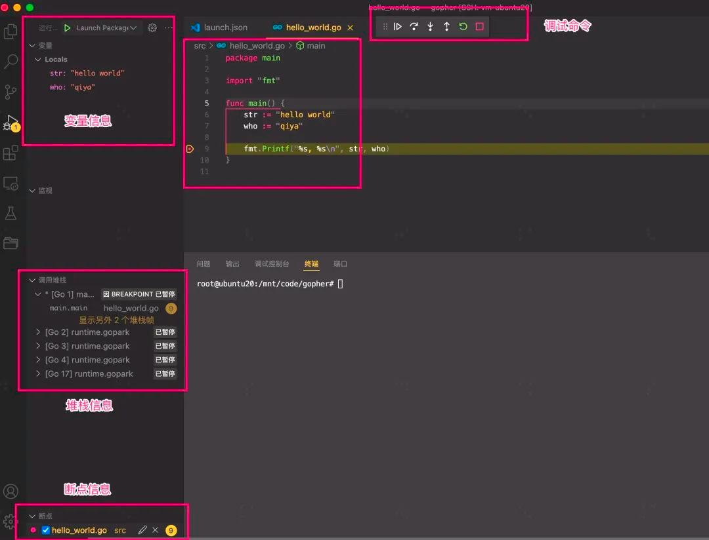
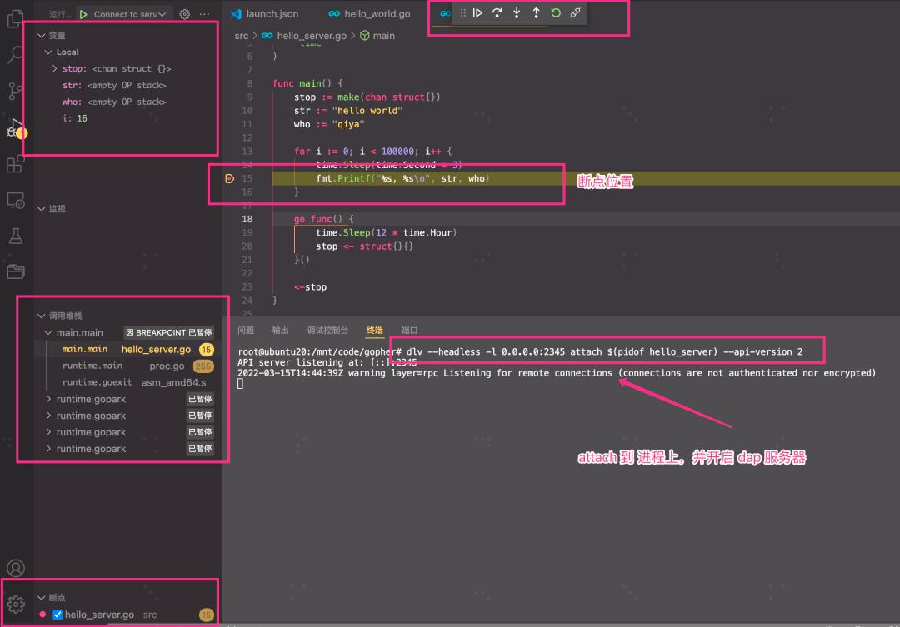

# VsCode 调试技巧｜程序不是写出来的？是调出来的！




## 常用的调试手段


作为程序猿的我可太清楚调试的重要性了，有一句话说的很对：程序不是写出来的，是调出来的。调试的方法很多，比如朴实的日志打印，打点的计量统计（比如 golang 的 pprof 信息），还有无侵入式的单点调试。

在 c/c++ 我们最常用的是 gdb 调试，这是必备技能。在 golang 里面，我经常用的是 dlv 调试，用来分析程序的底层逻辑。奇伢的调试姿势通常有三种：

- 先 go build 编译，出二进制文件，然后用 dlv exec 来调试；
- 程序已经跑在测试环境，dlv attach 调试；
- 程序出 core 了，dlv core 调试；

个人还是挺习惯这种较为最原始的方式来调试程序。

## 避免依赖过重的工具？

IDE 提供了非常方便的调试功能，比如 goland 的调试功能，但 IDE 封装的过于严重，并且调试界面的实现各有不同，虽然提供了便捷，但是它对程序猿几乎相当于黑盒。一旦遇到点调试的问题，很难梳理清楚。并且当切换环境的时候经常要重新配置复杂的配置。

奇伢个人尽量强避免依赖这些 IDE 的特有的调试功能的，黑盒不透明是一个原因，第二个原因是类似 goland 这种商业付费的软件，License 经常过期，在换电脑或平台的时候，各种不同的付费策略导致这些软件使用很纠结。并且太过依赖它，却不知dlv 通用的调试技能，会导致**工具的迁移成本过高**。

那奇伢是一定要沉浸在终端调试的美梦中吗？

那不是，奇伢不排斥任何工具，只要你能完全掌控它即可。今天奇伢要分享一点关于 vscode 的调试姿势，个人觉得是比较适合我的预期的：

- 很透明，让用户有种掌控的感觉；
- 姿势通用，不会让你只能依赖于 vscode ，还是 dlv 的用法；
- 工具全平台可用，windows，mac，linux ，调试姿势完全一样；

**vscode 只作为一个界面，还是最基本的 gdb 或者 dlv 调试，这个过程让你看得到。**


## 奇伢的调试姿势

Go 程序用的最多的还是 dlv 调试，现在有了 vscode ，感觉是有了一个新的体验。本质上还是 dlv 调试。我们先捋一捋调试的思路，按照模式分为两大类来讲：

- 调试二进制文件：先编译，后调试，对应 launch 调试；
- 调试运行进程：调试正在运行的进程，对应 attach 调试；

如果按照代码位置再区分 local 还是 remote ，那么姿势就可以分为：

- 本地 launch 调试：vscode 在本机，代码在本地，二进制在本地；
- 本地 attach 调试：vscode 在本机，代码在本地，进程在本地；
- 远程 lanuch 调试：vscode 在本机，代码远端，二进制在远端；
- 远程 attach 调试：vscode 在本机，代码在本地，二进制在远端；

下面分别举两个最典型的栗子，远程开发 launch 调试和远程 attach 调试，来看看奇伢是怎么配置调试的吧。

### 远程开发调试 launch

演示的场景：vscode 在本地，代码在远端，二进制在远端。

这种方式本质是先编译，后调试。先编译出二进制文件，然后进行运行这个二进制文件进行调试。怎么得到这个二进制？

有两种方式：

- 让 vscode 编译出你的二进制文件，通过配置 `task.json` 这个文件，定义你的编译规则；
- 还有一种方式，就是纯粹靠你自己来编译出二进制，比如你写了个 `Makefile`  或者 `go build` 出你的二进制；

只要有个二进制，我们就能调试。这个对应了我常用的 dlv exec 的方式。vscode 调试首先创建一个 `.vscode/launch.json`  的配置文件：

```js
{
    // 自定义名字
    "name": "Launch file",
    // 调试的程序类型
    "type": "go",
    // 调试类型（调试二进制）
    "request": "launch",
    // 调试类型
    "mode": "debug",
    // 调试的程序
    "program": "${file}"
}
```

上面的配置好后，打开你的主程序（ `main.go` ）文件，给你的文件设置个断点，点击左侧的运行调试按钮。就能让 vscode 先编译，后调试，并且停顿再断点出。

> vscode 会编译出一个二进制文件 __debug_binxxx ，然后 debug 这个文件，并且 dlv dap 也会启动一个 dap server，用于和 vscode 链接

示例如图：



这个太简单了，几乎没有任何障碍。

### 远程调试 attach

**演示的场景：vscode 在本地，代码在本地，进程在远端。** 这种场景说白了就是：我代码在本地，进程在线上。

因为奇伢是做后端开发的，平时开发的程序都是守护进程，那么 attach 这种方式是更通用的方式。往往就是进程正在运行，我们再去调试。gdb 和 dlv 都具备 attach 这种能力。这种场景，是经常在调试线上的守护程序来的。

如果是本地终端用这种方式调试：

```bash
dvl attach <pid>
```

假设，当前我们进程跑在线上：

- 在某台测试机器上，程序已经跑起来了，机器上没有代码；
- 我们本地有版本一致的代码，用 vscode 打开着；

你想要调试它，怎么办？

**第一种方法：可以 ssh 到远端机器，然后 dlv 去调试。对比着本地的代码设置断点，进行调试。相对来讲比较麻烦。**

假设，如果能用本地的代码加上远端的 dlv ，无缝联合起来，同步调试？岂不是完美。

**vscode 支持这种方式！** 使用的是 dlv 的 dap 功能，远端机器上用 dlv attach 到对应进程，且开一个 dap server 监听端口，本地 vscode 去连接这个端口。它们之间的通信使用 DAP 协议走网络传输，从而实现远程的 attach 调试。

下面来看一下具体演示步骤吧。

#### 步骤一：远程拉起进程

这个很简单，后端开发，守护进程才是最常见的场景。

```bash
# 自己的进程自己拉。假设进程号是 7488 
./hello_server
```

 #### 步骤二：dlv dap 服务器

开启一个 dap 服务器，并且 dlv attach 到对应的进程上，并启动 dap 服务器；

```bash
dlv --headless -l 0.0.0.0:2345 attach 7488 --api-version 2
```

**解释：**
- 7488 是 hello_server 的进程号
- dlv 其实随便在哪个目录执行都可以
- 注意声明 --api-version 2

 #### 步骤三：vscode 客户端配置

这个作为 dap 客户端，配置和 dlv dap 服务器的联通即可。

```js
"configurations": [
 {
  // 自定义，名字，看起来有意义就行，用来给你选的；
  "name": "Connect to server",
  // 调试的是 go 程序
  "type": "go",
  // attach 进程的方式
  "request": "attach",
  // 远程调试
  "mode": "remote",
  // 注意！！非常关键，这是能否成功设置断点的关键参数。
  "remotePath": "{编译的项目路径}",
  // dlv server 启动的端口
  "port": 2345,
  // 远程主机的 IP
  "host": "192.168.56.12"
 }
]
```

强调 remotePath 这个参数，这个参数非常关键，是你能否远程断点成功的关键。它并不是进程当前的目录，也不是本地项目的代码目录，而是**编译二进制的项目目录**。

**举个栗子：**
加入 hello_server 这个进程是在 /root/code/ 这个目录编译的，那么 remotePath 目录填的这个。后面 hello_server 放到其他任意目录运行都和 remotePath 没关系。


 #### 步骤四：运行调试

设置断点，发一个请求，就可以调试了。演示效果：



## 断点技巧

vscode 能打的断点有三种：

- 普通断点，运行到了就会停住；
- 条件断点，满足条件才会停住；
- 日志断点，运行到了只打印，不停；


### Breakpoint

普通断点，这是最常见的断点，提前设置到代码某个位置，运行到了就会停在对应位置。

### Conditional Breakpoint

条件断点。满足条件才会断住，这个可以更精准的调试。这个表达式是语言本身的表达式即可：比如 c++ ：

```c++
tag == 2
````

tag 是 c++ 的一个整形变量。


#### Logpoint

日志打印，不断点。很实用的技巧，只要路过就会打印一行信息。适用于不适合暂停调试的程序。比如可以输入：

```bash
result is {result.code()}
```

result 是 c++ 的一个 class 变量，code 是它的方法。


## Debug Console

程序断点打住之后，我们还可以交互（就和 gdb，dlv 一样，手动输入命令），可以输入命令前缀 -exec 。比如，反汇编：

```bash
-exec disassemble
```

打印寄存器：

```bash
-exec print $rip
```

想知道全部命令，可以 help 一下：

```bash
-exec help
```

## 总结

- 调试的两大类 **launch 调试和 attach 调试**，开发过程 launch 模式可能占多数，但是测试过程，attach 模式可能才是多数的需求；
- 使用 dlv dap 开启一个 dap server，这样让编辑器或者 IDE 都能够**通过网络介入调试**；
- vscode 调试只是作为一个客户端，**代码在本地，程序在远端**，用 vscode 拉通起来，完美体验；
- 远程 attach 调试其实不需要远端有代码哦，这个记住了，**remotePath** 参数是关键；
- 除了普通断点，条件断点和日志断点真的挺有用的；