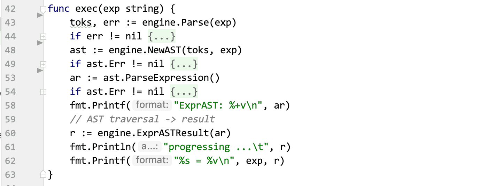
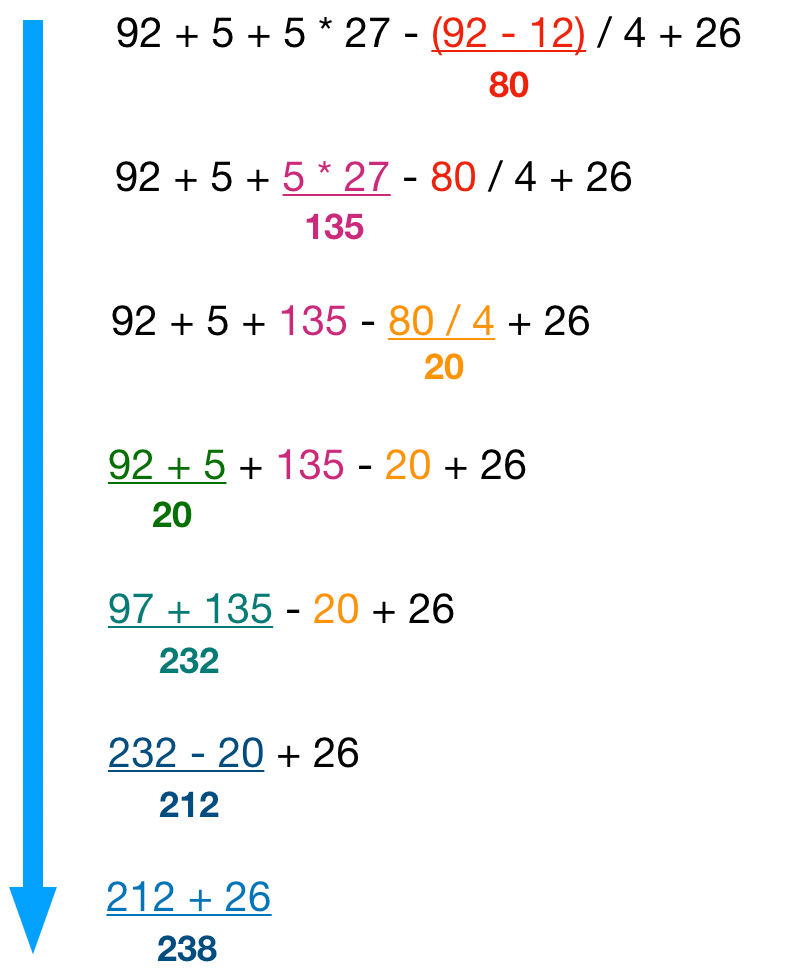
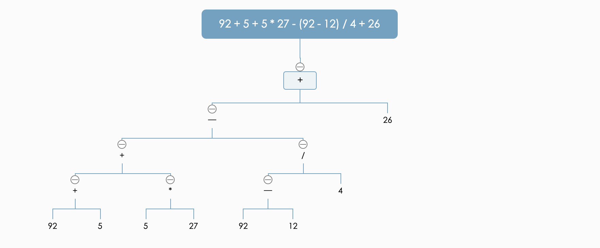

# 用 Go 实现一个完整的数学表达式计算引擎



## 导读
这篇文章将从头开始，使用 `Go` 语言来实现一个完整的数学表达式计算引擎。本文采用的是抽象语法树（`Abstract Syntax Tree，AST`）实现方式。

虽然本文的实现代码为 Go，但不用纠结于此，语言只是实现方式的一种选择，作为开发工程师，相信你读起来它并不会感到费力。你完全可以在读完文章后，用 `C/C++`，`Rust` 或者任意你喜欢的语言来实现一遍，甚至，这是检验你学习成果的最佳方式。

文章的所有代码和编译后的二进制可执行文件都会放在 Github, 文章末尾附有链接。
那么，就让我们开始吧。

## 概述
我们来先做一道题数学题，计算下面的式子：

```
92 + 5 + 5 * 27 - (92 - 12) / 4 + 26
```

什么？没了？？就这么简单？？？( 是的，就这么简单 🤣

凭借个人实力，我觉得大家完全可以口算给出这道题的答案。但是，你并不会这么做，因为你觉得你是一名工程师，你要用你所擅长的代码来解决这个问题，以至于一发不可收，最后解决了这类问题。(我没有、我不想、别瞎说.jpg)

如果不往下看，停顿思考，你的实现思路是什么样的？每个人都会有一个自己的实现思路，事实上，解决这个问题的方法很多，没有必要拘泥于某一种算法。本文为了保证代码实现质量的同时，还能够阐述基础的语言处理结构，这里使用的是抽象语法树（Abstract Syntax Tree，AST，下称:AST）实现方式。使用抽象语法树还有一个目的，就是窥一斑而知全豹，让大家能了解脚本语言（典型的如PHP、Javascript）是如何动态解析执行的。

所以，看完本章，你会了解到：

- 词法分析，如何手写一个词法分析器
- 语法分析，如何手写一个语法分析器
- AST，如何构建一个AST
- 运算优先级算法的实现
- 执行一个 AST

## 题目分析思路

首先，我们先来分析一下这个题目。

```
92 + 5 + 5 * 27 - (92 - 12) / 4 + 26
```

根据小学学过的理论知识，我们知道：先乘除后加减，有括号最优先。所以在我们口算这道题的时候，我们的计算顺序应该是：

```
X = ( 92 - 12 ) = 80
Y = 5 * 27 = 135
Z = X / 4 = 80 / 4 = 20
原题 = 92 + 5 + Y - Z + 26 = 92 + 5 + 135 - 20 + 26 = 238
```

为了能够用代码实现这个算法，我们需要提炼出口算时的计算模式，或者说，计算的规律。有了规律，转换成代码实现就会很容易。

不知道你有没有注意到，我们口算解这道题的时候，并没有说一下子把题目解出来，而是对题目先做了分解，比如 `(92-12)`是第一步分解出来的，我们可以先计算这个小的子题，得出80这个结果后，再代入到原式中。这个思路正是上面说的”先乘除后加减，有括号最优先”的具体实践，也就是说，运算符是有优先级的，需要根据算式中优先级的高低，先分解优先级高的计算出来，然后计算优先级低的，而不是简单的从题目的起始一直计算到结尾。

很明显，在这道题中，`()`、的优先级最高，`*`、`/`的优先级次之，`+`、`-`的优先级最低。同一优先级可以从左到右顺序计算。
确立了优先级，我们就能根据上面的口算步骤，模拟一个算法流程：

1. 找出较高优先级的子算式 92-12,得出结果 80，代替92-12的位置；
2. 找出较高优先级的子算式 5*7,得出结果 35，代替5*7的位置；
3. 找出较高优先级的子算式 80/4,得出结果 20，代替80/4的位置；
4. 发现优先级都是一样的，可以顺序计算，依次计算得出结果238

图解如下：




模拟的算法流程有了，但是，emmm… 好像还是不知道该从哪里开始码代码，难道要一遍遍的遍历查找计算吗？不。

那就进一步分析这个流程，可以发现，在每一步的最后一个操作都是做一个简单的运算，然后得出结果，这个简单运算遵循 `number opeator number`，可以很明确的知道，这是一个二元运算，我们记作(`lhs op rhs`)。

!> lhs, left hand side 的缩写，意为左侧。rhs 同理。

所以，回过头，再来规划一下上面的题目和流程，可以总结出：计算一个数学表达式，本质上就是把表达式按照运算优先级分出二元运算、运算合并的过程。
有了这个认知后，我们就可以把这个问题跟我们的数据结构结合在一起，用某种或者多种数据结构来描述这个题目。在计算机中，该如何描述呢？我们可以先改进一下`lhs op rhs`, 把`op`提到最前面, 转化成`op lhs rhs`, 因为它们都是一个个二元运算，而每个二元运算都可以看做是一个Root为op，`LeftNode`为`lhs`，`RightNode`为`rhs`的二叉树（`Root=op LeftNode=lhs RightNode=rhs`），那么按照算法流程来构建一个二叉树就可以很好的表示这个题目。

最终，我们可以得出这张图：



整个待计算的表达式可以用二叉树来完美的表示。这是一个令人兴奋的事情，因为我们把一道数学问题成功的转化成了一道数据结构的算法问题，也就是说，我们只需要一种算法对这个二叉树求解，就能得出原算式的答案。事实上，这就是解决这道题的核心所在(不仅仅是这道数学运算题，把范围扩展到整个计算机领域都会适用)，一旦我们能够通过数据结构和算法描述现实问题，那么我们就可以利用计算机完成问题的映射，并且通过计算得出答案。

解决问题的思路有了，那我们就可以开始准备 Coding，实现我们说的数据结构。

## 词法分析

!> 词法分析：将字符序列转换为单词（Token）序列的过程。

为了能让计算机理解我们输入的字符串，我们需要对这个字符串做解析，那第一个阶段就是词法分析。
不要惊慌！即使你从来没接触过这类知识，这个小节也并不会出现让你感到晦涩难懂的地方。相信我！（其实，看完你会觉得很简单）

`92 + 5 + 5 * 27 - (92 - 12) / 4 + 26` 这个算式，对我们而言，有意义的字符/词是什么？我们来逐个拆解一下：

- `92` 有意义，因为它是数字，参与运算；
- `+` 有意义，因为它是操作符，参与运算；
- `5`, `+`, `5`, `*`, `27`, `-`, `92`, `-`, `12`, `/`, `4`, `+`, `26`都有意义，原因同上；
- `(`  有意义，它表示一个优先级开始；
- `)` 有意思，它表示一个优先级结束；

当我们把所有有意义的词拆解出来，那剩下的自然就是无意义的了。在这个式子中就是空格。

上面的这个拆解过程，我们就称之为`词法分析`。通俗的来讲，词法分析是将输入的字符串逐个分析，通过某种方式（一般是有限状态机）来识别有意义的字符，转化成相应的标记`Token`，无意义的字符直接忽略丢弃，最终得到一个全部是有意义的`Token`序列的过程。

上面我们提到了两种类型，一个是数字，一个是操作符（`()`我们也当做是操作符）,在代码中可以定义成常量，供接下来使用：

```go
const (
  // 字面量，e.g. 50
    Literal = iota
  // 操作符, e.g. + - * /
    Operator
)
```

定义好类型，我们接下来可以定义 Token：

```go
type Token struct {
  // 原始字符
    Tok  string
  // 类型，有 Literal、Operator 两种
    Type int
}
```

只要能够通过词法分析得到的 `Token`，都是有意义的，对于本文来讲，`Token`只有`Literal`, `Operator`两种类型，所以，接下来的扫描过程只需要处理这两种类型就行了。

词法分析的具体实现代码：

```go
// 定义一个结构体，描述一个词法分析器
type Parser struct {
  // 输入的字符串
    Source string
  // 扫描器当前所在的字符
    ch     byte
  // 扫描器当前所在的位置
    offset int
  // 扫描过程出现的错误收集
    err error
}

// 逐个字符扫描，得到一串 Token 序列
func (p *Parser) parse() []*Token {
    toks := make([]*Token, 0)
  // 一直获取下一个 Token
    for {
        tok := p.nextTok()
        if tok == nil {
      // 已经到达末尾或者出现错误时，停止
            break
        }
    // 收集 Token
        toks = append(toks, tok)
    }
    return toks
}

// 获取下一个 Token
func (p *Parser) nextTok() *Token {
  // 已经到达末尾或者出现错误
    if p.offset >= len(p.Source) || p.err != nil {
        return nil
    }
    var err error
  // 跳过所有无意义的空白符
    for p.isWhitespace(p.ch) && err == nil {
        err = p.nextCh()
    }
    start := p.offset
    var tok *Token
    switch p.ch {
  // 操作符
    case
        '(',
        ')',
        '+',
        '-',
        '*',
        '/',
        '^',
        '%':
        tok = &Token{
            Tok:  string(p.ch),
            Type: Operator,
        }
        tok.Offset = start
    // 前进到下一个字符
        err = p.nextCh()

  // 字面量(数字)
    case
        '0',
        '1',
        '2',
        '3',
        '4',
        '5',
        '6',
        '7',
        '8',
        '9':
        for p.isDigitNum(p.ch) && p.nextCh() == nil {
        }
        tok = &Token{
            Tok:  strings.ReplaceAll(p.Source[start:p.offset], "_", ""),
            Type: Literal,
        }
        tok.Offset = start

  // 捕获错误
    default:
        if p.ch != ' ' {
            s := fmt.Sprintf("symbol error: unkown '%v', pos [%v:]\n%s",
                string(p.ch),
                start,
                ErrPos(p.Source, start))
            p.err = errors.New(s)
        }
    }
    return tok
}

// 前进到下一个字符
func (p *Parser) nextCh() error {
    p.offset++
    if p.offset < len(p.Source) {
        p.ch = p.Source[p.offset]
        return nil
    }
  // 到达字符串末尾
    return errors.New("EOF")
}

// 空白符
func (p *Parser) isWhitespace(c byte) bool {
    return c == ' ' ||
        c == '\t' ||
        c == '\n' ||
        c == '\v' ||
        c == '\f' ||
        c == '\r'
}

// 数字
func (p *Parser) isDigitNum(c byte) bool {
    return '0' <= c && c <= '9' || c == '.' || c == '_' || c == 'e'
}

// 对错误包装，进行可视化展示
func ErrPos(s string, pos int) string {
    r := strings.Repeat("-", len(s)) + "\n"
    s += "\n"
    for i := 0; i < pos; i++ {
        s += " "
    }
    s += "^\n"
    return r + s + r
}
```

为了方便调用，我们封装一下这个`Parser`结构体，通过一个函数来把它变成一个黑箱，简化流程：

```go
// 封装词法分析过程，直接调用该函数即可解析字符串为[]Token
func Parse(s string) ([]*Token, error) {
  // 初始化 Parser
    p := &Parser{
        Source: s,
        err:    nil,
        ch:     s[0],
    }
  // 调用 parse 方法
    toks := p.parse()
    if p.err != nil {
        return nil, p.err
    }
    return toks, nil
}
```

现在我们只需要调用 `Parse` 函数，就能够对任意字符串进行分析，得到一串 `Token` 序列。

至此，我们所有的词法分析的代码全部就完成了。这短短不到100行代码，我们就得到了一个可以工作的很好的词法分析器，它能够处理目前我们需要计算数学表达式的输入字符串。（放大一下视角，在编译器领域，对于源代码的第一阶段的词法分析，和我们现在写的代码并没什么两样，只不过是它们的类型更多，逻辑更复杂而已。这种通过有限状态机的方式来写，虽然会比较繁琐、代码量多，但是贵在逻辑很清楚，大多数语言会用这种算法来实现）

有了 `Token` 序列是没有什么卵用的，我们的目的是求解。接下来我们要用它来进行下一阶段：语法分析和构建一个 AST。

## 语法分析、构建 AST

!> 语法分析：在词法分析的基础上将单词`Token`序列组合成各类语法短语, 判断源代码在结构上是否正确。

拿到一串 `Token` 序列，把它当做一个输入，由一个函数去执行，然后得到一个检查结果，这个就是语法分析阶段要做的事情，这个函数就是语法分析器。语法分析器得出的结果是对我们输入的整个字符串在语法上的检查结果，它能够告诉我们，这个输入的字符串内容是否能够被识别格式化为下一个阶段目标（这里的目标是构建一个 AST ），举个例子：

?> `1+2+3+4+5` >>>>词法分析>>>>语法分析>>>>无错误>>>>AST <br />
`1+2+(3-4` >>>>词法分析>>>>语法分析>>>>出错,`4`之后应该要有一个操作符，可能是`)`或者`+//*`等等

可以看出，语法分析阶段是我们能够确定是否可以继续进行求解很重要的一步。有了它，原始输入的算式字符串才有转成计算机所能理解的数据结构的可能。一般来讲，语法分析不仅仅孤立存在于本身的语法语义检查，他还会产生一个数据结构，这个数据结构通常是一个语法树。要注意的是，并不是只有完全的语法分析通过才会产生这个数据结构，部分语法通过也可以有这个数据结构，具体要看你的语法分析器的宽容度，也就是纠错能力。说的比较抽象，我们来看个例子：

输入 `1+2+3 0 5 06 9*4`，词法分析通过，然后到语法分析，很明显整个算式是无法通过语法检查的，但是语法分析器可以只解析到正确的部分 `1+2+3`，然后返回一个`1+2+3`的语法树结构，这样即使语法没通过，但是也能得到一个语法树结构。

就目前的问题而言，我们可以在语法分析阶段生成一个 AST, 用这个 AST 描述数学表达式，就像做思路分析里的这张图一样：


根据这张图，先定义用到的两个 AST 节点:

```go
// 基础表达式节点接口
type ExprAST interface {
    toStr() string
}

// 数字表达式节点
type NumberExprAST struct {
    // 具体的值
    Val float64
}

// 操作表达式节点
type BinaryExprAST struct {
    // 操作符
    Op string
    // 左右节点，可能是 数字表达式节点/操作表达式节点/nil
    Lhs,
    Rhs ExprAST
}

// 实现接口
func (n NumberExprAST) toStr() string {
    return fmt.Sprintf(
        "NumberExprAST:%s",
        strconv.FormatFloat(n.Val, 'f', 0, 64),
    )
}

// 实现接口
func (b BinaryExprAST) toStr() string {
    return fmt.Sprintf(
        "BinaryExprAST: (%s %s %s)",
        b.Op,
        b.Lhs.toStr(),
        b.Rhs.toStr(),
    )
}
```

解析数学表达式这类问题，只需要 `NumberExprAST` 和 `BinaryExprAST` 这两个节点就可以了。原因词法分析阶段已经说过的，只有 `Literal`、`Operator` 两种类型。

定义基础的 AST 结构：

```go
// AST 生成器结构体
type AST struct {
    // 词法分析的结果
    Tokens []*Token
    // 源字符串
    source    string
    // 当前分析器分析的 Token
    currTok   *Token
    // 当前分析器的位置
    currIndex int
    // 错误收集
    Err error
}
```

下面开始实现语法分析和构建 AST 的核心代码：

```go
// 定义操作符优先级，value 越高，优先级越高
var precedence = map[string]int{"+": 20, "-": 20, "*": 40, "/": 40, "%": 40, "^": 60}

// 语法分析器入口
func (a *AST) ParseExpression() ExprAST {
    lhs := a.parsePrimary()
    return a.parseBinOpRHS(0, lhs)
}

// 获取下一个 Token
func (a *AST) getNextToken() *Token {
    a.currIndex++
    if a.currIndex < len(a.Tokens) {
        a.currTok = a.Tokens[a.currIndex]
        return a.currTok
    }
    return nil
}

// 获取操作优先级
func (a *AST) getTokPrecedence() int {
    if p, ok := precedence[a.currTok.Tok]; ok {
        return p
    }
    return -1
}

// 解析数字，并生成一个 NumberExprAST 节点
func (a *AST) parseNumber() NumberExprAST {
    f64, err := strconv.ParseFloat(a.currTok.Tok, 64)
    if err != nil {
        a.Err = errors.New(
            fmt.Sprintf("%v\nwant '(' or '0-9' but get '%s'\n%s",
                err.Error(),
                a.currTok.Tok,
                ErrPos(a.source, a.currTok.Offset)))
        return NumberExprAST{}
    }
    n := NumberExprAST{
        Val: f64,
    }
    a.getNextToken()
    return n
}

// 获取一个节点，返回 ExprAST
// 这里会处理所有可能出现的类型，并对相应类型做解析
func (a *AST) parsePrimary() ExprAST {
    switch a.currTok.Type {
    case Literal:
        return a.parseNumber()
    case Operator:
        // 对 () 语法处理
        if a.currTok.Tok == "(" {
            a.getNextToken()
            e := a.ParseExpression()
            if e == nil {
                return nil
            }
            if a.currTok.Tok != ")" {
                a.Err = errors.New(
                    fmt.Sprintf("want ')' but get %s\n%s",
                        a.currTok.Tok,
                        ErrPos(a.source, a.currTok.Offset)))
                return nil
            }
            a.getNextToken()
            return e
        } else {
            return a.parseNumber()
        }
    default:
        return nil
    }
}

// 循环获取操作符的优先级，将高优先级的递归成较深的节点
// 这是生成正确的 AST 结构最重要的一个算法，一定要仔细阅读、理解
func (a *AST) parseBinOpRHS(execPrec int, lhs ExprAST) ExprAST {
    for {
        tokPrec := a.getTokPrecedence()
        if tokPrec < execPrec {
            return lhs
        }
        binOp := a.currTok.Tok
        if a.getNextToken() == nil {
            return lhs
        }
        rhs := a.parsePrimary()
        if rhs == nil {
            return nil
        }
        nextPrec := a.getTokPrecedence()
        if tokPrec < nextPrec {
            // 递归，将当前优先级+1
            rhs = a.parseBinOpRHS(tokPrec+1, rhs)
            if rhs == nil {
                return nil
            }
        }
        lhs = BinaryExprAST{
            Op:  binOp,
            Lhs: lhs,
            Rhs: rhs,
        }
    }
}
```

`parseBinOpRHS` 是一个非常重要的算法，他根据定义的操作符优先级进行高优先级递归，从而使高优先级的节点具有更深的 AST 节点，这样，我们遍历 AST 的时候就会天然的进行高优先级的计算。（这是一个成熟的算法，更多的细节可以阅读这篇 Wiki [Operator-precedence_parser](https://en.wikipedia.org/wiki/Operator-precedence_parser)）。

同样，为了便于调用，我们封装一下生成 AST 的方法：

```go
// 生成一个 AST 结构指针
func NewAST(toks []*Token, s string) *AST {
    a := &AST{
        Tokens: toks,
        source: s,
    }
    if a.Tokens == nil || len(a.Tokens) == 0 {
        a.Err = errors.New("empty token")
    } else {
        a.currIndex = 0
        a.currTok = a.Tokens[0]
    }
    return a
}
```

OK！所有的语法分析和 AST 构建的代码都已经完成了。你现在可以通过下面的代码来尝试查看生成的 AST 结构：

```go
func main() {
    exp := "92 + 5 + 5 * 27 - (92 - 12) / 4 + 26"
    // input text -> []token
    toks, err := Parse(exp)
    if err != nil {
        fmt.Println("ERROR: " + err.Error())
        return
    }
    // []token -> AST Tree
    ast := NewAST(toks, exp)
    if ast.Err != nil {
        fmt.Println("ERROR: " + ast.Err.Error())
        return
    }
    // AST builder
    ar := ast.ParseExpression()
    if ast.Err != nil {
        fmt.Println("ERROR: " + ast.Err.Error())
        return
    }
    fmt.Printf("ExprAST: %+v\n", ar)
}
```

运行这段代码，应该可以看到如下输出：

```
ExprAST: {Op:+ Lhs:{Op:- Lhs:{Op:+ Lhs:{Op:+ Lhs:{Val:92} Rhs:{Val:5}} Rhs:{Op:* Lhs:{Val:5} Rhs:{Val:27}}} Rhs:{Op:/ Lhs:{Op:- Lhs:{Val:92} Rhs:{Val:12}} Rhs:{Val:4}}} Rhs:{Val:26}}
```

成功的将一段源字符串转化成了一个 ExprAST 结构！

## AST 求解

现在离我们成功只差一步之遥，我们只需要对这个 ExprAST 进行某种算法运算，就可以得出答案。事实上，我们得到的这个 ExprAST 是一个二叉树结构，根据经验，写一个后序遍历算法（LRD）进行求解即可。

代码如下：

```go
// 一个典型的后序遍历求解算法
func ExprASTResult(expr ExprAST) float64 {
    // 左右值
    var l, r float64
    switch expr.(type) {
    // 传入的根节点是 BinaryExprAST
    case BinaryExprAST:
        ast := expr.(BinaryExprAST)
        // 递归左节点
        l = ExprASTResult(ast.Lhs)
        // 递归右节点
        r = ExprASTResult(ast.Rhs)
        // 现在 l,r 都有具体的值了，可以根据运算符运算
        switch ast.Op {
        case "+":
            return l + r
        case "-":
            return l - r
        case "*":
            return l * r
        case "/":
            if r == 0 {
                panic(errors.New(
                    fmt.Sprintf("violation of arithmetic specification: a division by zero in ExprASTResult: [%g/%g]",
                        l,
                        r)))
            }
            return l / r
        case "%":
            return float64(int(l) % int(r))
        default:

        }
    // 传入的根节点是 NumberExprAST,无需做任何事情，直接返回 Val 值
    case NumberExprAST:
        return expr.(NumberExprAST).Val

    return 0.0
}

```

改造一下之前的 main()方法：

```go
func main() {
    exp := "92 + 5 + 5 * 27 - (92 - 12) / 4 + 26"
    // input text -> []token
    toks, err := Parse(exp)
    if err != nil {
        fmt.Println("ERROR: " + err.Error())
        return
    }
    // []token -> AST Tree
    ast := NewAST(toks, exp)
    if ast.Err != nil {
        fmt.Println("ERROR: " + ast.Err.Error())
        return
    }
    // AST builder
    ar := ast.ParseExpression()
    if ast.Err != nil {
        fmt.Println("ERROR: " + ast.Err.Error())
        return
    }
    fmt.Printf("ExprAST: %+v\n", ar)
    // 加入下面的代码
    // AST traversal -> result
    r := ExprASTResult(ar)
    fmt.Println("progressing ...\t", r)
    fmt.Printf("%s = %v\n", exp, r)
}
```

再次运行，可以看到如下输出：

```
ExprAST: {Op:+ Lhs:{Op:- Lhs:{Op:+ Lhs:{Op:+ Lhs:{Val:92} Rhs:{Val:5}} Rhs:{Op:* Lhs:{Val:5} Rhs:{Val:27}}} Rhs:{Op:/ Lhs:{Op:- Lhs:{Val:92} Rhs:{Val:12}} Rhs:{Val:4}}} Rhs:{Val:26}}
progressing ...  238
92 + 5 + 5 * 27 - (92 - 12) / 4 + 26 = 238
```

看到了吗，`92 + 5 + 5 * 27 - (92 - 12) / 4 + 26 = 238`，我们成功的计算出来了这个算式的结果，是不是跟你一开始口算的结果是一样的呢？！（不要怀疑，这个运算的结果是百分百正确的 😉 ）

所有的代码到这里就全部写完了，你现在可以尝试对这个算法输入任意的数学表达式算式，他都能帮你算出结果！很快！！！

## 结尾

我们回顾一下刚刚实现的引擎：它读取一段表达式源字符串，经过词法分析、语法分析、生成 AST ，最后遍历执行 AST 得到结果。这些步骤，会不会让你觉得它跟脚本语言的解释引擎很像？

是的，典型的如 `PHP`，如果你有看过`Zend`引擎的底层实现，你应该就不会对此感到陌生。我们写的这个引擎当然没办法跟 `Zend` 这种解释引擎去比较，但是完全可以窥一斑而知全豹，通过短短一两百行的代码来模拟实现一个小型的引擎，理解底层系统是如何对输入的源代码进行解析执行的，这对你加深底层编译器的了解有着非常重要的帮助。所以，本文并不是仅仅作为一篇代码讲解或者算法实现的教科文，而是给你一种思路和方式去了解离我们业务较远但是却非常重要的底层系统原理。如果有兴趣，你甚至可以借助 LLVM 来实现一个你自己的编程语言（老实讲，只要你愿意，这并不是一件很难的事情）。

本文并没有提及一些专业的编译器术语，这是故意而为之。一来是可能看官们并没有这方面的知识储备，会让大家觉得晦涩难懂，二来是我本身对这些概念的理解也不是特别的深刻，怕提及解释不到位误导各位。如果你有兴趣，可以在下面的 Github issue 区跟我探讨交流，期待你的高见！

## 代码资源
- Github: [math-engine](https://github.com/dengsgo/math-engine)
- 二进制文件：[Releases](https://github.com/dengsgo/math-engine/releases)
  