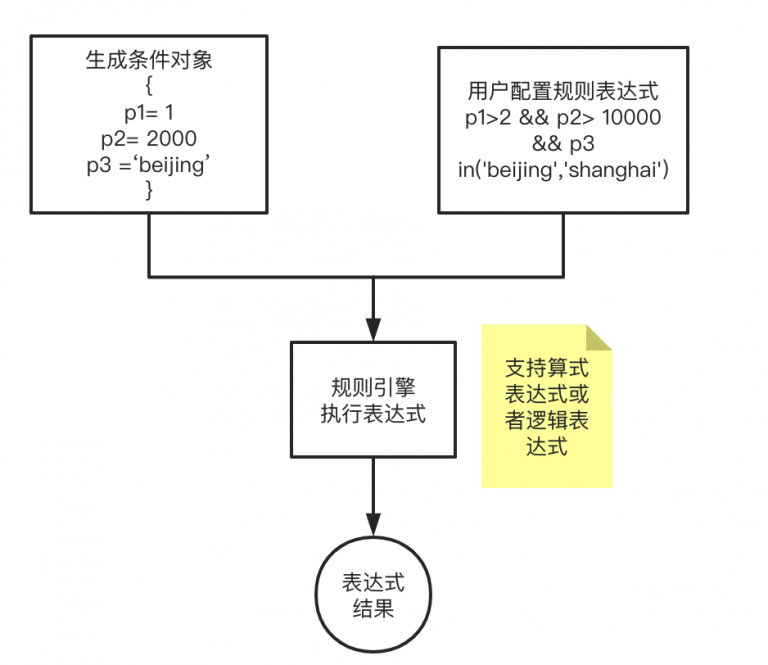

# 基于go的规则引擎

!> 本文概览：介绍go语言框架下开源规则引擎


## 引入 
以一个电商运维场景为例，我们需要对用户注册年限p1、购买金额p2、地域p3等条件给用户进行发券，基于条件进行任意组合成不同规则。比如： 
- 规则1 ：`p1 > 2 && p2 > 10 000 & p3 in ('beijng','shanghai')`  大于2年的老用户，并且购买金额大于10000的北京或上海用户。 
- 规则2： `p1<1`  小于1年的用户 
  
为了解决这个问题，引入了规则引擎，从**if …else中解放出来**。Drools是java语言的规则引擎，本文是针对go语言的规则引擎框架。



## Go开源
先说结论：比较了govaluate、goengine、gorule，最终使用govaluate。相比 gorule、goengine，govaluate除了支持in操作、还支持正则表达式，而且表达式也不需要转换成DRL。

- 支持string类型的 == 操作
- 支持in操作
- 支持计算逻辑表达式和算数表达式
- 支持正则


| 框架 | 功能 | 基准测试 |
| :-- | :-- | :-- |
| [govaluate](https://github.com/Knetic/govaluate) <br />Star: 1.4 k |	1、直接使用表达式。不需要转IDL<br />2、支持算数表达式和逻辑表达式。<br />3、支持string的判断。<br />4、支持in 操作。<br /> - 1 in （1,2,3）<br /> - 字符串 in 。 ‘code1’ in (‘cod1′,’code2’)<br />5、支持正则 | 测试3个逻辑表达式条件，如下：<br />每次执行op需要15us |
| [gengie](https://github.com/rencalo770/gengine)（B站开源）<br />Star: 193 | 规则表达式类似于一个DRL。<br />规则脚本具有if..else等语法，后续支持扩展灵活。| |
| [grue](https://github.com/hyperjumptech/grule-rule-engine/) <br /> Star:525 | 规则表达式需要生成生成一个 DRL。 | |
| [goja](https://github.com/dop251/goja) <br /> Start: 1.8k | go实现执行js脚本(类似于java 执行groovy )<br />这里不关注表达式，只是通过这引擎可以执行js脚本代码。<br />goja、gengine、grule都是基于脚本的，只是gojar是支持js，grule和gengine是自定义的语法脚本。 | |

### govaluate
demo代码，需要生成一个map传递变量的值。如下是计算算数公式和逻辑表达式例子。

```go
func TestGoValueate() {
   // 支持多个逻辑表达式
   expr, err := govaluate.NewEvaluableExpression("(10 > 0) && (2.1 == 2.1) && 'service is ok' == 'service is ok'" +
      " && 1 in (1,2) && 'code1' in ('code3','code2',1)")
   if err != nil {
      log.Fatal("syntax error:", err)
   }
   result, err := expr.Evaluate(nil)
   if err != nil {
      log.Fatal("evaluate error:", err)
   }
   fmt.Println(result)
 
   // 逻辑表达式包含变量
   expression, err := govaluate.NewEvaluableExpression("http_response_body == 'service is ok'")
   parameters := make(map[string]interface{}, 8)
   parameters["http_response_body"] = "service is ok"
   res, _ := expression.Evaluate(parameters)
   fmt.Println(res)
 
   // 算数表达式包含变量
   expression1, _ := govaluate.NewEvaluableExpression("requests_made * requests_succeeded / 100")
   parameters1 := make(map[string]interface{}, 8)
   parameters1["requests_made"] = 100
   parameters1["requests_succeeded"] = 80
   result1, _ := expression1.Evaluate(parameters1)
   fmt.Println(result1)
 
}
```

基准测试

```go
func BenchmarkNewEvaluableExpression(b *testing.B) {
   for i := 0; i < b.N; i++ {
      _, err := govaluate.NewEvaluableExpression("(10 > 0) && (100 > 20) && 'code1' in ('code3','code2',1)")
      if err != nil {
         log.Fatal("syntax error:", err)
      }
   }
}
 
func BenchmarkEvaluate(b *testing.B) {
   parameters1 := make(map[string]interface{}, 8)
   parameters1["gmv"] = 100
   parameters1["customerId"] = "80"
   parameters1["stayLength"] = 20
   for i := 0; i < b.N; i++ {
      _, err := govaluate.NewEvaluableExpression("(gmv > 0) && (stayLength > 20) && customerId in ('80','code2','code3')")
      if err != nil {
         log.Fatal("syntax error:", err)
      }
   }
}
```

在测试go文件目录下执行：

```bash
test go test  -bench=.    -benchmem
```

测试结果如下，每次执行op需要15ms、9KB、需要内存分片次数140次。

```bash
goos: darwin
goarch: amd64
pkg: helloWord/test
BenchmarkNewEvaluableExpression-8          74413             15341 ns/op            8680 B/op        139 allocs/op
BenchmarkEvaluate-8
```

### goengine代码

demo如下：

```go
import (
   "fmt"
   "gengine/builder"
   "gengine/context"
   "gengine/engine"
   "github.com/google/martian/log"
   "time"
)
 
func PrintName(name string) {
   fmt.Println(name)
}
 
/**
use '@name',you can get rule name in rule content
*/
const atname_rule = `
rule "测试规则名称1" "rule desc"
begin
  va = @name
  PrintName(va)
  PrintName(@name)
end
rule "rule name" "rule desc"
begin
  va = @name
  PrintName(va)
  PrintName(@name)
end
`
 
func TestGEngine() {
   start1 := time.Now().UnixNano()
   // context data
   dataContext := context.NewDataContext()
   dataContext.Add("PrintName", PrintName)
   // init rule engine
   ruleBuilder := builder.NewRuleBuilder(dataContext)
   // resolve rules from string
   err := ruleBuilder.BuildRuleFromString(atname_rule)
 
   end1 := time.Now().UnixNano()
 
   fmt.Println("rules num:%d, load rules cost time:%d ns", len(ruleBuilder.Kc.RuleEntities), end1-start1)
 
   if err != nil {
      log.Errorf("err:%s ", err)
   } else {
      eng := engine.NewGengine()
 
      start := time.Now().UnixNano()
      // true: means when there are many rules， if one rule execute error，continue to execute rules after the occur error rule
      err := eng.Execute(ruleBuilder, true)
      end := time.Now().UnixNano()
      if err != nil {
         log.Errorf("execute rule error: %v", err)
      }
      log.Infof("execute rule cost %d ns", end-start)
   }
}
```

### gorule

demo如下：

```go
type RuleConditionContext struct {
   NetAmount float32
   Distance  int32
   Duration  int32
   Result    bool
}
 
// DRL的规则
const duplicateRulesWithDiffSalience = `
rule  DuplicateRule1  "Duplicate Rule 1"  salience 5 {
when
(RuleConditionContext.Distance > 5000  &&   RuleConditionContext.Duration > 120) && (RuleConditionContext.Result == false)
Then
   RuleConditionContext.Result=true;
}
`
 
// 理想的规则引擎应该是解析一个规则+contextData
 
// 1.目前规则是：
// (1)执行步骤
//       step1:加载所有规则
//    step2: 执行一个数据
// (2) 问题
// 问题1： 执行效率
// 问题2： 如果需要提前加载所有规则，那么就需要考虑：规则量、动态改变规则，比如规则被修改或者新增规则场景。
 
func TestGruleEngine() {
   //Given
   ruleCondition := &RuleConditionContext{
      Distance: 6000,
      Duration: 121,
      Result:   false,
   }
 
   lib := ast.NewKnowledgeLibrary()
 
   ruleBuiler := builder.NewRuleBuilder(lib)
   ruleBuiler.BuildRuleFromResource("rule1", "1.0", pkg.NewBytesResource([]byte(duplicateRulesWithDiffSalience)))
 
   kb := lib.NewKnowledgeBaseInstance("rule1", "1.0")
   eng := engine.NewGruleEngine()
 
   // 2.对于一个对象进行判断是否满足规则
   // 2.1 构建一个规则条件对象
   dctx := ast.NewDataContext()
   dctx.Add("RuleConditionContext", ruleCondition)
   eng.Execute(dctx, kb)
 
   fmt.Println(ruleCondition.Result)
 
}
```

### goja

demo如下：

```go
import (
	"fmt"
	"github.com/dop251/goja"
)
 
func TestGoja() {
	const SCRIPT = `
	var hasX = false;
	var hasY = false;
	for (var key in o) {
		switch (key) {
		case "x":
			if (hasX) {
				throw "Already have x";
			}
			hasX = true;
			delete o.y;
			break;
		case "y":
			if (hasY) {
				throw "Already have y";
			}
			hasY = true;
			delete o.x;
			break;
		default:
			throw "Unexpected property: " + key;
		}
	}
	
	hasX && !hasY || hasY && !hasX;
	`
	r := goja.New()
	r.Set("o", map[string]interface{}{
		"x": 40,
		"y": 2,
	})
	v, err := r.RunString(SCRIPT)
	if err != nil {
		fmt.Println(err)
	}
 
	fmt.Println(v)
}
```