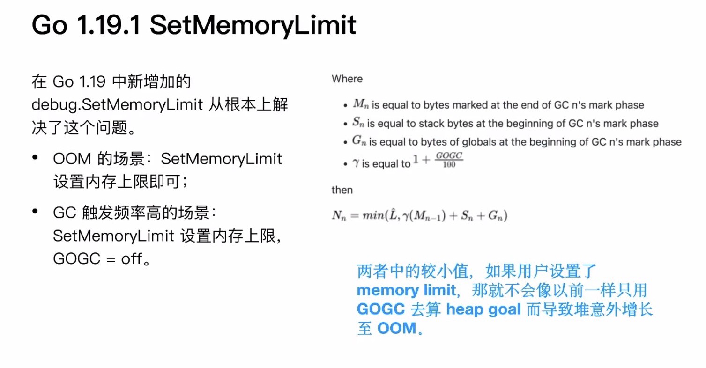

# GC 优化之路

> 基于Go 1.19.1 版本前的优化方案


## GC 常见优化

所有的性能优化都需要基于 trace 来观测。通常应用程序要么是计算密集型，或者是 IO 密集型，也可能是内存密集型。
- **存储差速**：压缩消息、批调用（减少syscall）；
- **高效的序列化**；
- **GC**：strings.Builder、RO复用、sync.Pool、栈内存、Bigcache（减少对象数量）、prealloc。

## 1.19.1 前的优化实践

GOGC 触发时机为堆大小增长为上次 GC 两倍时。但在 GOGC 实际实践中会按照 Pacer 调频算法根据堆增长速度等因素，使堆大小在达到两倍大小前提前发起 GC。通过调整 GC 的步调，以调整 GC 的触发频率。

- 设置 `GOGC`
- 设置 `debug.SetGCPercent()`

**设置 GOGC 的弊端**
- GOGC 设置比率的方式不精确；
- GOGC 设置过小，容易频繁触发 GC；
- 对某些程序本身占用内存就低，容易触发 GC；
- GOGC 设置很大，有的时候又容易触发 OOM。

### Go Ballast

> 参考：[Go Ballast 让内存控制更加丝滑](https://www.51cto.com/article/690830.html)

Go Ballast，其实很简单就是初始化一个生命周期贯穿整个Go应用生命周期的超大Slice。
利用这个特性，就能保证 GC 在 10G 的一倍时才能被触发（潜在含义，内存不可能会达到10G的限制，所以就会走 GC 的定时触发机制，同时观测内存变化，即可知道精准的 GC 的内存触发时机），这样就能够比较精准控制 GO GC 的触发时机。

```go
func main() {
	// 这里初始化一个 10G 的数组，并不会实际占用 10G 的物理内存
	ballast := make([]byte, 10*1024*1024*1024) // 10G
	
	// do something

	// 保证 ballast 不会被 GC 给回收
	runtime.KeepAlive(ballast)
}
```

延伸一点，当怀疑我们的接口的耗时是由于 GC 的频繁触发引起的，我们需要怎么确定呢?首先你会想到周期性的抓取 pprof 的来分析，这种方案其实也可以，但是太麻烦了。其实可以根据 GC 的触发时间绘制这个曲线图，GC 的触发时间可以利用 `runtime.Memstats` 的 LastGC 来获取。

**优化前后效果**
- 绿线：调整前 GOGC = 30
- 黄线：调整后 GOGC 默认值，ballast = 100G


这张图相同的流量压力下，ballast 的表现明显偏好。


### GOGC Tunner

通过自动调整 GOGC，来动态的调整 GC 的target，用来在内存足够的时候调整 GOGC 来减少 GC 的次数。

我们发现固定的 GOGC 值的调整不适合业务的服务。以下时可能的挑战：
- 它不知道分配给容器的最大内存，并可能导致内存不足的问题；
- 微服务有各种内存利用率组合。如某个服务 P99 利用率为 1G 但 P1 为100MB，因此 100MB 实例具有巨大的 GC 影响。

GOGC Tuner 根据容器的内存限制（例如：cgroup）动态计算正确的 GOGC 值，并使用 Go 的运行时 API 设置它。
- 简化配置，便于推理和确定性计算；
- 防止 OOM（内存不足）；
- 对于极端情况允许更高的 GOGC 值。

Go 有终结器（SetFinalizer），它们是在对象将被垃圾收集时运行的函数。我们能够使用一个自引用终结器，它会在每次 GC 调用时自行重置。

#### **正常流量（实时数据集150M）**

<center>正常运行。左边是默认配置，右边是手动调整。</center>

#### **流量增加 2 倍（实时数据集为 300M）**


<center>双倍负载。左边是默认配置，右边是手动调整。</center>

#### **GOGCTuner 的流量增加了 2 倍，达到 70%（实时数据集为 300M）**


<center>双倍负载，但使用协调器 pacer。左边是默认配置，右边是 GOGC Tuner 调整后的配置。</center>

### 1.19.1 SetMemoryLimit

在 Go 1.19 中新增的 `debug.SetMemoryLimit` 从根本上解决了这个问题。
- **OOM 的场景**： `SetMemoryLimit` 设置内存上限即可；
- **GC 触发频率高的场景**： `SetMemoryLimit` 设置内存上限，`GOGC = off`。
- `SetMemoryLimit` + `GOGC = off` + `MemoryLimit 足够大`；
	- 设置 Go Ballast 的效果一样，常驻稳态内存的服务；
- `SetMemoryLimit` + `GOGC = 100` + `MemoryLimit 足够大`；
	- 在没有达到 MemoryLimit 阈值的情况下，还是遵循 GOGC 的 target 决定要不要进行垃圾回收，使用 GOGC Tuner 进行调优，避免这么多次的垃圾回收，大部分应用符合这类配置；
- `SetMemoryLimit` + `GOGC = 100` + `MemoryLimit 不足够大`；
- `SetMemoryLimit` + `GOGC = off `+ `MemoryLimit 不足够大`。


