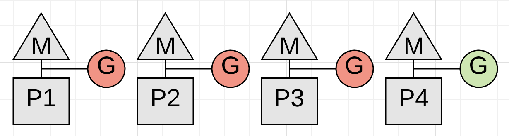
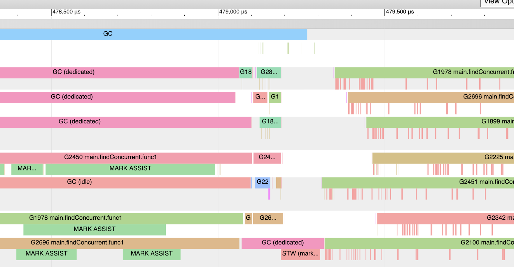
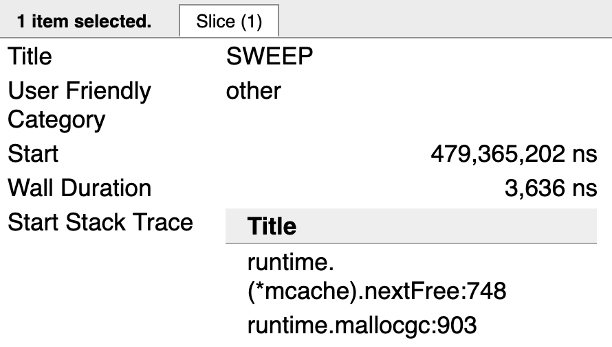
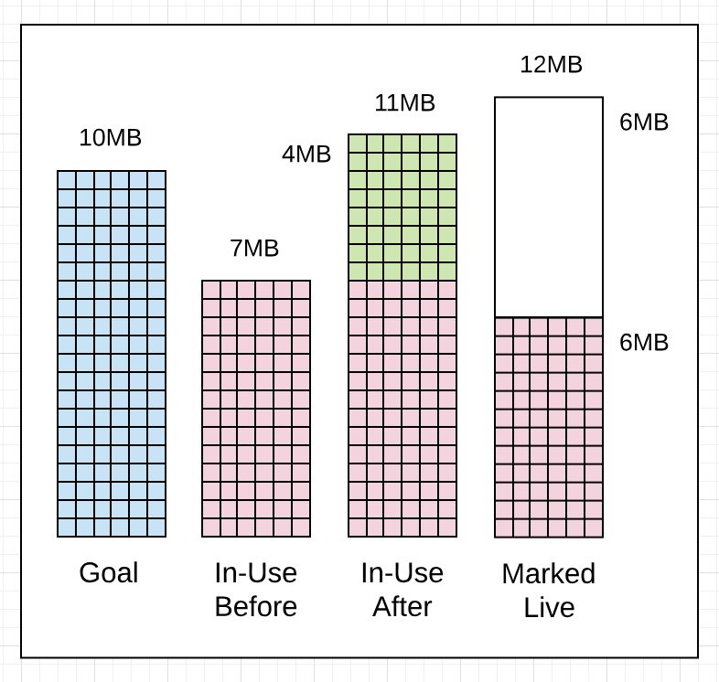
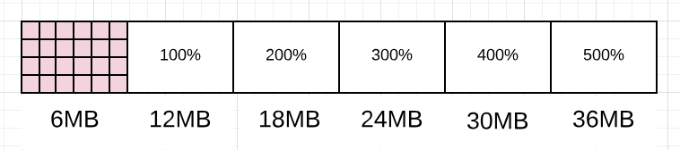

# Go 中的垃圾回收：第一部分 - 语义

### Prelude 前奏曲

This is the first post in a three part series that will provide an understanding of the mechanics and semantics behind the garbage collector in Go. This post focuses on the foundation material on the collector’s semantics.  
这是由三部分组成的系列文章中的第一篇，该系列文章将提供对 Go 中垃圾收集器背后的机制和语义的理解。这篇文章重点介绍收集器语义的基础材料。

Index of the three part series:  
三部分系列的索引：

1. [Garbage Collection In Go : Part I - Semantics  
    Go 中的垃圾回收：第一部分 - 语义](https://www.ardanlabs.com/blog/2018/12/garbage-collection-in-go-part1-semantics.html)
2. [Garbage Collection In Go : Part II - GC Traces  
    Go 中的垃圾回收：第二部分 - GC 跟踪](https://www.ardanlabs.com/blog/2019/05/garbage-collection-in-go-part2-gctraces.html)
3. [Garbage Collection In Go : Part III - GC Pacing  
    Go 中的垃圾回收：第三部分 - GC Pacing](https://www.ardanlabs.com/blog/2019/07/garbage-collection-in-go-part3-gcpacing.html)

### Introduction 介绍

Garbage collectors have the responsibility of tracking heap memory allocations, freeing up allocations that are no longer needed, and keeping allocations that are still in-use. How a language decides to implement this behavior is complex but it shouldn’t be a requirement for application developers to understand the details in order to build software. Plus, with different releases of a language’s VM or runtime, the implementation of these systems are always changing and evolving. What’s important for application developers is to maintain a good working model of how the garbage collector for their language behaves and how they can be sympathetic with that behavior without being concerned as to the implementation.  
垃圾回收器负责跟踪堆内存分配，释放不再需要的分配，并保留仍在使用的分配。语言如何决定实现此行为很复杂，但应用程序开发人员不应该为了构建软件而了解细节。此外，随着语言的 VM 或运行时的不同版本，这些系统的实现总是在变化和发展。对于应用程序开发人员来说，重要的是维护一个良好的工作模型，了解其语言的垃圾回收器的行为方式，以及他们如何在不关心实现的情况下同情该行为。

As of version 1.12, the Go programming language uses a non-generational concurrent tri-color mark and sweep collector. If you want to visually see how a mark and sweep collector works, Ken Fox wrote this great [article](https://spin.atomicobject.com/2014/09/03/visualizing-garbage-collection-algorithms) and provides an animation. The implementation of Go’s collector has changed and evolved with every release of Go. So any post that talks about the implementation details will no longer be accurate once the next version of the language is released.  
从 1.12 版本开始，Go 编程语言使用非分代并发三色标记和扫描收集器。如果您想直观地了解标记和扫描收集器的工作原理，Ken Fox 撰写了这篇很棒的文章并提供了动画。Go 收集器的实现随着 Go 的每个版本而变化和发展。因此，一旦该语言的下一个版本发布，任何谈论实现细节的帖子都将不再准确。

With all that said, the modeling I will do in this post will not focus on the actual implementation details. The modeling will focus on the behavior you will experience and the behavior you should expect to see for years to come. In this post, I will share with you the behavior of the collector and explain how to be sympathetic with that behavior, regardless of the current implementation or how it changes in the future. This will make you a better Go developer.  
综上所述，我在这篇文章中所做的建模将不关注实际的实现细节。建模将侧重于您将体验到的行为以及您应该在未来几年内看到的行为。在这篇文章中，我将与您分享收集器的行为，并解释如何同情这种行为，无论当前的实现或将来如何变化。这将使你成为一个更好的 Go 开发人员。

_Note: Here is more reading you can do about [garbage collectors](https://github.com/ardanlabs/gotraining/tree/master/reading#garbage-collection) and Go’s actual collector as well.  
注意：这里有更多关于垃圾收集器和 Go 的实际收集器的阅读。_

### The Heap Is Not A Container  
### 堆不是容器

I will never refer to the heap as a container that you can store or release values from. It’s important to understand that there is no linear containment of memory that defines the “Heap”. Think that any memory reserved for application use in the process space is available for heap memory allocation. Where any given heap memory allocation is virtually or physically stored is not relevant to our model. This understanding will help you better understand how the garbage collector works.  
我永远不会将堆称为可以从中存储或释放值的容器。重要的是要了解，没有定义“堆”的内存的线性包含。认为在进程空间中为应用程序使用保留的任何内存都可用于堆内存分配。任何给定的堆内存分配是虚拟的还是物理存储的，这与我们的模型无关。这种理解将帮助您更好地了解垃圾回收器的工作原理。

### Collector Behavior 收集器行为

When a collection starts, the collector runs through three phases of work. Two of these phases create Stop The World (STW) latencies and the other phase creates latencies that slow down the throughput of the application. The three phases are:  
当收集开始时，收集器会经历三个工作阶段。其中两个阶段会产生停止世界 （STW） 延迟，另一个阶段会产生延迟，从而降低应用程序的吞吐量。这三个阶段是：

- Mark Setup - STW 标记设置 - STW
- Marking - Concurrent 打标 - 并发
- Mark Termination - STW 标记终止 - STW

Here is a break-down of each phase.  
以下是每个阶段的细分。

**Mark Setup - STW 标记设置 - STW**

When a collection starts, the first activity that must be performed is turning on the Write Barrier. The purpose of the Write Barrier is to allow the collector to maintain data integrity on the heap during a collection since both the collector and application goroutines will be running concurrently.  
当集合开始时，必须执行的第一个活动是打开写入屏障。写入屏障的目的是允许收集器在收集期间维护堆上的数据完整性，因为收集器和应用程序 goroutine 将同时运行。

In order to turn the Write Barrier on, every application goroutine running must be stopped. This activity is usually very quick, within 10 to 30 microseconds on average. That is, as long as the application goroutines are behaving properly.  
为了打开写入屏障，必须停止每个正在运行的应用程序 goroutine。这种活动通常非常快，平均在 10 到 30 微秒内。也就是说，只要应用程序 goroutine 运行正常。

_Note: To better understand these scheduler diagrams, be sure to read this series of posts on the [Go Scheduler](https://www.ardanlabs.com/blog/2018/08/scheduling-in-go-part1.html)  
注意：为了更好地理解这些调度器图，请务必阅读 Go Scheduler 上的这一系列文章_

**Figure 1 图1**  


Figure 1 shows 4 application goroutines running before the start of a collection. Each of those 4 goroutines must be stopped. The only way to do that is for the collector to watch and wait for each goroutine to make a function call. Function calls guarantee the goroutines are at a safe point to be stopped. What happens if one of those goroutines doesn’t make a function call but the others do?  
图 1 显示了在集合开始之前运行的 4 个应用程序 goroutine。这 4 个 goroutine 中的每一个都必须停止。唯一的方法是让收集器观察并等待每个 goroutine 进行函数调用。函数调用保证 goroutine 处于要停止的安全点。如果其中一个 goroutines 没有进行函数调用，而其他 goroutine 进行了调用，会发生什么情况？

**Figure 2 图2**  


Figure 2 shows a real problem. The collection can’t start until the goroutine running on P4 is stopped and that can’t happen because it’s in a [tight loop](https://github.com/golang/go/issues/10958) performing some math.  
图 2 显示了一个实际问题。在 P4 上运行的 goroutine 停止之前，集合无法启动，这不会发生，因为它处于执行一些数学运算的紧密循环中。

**Listing 1 清单 1**

```go
func add(numbers []int) int {
    var v int
    for _, n := range numbers {
        v += n
    }
    return v
}
```

Listing 1 shows the code that the Goroutine running on P4 is executing. Depending on the size of the slice, the Goroutine could run for an unreasonable amount of time with no opportunity to be stopped. This is the kind of code that could stall a collection from starting. What’s worse is the other P’s can’t service any other goroutines while the collector waits. It’s critically important that goroutines make function calls in reasonable timeframes.  
清单 1 显示了在 P4 上运行的 Goroutine 正在执行的代码。根据切片的大小，Goroutine 可能会运行不合理的时间，而没有机会停止。这种代码可能会使集合停止启动。更糟糕的是，当收集器等待时，其他 P 无法为任何其他 goroutine 提供服务。goroutines 在合理的时间范围内进行函数调用至关重要。

_Note: This is something the language team is looking to correct in 1.14 by adding [preemptive](https://github.com/golang/go/issues/24543) techniques to the scheduler.  
注意：这是语言团队希望在 1.14 中通过向调度器添加抢占式技术来纠正的问题。_

**Marking - Concurrent 打标 - 并发**

Once the Write Barrier is turned on, the collector commences with the Marking phase. The first thing the collector does is take 25% of the available CPU capacity for itself. The collector uses Goroutines to do the collection work and needs the same P’s and M’s the application Goroutines use. This means for our 4 threaded Go program, one entire P will be dedicated to collection work.  
打开写入屏障后，收集器将进入标记阶段。收集器做的第一件事是将 25% 的可用 CPU 容量据为己有。收集器使用 Goroutines 来完成收集工作，并且需要与 Goroutines 应用程序相同的 P 和 M。这意味着对于我们的 4 线程 Go 程序，一个完整的 P 将专门用于收集工作。

**Figure 3 图3**  


Figure 3 shows how the collector took P1 for itself during the collection. Now the collector can start the Marking phase. The Marking phase consists of marking values in heap memory that are still in-use. This work starts by inspecting the stacks for all existing goroutines to find root pointers to heap memory. Then the collector must traverse the heap memory graph from those root pointers. While the Marking work is happening on P1, application work can continue concurrently on P2, P3 and P4. This means the impact of the collector has been minimized to 25% of the current CPU capacity.  
图 3 显示了收集器在收集过程中如何自行获取 P1。现在，收集器可以开始标记阶段。标记阶段由堆内存中仍在使用的标记值组成。这项工作首先检查所有现有 goroutine 的堆栈，以查找指向堆内存的根指针。然后，收集器必须从这些根指针遍历堆内存图。在 P1 上进行标记工作时，P2、P3 和 P4 上的应用程序工作可以同时继续进行。这意味着收集器的影响已降至当前 CPU 容量的 25%。

I wish that was the end of the story but it isn’t. What if it’s identified during the collection that the Goroutine dedicated to GC on P1 will not finish the Marking work before the heap memory in-use reaches its limit? What if only one of those 3 Goroutines performing application work is the reason the collector will not finish in time? In this case, new allocations have to be slowed down and specifically from that Goroutine.  
我希望这就是故事的结局，但事实并非如此。如果在收集过程中发现 P1 上专用于 GC 的 Goroutine 在使用的堆内存达到其限制之前无法完成标记工作，该怎么办？如果这 3 个执行应用程序工作的 Goroutine 中只有一个是收集器无法及时完成的原因怎么办？在这种情况下，必须放慢新的分配速度，特别是从 Goroutine 中减慢速度。

If the collector determines that it needs to slow down allocations, it will recruit the application Goroutines to assist with the Marking work. This is called a Mark Assist. The amount of time any application Goroutine will be placed in a Mark Assist is proportional to the amount of data it’s adding to heap memory. One positive side effect of Mark Assist is that it helps to finish the collection faster.  
如果收集器确定它需要放慢分配速度，它将招募应用程序 Goroutines 来协助标记工作。这称为标记辅助。任何应用程序 Goroutine 放置在 Mark Assist 中的时间量与它添加到堆内存中的数据量成正比。Mark Assist 的一个积极副作用是它有助于更快地完成收集。

**Figure 4 图4**  


Figure 4 shows how the application Goroutine running on P3 is now performing a Mark Assist and helping with the collection work. Hopefully the other application Goroutines don’t need to get involved as well. Applications that allocate heavy could see the majority of the running Goroutines perform small amounts of Mark Assist during collections.  
图 4 显示了在 P3 上运行的应用程序 Goroutine 现在如何执行标记辅助并帮助完成收集工作。希望其他应用程序 Goroutines 也不需要参与其中。分配繁重的应用程序可能会看到大多数正在运行的 Goroutines 在收集期间执行少量的 Mark Assist。

One goal of the collector is to eliminate the need for Mark Assists. If any given collection ends up requiring a lot of Mark Assist, the collector can start the next garbage collection earlier. This is done in an attempt to reduce the amount of Mark Assist that will be necessary on the next collection.  
收集器的一个目标是消除对标记辅助的需求。如果任何给定的回收最终需要大量标记辅助，则回收器可以提前开始下一个垃圾回收。这样做是为了减少下一次收集所需的标记辅助量。

**Mark Termination - STW 标记终止 - STW**

Once the Marking work is done, the next phase is Mark Termination. This is when the Write Barrier is turned off, various clean up tasks are performed, and the next collection goal is calculated. Goroutines that find themselves in a tight loop during the Marking phase can also cause Mark Termination STW latencies to be extended.  
标记工作完成后，下一阶段是标记终止。这是关闭写入屏障、执行各种清理任务并计算下一个收集目标的时候。在标记阶段发现自己处于紧密循环中的例程也可能导致标记终止 STW 延迟延长。

**Figure 5 图5**  


Figure 5 shows how all the Goroutines are stopped while the Mark Termination phase completes. This activity is usually within 60 to 90 microseconds on average. This phase could be done without a STW, but by using a STW, the code is simpler and the added complexity is not worth the small gain.  
图 5 显示了在标记终止阶段完成时如何停止所有 Goroutine。这种活动通常平均在 60 到 90 微秒内。这个阶段可以在没有 STW 的情况下完成，但通过使用 STW，代码更简单，增加的复杂性不值得小收益。

Once the collection is finished, every P can be used by the application Goroutines again and the application is back to full throttle.  
收集完成后，应用程序 Goroutines 可以再次使用每个 P，并且应用程序将恢复到全速运行状态。

**Figure 6 图6**  


Figure 6 shows how all of the available P’s are now processing application work again once the collection is finished. The application is back to full throttle as it was before the collection started.  
图 6 显示了所有可用的 P 现在如何在收集完成后再次处理应用程序工作。应用程序将恢复到收集开始前的全速运行。

**Sweeping - Concurrent 扫描 - 并发**

There is another activity that happens after a collection is finished called Sweeping. Sweeping is when the memory associated with values in heap memory that were not marked as in-use are reclaimed. This activity occurs when application Goroutines attempt to allocate new values in heap memory. The latency of Sweeping is added to the cost of performing an allocation in heap memory and is not tied to any latencies associated with garbage collection.  
收集完成后还会发生另一项活动，称为“扫描”。清除是指回收与堆内存中未标记为正在使用的值关联的内存。当应用程序 Goroutines 尝试在堆内存中分配新值时，会发生此活动。扫描的延迟将添加到在堆内存中执行分配的成本中，并且与与垃圾回收关联的任何延迟无关。

The following is a sample of a trace on my machine where I have 12 hardware threads available for executing Goroutines.  
以下是我的机器上的跟踪示例，其中有 12 个硬件线程可用于执行 Goroutines。

**Figure 7 图7**  


Figure 7 shows a partial snapshot of the trace. You can see how during this collection (keep your view within the blue GC line at the top), three of the twelve P’s are dedicated to GC. You can see Goroutine 2450, 1978, and 2696 during this time are performing moments of Mark Assist work and not its application work. At the very end of the collection, only one P is dedicated to GC and eventually performs the STW (Mark Termination) work.  
图 7 显示了跟踪的部分快照。您可以看到在此集合期间（将您的视图保持在顶部的蓝色 GC 线内），12 个 P 中的三个专用于 GC。您可以看到 Goroutine 2450、1978 和 2696 在此期间正在执行 Mark Assist 工作的时刻，而不是其应用程序工作。在集合的最后，只有一个 P 专用于 GC，并最终执行 STW（标记终止）工作。

After the collection is finished, the application is back to running at full throttle. Except you see a lot of rose colored lines underneath those Goroutines.  
收集完成后，应用程序将恢复全速运行。除了你看到那些 Goroutines 下面有很多玫瑰色的线条。

**Figure 8 图8**  


Figure 8 shows how those rose colored lines represent moments when the Goroutine is performing the Sweeping work and not its application work. These are moments when the Goroutine is attempting to allocate new values in heap memory.  
图 8 显示了这些玫瑰色线如何表示 Goroutine 执行 Sweeping 工作而不是其应用程序工作的时刻。这些是 Goroutine 尝试在堆内存中分配新值的时刻。

**Figure 9 图9**  


Figure 9 shows the end of the stack trace for one of the Goroutines in the Sweep activity. The call to `runtime.mallocgc` is the call to allocate a new value in heap memory. The call to `runtime.(*mcache).nextFree` is causing the Sweep activity. Once there are no more allocations in heap memory to reclaim, the call to `nextFree` won’t be seen any longer.  
图 9 显示了 Sweep 活动中某个 Goroutines 的堆栈跟踪的结束。对 `runtime.mallocgc` 的调用是在堆内存中分配新值的调用。调用 `runtime.(*mcache).nextFree` is 导致 Sweep 活动。一旦堆内存中没有更多要回收的分配，将不再看到对 `nextFree` 的调用。

The collection behavior that was just described only happens when a collection has started and is running. The GC Percentage configuration option plays a big role in determining when a collection starts.  
刚才描述的集合行为仅在集合已启动并正在运行时发生。GC 百分比配置选项在确定收集何时开始方面起着重要作用。

### GC Percentage GC百分比

There is a configuration option in the runtime called GC Percentage, which is set to 100 by default. This value represents a ratio of how much new heap memory can be allocated before the next collection has to start. Setting the GC Percentage to 100 means, based on the amount of heap memory marked as live after a collection finishes, the next collection has to start at or before 100% more new allocations are added to heap memory.  
运行时中有一个名为 GC Percentage 的配置选项，默认情况下设置为 100。此值表示在必须启动下一个集合之前可以分配多少新堆内存的比率。将 GC 百分比设置为 100 意味着，根据收集完成后标记为活动的堆内存量，下一个集合必须在向堆内存添加 100% 以上的新分配时或之前开始。

As an example, imagine a collection finishes with 2MB of heap memory in-use.  
例如，假设一个集合结束时使用了 2MB 的堆内存。

_Note: The diagrams of the heap memory in this post do not represent a true profile when using Go. The heap memory in Go will often be fragmented and messy, and you don’t have the clean separation as the images are representing. These diagrams provide a way to visualize heap memory in an easier to understand way that is accurate towards the behavior you will experience.  
注意：本文中的堆内存图并不代表使用 Go 时的真实配置文件。Go 中的堆内存通常是碎片化和混乱的，并且您没有像图像所表示的那样进行干净的分离。这些关系图提供了一种以更易于理解的方式可视化堆内存的方法，该方式对您将体验到的行为是准确的。_

**Figure 10 图10**  


Figure 10 shows the 2MB of heap memory in-use after the last collection finished. Since the GC Percentage is set to 100%, the next collection needs to start at or before 2 more MB of heap memory is added.  
图 10 显示了上次收集完成后使用的 2MB 堆内存。由于 GC 百分比设置为 100%，因此下一个集合需要在添加 2 MB 堆内存时或之前开始。

**Figure 11 图11**  


Figure 11 shows that 2 more MB of heap memory is now in-use. This will trigger a collection. A way to view all of this in action, is to generate a GC trace for every collection that takes place.  
图 11 显示现在又使用了 2 MB 的堆内存。这将触发收集。查看所有这些操作的一种方法是为每个发生的收集生成一个 GC 跟踪。

### GC Trace GC 跟踪

A GC trace can be generated by including the environmental variable `GODEBUG` with the `gctrace=1` option when running any Go application. Every time a collection happens, the runtime will write the GC trace information to `stderr`.  
在运行任何 Go 应用程序时，可以通过将环境变量 `GODEBUG` 与 `gctrace=1` 选项一起包含来生成 GC 跟踪。每次进行收集时，运行时都会将 GC 跟踪信息写入 `stderr` 。

**Listing 2 清单 2**

```
GODEBUG=gctrace=1 ./app

gc 1405 @6.068s 11%: 0.058+1.2+0.083 ms clock, 0.70+2.5/1.5/0+0.99 ms cpu, 7->11->6 MB, 10 MB goal, 12 P

gc 1406 @6.070s 11%: 0.051+1.8+0.076 ms clock, 0.61+2.0/2.5/0+0.91 ms cpu, 8->11->6 MB, 13 MB goal, 12 P

gc 1407 @6.073s 11%: 0.052+1.8+0.20 ms clock, 0.62+1.5/2.2/0+2.4 ms cpu, 8->14->8 MB, 13 MB goal, 12 P
```

Listing 2 shows how to use the `GODEBUG` variable to generate GC traces. The listing also shows 3 traces that were generated by the running Go application.  
清单 2 显示了如何使用该 `GODEBUG` 变量生成 GC 跟踪。该列表还显示了由正在运行的 Go 应用程序生成的 3 个跟踪。

Here is a break-down of what each value in the GC trace means by reviewing the first GC trace line in the listing.  
以下是通过查看列表中的第一条 GC 跟踪行来细分 GC 跟踪中每个值的含义。

**Listing 3 清单 3**

```
gc 1405 @6.068s 11%: 0.058+1.2+0.083 ms clock, 0.70+2.5/1.5/0+0.99 ms cpu, 7->11->6 MB, 10 MB goal, 12 P

// General
gc 1404     : The 1404 GC run since the program started
@6.068s     : Six seconds since the program started
11%         : Eleven percent of the available CPU so far has been spent in GC

// Wall-Clock
0.058ms     : STW        : Mark Start       - Write Barrier on
1.2ms       : Concurrent : Marking
0.083ms     : STW        : Mark Termination - Write Barrier off and clean up

// CPU Time
0.70ms      : STW        : Mark Start
2.5ms       : Concurrent : Mark - Assist Time (GC performed in line with allocation)
1.5ms       : Concurrent : Mark - Background GC time
0ms         : Concurrent : Mark - Idle GC time
0.99ms      : STW        : Mark Term

// Memory
7MB         : Heap memory in-use before the Marking started
11MB        : Heap memory in-use after the Marking finished
6MB         : Heap memory marked as live after the Marking finished
10MB        : Collection goal for heap memory in-use after Marking finished

// Threads
12P         : Number of logical processors or threads used to run Goroutines
```

Listing 3 shows the actual numbers from the first GC trace line broken down by what the values mean. I will eventually talk about most of these values, but for now just focus on the memory section of the GC trace for trace 1405.  
清单 3 显示了第一条 GC 跟踪线的实际数字，按值的含义细分。我最终将讨论其中的大部分值，但现在只关注跟踪 1405 的 GC 跟踪的内存部分。

**Figure 12 图12**  


**Listing 4 清单 4**

```
// Memory
7MB         : Heap memory in-use before the Marking started
11MB        : Heap memory in-use after the Marking finished
6MB         : Heap memory marked as live after the Marking finished
10MB        : Collection goal for heap memory in-use after Marking finished
```

What this GC trace line is telling you in listing 4, is that the amount of heap memory in-use was 7MB before the Marking work started. When the Marking work finished, the amount of heap memory in-use reached 11MB. Which means there was an additional 4MB of allocations that occurred during the collection. The amount of heap memory that was marked as live after the Marking work finished was 6MB. This means the application can increase the amount of heap memory in-use to 12MB (100% of the live heap size of 6MB) before the next collection needs to start.  
清单 4 中的 GC 跟踪行告诉您的是，在标记工作开始之前，正在使用的堆内存量为 7MB。标记工作完成后，使用的堆内存量达到 11MB。这意味着在收集期间发生了额外的 4MB 分配。标记工作完成后标记为活动堆内存量为 6MB。这意味着，在需要启动下一个集合之前，应用程序可以将正在使用的堆内存量增加到 12MB（6MB 实时堆大小的 100%）。

You can see that the collector missed its goal by 1MB. The amount of heap memory in-use after the Marking work finished was 11MB not 10MB. That’s ok, because the goal is calculated based on the current amount of the heap memory in-use, the amount of heap memory marked as live, and timing calculations about the additional allocations that will occur while the collection is running. In this case, the application did something that required more heap memory to be in-use after Marking than expected.  
您可以看到收集器偏离了 1MB 的目标。标记工作完成后使用的堆内存量为 11MB，而不是 10MB。这没关系，因为目标是根据当前正在使用的堆内存量、标记为活动状态的堆内存量以及有关集合运行时将发生的额外分配的计时计算来计算的。在这种情况下，应用程序执行了一些操作，在标记之后需要比预期更多的堆内存才能使用。

If you look at the next GC trace line (1406), you will see how things changed within 2ms.  
如果您查看下一条 GC 跟踪线 （1406），您将看到 2 毫秒内的变化。

**Figure 13 图13**  


**Listing 5 清单 5**

```
gc 1406 @6.070s 11%: 0.051+1.8+0.076 ms clock, 0.61+2.0/2.5/0+0.91 ms cpu, 8->11->6 MB, 13 MB goal, 12 P

// Memory
8MB         : Heap memory in-use before the Marking started
11MB        : Heap memory in-use after the Marking finished
6MB         : Heap memory marked as live after the Marking finished
13MB        : Collection goal for heap memory in-use after Marking finished
```

Listing 5 shows how this collection started 2ms after the start of the previous collection (6.068s vs 6.070s) even though the heap memory in-use had only reached 8MB of the 12MB that was allowed. It’s important to note, if the collector decides it’s better to start a collection earlier it will. In this case, it probably started earlier because the application is allocating heavily and the collector wanted to reduce the amount of Mark Assist latency during this collection.  
清单 5 显示了该集合是如何在上一个集合开始后 2 毫秒（6.068 秒对 6.070 秒）开始的，尽管使用的堆内存只达到了允许的 12MB 中的 8MB。需要注意的是，如果收藏家决定最好早点开始收集，那就要开始了。在本例中，它可能更早开始，因为应用程序分配量很大，并且收集器希望减少此收集期间的标记辅助延迟量。

Two more things of note. The collector stayed within its goal this time. The amount of heap memory in-use after Marking finished was 11MB not 13MB, 2 MB less. The amount of heap memory marked as live after Marking finished was the same at 6MB.  
还有两件事需要注意。这一次，收藏家保持在目标范围内。标记完成后使用的堆内存量为 11MB，而不是 13MB，少了 2 MB。标记完成后标记为活动状态的堆内存量相同，均为 6MB。

As a side note. You can get more details from the GC trace by adding the `gcpacertrace=1` flag. This causes the collector to print information about the internal state of the concurrent pacer.  
顺便说一句。您可以通过添加 `gcpacertrace=1` 标志从 GC 跟踪中获取更多详细信息。这会导致收集器打印有关并发起搏器内部状态的信息。

**Listing 6 清单 6**

```
$ export GODEBUG=gctrace=1,gcpacertrace=1 ./app

Sample output:
gc 5 @0.071s 0%: 0.018+0.46+0.071 ms clock, 0.14+0/0.38/0.14+0.56 ms cpu, 29->29->29 MB, 30 MB goal, 8 P

pacer: sweep done at heap size 29MB; allocated 0MB of spans; swept 3752 pages at +6.183550e-004 pages/byte

pacer: assist ratio=+1.232155e+000 (scan 1 MB in 70->71 MB) workers=2+0

pacer: H_m_prev=30488736 h_t=+2.334071e-001 H_T=37605024 h_a=+1.409842e+000 H_a=73473040 h_g=+1.000000e+000 H_g=60977472 u_a=+2.500000e-001 u_g=+2.500000e-001 W_a=308200 goalΔ=+7.665929e-001 actualΔ=+1.176435e+000 u_a/u_g=+1.000000e+000
```

Running a GC trace can tell you a lot about the health of the application and the pace of the collector. The pace at which the collector is running plays an important role in collection process.  
运行 GC 跟踪可以告诉您很多关于应用程序运行状况和收集器速度的信息。除尘器的运行速度在除尘器的运行过程中起着重要作用。

### Pacing 步测

The collector has a pacing algorithm which is used to determine when a collection is to start. The algorithm depends on a feedback loop that the collector uses to gather information about the running application and the stress the application is putting on the heap. Stress can be defined as how fast the application is allocating heap memory within a given amount of time. It’s that stress that determines the pace at which the collector needs to run.  
收集器具有一个步调算法，用于确定何时开始收集。该算法依赖于一个反馈循环，收集器使用该循环来收集有关正在运行的应用程序的信息以及应用程序对堆施加的压力。压力可以定义为应用程序在给定时间内分配堆内存的速度。正是这种压力决定了除尘器需要运行的速度。

Before the collector starts a collection, it calculates the amount of time it believes it will take to finish the collection. Then once a collection is running, latencies will be inflicted on the running application that will slow down application work. Every collection adds to the overall latency of the application.  
在收集器开始收集之前，它会计算它认为完成收集所需的时间。然后，一旦集合运行，就会对正在运行的应用程序造成延迟，从而减慢应用程序工作速度。每个集合都会增加应用程序的整体延迟。

One misconception is thinking that slowing down the pace of the collector is a way to improve performance. The idea being, if you can delay the start of the next collection, then you are delaying the latency it will inflict. Being sympathetic with the collector isn’t about slowing down the pace.  
一种误解是认为放慢收集器的速度是提高性能的一种方式。这个想法是，如果你可以延迟下一次收集的开始，那么你就是在延迟它造成的延迟。同情收藏家并不是要放慢脚步。

You could decide to change the GC Percentage value to something larger than 100. This will increase the amount of heap memory that can be allocated before the next collection has to start. This could result in the pace of collection to slow down. Don’t consider doing this.  
您可以决定将 GC 百分比值更改为大于 100 的值。这将增加在下一次收集必须开始之前可以分配的堆内存量。这可能会导致收集速度减慢。不要考虑这样做。

**Figure 14 图14**  


Figure 14 shows how changing the GC Percentage would change the amount of heap memory allowed to be allocated before the next collection has to start. You can visualize how the collector could be slowed down as it waits for more heap memory to become in-use.  
图 14 显示了更改 GC 百分比将如何更改在下一个收集必须开始之前允许分配的堆内存量。您可以直观地看到收集器在等待更多堆内存投入使用时如何减慢速度。

Attempting to directly affect the pace of collection has nothing to do with being sympathetic with the collector. It’s really about getting more work done between each collection or during the collection. You affect that by reducing the amount or the number of allocations any piece of work is adding to heap memory.  
试图直接影响收藏的节奏与同情收藏家无关。这实际上是关于在每个集合之间或收集期间完成更多工作。您可以通过减少任何工作添加到堆内存中的分配量或数量来影响这一点。

_Note: The idea is also to achieve the throughput you need with the smallest heap possible. Remember, minimizing the use of resources like heap memory is important when running in cloud environments.  
注意：这个想法也是以尽可能小的堆实现所需的吞吐量。请记住，在云环境中运行时，尽量减少堆内存等资源的使用非常重要。_

**Figure 15 图15**  


Listing 15 shows some statistics of a running Go application that will be used in the next part of this series. The version in blue shows stats for the application without any optimizations when 10k requests are processed through the application. The version in green shows stats after 4.48GB of non-productive memory allocations were found and removed from the application for the same 10k requests.  
清单 15 显示了一个正在运行的 Go 应用程序的一些统计信息，这些统计信息将在本系列的下一部分使用。蓝色版本显示通过应用程序处理 10k 个请求时应用程序的统计信息，但未进行任何优化。绿色版本显示了在相同的 10k 请求中发现并从应用程序中删除 4.48GB 非生产性内存分配后的统计信息。

Look at the average pace of collection for both versions (2.08ms vs 1.96ms). They are virtually the same, at around ~2.0ms. What fundamentally changed between these two versions is the amount of work that is getting done between each collection. The application went from processing 3.98 to 7.13 requests per collection. That is a 79.1% increase in the amount of work getting done at the same pace. As you can see, the collection did not slow down with the reduction of those allocations, but remained the same. The win came from getting more work done in-between each collection.  
查看两个版本的平均收集速度（2.08 毫秒和 1.96 毫秒）。它们几乎相同，约为 ~2.0ms。这两个版本之间的根本变化是每个集合之间完成的工作量。应用程序从每个集合处理 3.98 个请求增加到 7.13 个请求。也就是说，以相同的速度完成的工作量增加了 79.1%。正如你所看到的，收集并没有随着这些分配的减少而放缓，而是保持不变。胜利来自于在每个系列之间完成更多工作。

Adjusting the pace of the collection to delay the latency cost is not how you improve the performance of your application. It’s about reducing the amount of time the collector needs to run, which in turn will reduce the amount of latency cost being inflicted. The latency costs inflicted by the collector has been explained, but let me summarize it again for clarity.  
调整收集速度以延迟延迟成本并不是提高应用程序性能的方法。这是为了减少收集器运行所需的时间，这反过来又会减少造成的延迟成本。收集器造成的延迟成本已经解释过了，但为了清楚起见，让我再次总结一下。

### Collector Latency Costs 收集器延迟成本

There are two types of latencies every collection inflicts on your running application. The first is the stealing of CPU capacity. The effect of this stolen CPU capacity means your application is not running at full throttle during the collection. The application Goroutines are now sharing P’s with the collector’s Goroutines or helping with the collection (Mark Assist).  
每个集合都会对正在运行的应用程序造成两种类型的延迟。首先是窃取CPU容量。此被盗的 CPU 容量的影响意味着应用程序在收集期间未全速运行。应用程序 Goroutines 现在与收集器的 Goroutines 共享 P 或帮助收集 （Mark Assist）。

**Figure 16 图16**  


Figure 16 shows how the application is only using 75% of its CPU capacity for application work. This is because the collector has dedicated P1 for itself. This is going to be for the majority of the collection.  
图 16 显示了应用程序如何仅将其 CPU 容量的 75% 用于应用程序工作。这是因为收集器具有专用的 P1 用于自身。这将是大部分的集合。

**Figure 17 图17**  


Figure 17 shows how the application in this moment of time (typically just for just a few microseconds) is now only using half of its CPU capacity for application work. This is because the goroutine on P3 is performing a Mark Assist and the collector has dedicated P1 for itself.  
图 17 显示了应用程序在此时（通常只有几微秒）如何仅使用其一半的 CPU 容量来执行应用程序工作。这是因为 P3 上的 goroutine 正在执行标记辅助，并且收集器已将 P1 专用于自身。

_Note: Marking usually takes 4 CPU-milliseconds per MB of live heap (e.g., to estimate how many milliseconds the Marking phase will run for, take the live heap size in MB and divide by 0.25 * the number of CPUs). Marking actually runs at about 1 MB/ms, but only has a quarter of the CPUs.  
注意：标记通常需要 4 个 CPU 毫秒/MB 实时堆（例如，要估计标记阶段将运行多少毫秒，请以 MB 为单位获取实时堆大小，然后除以 0.25 * CPU 数量）。标记实际上以大约 1 MB/ms 的速度运行，但只有四分之一的 CPU。_

The second latency that is inflicted is the amount of STW latency that occurs during the collection. The STW time is when no application Goroutines are performing any of their application work. The application is essentially stopped.  
造成的第二个延迟是收集期间发生的 STW 延迟量。STW 时间是指没有应用程序 Goroutines 执行其任何应用程序工作的时间。应用程序基本上已停止。

**Figure 18 图18**  


Figure 18 is showing STW latency where all the Goroutines are stopped. This happens twice on every collection. If your application is healthy, the collector should be able to keep the total STW time at or below 100 microsecond for the majority of collections.  
图 18 显示了所有 Goroutines 都停止的 STW 延迟。这在每次集合中发生两次。如果应用程序运行正常，则对于大多数收集，收集器应能够将总 STW 时间保持在 100 微秒或以下。

You now know the different phases of the collector, how memory is sized, how pacing works, and the different latencies the collector inflicts on your running application. With all that knowledge, the question of how you can be sympathetic with the collector can finally be answered.  
现在，您知道了收集器的不同阶段、内存大小、节奏的工作原理，以及收集器对正在运行的应用程序造成的不同延迟。有了所有这些知识，你如何同情收藏家的问题终于可以得到解答。

### Being Sympathetic 富有同情心

Being sympathetic with the collector is about reducing stress on heap memory. Remember, stress can be defined as how fast the application is allocating heap memory within a given amount of time. When stress is reduced, the latencies being inflicted by the collector will be reduced. It’s the GC latencies that are slowing down your application.  
同情收集器是为了减少堆内存的压力。请记住，压力可以定义为应用程序在给定时间内分配堆内存的速度。当应力降低时，收集器造成的延迟将减少。GC 延迟会减慢应用程序的速度。

The way to reduce GC latencies is by identifying and removing unnecessary allocations from your application. Doing this will help the collector in several ways.  
减少 GC 延迟的方法是识别并删除应用程序中不必要的分配。这样做将在几个方面帮助收集器。

Helps the collector: 帮助收集器：

- Maintain the smallest heap possible.  
    维护尽可能小的堆。
- Find an optimal consistent pace.  
    找到一个最佳的一致配速。
- Stay within the goal for every collection.  
    保持在每个系列的目标范围内。
- Minimize the duration of every collection, STW and Mark Assist.  
    最大限度地减少每次收集、STW 和 Mark Assist 的持续时间。

All these things help reduce the amount of latency the collector will inflict on your running application. That will increase the performance and throughput of your application. The pace of the collection has nothing to do with it. These are other things you can do as well to help make better engineering decisions that will reduce stress on the heap.  
所有这些因素都有助于减少收集器对正在运行的应用程序造成的延迟。这将提高应用程序的性能和吞吐量。收藏的节奏与它无关。您还可以执行这些操作，以帮助做出更好的工程决策，从而减轻堆的压力。

**Understand the nature of the workload your application is performing  
了解应用程序正在执行的工作负载的性质**  
Understanding your workload means making sure you are using a reasonable number of goroutines to get the work you have done. CPU vs IO bound workloads are different and require different engineering decisions.  
了解你的工作量意味着确保你使用合理数量的 goroutines 来完成你已经完成的工作。CPU 与 IO 密集型工作负载是不同的，需要不同的工程决策。

[https://www.ardanlabs.com/blog/2018/12/scheduling-in-go-part3.html](https://www.ardanlabs.com/blog/2018/12/scheduling-in-go-part3.html)

**Understand the data that is defined and how it’s passed around the application  
了解定义的数据及其在应用程序中的传递方式**  
Understanding your data means knowing the problem you are trying to solve. Data semantic consistency is a critical part of maintaining data integrity and allows you to know (by reading the code) when you are choosing heap allocations over your stack.  
了解您的数据意味着了解您要解决的问题。数据语义一致性是维护数据完整性的关键部分，它允许您（通过阅读代码）知道何时在堆栈上选择堆分配。

[https://www.ardanlabs.com/blog/2017/06/design-philosophy-on-data-and-semantics.html](https://www.ardanlabs.com/blog/2017/06/design-philosophy-on-data-and-semantics.html)

### Conclusion 结论

If you take the time to focus on reducing allocations, you are doing what you can as a Go developer to be sympathetic with the garbage collector. You are not going to write zero allocation applications so it’s important to recognize the difference between allocations that are productive (those helping the application) and those that are not productive (those hurting the application). Then put your faith and trust in the garbage collector to keep the heap healthy and your application running consistently.  
如果你花时间专注于减少分配，那么作为 Go 开发人员，你正在尽你所能去同情垃圾收集器。您不打算编写零分配应用程序，因此重要的是要认识到高效分配（帮助应用程序的分配）和非高效分配（损害应用程序的分配）之间的区别。然后，请相信并信任垃圾回收器，以保持堆的正常运行和应用程序的一致运行。

Having a garbage collector is a nice tradeoff. I will take the cost of garbage collection so I don’t have the burden of memory management. Go is about allowing you as a developer to be productive while still writing applications that are fast enough. The garbage collector is a big part of making that a reality. In the next post, I will show you a sample web application and how to use the tooling to see all of this in action.  
拥有垃圾回收器是一个很好的权衡。我将承担垃圾回收的成本，这样我就没有内存管理的负担。Go 旨在让您作为开发人员在编写足够快的应用程序的同时提高工作效率。垃圾收集器是实现这一目标的重要组成部分。在下一篇文章中，我将向您展示一个示例 Web 应用程序，以及如何使用该工具来查看所有这些操作。