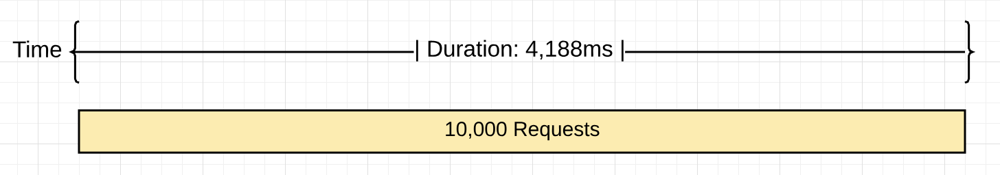
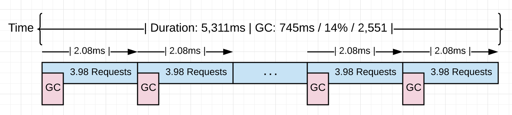
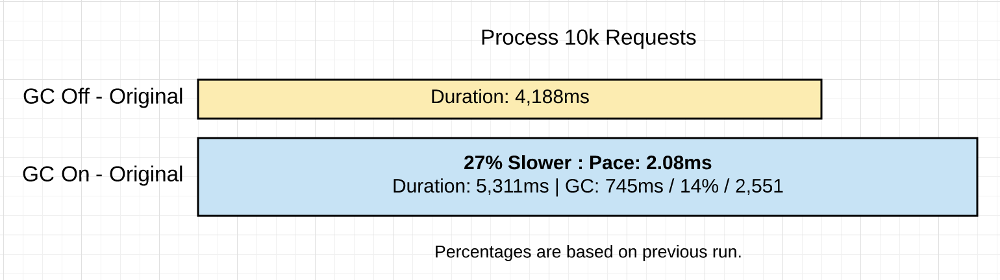
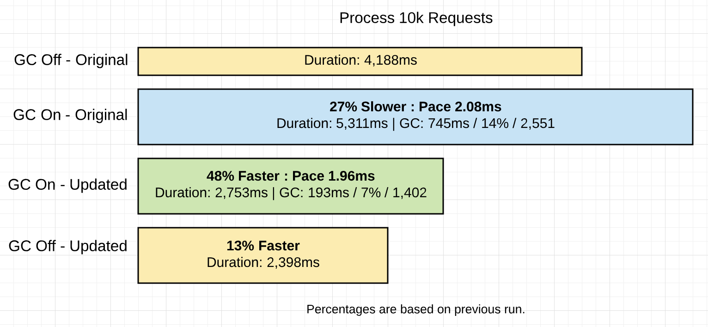

# Go 中的垃圾回收：第二部分 - GC 跟踪
### Prelude 前奏曲

This is the second post in a three part series that will provide an understanding of the mechanics and semantics behind the garbage collector in Go. This post focuses on how to generate GC traces and interpret them.  
这是三部分系列文章中的第二篇，将提供对 Go 中垃圾收集器背后的机制和语义的理解。本文重点介绍如何生成 GC 跟踪并解释它们。

Index of the three part series:  
三部分系列的索引：

1. [Garbage Collection In Go : Part I - Semantics](https://www.ardanlabs.com/blog/2018/12/garbage-collection-in-go-part1-semantics.html)
    [Go 中的垃圾回收：第一部分 - 语义](https://www.ardanlabs.com/blog/2018/12/garbage-collection-in-go-part1-semantics.html)
2. [Garbage Collection In Go : Part II - GC Traces](https://www.ardanlabs.com/blog/2019/05/garbage-collection-in-go-part2-gctraces.html)
    [Go 中的垃圾回收：第二部分 - GC 跟踪](https://www.ardanlabs.com/blog/2019/05/garbage-collection-in-go-part2-gctraces.html)
3. [Garbage Collection In Go : Part III - GC Pacing](https://www.ardanlabs.com/blog/2019/07/garbage-collection-in-go-part3-gcpacing.html)
    [Go 中的垃圾回收：第三部分 - GC Pacing](https://www.ardanlabs.com/blog/2019/07/garbage-collection-in-go-part3-gcpacing.html)
### Introduction 介绍

In the first post, I took the time to describe the behavior of the garbage collector and show the latencies that the collector inflicts on your running application. I shared how to generate and interpret a GC trace, showed how the memory on the heap is changing, and explained the different phases of the GC and how they affect latency cost.  
在第一篇文章中，我花时间描述了垃圾回收器的行为，并展示了回收器对正在运行的应用程序造成的延迟。我分享了如何生成和解释 GC 跟踪，展示了堆上的内存是如何变化的，并解释了 GC 的不同阶段以及它们如何影响延迟成本。

The final conclusion of that post was, if you reduce stress on the heap you will reduce the latency costs and therefore increase the application’s performance. I also made a point that it’s not a good strategy to decrease the pace at which collections start, by finding ways to increase the time between any two collections. A consistent pace, even if it’s quick, will be better at keeping the application running at top performance.  
该文章的最终结论是，如果减少堆上的压力，将降低延迟成本，从而提高应用程序的性能。我还指出，通过寻找增加任何两个集合之间的时间来降低集合开始的速度并不是一个好的策略。一致的速度，即使速度很快，也能更好地保持应用程序以最佳性能运行。

In this post, I will walk you through running a real web application and show you how to generate GC traces and application profiles. Then I will show you how to interpret the output from these tools so you can find ways to improve the performance of your applications.  
在这篇文章中，我将引导您运行一个真正的 Web 应用程序，并向您展示如何生成 GC 跟踪和应用程序配置文件。然后，我将向您展示如何解释这些工具的输出，以便您可以找到提高应用程序性能的方法。

### Running The Application 运行应用程序

Look at this web application that I use in the Go training.  
看看我在围棋训练中使用的这个 Web 应用程序。

**Figure 1 图1**  


[https://github.com/ardanlabs/gotraining/tree/master/topics/go/profiling/project](https://github.com/ardanlabs/gotraining/tree/master/topics/go/profiling/project)

Figure 1 shows what the application looks like. This application downloads three sets of rss feeds from different news providers and allows the user to perform searches. After building the web application, the application is started.  
图 1 显示了应用程序的外观。此应用程序从不同的新闻提供商下载三组 rss 提要，并允许用户执行搜索。生成 Web 应用程序后，将启动该应用程序。

**Listing 1 清单 1**

```
$ go build
$ GOGC=off ./project > /dev/null
```

Listing 1 show how the application is started with the `GOGC` variable set to `off`, which turns the garbage collection off. The logs are redirected to the `/dev/null` device. With the application running, requests can be posted into the server.  
清单 1 显示了如何在 `GOGC` 变量设置为 `off` 的情况下启动应用程序，这将关闭垃圾回收。日志将重定向到 `/dev/null` 设备。随着应用程序的运行，可以将请求发布到服务器中。

**Listing 2 清单 2**

```
$ hey -m POST -c 100 -n 10000 "http://localhost:5000/search?term=topic&cnn=on&bbc=on&nyt=on"
```

Listing 2 shows how 10k requests using 100 connections are run through the server using the `hey` tool. Once all the requests are sent through the server, this produces the following results.  
清单 2 显示了如何使用该 `hey` 工具在服务器中运行使用 100 个连接的 10k 个请求。通过服务器发送所有请求后，将产生以下结果。

**Figure 2 图2**  


Figure 2 shows a visual representation of processing 10k requests with the garbage collector off. It took 4,188ms to process the 10k requests which resulted in the server processing ~2,387 requests per second.  
图 2 显示了在垃圾回收器关闭的情况下处理 10k 请求的可视化表示。处理 10k 个请求需要 4,188 毫秒，导致服务器每秒处理 ~2,387 个请求。

### Turning on Garbage Collection  
打开垃圾回收

What happens when the garbage collection is turned on for this application?  
为此应用程序启用垃圾回收时会发生什么情况？

**Listing 3 清单 3**

```
$ GODEBUG=gctrace=1 ./project > /dev/null
```

Listing 3 shows how the application is started to see GC traces The `GOGC` variable is removed and replaced with the `GODEBUG` variable. The `GODEBUG` is set so the runtime generates a GC trace every time a collection happens. Now the same 10k requests can be run through the server again. Once all the requests are sent through the server, there are GC traces and information provided by the `hey` tool that can be analyzed.  
清单 3 显示了如何启动应用程序来查看 GC 跟踪 该 `GOGC` 变量被删除并替换为该 `GODEBUG` 变量。设置了 ， `GODEBUG` 以便运行时在每次发生收集时生成 GC 跟踪。现在，相同的 10k 请求可以再次通过服务器运行。一旦所有请求都通过服务器发送，就可以分析 `hey` 该工具提供的 GC 跟踪和信息。

**Listing 4 清单 4**

```
$ GODEBUG=gctrace=1 ./project > /dev/null
gc 3 @3.182s 0%: 0.015+0.59+0.096 ms clock, 0.19+0.10/1.3/3.0+1.1 ms cpu, 4->4->2 MB, 5 MB goal, 12 P
.
.
.
gc 2553 @8.452s 14%: 0.004+0.33+0.051 ms clock, 0.056+0.12/0.56/0.94+0.61 ms cpu, 4->4->2 MB, 5 MB goal, 12 P
```

Listing 4 shows a GC trace of the third and last collection from the run. I’m not showing the first two collections since the load was sent through the server after those collection took place. The last collection shows that it took 2551 collections (subtract the first two collections since they don’t count) to process the 10k requests.  
清单 4 显示了运行中第三个也是最后一个集合的 GC 跟踪。我没有显示前两个集合，因为加载是在这些集合发生后通过服务器发送的。最后一个集合显示需要 2551 个集合（减去前两个集合，因为它们不计算在内）来处理 10k 个请求。

Here is a break-down of each section in the trace.  
以下是跟踪中每个部分的细分。

**Listing 5 清单 5**

```
gc 2553 @8.452s 14%: 0.004+0.33+0.051 ms clock, 0.056+0.12/0.56/0.94+0.61 ms cpu, 4->4->2 MB, 5 MB goal, 12 P

gc 2553     : The 2553 GC runs since the program started
@8.452s     : Eight seconds since the program started
14%         : Fourteen percent of the available CPU so far has been spent in GC

// wall-clock
0.004ms     : STW        : Write-Barrier - Wait for all Ps to reach a GC safe-point.
0.33ms      : Concurrent : Marking
0.051ms     : STW        : Mark Term     - Write Barrier off and clean up.

// CPU time
0.056ms     : STW        : Write-Barrier
0.12ms      : Concurrent : Mark - Assist Time (GC performed in line with allocation)
0.56ms      : Concurrent : Mark - Background GC time
0.94ms      : Concurrent : Mark - Idle GC time
0.61ms      : STW        : Mark Term

4MB         : Heap memory in-use before the Marking started
4MB         : Heap memory in-use after the Marking finished
2MB         : Heap memory marked as live after the Marking finished
5MB         : Collection goal for heap memory in-use after Marking finished

// Threads
12P         : Number of logical processors or threads used to run Goroutines.
```

Listing 5 shows the actual numbers from the last collection. Thanks to `hey`, these are the performance results of the run.  
清单 5 显示了上一个集合的实际数字。感谢 `hey` ，这些是运行的性能结果。

**Listing 6 清单 6**

```
Requests            : 10,000
------------------------------------------------------
Requests/sec        : 1,882 r/s   - Hey
Total Duration      : 5,311ms     - Hey
Percent Time in GC  : 14%         - GC Trace
Total Collections   : 2,551       - GC Trace
------------------------------------------------------
Total GC Duration   : 744.54ms    - (5,311ms * .14)
Average Pace of GC  : ~2.08ms     - (5,311ms / 2,551)
Requests/Collection : ~3.98 r/gc  - (10,000 / 2,511)
```

Listing 6 shows the results. The following provides more of a visual of what happened.  
清单 6 显示了结果。下面提供了所发生情况的更多直观信息。

**Figure 3 图3**  


Figure 3 shows what happened visually. When the collector is turned on it had to run ~2.5k times to process the same 10k requests. Each collection on average is starting at a pace of ~2.0ms and running all these collections added an extra ~1.1 seconds of latency.  
图 3 直观地显示了发生的情况。当收集器打开时，它必须运行 ~2.5k 次才能处理相同的 10k 请求。每个集合平均以 ~2.0 毫秒的速度启动，运行所有这些集合会增加额外的 ~1.1 秒延迟。

**Figure 4 图4**  


Figure 4 shows a comparison of the two runs of the application so far.  
图 4 显示了到目前为止应用程序两次运行的比较。

### Reduce Allocations 减少分配

It would be great to get a profile of the heap and see if there are any non-productive allocations that can be removed.  
如果能获得堆的配置文件，看看是否有任何可以删除的非生产性分配，那就太好了。

**Listing 7 清单 7**

```bash
go tool pprof http://localhost:5000/debug/pprof/allocs
```

Listing 7 show the use of the `pprof` tool calling the `/debug/pprof/allocs` endpoint to pull a memory profile from the running application. That endpoint exists because of the following code.  
清单 7 显示了使用 `pprof` 调用 `/debug/pprof/allocs` 端点的工具从正在运行的应用程序中提取内存配置文件。由于以下代码，该终结点存在。

**Listing 8 清单 8**

```go
import _ "net/http/pprof"

go func() {
    http.ListenAndServe("localhost:5000", http.DefaultServeMux)
}()
```

Listing 8 shows how to bind the `/debug/pprof/allocs` endpoint to any application. Adding the import to `net/http/pprof` binds the endpoint to the default server mux. Then using `http.ListenAndServer` with the `http.DefaultServerMux` constant makes the endpoint available.  
清单 8 显示了如何将 `/debug/pprof/allocs` 端点绑定到任何应用程序。添加导入以 `net/http/pprof` 将终结点绑定到默认服务器多路复用器。然后，与 `http.DefaultServerMux` 常量一起使用 `http.ListenAndServer` 使终结点可用。

Once the profiler starts, the `top` command can be used to see the top 6 functions that are allocating the most.  
探查器启动后，该 `top` 命令可用于查看分配最多的前 6 个函数。

**Listing 9 清单 9**

```
(pprof) top 6 -cum
Showing nodes accounting for 0.56GB, 5.84% of 9.56GB total
Dropped 80 nodes (cum <= 0.05GB)
Showing top 6 nodes out of 51
      flat  flat%   sum%        cum   cum%
         0     0%     0%     4.96GB 51.90%  net/http.(*conn).serve
    0.49GB  5.11%  5.11%     4.93GB 51.55%  project/service.handler
         0     0%  5.11%     4.93GB 51.55%  net/http.(*ServeMux).ServeHTTP
         0     0%  5.11%     4.93GB 51.55%  net/http.HandlerFunc.ServeHTTP
         0     0%  5.11%     4.93GB 51.55%  net/http.serverHandler.ServeHTTP
    0.07GB  0.73%  5.84%     4.55GB 47.63%  project/search.rssSearch
```

Listing 9 shows how at the bottom of the list, the `rssSearch` function appears. This function allocated 4.55GB of the 5.96GB to date. Next, it’s time to inspect the details of the `rssSearch` function using the `list` command.  
清单 9 显示了该 `rssSearch` 函数在列表底部的显示方式。到目前为止，此功能分配了 5.96GB 中的 4.55GB。接下来，是时候使用 `list` 命令检查 `rssSearch` 函数的详细信息了。

**Listing 10 清单 10**

```
(pprof) list rssSearch
Total: 9.56GB
ROUTINE ======================== project/search.rssSearch in project/search/rss.go
   71.53MB     4.55GB (flat, cum) 47.63% of Total


         .          .    117:	// Capture the data we need for our results if we find ...
         .          .    118:	for _, item := range d.Channel.Items {
         .     4.48GB    119:		if strings.Contains(strings.ToLower(item.Description), strings.ToLower(term)) {
   48.53MB    48.53MB    120:			results = append(results, Result{
         .          .    121:				Engine:  engine,
         .          .    122:				Title:   item.Title,
         .          .    123:				Link:    item.Link,
         .          .    124:				Content: item.Description,
         .          .    125:			})
```

Figure 10 shows the listing and the code. Line 119 sticks out as the bulk of the allocations.  
图 10 显示了列表和代码。第 119 行是分配的大部分。

**Listing 11 清单 11**

```
         .     4.48GB    119:		if strings.Contains(strings.ToLower(item.Description), strings.ToLower(term)) {
```

Listing 11 shows the line of code in question. That line alone accounts for 4.48GB of the 4.55GB of memory that function has allocated to date. Next, it’s time to review that line of code to see what can be done if anything.  
清单 11 显示了有问题的代码行。仅该行就占了该功能迄今为止分配的 4.55GB 内存中的 4.48GB。接下来，是时候查看该行代码了，看看如果有的话可以做什么。

**Listing 12 清单 12**

```
117 // Capture the data we need for our results if we find the search term.
118 for _, item := range d.Channel.Items {
119     if strings.Contains(strings.ToLower(item.Description), strings.ToLower(term)) {
120         results = append(results, Result{
121             Engine:  engine,
122             Title:   item.Title,
123             Link:    item.Link,
124             Content: item.Description,
125        })
126    }
127 }
```

Listing 12 shows how that line of code is in a tight loop. The calls to `strings.ToLower` are creating allocations since they create new strings which will need to allocate on the heap. Those calls to `strings.ToLower` are unnecessary since those calls can be done outside the loop.  
清单 12 显示了该行代码是如何处于一个紧密循环中的。调用 `strings.ToLower` 正在创建分配，因为它们创建了需要在堆上分配的新字符串。这些调用 `strings.ToLower` 是不必要的，因为这些调用可以在循环之外完成。

Line 119 can be changed to remove all those allocations.  
可以更改第 119 行以删除所有这些分配。

**Listing 13 清单 13**

```go
// Before the code change.
if strings.Contains(strings.ToLower(item.Description), strings.ToLower(term)) {

// After the code change.
if strings.Contains(item.Description, term) {
```

_Note: The other code changes you don’t see is the call to make the Description lower before the feed is placed into the cache. The news feeds are cached every 15 minutes. The call to make the `term` lower is done right outside the loop.  
注意：您没有看到的其他代码更改是在将 Feed 放入缓存之前将“说明”降低的调用。新闻源每 15 分钟缓存一次。降低 `term` 的调用是在循环之外完成的。_

Listing 13 shows how the called to `strings.ToLower` are removed. The project is built again with these new code changes and the 10k requests are run through the server again.  
清单 13 显示了如何删除 called to `strings.ToLower` 。使用这些新的代码更改再次生成项目，并再次通过服务器运行 10k 个请求。

**Listing 14 清单 14**

```
$ go build
$ GODEBUG=gctrace=1 ./project > /dev/null
gc 3 @6.156s 0%: 0.011+0.72+0.068 ms clock, 0.13+0.21/1.5/3.2+0.82 ms cpu, 4->4->2 MB, 5 MB goal, 12 P
.
.
.
gc 1404 @8.808s 7%: 0.005+0.54+0.059 ms clock, 0.060+0.47/0.79/0.25+0.71 ms cpu, 4->5->2 MB, 5 MB goal, 12 P
```

Listing 14 shows how it now took 1402 collections to process the same 10k requests after that code change. These are the full results of both runs.  
清单 14 显示了在代码更改后，现在需要 1402 个集合来处理相同的 10k 个请求。这些是两次运行的完整结果。

**Listing 15 清单 15**

```
With Extra Allocations              Without Extra Allocations
======================================================================
Requests            : 10,000        Requests            : 10,000
----------------------------------------------------------------------
Requests/sec        : 1,882 r/s     Requests/sec        : 3,631 r/s
Total Duration      : 5,311ms       Total Duration      : 2,753 ms
Percent Time in GC  : 14%           Percent Time in GC  : 7%
Total Collections   : 2,551         Total Collections   : 1,402
----------------------------------------------------------------------
Total GC Duration   : 744.54ms      Total GC Duration   : 192.71 ms
Average Pace of GC  : ~2.08ms       Average Pace of GC  : ~1.96ms
Requests/Collection : ~3.98 r/gc    Requests/Collection : 7.13 r/gc
```

Listing 15 shows the results compared to the last results. The following provides more of a visual of what happened.  
清单 15 显示了与上一个结果的比较结果。下面提供了所发生情况的更多直观信息。

**Figure 5 图5**  


Figure 5 shows what happened visually. This time the collector ran 1149 times less (1,402 vs 2,551) to process the same 10k requests. That resulted in reducing the percent of total GC time down from 14% to 7%. That allowed the application to run 48% faster with %74 less time in collection.  
图 5 直观地显示了发生的情况。这一次，收集器在处理相同的 10k 请求时运行了 1149 倍（1,402 对 2,551）。这导致将总 GC 时间的百分比从 14% 降低到 7%。这使得应用程序的运行速度提高了 48%，收集时间减少了 74%。

**Figure 6 图6**  


Figure 6 shows a comparison of all the different runs of the application. I included a run of the optimized code running without the garbage collector to be complete.  
图 6 显示了应用程序所有不同运行的比较。我包括了一次优化代码的运行，这些代码在没有垃圾收集器的情况下运行。

### What We Learned 我们学到了什么

As I stated in the last post, being sympathetic with the collector is about reducing stress on the heap. Remember, stress can be defined as how fast the application is allocating all available memory on the heap within a given amount of time. When stress is reduced, the latencies being inflicted by the collector will be reduced. It’s the latencies that are slowing down your application.  
正如我在上一篇文章中所说，同情收集器是为了减轻堆的压力。请记住，压力可以定义为应用程序在给定时间内在堆上分配所有可用内存的速度。当压力降低时，收集器造成的延迟将减少。延迟会减慢您的应用程序速度。

It’s not about slowing down the pace of collection. It’s really about getting more work done between each collection or during the collection. You affect that by reducing the amount or the number of allocations any piece of work is adding to the heap.  
这并不是要放慢收集的步伐。这实际上是关于在每个集合之间或收集期间完成更多工作。您可以通过减少任何工作添加到堆中的分配量或数量来影响这一点。

**Listing 16 清单 16**

```
With Extra Allocations              Without Extra Allocations
======================================================================
Requests            : 10,000        Requests            : 10,000
----------------------------------------------------------------------
Requests/sec        : 1,882 r/s     Requests/sec        : 3,631 r/s
Total Duration      : 5,311ms       Total Duration      : 2,753 ms
Percent Time in GC  : 14%           Percent Time in GC  : 7%
Total Collections   : 2,551         Total Collections   : 1,402
----------------------------------------------------------------------
Total GC Duration   : 744.54ms      Total GC Duration   : 192.71 ms
Average Pace of GC  : ~2.08ms       Average Pace of GC  : ~1.96ms
Requests/Collection : ~3.98 r/gc    Requests/Collection : 7.13 r/gc
```

Listing 16 shows the results of the two versions of the applications with the garbage collection on. It is clear that removing the 4.48GB of allocations made the application run faster. What is interesting, is the average pace of each collection (for both versions) is virtually the same, at around ~2.0ms. What fundamentally changed between these two versions is the amount of work that is getting done between each collection. The application went from 3.98 r/gc to 7.13 r/gc. That is a 79.1% increase in the amount of work getting done.  
清单 16 显示了启用垃圾回收的两个版本的应用程序的结果。很明显，删除 4.48GB 的分配使应用程序运行得更快。有趣的是，每个集合（两个版本）的平均速度几乎相同，约为 ~2.0 毫秒。这两个版本之间的根本变化是每个集合之间完成的工作量。应用从 3.98 r/gc 变为 7.13 r/gc。这增加了 79.1% 的工作量。

Getting more work done between the start of any two collections helped to reduce the number of collections that were needed from 2,551 to 1,402, a 45% reduction. The application saw a %74 reduction in total GC time from 745ms to 193ms with a change from 14% to 7% of total time for each respective version being in collection. When you run the optimized version of the application without garbage collection, the difference in performance is only 13%, with the application taking 2,753ms down to 2,398ms.  
在开始任何两个集合之间完成更多的工作有助于将所需的集合数量从 2,551 个减少到 1,402 个，减少了 45%。该应用程序将总 GC 时间从 745 毫秒减少到 193 毫秒，减少了 74%，每个相应版本的总时间从 14% 减少到 7%。当您在没有垃圾回收的情况下运行应用程序的优化版本时，性能差异仅为 13%，应用程序需要 2,753 毫秒到 2,398 毫秒。

### Conclusion 结论

If you take the time to focus on reducing allocations, you are doing what you can as a Go developer to be sympathetic with the garbage collector. You are not going to write zero allocation applications so it’s important to recognize the difference between allocations that are productive (those helping the application) and those that are not productive (those hurting the application). Then put your faith and trust in the garbage collector to keep the heap healthy and your application running consistently.  
如果你花时间专注于减少分配，那么作为 Go 开发人员，你正在尽你所能去同情垃圾收集器。您不打算编写零分配应用程序，因此重要的是要认识到高效分配（帮助应用程序的分配）和非高效分配（损害应用程序的分配）之间的区别。然后，请相信并信任垃圾回收器，以保持堆的正常运行和应用程序的一致运行。

Having a garbage collector is a nice tradeoff. I will take the cost of garbage collection so I don’t have the burden of memory management. Go is about allowing you as a developer to be productive while still writing applications that are fast enough. The garbage collector is a big part of making that a reality. In the next post, I will share another program that shows how well the collector can analyze your Go applications and find the optimal collection path.  
拥有垃圾收集器是一个很好的权衡。我将承担垃圾回收的成本，这样我就没有内存管理的负担。Go 旨在让您作为开发人员在编写足够快的应用程序的同时提高工作效率。垃圾收集器是实现这一目标的重要组成部分。在下一篇文章中，我将分享另一个程序，该程序展示了收集器如何分析您的 Go 应用程序并找到最佳收集路径。