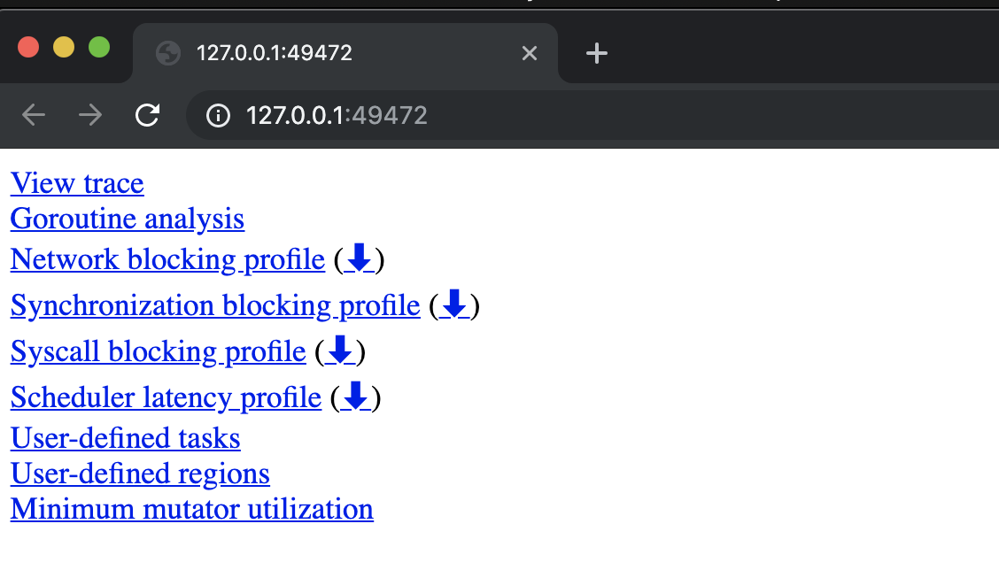
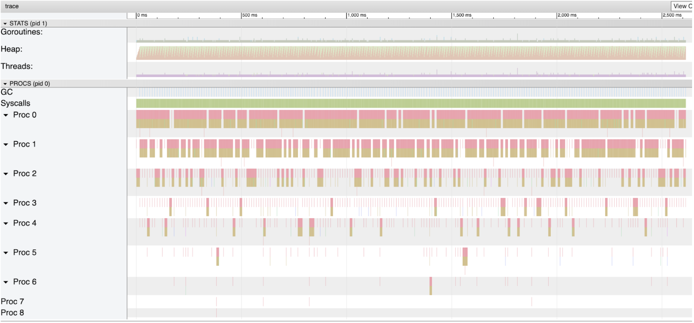
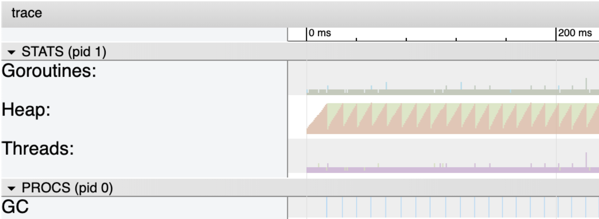
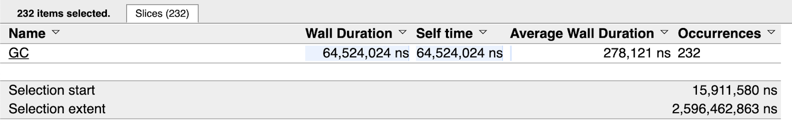
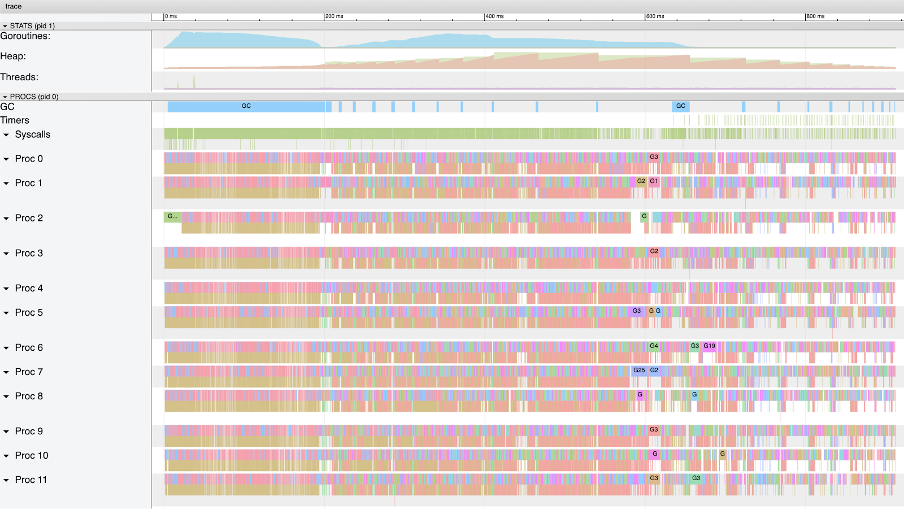
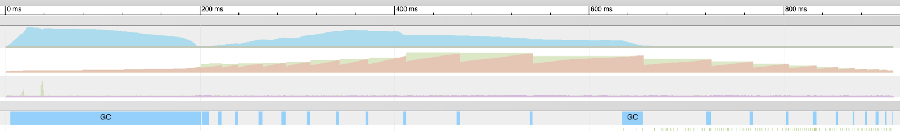
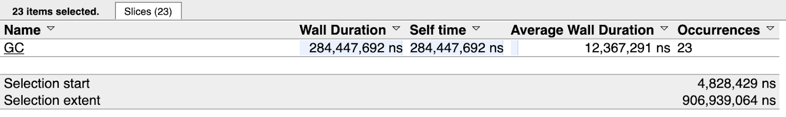
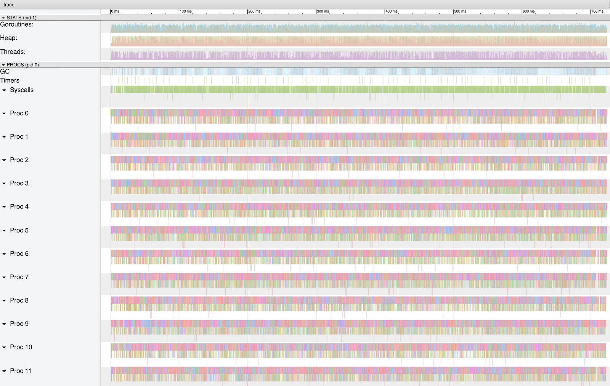
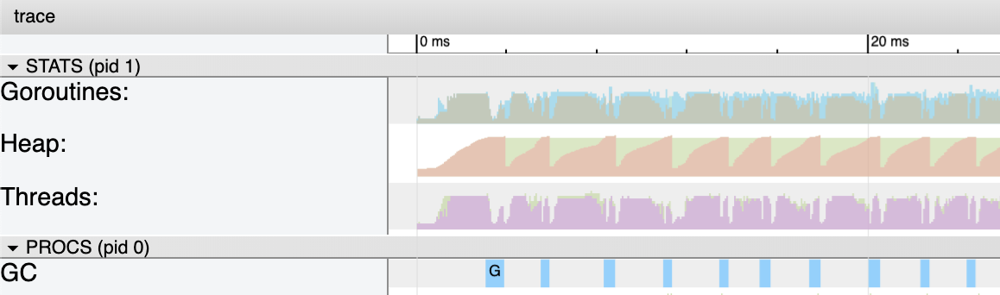
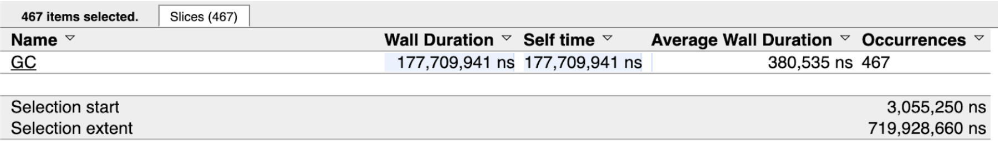

# Go 中的垃圾回收：第三部分 - GC 起搏

### Prelude 前奏曲

This is the third post in a three part series that will provide an understanding of the mechanics and semantics behind the garbage collector in Go. This post focuses on how the GC paces itself.  
这是三部分系列中的第三篇文章，将提供对 Go 中垃圾收集器背后的机制和语义的理解。这篇文章的重点是 GC 如何调整自己的节奏。

Index of the three part series:  
三部分系列的索引：

1. [Garbage Collection In Go : Part I - Semantics](https://www.ardanlabs.com/blog/2018/12/garbage-collection-in-go-part1-semantics.html)
    [Go 中的垃圾回收：第一部分 - 语义](https://www.ardanlabs.com/blog/2018/12/garbage-collection-in-go-part1-semantics.html)
2. [Garbage Collection In Go : Part II - GC Traces](https://www.ardanlabs.com/blog/2019/05/garbage-collection-in-go-part2-gctraces.html)
    [Go 中的垃圾回收：第二部分 - GC 跟踪](https://www.ardanlabs.com/blog/2019/05/garbage-collection-in-go-part2-gctraces.html)
3. [Garbage Collection In Go : Part III - GC Pacing](https://www.ardanlabs.com/blog/2019/07/garbage-collection-in-go-part3-gcpacing.html)
    [Go 中的垃圾回收：第三部分 - GC Pacing](https://www.ardanlabs.com/blog/2019/07/garbage-collection-in-go-part3-gcpacing.html)
### Introduction 介绍

In the second post, I showed you the behavior of the garbage collector and how to use the tooling to see the latencies that the collector inflicts on your running application. I walked you through running a real web application and showed you how to generate GC traces and application profiles. Then I showed you how to interpret the output from these tools so you can find ways to improve the performance of your applications.  
在第二篇文章中，我向您展示了垃圾回收器的行为，以及如何使用该工具查看回收器对正在运行的应用程序造成的延迟。我引导您运行一个真正的 Web 应用程序，并向您展示了如何生成 GC 跟踪和应用程序配置文件。然后，我向您展示了如何解释这些工具的输出，以便找到提高应用程序性能的方法。

The final conclusion of that post was the same as the first: if you reduce stress on the heap you will reduce the latency costs and therefore increase the application’s performance. The best strategy for being sympathetic with the garbage collector is to reduce the number or the amount of allocation per work being performed. In this post, I will show how the pacing algorithm is capable of identifying the optimal pace for a given workload over time.  
那篇文章的最终结论与第一篇文章相同：如果你减少堆上的压力，你将减少延迟成本，从而提高应用程序的性能。同情垃圾回收者的最佳策略是减少每个正在执行的工作的分配数量或数量。在这篇文章中，我将展示起搏算法如何能够识别给定工作负载随时间推移的最佳起步速度。

### Concurrent Example Code 并发示例代码

I am going to use the code located at this link.  
我将使用位于此链接中的代码。

[https://github.com/ardanlabs/gotraining/tree/master/topics/go/profiling/trace](https://github.com/ardanlabs/gotraining/tree/master/topics/go/profiling/trace)

This program identifies the frequency at which a particular topic can be found in a collection of RSS news feed documents. The trace program contains different versions of a find algorithm to test different concurrency patterns. I will concentrate on the `freq`, `freqConcurrent` and `freqNumCPU` versions of the algorithms.  
该程序标识在 RSS 新闻源文档集合中可以找到特定主题的频率。跟踪程序包含不同版本的查找算法，用于测试不同的并发模式。我将专注于算法的 `freq` 和 `freqConcurrent` `freqNumCPU` 版本。

_Note: I am running the code on a Macbook Pro with an Intel i9 processor with 12 hardware threads using go1.12.7. You will see different results on different architectures, operating systems and versions of Go. The core results of the post should remain the same.  
注意：我正在使用 go1.12.7 在配备 Intel i9 处理器和 12 个硬件线程的 Macbook Pro 上运行代码。您将在不同的架构、操作系统和 Go 版本上看到不同的结果。该职位的核心结果应保持不变。_

I will start with the `freq` version first. It represents a non-concurrent sequential version of the program. This will provide a baseline for the concurrent versions that follow.  
我将首先从 `freq` 版本开始。它表示程序的非并发顺序版本。这将为后续的并发版本提供基线。

**Listing 1 清单 1**

```go
func freq(topic string, docs []string) int {
    var found int

    for _, doc := range docs {
        file := fmt.Sprintf("%s.xml", doc[:8])
        f, err := os.OpenFile(file, os.O_RDONLY, 0)
        if err != nil {
            log.Printf("Opening Document [%s] : ERROR : %v", doc, err)
            return 0
        }
        defer f.Close()

        data, err := ioutil.ReadAll(f)
        if err != nil {
            log.Printf("Reading Document [%s] : ERROR : %v", doc, err)
            return 0
        }

        var d document
        if err := xml.Unmarshal(data, &d); err != nil {
            log.Printf("Decoding Document [%s] : ERROR : %v", doc, err)
            return 0
        }

        for _, item := range d.Channel.Items {
            if strings.Contains(item.Title, topic) {
                found++
                continue
            }

            if strings.Contains(item.Description, topic) {
                found++
            }
       }
    }

    return found
}
```

Listing 1 shows the `freq` function. This sequential version ranges over the collection of file names and performs four actions: open, read, decode and search. It does this for each file, one at a time.  
清单 1 显示了该 `freq` 函数。此顺序版本涵盖文件名集合，并执行四个操作：打开、读取、解码和搜索。它对每个文件执行此操作，一次一个。

When I run this version of `freq` on my machine, I get the following results.  
当我 `freq` 在我的机器上运行这个版本时，我得到以下结果。

**Listing 2 清单 2**

```
$ time ./trace
2019/07/02 13:40:49 Searching 4000 files, found president 28000 times.
./trace  2.54s user 0.12s system 105% cpu 2.512 total
```

You can see by the output of time, the program is taking ~2.5 seconds to process the 4000 files. It would be nice to see what percent of time was spent in garbage collection. You can do that by seeing a trace of the program. Since this is a program that starts and completes, you can use the trace package to generate a trace.  
从时间的输出可以看出，程序需要 ~2.5 秒来处理 4000 个文件。很高兴看到在垃圾收集上花费了多少时间。您可以通过查看程序的痕迹来做到这一点。由于这是一个启动和完成的程序，因此可以使用跟踪包来生成跟踪。

**Listing 3 清单 3**

```go
import "runtime/trace"

func main() {
    trace.Start(os.Stdout)
    defer trace.Stop()
```

Listing 3 shows the code you need to generate a trace from your program. After importing the `trace` package from the `runtime` folder in the standard library, make calls to `trace.Start` and `trace.Stop`. Directing the trace output to `os.Stdout` just simplies the code.  
清单 3 显示了从程序生成跟踪所需的代码。从标准库中的 `runtime` 文件夹导入 `trace` 包后，调用 `trace.Start` 和 `trace.Stop` 。将跟踪输出定向到 `os.Stdout` 只是隐晦的代码。

With this code in place, now you can rebuild and run the program again. Don’t forget to redirect `stdout` to a file.  
有了这段代码，现在您可以重新生成并再次运行程序。不要忘记重定向 `stdout` 到文件。

**Listing 4 清单 4**

```
$ go build
$ time ./trace > t.out
Searching 4000 files, found president 28000 times.
./trace > t.out  2.67s user 0.13s system 106% cpu 2.626 total
```

A little over 100 milliseconds was added to the runtime but that is expected. The trace captured every function call, in and out, down to the microsecond. What’s important is that now there is a file named `t.out` that contains the trace data.  
运行时增加了 100 毫秒多一点，但这是意料之中的。跟踪捕获每个函数调用，进出，精确到微秒。重要的是，现在有一个名为包含跟踪数据的文件 `t.out` 。

To look at the trace, the trace data needs to be run through the tracing tool.  
若要查看跟踪，需要通过跟踪工具运行跟踪数据。

**Listing 5 清单 5**

```bash
$ go tool trace t.out
```

Running that command launches the Chrome browser with the following screen.  
运行该命令将启动带有以下屏幕的 Chrome 浏览器。

_Note: The trace tooling is using tooling built into the Chrome browser. This tool only works in Chrome.  
注意：跟踪工具使用的是 Chrome 浏览器中内置的工具。此工具仅适用于 Chrome。_

**Figure 1 图1**  


Figure 1 shows the 9 links presented when the tracing tool launches. The important link right now is the first link that says `View trace`. Once you select that link, you will see something similar to the following.  
图 1 显示了跟踪工具启动时显示的 9 个链接。现在重要的链接是第一个链接，上面写着 `View trace` .选择该链接后，您将看到类似于以下内容的内容。

**Figure 2 图2**  


Figure 2 shows the full trace window from running the program on my machine. For this post, I will focus on the parts that are associated with the garbage collector. That is the second section labeled `Heap` and the fourth section labeled `GC`.  
图 2 显示了在我的机器上运行程序的完整跟踪窗口。在这篇文章中，我将重点介绍与垃圾回收器关联的部分。即标记的第二部分 `Heap` 和标记 `GC` 的第四部分。

**Figure 3 图3**  


Figure 3 shows a closer look at the first 200 milliseconds of the trace. Focus your attention on the `Heap` (green and orange area) and the `GC` (blue lines at the bottom). The `Heap` section is showing you two things. The orange area is the current in-use space on the heap at any given microsecond. The green is the amount of in-use space on the heap that will trigger the next collection. This is why every time the orange area reaches the top of the green area, a garbage collection takes place. The blue lines represent a garbage collection.  
图 3 显示了跟踪的前 200 毫秒的仔细观察。将注意力集中在（绿色和橙色区域）和 `Heap` `GC` （底部的蓝线）上。该 `Heap` 部分向您展示了两件事。橙色区域是堆上任何给定微秒的当前使用空间。绿色表示堆上将触发下一个集合的正在使用空间量。这就是为什么每次橙色区域到达绿色区域的顶部时，都会进行垃圾收集。蓝线表示垃圾回收。

In this version of the program, the memory in-use on the heap stays at ~4 meg for the entire run of the program. To see stats about all the individual garbage collections that took place, use the selection tool and draw a box around all the blue lines.  
在此版本的程序中，堆上正在使用的内存在整个程序运行期间保持在 ~4 meg。要查看有关发生的所有单个垃圾回收的统计信息，请使用选择工具并在所有蓝线周围绘制一个框。

**Figure 4 图4**  


Figure 4 shows how a blue box was drawn around the blue lines using the arrow tool. You want to draw the box around every line. The number inside the box represents the amount of time the items selected from the graph consume. In this case, close to 316 milliseconds (ms, μs, ns) were selected to generate this image. When all the blue lines are selected, the following stats are provided.  
图 4 显示了如何使用箭头工具在蓝线周围绘制蓝色框。您想在每条线周围绘制框。框内的数字表示从图形中选择的项目消耗的时间量。在这种情况下，选择了接近 316 毫秒（ms、μs、ns）来生成此图像。选择所有蓝线后，将提供以下统计信息。

**Figure 5 图5**  


Figure 5 shows that all the blue lines in the graph are between the 15.911 millisecond mark through the 2.596 second mark. There were 232 garbage collections that represented 64.524 milliseconds of time with the average collection taking 287.121 microseconds. Knowing the program took 2.626 seconds to run, this means that garbage collection only constitutes ~2% of the total run time. Essentially the garbage collector was an insignificant cost to running this program.  
图 5 显示图中的所有蓝线都在 15.911 毫秒标记到 2.596 秒标记之间。有 232 个垃圾回收，代表 64.524 毫秒的时间，平均回收需要 287.121 微秒。知道程序运行需要 2.626 秒，这意味着垃圾回收仅占总运行时间的 ~2%。从本质上讲，垃圾收集器对于运行这个程序来说是微不足道的。

With a baseline to work from, a concurrent algorithm can be used to perform the same work in the hope to speed up the program.  
有了基线，可以使用并发算法来执行相同的工作，以期加快程序的速度。

**Listing 6 清单 6**

```go
func freqConcurrent(topic string, docs []string) int {
    var found int32

    g := len(docs)
    var wg sync.WaitGroup
    wg.Add(g)

    for _, doc := range docs {
        go func(doc string) {
            var lFound int32
            defer func() {
                atomic.AddInt32(&found, lFound)
                wg.Done()
            }()

            file := fmt.Sprintf("%s.xml", doc[:8])
            f, err := os.OpenFile(file, os.O_RDONLY, 0)
            if err != nil {
                log.Printf("Opening Document [%s] : ERROR : %v", doc, err)
                return
            }
            defer f.Close()

            data, err := ioutil.ReadAll(f)
            if err != nil {
                log.Printf("Reading Document [%s] : ERROR : %v", doc, err)
                return
            }

            var d document
            if err := xml.Unmarshal(data, &d); err != nil {
                log.Printf("Decoding Document [%s] : ERROR : %v", doc, err)
                return
            }

            for _, item := range d.Channel.Items {
                if strings.Contains(item.Title, topic) {
                    lFound++
                    continue
                }

                if strings.Contains(item.Description, topic) {
                    lFound++
                }
            }
        }(doc)
    }

    wg.Wait()
    return int(found)
}
```

Listing 6 shows one possible concurrent version of `freq`. The core design patterns for this version is to use a fan out pattern. For every file listed in the `docs` collection, a goroutine is created to process that file. If there are 4000 documents to process, then 4000 goroutines are used. The advantage of this algorithm is that it’s the simplest way to leverage concurrency. Each goroutine processes 1 and only 1 file. The orchestration of waiting for every document to be processed can be performed using a `WaitGroup` and an atomic instruction can keep the counter synchronized.  
清单 6 显示了 `freq` 的一个可能的并发版本。此版本的核心设计模式是使用扇出模式。对于 `docs` 集合中列出的每个文件，都会创建一个 goroutine 来处理该文件。如果有 4000 个文档需要处理，则使用 4000 个 goroutine。这种算法的优点是它是利用并发的最简单方法。每个 goroutine 处理 1 个文件，并且只处理 1 个文件。等待每个文档被处理的编排可以使用原子指令来执行 `WaitGroup` ，并且原子指令可以使计数器保持同步。

The disadvantage of this algorithm is that it doesn’t scale well with the number of documents or cores. All the goroutines will be given time to run very early on in the start of the program, which means a large amount of memory will be consumed quickly. There are also cache coherency problems with the adding of the `found` variable on line 12. This is going to cause the thrashing of memory due to each core sharing the same cache line for this variable. This gets worse as the number of files or cores increase.  
这种算法的缺点是它不能很好地随着文档或核心的数量而扩展。在程序启动的早期，所有的 goroutines 都会有时间运行，这意味着大量的内存将被快速消耗。在第 12 行添加 `found` 变量时也存在缓存一致性问题。这将导致内存抖动，因为每个内核都共享此变量的相同缓存行。随着文件或内核数量的增加，情况会变得更糟。

With this code in place, now you can rebuild and run the program again.  
有了这段代码，现在您可以重新生成并再次运行程序。

**Listing 7 清单 7**

```
$ go build
$ time ./trace > t.out
Searching 4000 files, found president 28000 times.
./trace > t.out  6.49s user 2.46s system 941% cpu 0.951 total
```

You can see by the output in listing 7, the program is now taking 951 milliseconds to process the same 4000 files. That is a ~64% percent improvement in performance. Take a look at the trace.  
从清单 7 中的输出可以看出，程序现在需要 951 毫秒来处理相同的 4000 个文件。这是性能提升的 ~64%。看一下跟踪。

**Figure 6 图6**  


Figure 6 shows how much more of the CPU capacity on my machine is being used by this version of the program. There is a lot of density in the beginning of the graph. This is because as all the goroutines get created, they run and begin to attempt to allocate memory in the heap. As soon as the first 4 meg of memory is allocated, which is very quickly, a GC starts. During this GC, each Goroutine gets time to run and most get placed into a waiting state when they request memory on the heap. At least 9 goroutines get to continue to run and grow the heap to ~26 meg by the time this GC is complete.  
图 6 显示了此版本的程序在我的机器上使用了多少 CPU 容量。在图形的开头有很多密度。这是因为当所有 goroutines 被创建时，它们会运行并开始尝试在堆中分配内存。一旦分配了前 4 兆的内存，这非常快，GC 就会启动。在此 GC 期间，每个 Goroutine 都有运行时间，并且大多数 Goroutine 在堆上请求内存时都会进入等待状态。当这个 GC 完成时，至少有 9 个 goroutine 可以继续运行并将堆增加到 ~26 meg。

**Figure 7 图7**  


Figure 7 shows how large amounts of goroutines are in Runnable and Running states for a large portion of the first GC and how that starts up again quickly. Notice the heap profile looks irregular and collections are not on any regular cadence as before. If you look closely, a second GC starts almost immediately after the first.  
图 7 显示了在第一个 GC 的大部分时间里，有多少 goroutine 处于 Runnable 和 Running 状态，以及这些 goroutine 是如何快速再次启动的。请注意，堆配置文件看起来不规则，并且集合不像以前那样以任何规则的节奏进行。如果你仔细观察，第二个GC几乎在第一个GC之后立即开始。

If you select all the collections in this graph you will see the following.  
如果选择此图中的所有集合，则会看到以下内容。

**Figure 8 图8**  


Figure 8 shows that all the blue lines in the graph are between the 4.828 millisecond mark through the 906.939 millisecond mark. There were 23 garbage collections that represented 284.447 milliseconds of time with the average collection taking 12.367 milliseconds. Knowing the program took 951 milliseconds to run, this means that garbage collection constituted ~34% of the total run time.  
图 8 显示，图中的所有蓝线都位于 4.828 毫秒标记到 906.939 毫秒标记之间。有 23 个垃圾回收，代表 284.447 毫秒的时间，平均回收需要 12.367 毫秒。知道程序运行需要 951 毫秒，这意味着垃圾回收占总运行时间的 ~34%。

This is a significant difference in both performance and GC time from the sequential version. However, running more goroutines in parallel the way it was done, allowed the work to get done ~64% faster. The cost was needing a lot more resources on the machine. Unfortunate at its peak, ~200 meg of memory was in-use at one time on the heap.  
这与顺序版本在性能和 GC 时间方面存在显着差异。然而，以完成的方式并行运行更多的 goroutine，可以使工作完成速度提高 ~64%。成本是机器上需要更多的资源。不幸的是，在高峰期，~200 meg 的内存在堆上一次被使用。

With a concurrent baseline to work from, the next concurrent algorithm tries to be more efficient with resources.  
有了并发基线，下一个并发算法会尝试更有效地利用资源。

**Listing 8 清单 8**

```go
func freqNumCPU(topic string, docs []string) int {
    var found int32

    g := runtime.NumCPU()
    var wg sync.WaitGroup
    wg.Add(g)

    ch := make(chan string, g)

    for i := 0; i < g; i++ {
        go func() {
            var lFound int32
            defer func() {
                atomic.AddInt32(&found, lFound)
                wg.Done()
            }()

            for doc := range ch {
                file := fmt.Sprintf("%s.xml", doc[:8])
                f, err := os.OpenFile(file, os.O_RDONLY, 0)
                if err != nil {
                    log.Printf("Opening Document [%s] : ERROR : %v", doc, err)
                    return
                }

                data, err := ioutil.ReadAll(f)
                if err != nil {
                    f.Close()
                    log.Printf("Reading Document [%s] : ERROR : %v", doc, err)
                    return
                }
                f.Close()

                var d document
                if err := xml.Unmarshal(data, &d); err != nil {
                    log.Printf("Decoding Document [%s] : ERROR : %v", doc, err)
                    return
                }

                for _, item := range d.Channel.Items {
                    if strings.Contains(item.Title, topic) {
                        lFound++
                        continue
                    }

                    if strings.Contains(item.Description, topic) {
                        lFound++
                    }
                }
            }
        }()
    }

    for _, doc := range docs {
        ch <- doc
    }
    close(ch)

    wg.Wait()
    return int(found)
}
```

Listing 8 shows the `freqNumCPU` version of the program. The core design patterns for this version is to use a pooling pattern. A pool of goroutines based on the number of logical processors to process all the files. If there are 12 logical processors available for use, then 12 goroutines are used. The advantage of this algorithm is that it keeps the resource usage of the program consistent from beginning to end. Since a fixed number of goroutines are used, only the memory those 12 goroutines need at any given time is required. This also fixes the cache coherency problem with the memory thrashing. This is because the call to the atomic instruction on line 14 only has to happen a small fixed number of times.  
清单 8 显示了该程序的 `freqNumCPU` 版本。此版本的核心设计模式是使用池化模式。基于逻辑处理器数量的 goroutines 池，用于处理所有文件。如果有 12 个逻辑处理器可供使用，则使用 12 个 goroutine。这种算法的优点是它使程序的资源使用从头到尾保持一致。由于使用了固定数量的 goroutine，因此只需要这 12 个 goroutine 在任何给定时间所需的内存。这也修复了内存抖动的缓存一致性问题。这是因为对第 14 行原子指令的调用只需要发生少量固定次数。

The disadvantage of this algorithm is more complexity. It adds the use of a channel to feed the pool of goroutines all the work. Any time pooling is being used, identifying the “correct” number of goroutines for the pool is complicated. As a general rule, I give the pool 1 goroutine per logical processor to start. Then performing load testing or using production metrics, a final value for the pool can be calculated.  
这种算法的缺点是更复杂。它增加了使用通道来向 goroutines 池提供所有工作。每当使用池化时，确定池的“正确”goroutine数量都很复杂。作为一般规则，我为每个逻辑处理器提供池 1 个 goroutine 来启动。然后执行负载测试或使用生产指标，可以计算池的最终值。

With this code in place, now you can rebuild and run the program again.  
有了这段代码，现在您可以重新生成并再次运行程序。

**Listing 9 清单 9**

```
$ go build
$ time ./trace > t.out
Searching 4000 files, found president 28000 times.
./trace > t.out  6.22s user 0.64s system 909% cpu 0.754 total
```

You can see by the output in listing 9, the program is now taking 754 millisecond to process the same 4000 files. The program is ~200 milliseconds faster which is significant for this small load. Take a look at the trace.  
从清单 9 中的输出可以看出，程序现在需要 754 毫秒来处理相同的 4000 个文件。该程序快了 ~200 毫秒，这对于这种小负载来说意义重大。看一下跟踪。

**Figure 9 图9**  


Figure 9 shows how all of the CPU capacity on my machine is being used by this version of the program as well. If you look closely there is a consistent cadance to the program again. Very similar to the sequential version.  
图 9 显示了此版本的程序如何使用我机器上的所有 CPU 容量。如果你仔细观察，就会发现这个程序又有一个一致的音阶。与顺序版本非常相似。

**Figure 10 图10**  


Figure 10 shows how a closer view of the core metrics for the first 20 milliseconds of the program. The collections are definitely longer than the sequential version but there are 12 goroutines running. The memory in-use on the heap stays at ~4 meg for the entire run of the program. Again, the same as the sequential version of the program.  
图 10 显示了程序前 20 毫秒的核心指标的近距离视图。这些集合肯定比顺序版本长，但有 12 个 goroutines 在运行。在整个程序运行期间，堆上正在使用的内存保持在 ~4 meg。同样，与程序的顺序版本相同。

If you select all the collections in this graph you will see the following.  
如果选择此图中的所有集合，则会看到以下内容。

**Figure 11 图11**  


Figure 11 shows that all the blue lines in the graph are between the 3.055 millisecond mark through the 719.928 millisecond mark. There were 467 garbage collections that represented 177.709 milliseconds of time with the average collection taking 380.535 microseconds. Knowing the program took 754 milliseconds to run, this means that garbage collection constituted ~25% of the total run time. A 9% improvement over the other concurrent version.  
图 11 显示，图中的所有蓝线都位于 3.055 毫秒标记到 719.928 毫秒标记之间。有 467 个垃圾回收，代表 177.709 毫秒的时间，平均收集需要 380.535 微秒。知道程序运行需要 754 毫秒，这意味着垃圾回收占总运行时间的 ~25%。与其他并发版本相比，改进了 9%。

This version of the concurrent algorithm appears that it will scale better with more files and cores. The complexity cost in my opinion is worth the benefis. The channel could be replaced with slicing the list into a bucket of work for each Goroutine. This will definitely add more complexity though it could reduce some of the latency cost incurred by the channel. Over more files and cores, this could potentially be significant, but the complexity cost needs to be measured. This is something you can try yourself.  
此版本的并发算法似乎会随着更多文件和内核的扩展而更好地扩展。在我看来，复杂性成本是值得的。该频道可以替换为将列表切成每个 Goroutine 的工作桶。这肯定会增加更多的复杂性，尽管它可以减少通道产生的一些延迟成本。对于更多的文件和内核，这可能很重要，但需要衡量复杂性成本。这是您可以自己尝试的。

### Conclusion 结论

What I love about comparing the three versions of the algorithm is how the GC handled each situation. The total amount of memory required to process the files doesn’t change across any version. What changes is how the program allocates.  
我喜欢比较算法的三个版本，因为 GC 如何处理每种情况。处理文件所需的总内存量在任何版本中都不会改变。改变的是程序的分配方式。

When there is only one goroutine, a base 4 meg heap is all that is needed. When the program threw all the work at the runtime at once, the GC took the approach of letting the heap grow, reducing the number of collections but running longer collections. When the program controlled the number of files being worked on at any given time, the GC took the approach of keeping the heap small again, increasing the number of collections but running smaller collections. Each approach the GC took essentially allowed the programs to run with the minimal impact the GC could have on the program.  
当只有一个 goroutine 时，只需要一个以 4 为基数的 meg 堆。当程序在运行时一次性抛出所有工作时，GC 采取了让堆增长的方法，减少了集合的数量，但运行了更长的集合。当程序控制在任何给定时间处理的文件数量时，GC 采用的方法再次保持堆较小，增加集合数量但运行较小的集合。GC 采取的每种方法基本上都允许程序以最小的影响运行 GC 对程序的影响。

```
| Algorithm  | Program | GC Time  | % Of GC | # of GC’s | Avg GC   | Max Heap |
|------------|---------|----------|---------|-----------|----------|----------|
| freq       | 2626 ms |  64.5 ms |     ~2% |       232 |   278 μs |    4 meg |
| concurrent |  951 ms | 284.4 ms |    ~34% |        23 |  12.3 ms |  200 meg |
| numCPU     |  754 ms | 177.7 ms |    ~25% |       467 | 380.5 μs |    4 meg |
```

The `freqNumCPU` version has other things going for it like dealing with cache coherency better, which is helping. However, the difference in the total amount of GC time for each program is fairly close, ~284.4 ms vs ~177.7 ms. On some days running this program on my machine, those numbers are even closer. Running some experiments using version 1.13.beta1, I’ve seen both algorithms run at an equal time. Potentially suggesting their may be some improvements coming that allow the GC to better predict how to run.  
该 `freqNumCPU` 版本还有其他事情要做，比如更好地处理缓存一致性，这很有帮助。但是，每个程序的总 GC 时间差异相当接近，~284.4 ms 和 ~177.7 ms。在某些日子里，在我的机器上运行这个程序，这些数字甚至更接近。使用 1.13.beta1 版本运行一些实验，我看到两种算法在相同的时间运行。可能表明他们可能会进行一些改进，使 GC 能够更好地预测如何运行。

All of this gives me the confidence to throw a lot of work at the runtime. Such is a web service using 50k goroutines, which is essentially a fan out pattern similar to the first concurrent algorithm. The GC will study the workload and find the optimal pace for the service to get out of its way. At least for me, not having to think about any of this is worth the price of admission.  
所有这些都让我有信心在运行时投入大量工作。这是一个使用 50k goroutines 的 Web 服务，它本质上是一种类似于第一个并发算法的扇出模式。GC 将研究工作负载，并找到服务摆脱困境的最佳速度。至少对我来说，不必考虑这些都是值得的。