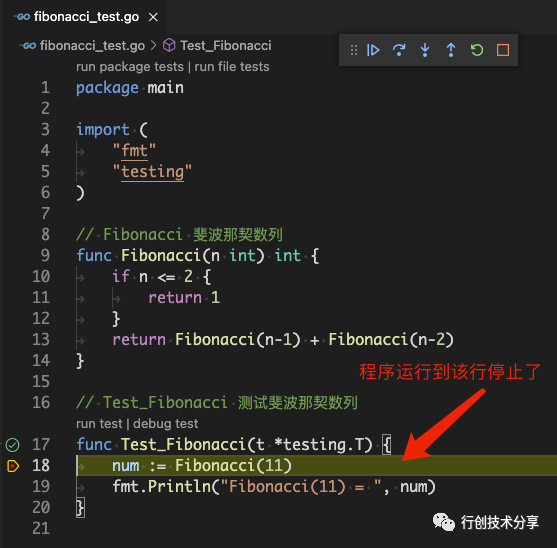
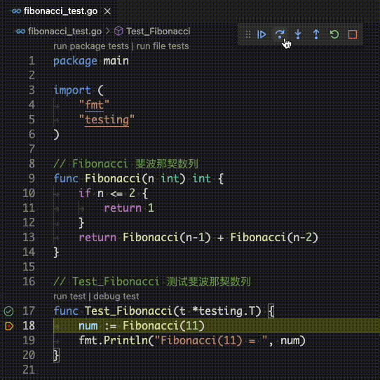
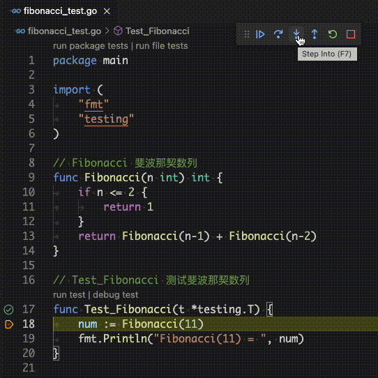
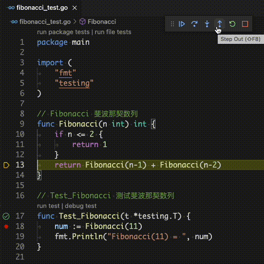
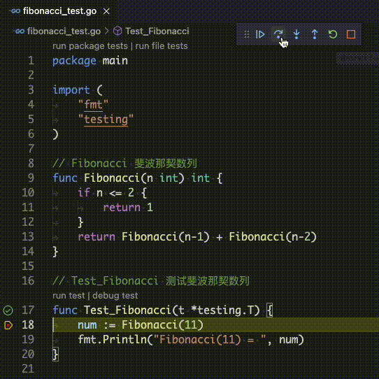
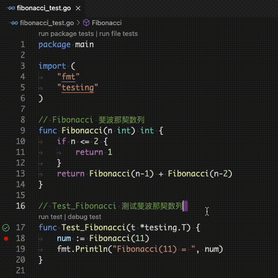

# Golang保姆级Debug教程


相信同学们在开发Golang程序的过程中一定会遇到各式各样意想不到的bug，那么如何快速的定位问题、解决bug呢？
相信同学们都有自己的方法，比如printf调试法，随缘调试法，借助调试工具调试法...当然其中最高效的方法就是借助调试工具调试法了。那么如何利用调试工具快速调试、定位问题呢？君子生非异也，善假于物也。
接下来为大家介绍使用vscodeIDE借助delve调试器对Golang进行简单的调试入门。

## 一、环境配置
vscode配置Golang的调试环境 [百度一下](https://www.baidu.com/s?word=vscode配置Golang的调试环境) 资料很多，在此就不详述了，请各位同学配置好debug环境，我们开始调试。

```json
// View -> RUN -> GO{对应语言} -> Lauch
{
    // Use IntelliSense to learn about possible attributes.
    // Hover to view descriptions of existing attributes.
    // For more information, visit: https://go.microsoft.com/fwlink/?linkid=830387
    "version": "0.2.0",
    "configurations": [
        {
            "name": "Launch Package",
            "type": "go",
            "request": "launch",
            "mode": "auto",
            "program": "${fileDirname}"
        }
    ]
}
```

## 二、调试入门



首先介绍下调试涉及的显示图标。断点（忽略绿色圆圈内有对勾的图标，与调试无关，它是我额外安装的插件，标识单测是否通过)：调试工具栏里可以看到以下6个图标按钮位：

- ：表示continue，当前图标表示程序已经运行到断点处，程序(协程)已经停在当前行，当前按钮的另一个状态是表示程序(协程)正在运行中；

-  /  / ：它们是程序调试过程中最常用的三个图标按钮，分别表示：

  - ：`step over`，单步按行执行程序代码，函数调用作为单行语句会一步执行完，调试不会进入函数内部，如18行调用了`Fibonacci`函数，则直接会执行完`18`行；

   

  - ：`step into`，单步执行，如果遇到函数则会进入到子函数的调用中，如果在`18`行的时候点击了`step into`，那么程序就会进入到`Fibonacci`函数中，则是第`9`行代码，从函数的定义处开始；

   

  - ：`step out`：表示跳出当前执行的函数，如`step into`的时候我们的代码执行到了`13`行，当时我们又不想让程序继续调用`13`行的代码，我们想直接到`19`行代码，那么我们可以通过`step over`一步一步执行，直到退出`Fibonacci`函数，或者我们使用`step out`函数，跳出当前函数调用，再点击`step over`，就可以顺利的退出`Fibonacci`函数，并将程序执行到`19`行；

   

-  /  ：表示`restart`/`stop` ；

  - ：表示将重新运行调试程序；

   

  - ：表示停止调试程序运行，程序会退出`debug`，与点击右上角关闭程序退出效果相同，你可以通过点击运行调试按钮继续运行程序。

   


- ：`breakpoint`表示断点，程序如果运行到该行会停止下来，上面你也看到了，程序会运行到断点处，当然断点也可以有多个，当你调试运行或者调试过程中点击`continue`的时候程序会在断点处停下来。也可以程序运行的时候动态的添加或者删除断点，以快速的进行调试你的程序代码。

<iframe 
    width="800" 
    height="450" 
    src="./statics/images/stack/golang/breakpoint.mp4"
    frameborder="0" 
    allowfullscreen>
</iframe>
(无声视频演示)

## 三、进阶调试

### 3.1 查看程序的变量

`debug`运行程序到断点的时候可以看到断点时的变量，左侧第四个按钮可以看到变量名以及对应的值。如图运行的时候可以看到变量`n`对应的值，方便检测程序运行时的状态。

<iframe 
    width="800" 
    height="450" 
    src="./statics/images/stack/golang/debug-view.mp4"
    frameborder="0" 
    allowfullscreen>
</iframe>
(无声视频演示)


### 3.2 条件断点
`debug`程序的时候断点在满足某个条件时停下来，方便程序的调试，如图`n == 7`当n等于7的时候程序停止下来，而不是等待程序一步一步执行，一般可以用于快速定位问题。也可以动态的修改条件断点对应的值，也可以写多个变量支持如：`(n > 3) && (n % 4 == 0)`当**n大于3**且**对4取余等于0**的时候断点生效。

<iframe 
    width="800" 
    height="450" 
    src="./statics/images/stack/golang/debug-breakpoint.mp4"
    frameborder="0" 
    allowfullscreen>
</iframe>
(无声视频演示)


### 3.3 函数调用堆栈
函数调用堆栈是什么？它有什么用？堆栈是程序运行时一个必须的记录函数调用路径和参数的空间。堆栈提供函数调用框架，具有传递参数，保存函数返回地址，提供局部变量空间等功能。

简单理解其实就是一个栈模型，每调用一个函数则压入函数调用栈，当调用函数`return`之后则从栈中弹出。可以方便调试，查看函数调用之间的参数传递，并且当程序`panic`的时候也会打印出来程序的调用堆栈信息，快速的定位问题。

如下图所示，可以看到当`n=2`的时候，函数递归调用的调用栈，自下往上依次由`n=11、n=10、n=9 …  n = 2`可以看到`Fibonacci`函数递归调用栈和入参的变量。

<iframe 
    width="800" 
    height="450" 
    src="./statics/images/stack/golang/debug-callstack.mp4"
    frameborder="0" 
    allowfullscreen>
</iframe>
(无声视频演示)

## 四、总结

以上就是一些常见的程序开发过程中的`debug`操作技巧，熟练应用可以提升自己的开发调试效率，快速定位到程序的`bug`所在。