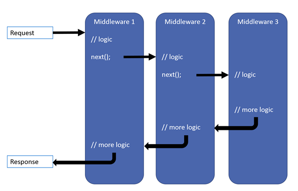
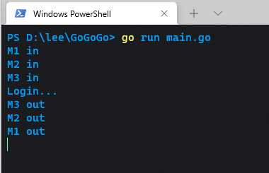

# Golang HTTP 简单中间件实现过程详解

> 本文在go web中简单的实现了中间件的机制，这样带来的好处也是显而易见的，当然社区也有一些成熟的 middleware 组件，包括 Gin 一些Web框架中也包含了 middleware 相关的功能，具体内容详情跟随小编一起看看吧
> 文章来源：https://www.jb51.net/article/218340.htm

本文主要针对Golang的内置库 net/http 做了简单的扩展，通过添加中间件的形式实现了管道(Pipeline)模式，这样的好处是各模块之间是低耦合的，符合单一职责原则，可以很灵活的通过中间件的形式添加一些功能到管道中，一次请求和响应在管道中的执行过程如下



首先, 我定义了三个测试的中间件` Middleware1,2,3` 如下

```go
func Middleware1(next http.Handler) http.Handler {
    return http.HandlerFunc(func(w http.ResponseWriter, r *http.Request) {
        fmt.Println("M1 in")
        next.ServeHTTP(w, r)
        fmt.Println("M1 out")
    })
}

func Middleware2(next http.Handler) http.Handler {
    return http.HandlerFunc(func(w http.ResponseWriter, r *http.Request) {
        fmt.Println("M2 in")
        next.ServeHTTP(w, r)
        fmt.Println("M2 out")
    })
}

func Middleware3(next http.Handler) http.Handler {
    return http.HandlerFunc(func(w http.ResponseWriter, r *http.Request) {
        fmt.Println("M3 in")
        next.ServeHTTP(w, r)
        fmt.Println("M3 out")
    })
}
```

这里中间件的入参和出参的类型都是 `http.Handler`, 然后在 `next.ServeHTTP()` 的前后分别输出了 `In` 和 `Out`.

接下来，定义一个 Pipeline 的方法，里面使用嵌套的形式, 使用了上面定义的三个测试的中间件.

```go
func Pipeline(next http.Handler) http.Handler {
    return Middleware1(Middleware2(Middleware3(next)))
}
```

然后还需要业务代码，这里我定义了 LoginHandler 和 RegisterHandler 两个方法

```go
func LoginHandler(w http.ResponseWriter, r *http.Request) {
    fmt.Println("Login...")
    w.Write([]byte("Login..."))
}

func RegisterHandler(w http.ResponseWriter, r *http.Request) {
    fmt.Println("Register...")
    w.Write([]byte("Register..."))
}

```

最后修改程序的 `main` 函数, 在 `Login` 接口上使用上面添加过中间件的 `Pipeline`

```go
func main() {

    http.Handle("/Login", Pipeline(http.HandlerFunc(LoginHandler)))

    http.Handle("/Register", http.HandlerFunc(RegisterHandler))

    http.ListenAndServe(":8080", nil)
}
```

启动程序后，访问 http://localhost:8080/Login, 程序的输出如下，这和本文最上面的管道的流程图是一致的，然后访问 `Register` 接口, 控制台没有输出信息，当然也不会执行任何中间件。



现在已经实现了中间件的机制，但是，上面添加中间件是用嵌套的方法，这种方式不能说不太优雅，只能说非常的Low，接下来我们需要对管道进行优化

```go
type Chain struct {
    middlewares []func(handler http.Handler) http.Handler
}

func Pipeline(next http.Handler) http.Handler {
    //return Middleware1(Middleware2(Middleware3(next)))
    return AddMiddlewares(Middleware1,Middleware2,Middleware3).Then(next)
} 

func AddMiddlewares(m ...func(handlerFunc http.Handler) http.Handler) Chain {
    c := Chain{}
    c.middlewares = append(c.middlewares,m...)
    return c
}

func (c Chain) Then(next http.Handler) http.Handler {
    for i := range c.middlewares {
        prev := c.middlewares[len(c.middlewares)-1-i]
        next = prev(next)
    }

    return next
} 
```

首先定义了一个 Chain 的 struct，用来接收添加到管道中的中间件，在 `AddMiddlewares()` 函数中，接收了多个Handle, 然后组装到 Chain 对象并返回, 接下来调用 `Then()` 函数, 把管道中的中间件和业务的 Handler 关联起来。在中间件的使用方式上， 这两种方法都是一样的，只需要调用 `Pipeline()` 方法就行了。

本文在go web中简单的实现了中间件的机制，这样带来的好处也是显而易见的，当然社区也有一些成熟的 middleware 组件，包括 Gin 一些Web框架中也包含了 middleware 相关的功能, 希望对您有用.