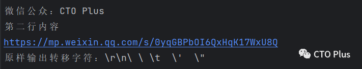

# Go 高效处理文本

Go语言中的字符串是一种不可变的字节（字符）序列（不可变类型，Python中也是如此）。字符串是由Unicode字符组成的，每个字符都用UTF-8编码表示（Go 语言字符串的内部实现使用UTF-8编码），即Go的字符串使用UTF8 编码。UTF8 的好处在于，如果基本是英文，每个字符占 1 byte，和 ASCII 编码是一样的，非常节省空间，如果是中文，一般占3字节。其中包含中文的字符串的处理方式与纯 ASCII 码构成的字符串有点区别。在Go中，字符串是以双引号包围的字符序列（在Python中可以使用单引号也可以使用双引号或者三组单双引号）。

本文我将详细介绍Go语言中字符串的定义、多种初始化方式和使用示例，包括字符串的拼接、长度、索引、切片、创建等操作，以及字符串的格式化转义。还介绍了字符串的不可变性，并通过reflect和rune对字符串的操作提取中文字符，介绍了字符串的多行字符串、数字转字符串和字符串常用的函数总结，在最后提供了一个完整的代码演示示例。

## **字符串的声明和初始化**

Go语言中的字符串以原生数据类型出现，使用字符串就像使用其他原生数据类型（int、bool、float32、float64 等）一样。可以在Go语言的源码中直接添加非ASCII码字符，例如：

```go
s1 := "hello steverocket"
s2 := "你好"
```

在Go语言中，可以使用双引号或反引号声明和初始化字符串。而单引号包裹的是字符，比如单独的数字、字母，汉字，符号。其中，字节，1个字节=8Bit（8个二进制位），一个字符'A' 等于1个字节，一个utf8编码的汉字一般占3个字节 （比如'周'）

```go
package main

import "fmt"

// 全局变量的字符串
var WEIXIN_URL = "https://mp.weixin.qq.com/s/0yqGBPbOI6QxHqK17WxU8Q"

func main() {
  str1 := "SteveRocket"     // 使用双引号声明字符串
  str2 := `公众号：CTO Plus` // 使用反引号声明字符串
  fmt.Println(WEIXIN_URL)
  fmt.Println(str1)
  fmt.Println(str2)
  /*
     outputs
        https://mp.weixin.qq.com/s/0yqGBPbOI6QxHqK17WxU8Q
        SteveRocket
        公众号：CTO Plus
  */ 

  c1 := '1'
  c2 := '周'
  c3 := 'A'
  fmt.Println(c1, c2, c3)              // 1 周 A
  fmt.Printf("%c %c %c\n", c1, c2, c3) // 1 周 A
}
```

其中，str1和str2都是字符串类型的变量。

## **字符串的格式化（转义符）**

Go语言中的字符串格式化可以使用fmt包中的函数，常用的函数有`Printf`、`Sprintf`和`Fprintf`等。

### Printf 函数

`Printf`函数可以将格式化后的字符串输出到标准输出，如下所示：

```go
name := "Tom"
age  := 18
fmt.Printf("My name is %s, I'm %d years old.\n", name, age)
```

其中，`%s`表示字符串类型的参数，`%d`表示整数类型的参数，`\n`表示换行符。

### Sprintf 函数

`Sprintf`函数可以将格式化后的字符串保存到一个字符串变量中，如下所示：

```go
str := fmt.Sprintf("My name is %s, I'm %d years old.\n", name, age)
```

其中，name和age表示要格式化的参数，str表示保存格式化后的字符串的变量。

举个例子，我们要打印一个Windows平台下的一个文件路径：

```go
package main

import (
    "fmt"
)

func main() {
    fmt.Println("str := \"c:\\pprof\\main.exe\"")
}
```

Go 语言的字符串常见转义符包含回车、换行、单双引号、制表符等，如下表所示。  

- `\r` 回车符（返回行首）
- `\n` 换行符（直接跳到下一行的同列位置）
- `\t` 制表符
- `'`   单引号
- `"` 双引号
- `\` 反斜杠

## **字符串的操作，拼接、长度、索引和切片**

Go语言中的字符串支持多种操作，包括获取字符串长度、访问字符串中的字符、截取字符串、字符串拼接和比较字符串等。

### 获取字符串长度

在Go语言中，获取字符串长度可以使用len函数。字符串的索引从0开始，可以使用[]运算符访问字符串的单个字符，如下所示：

```go
str := "hello, SteveRocket"
length := len(str)
```

其中，str表示要获取长度的字符串，length表示字符串的长度。

### 访问字符串中的字符

访问字符串中的字符可以通过下标访问，下标从0开始，如下所示：

```go
str := "微信公众号：CTO Plus"
char := str[0]
```

其中，str表示要访问的字符串，char表示字符串中的第一个字符。

需要注意的是，Go语言中的字符串是不可变类型，不能通过下标修改字符串中的字符。

### 截取字符串（切片操作）

在Go语言中，可以使用切片操作符[:]获取字符串的子串，如下所示：

```go
str := "hello, SteveRocket"
substr := str[0:5]
```

其中，str表示要截取的字符串，`substr`表示截取后的子字符串，`[0:5]`表示从字符串的第一个字符开始，截取5个字符。

```go
package main

import "fmt"

func main() {
    str := "Hello, World!"

    fmt.Println(str[0:5]) // 输出：Hello
    fmt.Println(str[7:])  // 输出：World!
    fmt.Println(str[:5])  // 输出：Hello
}
```

### 比较字符串

比较字符串可以使用`==`或`!=`运算符，如下所示：

```go
str1 := "hello, SteveRocket"
str2 := "hello, go"
if str1 == str2 {
    fmt.Println("str1 equals str2")
} else {
    fmt.Println("str1 not equals str2")
}
```

其中，str1和str2表示要比较的字符串，如果str1等于str2，则输出"str1 equals str2"，否则输出"str1 not equals str2"。

###  字符串的拼接

另外，Go语言中的字符串也可以使用+运算符进行拼接，如下所示：

```go
str3 := "Hello, " + "SteveRocket"
```

则str3表示字符串"Hello, SteveRocket"。

```go
package main

import "fmt"

func main() {
    str1 := "Hello"
    str2 := " SteveRocket "
    str3 := str1 + ", " + str2

    fmt.Println(str3) // 输出：Hello, SteveRocket
}
```

Go语言类似python，可以直接用'`+`'加号直接连接字符串，也可以用`Join`函数。也可以用fmt.Sprintf()格式化输出的方式临时拼接：`fmt.Sprintf("%s%s",s1,s2)`。

## **字符串的不可变性**

在Go语言中，字符串是不可变的，即不能修改字符串的某个字符。如果需要修改字符串，可以先将其转换为`[]byte`或`[]rune`类型，然后再进行修改。

```go
package main

import "fmt"

func main() {
  str := "微信公众号：CTO Plus"
  bytes := []byte(str)
  // 将字符C改为字符A
  bytes[18] = 'A'
  str = string(bytes)
  fmt.Println(str) // 微信公众号：ATO Plus 
}
```

## **结合reflect和rune对字符串的操作提取中文字符**

string是常量，不能修改其中的字符，但是可以把string转换为[]byte或[]rune类型。string底层是byte数组，string的长度就是该byte数组的长度，UTF-8编码下一个汉字占3个byte，即一个汉字占3个长度。

string中每个元素叫“字符”，字符有两种：
- `byte`：1个字节， 代表ASCII码的一个字符。
- `rune`：4个字节，代表一个UTF-8字符，一个汉字可用一个rune表示。

```go
package main

import (
  "fmt"
  "reflect"
)
func main() {
  str := "微信公众号：CTO Plus"
  str2 := "Author:SteveRocket"
  fmt.Println(reflect.TypeOf(str2[2]).Kind()) // uint8
  fmt.Println(str[18], string(str[18]))       // 67 C
  fmt.Printf("%d %c\n", str[0], str[0])       // 229 å
  fmt.Printf("%d %c\n", str2[0], str2[0])     // 65 A
  fmt.Println(len(str))                       // 26

  //将 string 转为 rune 数组
  runeArr := []rune(str)
  fmt.Println(reflect.TypeOf(runeArr[2]).Kind()) // int32
  // 取出中文
  fmt.Println(runeArr[2], string(runeArr[2])) // 20844 公
  //此处输出str的长度为14  跟上面的 26已经不一样了
  fmt.Println(len(runeArr)) // 14
}
```

`reflect.TypeOf().Kind() `可以知道某个变量的类型，我们可以看到，字符串是以 byte 数组形式保存的，类型是 uint8，占1个 byte，打印时需要用string 进行类型转换，否则打印的是编码值。

因为字符串是以 byte 数组的形式存储的，所以，str[0] 的值并不等于汉字微。str 的长度 `len(str)` 也不是14，而是26，中文部分：微信公众号：占`6*3=18byte`，CTO Plus占 8 byte，所以一共26占个byte。

然后就是使用将 string 转为rune 数组的方式，转换成 []rune 类型后，字符串中的每个字符，无论占多少个字节都用 int32 来表示，因而可以正确处理中文。

## **多行字符串**

Go语言中要定义一个多行字符串时，就必须使用反引号字符：

```go
func strFunc06() {
  multiLine := `微信公众：CTO Plus
第二行内容
https://mp.weixin.qq.com/s/0yqGBPbOI6QxHqK17WxU8Q
原样输出转移字符：\r\n\ \ \t  \'  \"
`
  fmt.Println(multiLine)
}
```

反引号里面的换行将被作为字符串中的换行，但是所有的转义字符均无效，文本将会原样输出。输出结果如下：  



## 数字转化字符串

1. `fmt.Println(string(num))`可以将数字作为字符输出

2. 但是有时候我们会需要直接将数字转化为字符串，可以使用`strconv`实现，如下代码示例：

```go
func numberToString() {
  //num := 68
  var num int = 67
  fmt.Println(string(num))
  fmt.Printf("%s\n", string(num))

  var num2 int = 1111
  fmt.Printf("%s\n", strconv.Itoa(num2)) // 1111 1111 公众号：CTO Plus
}
```

## **字符串的常用函数**

Go语言中的字符串还提供了一些常用的函数，如下所示：
### strings 包中的函数

strings包中提供了一些常用的字符串函数，如下所示：
- `len()`：获取字符串的长度。
- `+`或`fmt.Sprintf`：拼接字符串
- `strings.Contains(str, substr)`：判断字符串str是否包含子字符串substr。
- s`trings.Index(str, substr)`：返回子字符串substr在字符串str中第一次出现的位置，如果没有找到则返回-1。
- `strings.LastIndex(str, substr)`：返回子字符串substr在字符串str中最后一次出现的位置，如果没有找到则返回-1。
- `strings.Replace(str, old, new, n)`：将字符串str中的前n个old子字符串替换为new子字符串。
- `strings.Split(str, sep)`：将字符串str按照分隔符sep分割成多个子字符串，并返回一个字符串数组。
- `strings.ToLower(str)`：将字符串str转换为小写。
- `strings.ToUpper(str)`：将字符串str转换为大写。
- `strings.HasPrefix()`：判断字符串是否以指定前缀开头。
- `strings.HasSuffix()`：判断字符串是否以指定后缀结尾。
- `strings.Join(a[]string, sep string)`：join操作
- `strings.IndexAny()`：函数用于在字符串中查找指定字符集中的任意字符的第一个实例。它接受一个字符串和一个字符集参数，返回第一个匹配字符集中任意字符的索引位置。如果没有找到匹配字符，将返回-1。
- `strings.IndexByte()`：函数用于在字符串中查找指定字节的第一个实例。它接受一个字符串和一个字节参数，返回第一个匹配字节的索引位置。如果没有找到匹配字节，将返回-1。
- `strings.IndexFunc()`：函数用于在字符串中查找满足指定函数的第一个字符的实例。它接受一个字符串和一个函数参数，返回第一个满足函数条件的字符的索引位置。如果没有找到匹配字符，将返回-1。
- `strings.IndexRune()`：函数用于在字符串中查找指定Unicode码点的第一个实例。它接受一个字符串和一个Unicode码点参数，返回第一个匹配码点的索引位置。如果没有找到匹配码点，将返回-1。
- `strings.Compare()`：函数用于比较两个字符串的大小关系。它接受两个字符串参数，返回一个整数值。如果第一个字符串小于第二个字符串，返回负数；如果两个字符串相等，返回0；如果第一个字符串大于第二个字符串，返回正数。
- `strings.ContainsAny()`：函数用于判断字符串中是否包含任意一个指定的字符。它接受两个字符串参数，返回一个布尔值。如果字符串中包含任意一个指定的字符，返回true；否则返回false。
- `strings.ContainsRune()`：函数用于判断字符串中是否包含指定的Unicode码点。它接受一个字符串和一个Unicode码点参数，返回一个布尔值。如果字符串中包含指定的码点，返回true；否则返回false。
- `strings.EqualFold()`：函数用于比较两个字符串是否相等，不区分大小写。它接受两个字符串参数，返回一个布尔值。如果两个字符串相等（不区分大小写），返回true；否则返回false。
- `strings.Fields()`：函数用于将字符串按照空格分割成多个子字符串，并返回一个切片。它接受一个字符串参数，返回一个切片，其中每个元素都是一个子字符串。
- `strings.FieldsFunc()`：函数用于将字符串按照指定的函数分割成多个子字符串，并返回一个切片。它接受一个字符串和一个函数参数，返回一个切片，其中每个元素都是一个子字符串。函数参数用于指定分割字符串的规则。

### strconv 包中的函数

strconv包中提供了一些字符串和其他类型之间的转换函数，如下所示：
- `strconv.Atoi(str)`：将字符串str转换为整数类型。
- `strconv.ParseFloat(str, bitSize)`：将字符串str转换为浮点数类型，bitSize表示浮点数的位数。
- `strconv.Itoa(i)`：将整数i转换为字符串类型。
- `strconv.FormatFloat(f, 'f', -1, bitSize)`：将浮点数f转换为字符串类型，bitSize表示浮点数的位数。
- `strconv.ParseBool()`：函数用于将字符串解析为布尔值。它接受字符串参数，返回解析后的布尔值和一个错误。如果解析成功，布尔值为true或false，错误为nil；如果解析失败，布尔值为false，错误为相应的解析错误。
- `strconv.ParseInt()`：函数用于将字符串解析为整数。它接受字符串、进制和位大小参数，返回解析后的整数和一个错误。如果解析成功，整数为解析的值，错误为nil；如果解析失败，整数为0，错误为相应的解析错误。
- `strconv.ParseComplex()`：函数用于将字符串解析为复数。它接受字符串和位大小参数，返回解析后的复数和一个错误。如果解析成功，复数为解析的值，错误为nil；如果解析失败，复数为0，错误为相应的解析错误。
- `strconv.ParseUint()`：函数用于将字符串解析为无符号整数。它接受字符串、进制和位大小参数，返回解析后的无符号整数和一个错误。如果解析成功，无符号整数为解析的值，错误为nil；如果解析失败，无符号整数为0，错误为相应的解析错误。

这些函数的作用是将字符串解析为对应的数据类型，并返回解析后的值。它们可以用于将字符串转换为布尔值、整数、复数和无符号整数。

## 完整代码示例

```go
package main

import (
  "fmt"
  "strconv"
  "strings"
)

var information = "公众号：CTO Plus，blog：https://mp.weixin.qq.com/s/0yqGBPbOI6QxHqK17WxU8Q"

func stringsFunc() {
  fmt.Println(len(information))                                         // 79
  fmt.Printf("\"s\" length=%d\n", len("A"))                             // "s" length=1
  fmt.Printf("%d\n", len("中"))                                          // 3
  fmt.Println(strings.Contains(information, "CTO"))                     //true
  fmt.Println(strings.Index(information, "http"))                       // 30
  fmt.Println(strings.LastIndex(information, "o"))                      // 52
  fmt.Println(strings.Replace(information, "s", "S", 3))                // 公众号：CTO PluS，blog：httpS://mp.weixin.qq.com/S/0yqGBPbOI6QxHqK17WxU8Q
  fmt.Println(strings.ReplaceAll(information, "q", "Q"))                // 公众号：CTO Plus，blog：https://mp.weixin.QQ.com/s/0yQGBPbOI6QxHQK17WxU8Q
  fmt.Println(strings.Split(information, "/"))                          // [公众号：CTO Plus，blog：https:  mp.weixin.qq.com s 0yqGBPbOI6QxHqK17WxU8Q]
  fmt.Println(strings.SplitN(information, "/", 2))                      //[公众号：CTO Plus，blog：https: /mp.weixin.qq.com/s/0yqGBPbOI6QxHqK17WxU8Q]
  fmt.Println(strings.SplitAfter(information, "/"))                     // [公众号：CTO Plus，blog：https:/ / mp.weixin.qq.com/ s/ 0yqGBPbOI6QxHqK17WxU8Q]
  fmt.Println(strings.SplitAfterN(information, "/", 2))                 // [公众号：CTO Plus，blog：https:/ /mp.weixin.qq.com/s/0yqGBPbOI6QxHqK17WxU8Q]
  fmt.Println(strings.ToLower(information))                             // 公众号：cto plus，blog：https://mp.weixin.qq.com/s/0yqgbpboi6qxhqk17wxu8q
  fmt.Println(strings.ToUpper(information))                             // 公众号：CTO PLUS，BLOG：HTTPS://MP.WEIXIN.QQ.COM/S/0YQGBPBOI6QXHQK17WXU8Q
  fmt.Println(strings.HasSuffix(information, "0yqGBPbOI6QxHqK17WxU8Q")) // 以指定字符串结尾  true
  fmt.Println(strings.HasPrefix(information, "公众号"))                    // 以指定字符串开头  true

  //fmt.Println(strings.Count(information, 'o'))  // 错误用法，第二个参数必须是字符串，cannot use 'o' (type untyped rune) as type string in argument to strings.Count
  fmt.Println(strings.Count(information, "o")) // 2


  fmt.Println(strings.IndexAny("SteveRocket", "steve"))  // 1
  fmt.Println(strings.IndexAny("SteveRocket", "CTO Plus"))  // -1
  fmt.Println(strings.IndexByte("SteveRocket", 'S')) // 0
  fmt.Println(strings.IndexByte("SteveRocket", 'X')) // -1

  fmt.Println(strings.IndexFunc("SteveRocket", func(r rune) bool {
    return r == 'R'
  }))  // 5

  fmt.Println(strings.IndexRune("SteveRocket", 'S')) // 0
  fmt.Println(strings.IndexRune("SteveRocket", 'X')) // -1

  fmt.Println(strings.Compare("SteveRocket","SteveRocket"))  // 0
  fmt.Println(strings.Compare("SteveRocket","steverocket"))  // -1
  fmt.Println(strings.Compare("SteveRocket", "CTO Plus"))  // 1
  fmt.Println(strings.Compare("SteveRocket", "steve"))  // -1

  fmt.Println(strings.ContainsAny("SteveRocket", "rocket"))  // true
  fmt.Println(strings.ContainsAny("SteveRocket", "plm"))  // false

  fmt.Println(strings.ContainsRune("SteveRocket", 'r'))  // false
  fmt.Println(strings.ContainsRune("SteveRocket", 'X'))  // false

  fmt.Println(strings.EqualFold("SteveRocket", "rocket"))  // false
  fmt.Println(strings.EqualFold("SteveRocket", "STEVEROCKET"))  // true
  fmt.Println(strings.EqualFold("SteveRocket", "seven"))  // false

  fmt.Println(strings.Fields("SteveRocket"))  // [SteveRocket]
  fmt.Println(strings.Fields("   Steve   Rocket    "))  // [Steve Rocket]
  fmt.Println(strings.FieldsFunc("Steve Rocket", func(r rune) bool {
    return r == 'R'
  }))  // [Steve  ocket]
}

func strconvFunc() {
  //fmt.Println(strconv.Atoi(information))
  //0 strconv.Atoi: parsing "公众号：CTO Plus，blog：https://mp.weixin.qq.com/s/0yqGBPbOI6QxHqK17WxU8Q": invalid syntax

  //fmt.Println(strconv.ParseFloat(information, 1))
  //0 strconv.ParseFloat: parsing "公众号：CTO Plus，blog：https://mp.weixin.qq.com/s/0yqGBPbOI6QxHqK17WxU8Q": invalid syntax

  fmt.Println(strconv.Itoa(78))  // 78
  fmt.Println(strconv.FormatFloat(1.23456, 'f', 5, 64))  // 1.23456
  fmt.Println(strconv.FormatInt(123456, 2))  // 11110001001000000


  //strconv.Atoi()函数用于将字符串转换为整数类型。它接受一个字符串参数，返回转换后的整数值和一个错误。如果转换失败，将返回错误。
  fmt.Println(strconv.Atoi("123456"))  // 123456 <nil>

  //strconv.ParseFloat()函数用于将字符串转换为浮点数类型。它接受一个字符串参数和一个位数参数，返回转换后的浮点数值和一个错误。如果转换失败，将返回错误。
  fmt.Println(strconv.ParseFloat("1.233455666", 6))  // 1.233455666 <nil>

  //strconv.Itoa()函数用于将整数转换为字符串类型。它接受一个整数参数，返回转换后的字符串。
  fmt.Println(strconv.Itoa(12345678))  // 12345678

  //strconv.FormatFloat()函数用于将浮点数转换为字符串类型。它接受一个浮点数参数、格式参数和位数参数，返回转换后的字符串。
  fmt.Println(strconv.FormatFloat(3.14, 'f', 2,64)) // 3.14

  //strconv.FormatInt()函数用于将整数转换为字符串类型。它接受一个整数参数、基数参数和位数参数，返回转换后的字符串。
  fmt.Println(strconv.FormatInt(123, 10))  // 123

  //strconv.ParseBool()函数用于将字符串解析为布尔值。它接受一个字符串参数，返回解析后的布尔值和一个错误。如果字符串是"true"或"1"，则返回true；如果字符串是"false"或"0"，则返回false；否则返回错误。
  boolean, err := strconv.ParseBool("123")

  fmt.Println(strconv.ParseBool("true"))  // true <nil>
  fmt.Println(strconv.ParseBool("false")) // false <nil>
  if err != nil{
    fmt.Println(boolean, err)  // false strconv.ParseBool: parsing "123": invalid syntax
  }

  // strconv.ParseInt()函数用于将字符串解析为整数。它接受一个字符串参数、基数参数和位数参数，返回解析后的整数值和一个错误。基数参数指定了字符串表示的数值的进制，位数参数指定了结果的位数，可以是0、8、10或16。如果解析失败，则返回错误。
  fmt.Println(strconv.ParseInt("123456", 10, 64))  // 123456 <nil>

  //strconv.ParseComplex()函数用于将字符串解析为复数。它接受一个字符串参数，返回解析后的复数值和一个错误。字符串的格式可以是"real+imagi"或"real+imagj"，其中real表示实部，imag表示虚部。如果解析失败，则返回错误。
  fmt.Println(strconv.ParseComplex("3+4i", 64)) // (3+4i) <nil>

  //strconv.ParseUint()函数用于将字符串解析为无符号整数。它接受一个字符串参数、基数参数和位数参数，返回解析后的无符号整数值和一个错误。基数参数指定了字符串表示的数值的进制，位数参数指定了结果的位数，可以是0、8、10或16。如果解析失败，则返回错误。
  fmt.Println(strconv.ParseUint("123", 10, 64))  // 123 <nil>
}

func strConvert() {
  s1 := "公众号："
  s2 := "CTO Plus"
  s3 := "，blog："
  s4 := "https://"
  s5 := "mp.weixin.qq.com"
  s6 := "/s/"
  s7 := "0yqGBPbOI6QxHqK17WxU8Q"
  merged := strings.Join([]string{s1, s2, s3, s4, s5, s6, s7}, "")
  fmt.Println(merged)                // 公众号：CTO Plus，blog：https://mp.weixin.qq.com/s/0yqGBPbOI6QxHqK17WxU8Q
  fmt.Println(merged == information) // true

  //把多个字符串拼接成一个长的字符串有多种方式。
  //当有大量的string需要拼接时，用strings.Builder效率最高
  strBuilder := strings.Builder{}
  strBuilder.WriteString(s1)
  strBuilder.WriteString(s2)
  strBuilder.WriteString(s3)
  strBuilder.WriteString(s4)
  strBuilder.WriteString(s5)
  strBuilder.WriteString(s6)
  strBuilder.WriteString(s7)
  newInformation := strBuilder.String()
  fmt.Println(newInformation)                // 公众号：CTO Plus，blog：https://mp.weixin.qq.com/s/0yqGBPbOI6QxHqK17WxU8Q
  fmt.Println(newInformation == information) // true

  arrInformation := []byte(newInformation)
  runeInformation := []rune(newInformation)
  // string可以转换为[]byte或[]rune类型
  fmt.Printf("byte %d\n", arrInformation[len(arrInformation)-1]) // byte 81
  //byte或rune可以转为string
  fmt.Printf("byte %c\n", arrInformation[len(arrInformation)-1]) // byte Q

  fmt.Printf("rune %d\n", runeInformation[len(runeInformation)-1]) // rune 81
  fmt.Printf("rune %c\n", runeInformation[len(runeInformation)-1]) // rune Q

  for i := 0; i < len(runeInformation); i++ {
    fmt.Printf("%c", arrInformation[i])
  }
}
```

## **总结**

最后总结下本文的内容，本文详细介绍了Go语言中字符串的创建、操作、格式化和常用函数等内容。

本篇文章总结的知识点如下：
- 字符串是一种不可变类型（不可变的字节序列），由Unicode字符组成。
- 字符串可以使用双引号或反引号声明和初始化。
- 字符串支持多种操作，包括获取字符串长度、访问字符串中的字符、截取字符串、比较字符串等，比如：
- 可以使用`len()`函数获取字符串的长度。
- 可以使用`[]`运算符访问字符串的单个字符。
- 可以使用`+`运算符将两个字符串拼接在一起。
- 可以使用切片操作符`[:]`获取字符串的子串。
- 可以使用`for range`循环遍历字符串的每个字符。
- 字符串的格式化可以使用fmt包中的函数，常用的函数有`Printf`、`Sprintf`和`Fprintf`等。
- 字符串还提供了一些常用的函数，如`strings`包中的函数和`strconv`包中的函数处理字符串。
- 字符串是不可变的，如果需要修改字符串，可以先将其转换为`[]byte`或`[]rune`类型。