# 只改一个参数让Golang GC耗时暴降到1/30！


👉导读

Golang GC 问题的处理网上有比较多的参考文章与教程，本文则聚焦在一次实际业务场景中遇到的问题，并将问题排查处理的全过程详细地做了整理记录，相信对各位 Gopher 有较大参考价值。

👉目录

1. 问题现象
2. 确定原因
3. 根因分析  
4. 刨根问底  
5. 解决方案
6. 问题解决
7. 总结

## 01 问题现象 

最近有调用方反馈，在使用我们提供的某接口一段时间后，超时率的毛刺比较多，有时候成功率会突然掉到 99.5% 以下，触发业务告警。

经过排查，了解到客户因为测试我们的接口时的平均耗时很低（18ms），所以在线上设置了比较严格的超时时间，150ms。

虽然 150ms 确实比较严格，但根据历史经验，这个接口的内网 TP99 也不会超过 100ms，150ms 的超时时间不应该带来 0.5% 这么高的失败率抖动，于是开始深入排查。

首先是监控，我们的服务有一个专门的错误码来表示客户端断开链接，大多数情况下也就是服务端还在处理，但客户端认为超时时间到了，主动断开。观察此调用方的主动断连监控（请求数为客户端断连次数）：

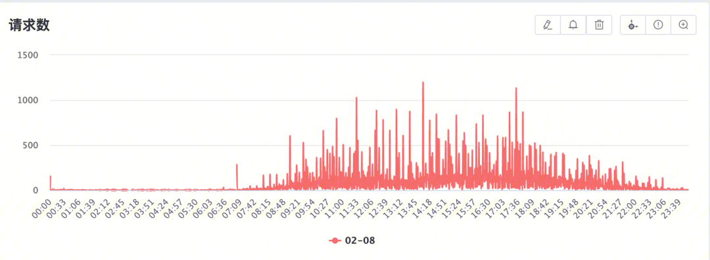

发现抖动确实比较明显，而且分钟级别毛刺最高达到 1000+ ，确实可能导致调用方的失败率告警。

## 02 确定原因

在排除了常见的可能问题（服务单点故障，依赖组件性能问题）之后，再看业务监控已经没什么帮助了，需要仔细分析服务自己的 Metrics 才可能找到原因。

首先发现问题的是 `GCCPUFraction` （左侧）这一项：


这一项的含义是 **GC** 使用的 **CPU** 占总 **CPU** 使用的比值，官方文档中是一个 0 - 1 的值，上报时做了 x1000 处理，所以这里是千分比。

也就是说，服务平均有 2% 以上的 CPU 使用在了 GC 上，最严重的机器甚至超过了 4%。

右边这一项 PauseNS 是 **GC** 的 **STW** 阶段耗时，这个值在 500us 左右。上报的是最近 256 次 GC 的平均值，如果平均值有 0.5ms，那么极大值达到几毫秒甚至十几毫秒也是有可能的。

看到了这两个指标之后，猜测造成请求超时毛刺的原因可能是 GC 的 STW 阶段会偶尔耗时过长，导致一些本来可以处理的请求，因为 `STW` 而超过了客户端的超时时间，造成超时毛刺。

Pause 耗时区间的数量也可以佐证这一点：

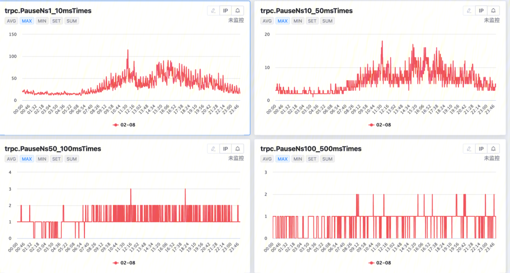

可以看到，超过 50ms，甚至超过 100ms 的 Pause 都时有出现，有理由怀疑这些 Pause 造成了极限条件下的超时毛刺。

## 03 根因分析

找到了可疑的目标之后，后续就要找到问题的根本原因，进而解决问题。
###    3.1 添加调试端口

Golang 官方其实提供了很好的运行时性能分析工具，只需要引入 `net/http/pprof `这个包，就可以在默认的 HTTP 端口上增加很多用于性能分析的 Handler。当然，也可以把它们手动挂到自己定义的其他 HTTP Mux 上。

我这里新开了一个 8002 作为调试端口，挂载上了性能分析的 Handler，然后使用了内网的测试域名绑定到这个端口，方便进行访问。
###    3.2 CPU 热点

既然问题是 GC 占用的 CPU 过高，首先我们分析一下 CPU 热点，进一步确认一下问题。

```bash
go tool pprof -seconds 30 https://<测试域名>/debug/pprof/profile
```

这个命令用于进行 30s 的 CPU 性能分析，在完成之后会进入 profile 的交互工具：
  
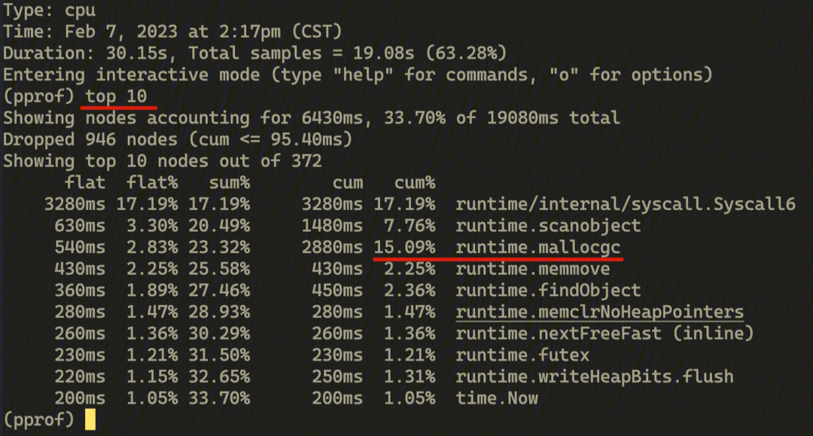

这里直接输入 `top 10` 可以输出 flat 占比最高的 10 个函数，可以看到 `runtime.mallocgc` 的 cum 占比已经达到了 15%，占用了快到 3s CPU 时间。

**Flat vs Cum：**

- Flat 占比是指这个函数自身的代码使用了多少 CPU，不计算子函数的耗时。
- 而 Cum 则代表这个函数实际执行消耗了多少 CPU，也就是包括了所有的子函数（和子函数的子函数...）的耗时。

交互工具这里输入 web 就会自动生成调用图（callgraph）并在浏览器里打开 ，限于文档空间这里只展示重要的部分 ：

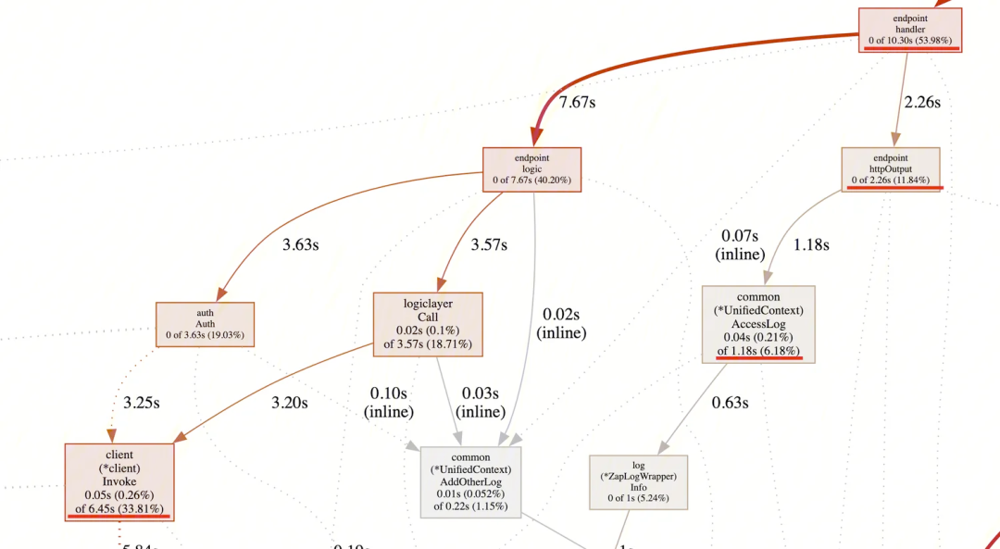

先分析一下主流程，这里业务逻辑一共占用了 54% 左右的 CPU（最上面的 `endpoint.handler` 方法），再往下看，其中 33% 是 RPC 调用（左下角的 client.Invoke），12% 是结果输出（右边的 `endpoint.httpOutput`，包括写出 HTTP Response，日志上报，监控）。剩下 9% 左右就是实际的各种业务逻辑了，因为非常分散且没有集中的点，所以图上没有显示出来。

纵观这个图可以看出，除了 HTTP/RPC 网络调用占用了大部分 CPU 外，并没有其他很明显的 CPU 热点，这就让最后一个热点凸显了出来：

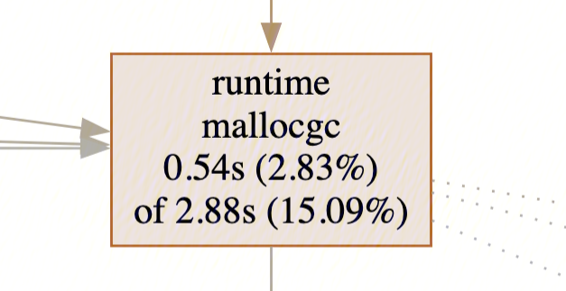

GC 占用的 CPU 在这次 Profiling 过程中占了 15%，比业务逻辑还高！到这里基本确认，GC 一定存在某些问题。
###    3.3 内存分配

确定了 GC 确实占用了过多的 CPU，那下一步就是继续探寻为什么了。

虽然前面一直没有提，但是 GC 大家应该都了解，就是垃圾回收，也就是 Go Runtime 将内存中不再被程序使用到的部分回收回去以供下次使用的过程。

那么 GC 占用 CPU 高，首先想到的就是可能程序申请了太多的内存，造成了很大的内存压力，进而导致不停的 GC，最后占用过高。

我们可以用另一个 pprof 工具 allocs 来确认猜测是否成立，这个工具会记录堆上的对象创建和内存分配，只需要把上面的 HTTP Path 最后的 profile 换成 allocs 即可：

```bash
go tool pprof -seconds 30 https://<测试域名>/debug/pprof/allocs
```

和 CPU Profile 不一样，Allocs 的 Profile 会记录四个不同的信息，可以输入 `o` 查看 `sample_index` 的可选值：


- `alloc_object`：新建对象数量记录；
- `alloc_space`：分配空间大小记录；
- `inuse_object`：常驻内存对象数量记录；
- `inuse_space`：常驻内存空间大小记录。

一般来说，inuse 相关的记录可以用于排查内存泄漏，OOM 等问题。这里我们是 GC 的问题，主要和内存申请和释放有关，所以先看下 `alloc_space`：

输入命令，`sample_index=alloc_space`，然后再 `top 10` 看下：


可以发现，这 30s 一共申请了 1300M 的内存，其中绝大多数都是框架和框架组件，比如 RPC 的网络读取（`consumeBytes`, `ReadFrame`），pb 的解析和序列化（`marshal`），名字服务的选址（`Select`），日志输出（`log`），监控上报（`ReportAttr`）。也没有明显的可疑对象。

我们进行一些简单计算：进行 profiling 的线上节点是 2C2G 配置，看监控单节点大约是 800 QPS 的流量，所以 30s 就是 2w4 的请求，申请了 1300M 的空间，平均一个请求就是大约 50KB 左右。

这个量也比较合理，毕竟一次请求我们需要储存 HTTP 包内容，解析成结构体，还需要调用两次 RPC 接口，最后做日志写出和监控上报，最后再给出返回值，50KB 的资源使用并不算大。而且绝大多数都是框架使用，即使用对象池把业务上的一些小对象复用，对这个内存申请也影响不大。

虽然这个步骤没有排查到想查的问题，但是却发现了一些其他的代码中的小问题，这里也顺便记录下。

首先，上面的 `top 10` 看不出任何问题，但是为了保险起见，看了一下 `top 20`：


这里有三个我们业务代码里的函数，`flat` 都很少，占比加起来也不到 4.5%，不过既然发现了他们 ，就深入看一下函数里各行的分配情况，看看有没有什么问题。

#### 3.3.1 预分配空间

首先看第一个函数 `AddOtherLog`。这个函数的作用是向上下文中添加一些额外的日志信息，最后打日志的时候会输出到最后一个字段中，一般用于输出一些执行过程中的辅助信息，供排查问题使用。

这个函数的定义很简单，我们输入` list AddOtherLog$` 看一下：


可以看到这函数就一行，就是往 `OtherInfo` 这个 Map 里添加一条记录。

第二个函数中的问题其实也和 `OtherInfo` 有关，也 `list FillResponseByLogicLayer$` 看看（只截取相关部分）：


也是往这个 Map 里增加数据，申请了不少内存。

看到这里自然就想到，往 Map 里插入数据，如果 Map 本身空间足够，是不需要重新申请内存的，这里申请了内存必然是因为初始化的时候忘记设置 cap 了，再一看创建 `UnifiedContext` 对象的代码，果然：


把这里改成提供 20 的 cap 之后，`AddOtherLog` 等函数操作 Map 时果然按预期不再申请内存。

**Note：这个优化其实对内存分配和 GC 影响很小。**

因为无论如何储存 20 个 KV 需要的内存总是要申请的，这个改动区别只是在于在初始化的时候申请还是在插入时因为空间不足而申请。而且 Golang 的 Map，KV 是储存在 bucket 里，一个 bucket 存在 8 个 slot，所以在量很小时，实际上最后申请的内存空间差不多。

但这依然是个优化，因为 Map 每次增长都需要重算 hash，但一开始设置好容量就可以避免这部分 CPU 占用。

####    3.3.2 字符串处理

然后看第三个函数 AccessLog：


还是和 OtherInfo 有关，这里是实际打日志的时候，把这个 Map 中的 KV 转换成 `a^b` 这种字符串（当然，最后输出的时候是还得 Join 一下，在很后面，不展示了）。

这里主要耗费在了字符串拼接上。众所周知用 `fmt.Sprintf` 来做字符串拼接性能很差，内存占用也比较高，应该考虑换成 strings.Builder。

这里优化了之后，内存申请减少了一半：


看到效果不错，顺便把其他重字符串拼接的地方也都优化了一下，不过因为都不是主要问题，不再赘述。

####    3.3.3 多次 Query 解析

最后这个问题是在偶然间发现的：

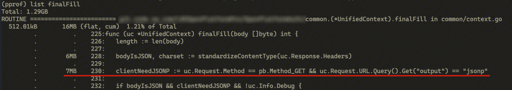

这里明明只是一些判断，为什么会申请 7MB 的内存呢？

仔细一看，`uc.Request.URL.Query()` 这里是个函数调用，再一翻代码，果然这里这个 Query 函数并不会缓存解析结果，每次调用都会重新解析 `querystring`，构造 `url.Values`。

因为请求入口处我们已经解析了 `querystring` 并且储存在了 `uc.Request.Query` 这个字段里，这里应该是（因为 IDE 的代码自动提示而）笔误了。

修改之后符合预期，没有内存申请：

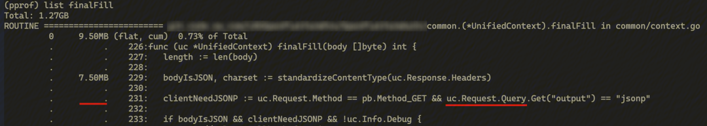

但是这些都是非常小的问题，随手发现修复了之后，申请内存的量有一点点的减少，但 GC 的 CPU 消耗还是没有变化，接下来还是继续排查主要问题。

###    3.4 Trace 追踪

虽然内存分析没有找到什么代码上的问题，但是实际上，从上面的 profile 已经能感觉出一些不对了。

随便看一张上面的 Profile 的截图，会发现一行：

```
Total: 1.27GB
```

因为我这里每次 Profiling 都是 30s，也就是说我们程序每分钟会申请 2.5G 的内存。

按照正常的策略，Golang 是 2 分钟进行一次 GC，但是服务线上使用的节点是 2C2G，所以肯定会因为内存快不足了而提前 GC，并且因为程序的内存需求很稳定，Golang GC 之后应该不会立马把内存还给 OS，所以预期上，我们这个服务的内存占用应该会很高才对。

但回忆之前排查监控时，却显示内存占用相当低：

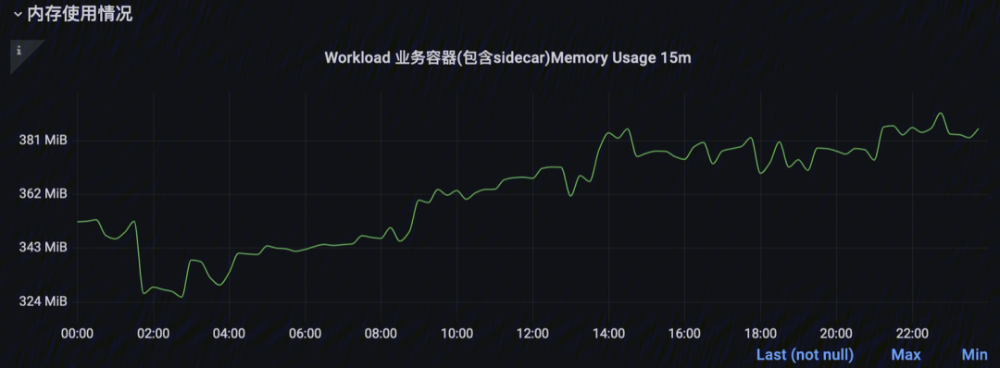

整个 Pod 占用的内存才 400MB 不到，再看程序中上报的自身使用的内存：

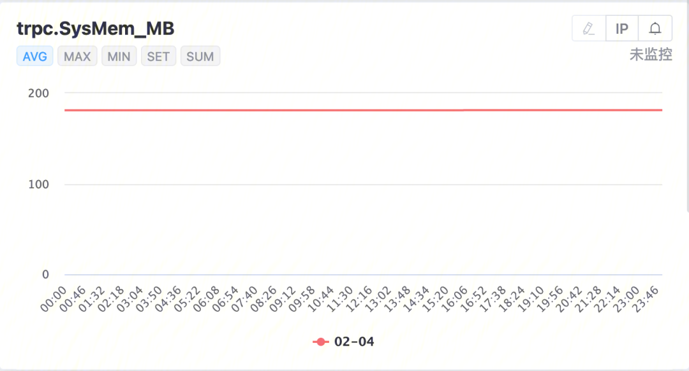

才 200MB 不到，这明显不符合预期，GC 必须以很快的频率执行，才能保证这个内存使用。

想确定 GC 频率是否真的存在问题，有两种方法：

- 在运行的时候增加 `GODEBUG=gctrace=1` 的环境变量，让 Golang runtime 在每次 GC 时往 stderr 输出信息；
- 使用 runtime trace。

因为之前增加的调试端口里已经有了 trace 的功能，所以我们就不用环境变量了，直接进行一下 trace：

```bash
curl 'https://<测试域名>/debug/pprof/trace?seconds=50' > trace.data
go tool trace -http 127.0.0.1:8080 trace.data
```

这里进行了 50s 的 trace，然后使用 golang 的 trace 工具解析结果，并在浏览器中可视化：

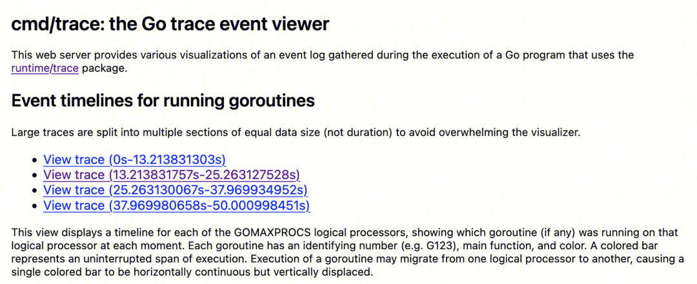

这里因为时间太长被分了段，我们随便点进一段查看：

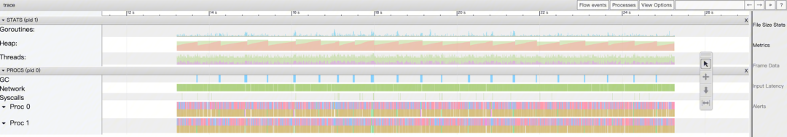

这里从上到下分别是：
- 协程：显示协程的数量和状态；
- 堆内存：显示堆内存占用；
- 线程：显示操作系统线程数量和状态；
- GC 事件：显示 GC 的开始和结束；
- 网络事件：网络 IO 相关片段；
- 系统调用事件：显示系统调用片段；
- Processor 事件：显示执行器在执行哪个协程和函数。

这里我们一眼就看出一个很特别的图案：Heap 堆内存呈现很明显的锯齿状。而且 GC 也在每次下降沿出现，很明显，这就是 GC 在不停的回收内存。

我们通过工具看一下每次 GC 间的间隔是多少：

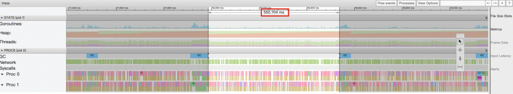

才 550ms，而且通过点击堆内存的最高点，查看统计可以发现：

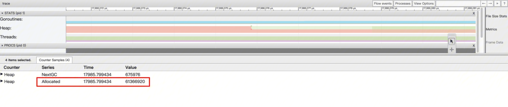

我们内存的最高点，应用程序自身才使用了 60MB 左右的堆内存。

总结一下，也就是说：现在我们的程序占用的内存非常小，但是 GC 却特别频繁，甚至达到了一秒两次。

然后我们回到 trace 首页，找到最底下的 MMU 链接：

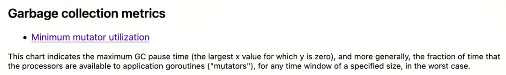

点进去可以看见一个图表，因为我们只关注影响程序执行的 STW 阶段，所以右边只勾选 STW：

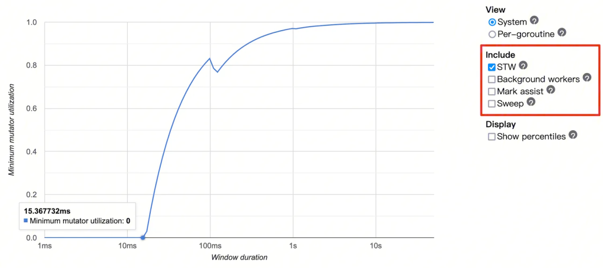

先简单介绍一下这个图的理解方法：
- X 轴表示我们取一个多长的时间窗口；
- Y 轴表示这个时间窗口里，最差情况下有多少比例的 CPU 时间可供业务代码使用。

所以根据这个 X 轴零点我们可以发现，在这段 trace 事件内，最长的 STW 时间有 15ms，然后我们看下以 1s 为时间窗口的情况：

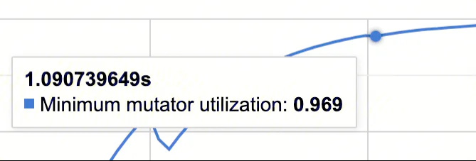

这里的比例大约是 96.9%，也就是说一秒的窗口内，最差会有 31ms 的时间被 GC 的 STW 占用，这个比例可以说很高了。在极端情况下，比如说某次 STW 达到 50ms，确实可能导致某些请求得不到处理而意外超时。

## 04 刨根问底

现在根本原因找到了，是因为 GC 频率过快导致 STW 时间占比太高，造成极端情况下的超时毛刺。

所以现在问题就变成了，在内存占用如此低的情况下，GC 为什么这么频繁？

众所周知，或者说按常识猜测，Golang runtime 的 GC 应该至少遵循三个策略：
- 在代码手动要求 GC 时执行；
- 间隔固定时间触发 GC，作为托底策略；
- 为了防止 OOM，在内存使用率比较高时触发 GC。

策略 1，可以忽略，我们没有手动执行 GC。策略 2，很容易查到，固定时间为 2 分钟 GC 一次。策略 3，很明显不管是 60M 还是 200M，对比 2G 的可用内存，都算不上使用率比较高。

所以肯定存在其他的 GC 策略，或者我们对某条策略还没有完全理解。

###    4.1 再看 Trace

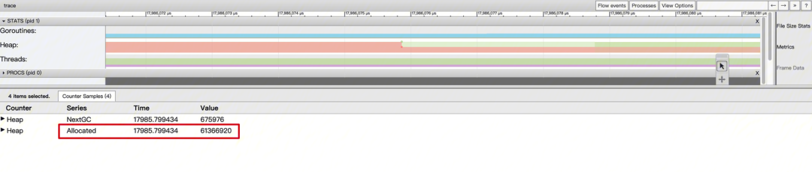

我们重新看这张图，这里除了 Allocated 已分配堆内存大小这一项之外，还有一项叫做 NextGC，直觉告诉我们这个值貌似和 GC 频率有关。

查看 Runtime trace 的相关资料，了解到 Heap 图表的红色部分代表占用内存，而绿色部分的上边沿表示下次 GC 的目标内存， 也就是绿色部分用完之后，就会触发 GC。

通过查看一个刚刚 GC 完毕的 trace 点的信息：

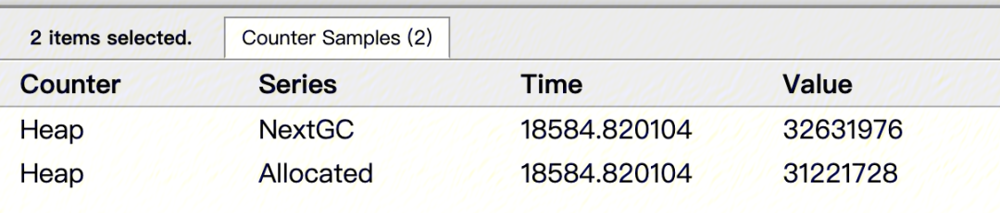

可以发现，每轮 GC 我们只有大约 30M 内存可以用，（快）用完了就触发 GC，就是这个限制造成了特别高的 GC 频率。

其实在 metrics 中也有 NextGC 的相关上报；

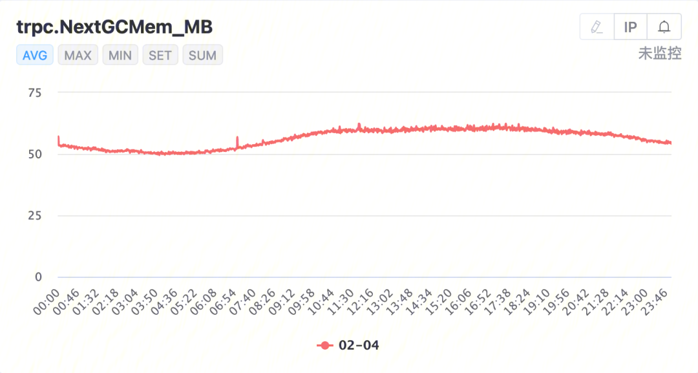

但是和 Trace 里显示剩余空间不同的是，metrics 上报的 NextGC 是 MemStat 结构里的原始值，也就是当 Heap 达到多少的时候触发 GC，更加清晰的能发现 Heap 上限就是 60MB 左右。

###    4.2 GOGC 参数

那么是什么在控制 NextGC 的大小呢，顺着线索我们来到 NextGC 这个值的注释：

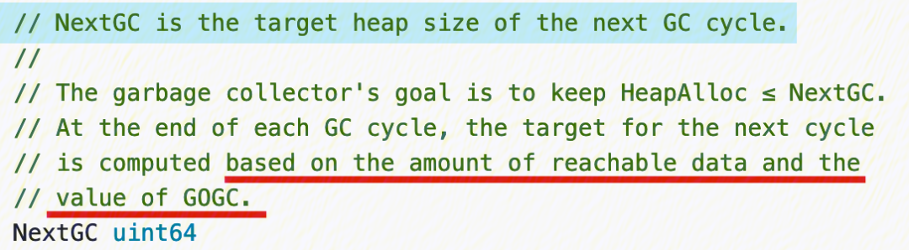

这个值是在上一轮 GC 结束时，基于可达数据和 GOGC 参数计算出来的。

可达数据，可以理解为 GC 过程当中从 root set 出发，沿着指针可以到达的数据，其实也就是还在使用，不能被 GC 的数据。

而 GOGC 这个参数，查看定义：

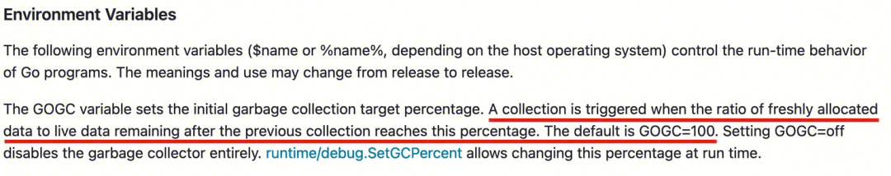

它的功能是控制 GC 的触发：会在每次新申请的内存大小和上次 GC 之后 Live Data（就是上面说过的不能被 GC 的数据） 的大小的比值达到 GOGC 设定的百分比时触发一次 GC。可能有点绕，写成公式其实就是 `NextGC = LiveData * (1 + GOGC / 100)`。

而默认值是 100 就表示，在每次 GC 之后，内存使用量一旦翻倍，就会再触发一次 GC。

很明显，这个默认值就是触发频繁 GC 的罪魁祸首。

## 05 解决方案

问题找到之后解决方案就很简单了，把 `GOGC` 调大就行了。

但是因为 `GOGC` 是个环境变量，如果写死在 Dockerfile 里如果想修改还需要发布上线，不是很灵活。

不过上面的文档也提到了，可以用 `SetGCPercent` 在运行时修改这个策略参数。

###    5.1 SetGCPercent

所以这里的解决方案是在运行时配置中新增了一个配置文件，用于存储运行时策略相关的配置，在代码中 Watch，在配置有改动的时调用 `SetGCPercent` 设置为需要的值：

```go
func runtimeConfigureWatcher(c <-chan config.Response) {
	for r := range c {
		var rc runtimeConfig

		// 将配置文件更新事件 r 解析成结构体 rc，代码省略……

		if rc.GCPercent != nil {
			old := debug.SetGCPercent(*rc.GCPercent)
			log.Infof("Set GC percent from %d to %d", old, *rc.GCPercent)
		} else {
			log.Infof("no GC percent value, do not change")
		}
	}
}
```

### 5.2 上线测试

新代码写完了，该上线看看效果了，但上线前配置要先准备好，这个 `GOGC` 值应该改成多少才合适呢？

我们可以重新看一下 Metrics 里 NextGC 的监控图，这次把 Max 打开：

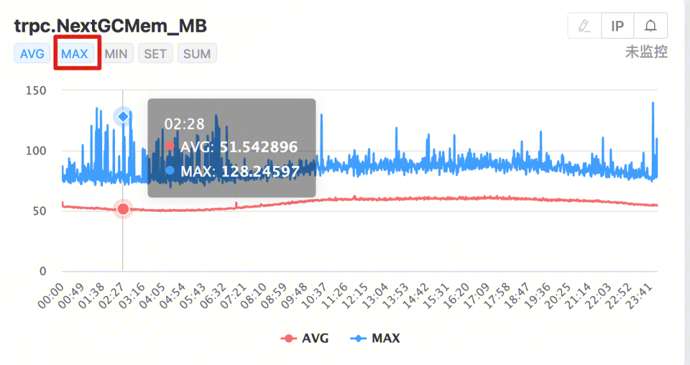

可以发现，NextGC 的平均值在 60MB 左右，但最大值的峰值大概 130MB，除以 2 就是 Live Data，也就是 65MB。

按照 2G 的 Pod 内存大小，简单除一下，大概是 32，所以我们的 GOGC 的上限不能超过 3200。

为了线上安全考虑，我们逐步加大这个值，从 100 开始，每次 x2，依次测试了 200，400，800，1600，效果符合预期，GC CPU 占比有了每次调整都有非常大的下降：

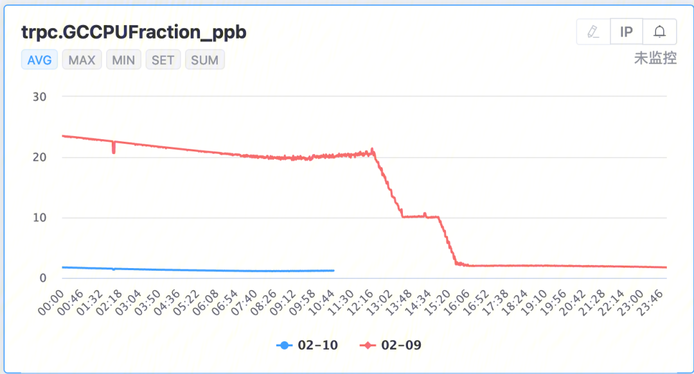

最终，调整到 1600 之后，GC CPU 占比下降到了千分之 1.2 左右。

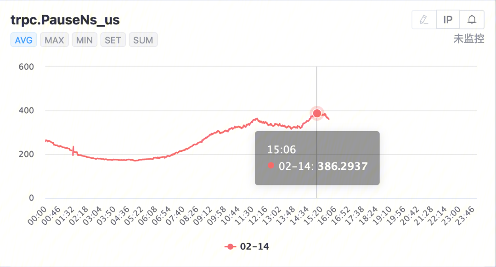

每次 GC 的平均 Pause 时间也更加稳定了，且不超过 400us。

另外，作为辅助验证，也新抓了每个阶段的 Trace，基本上 GOGC 翻倍，GC 间隔也翻倍，非常符合预期。

!> GOGC：100 -> 200 -> 400 -> 800 -> 1600。<br />GC 间隔：0.55s -> 1.2s -> 3.3s -> 6.3s -> 12.8s。

因为测试过很多次，图就不都放出来了，放一下最后 `GOGC` 为 1600 时的图：

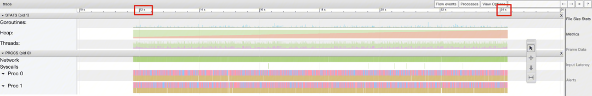

超过了分片大小了，但是可以看出 GC 间隔会超过 12s。顺便也看一下新的 MMU 图：

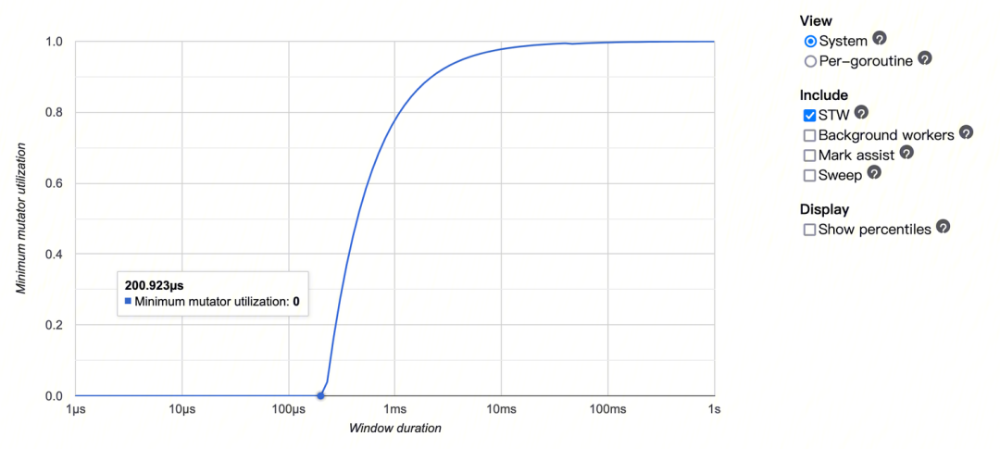

最长 STW 时间 200us。以 1s 为时间窗口的话：

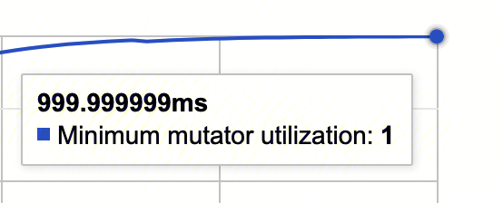

GC 几乎已经不使用任何 CPU 了，占比可以忽略不计。

简单计算一下：
之前 500ms 一次 GC，一分钟 120 次，平均 Pause 500us，一共就是 60ms。
现在 12s 一次 GC，一分钟 5 次，平均 Pause 400us，一共 2ms，仅有之前的 1/30！

###    5.3 Memory Limit

当然，把 GOGC 调大会让 Golang 从 OS 里申请的内存增多，但因为之前实在是太少了，增多之后也还在合理范围内。毕竟申请了内存，不用也是浪费了，这也是空间换时间的思路。以下是调整之后的 SysMem 曲线变化：

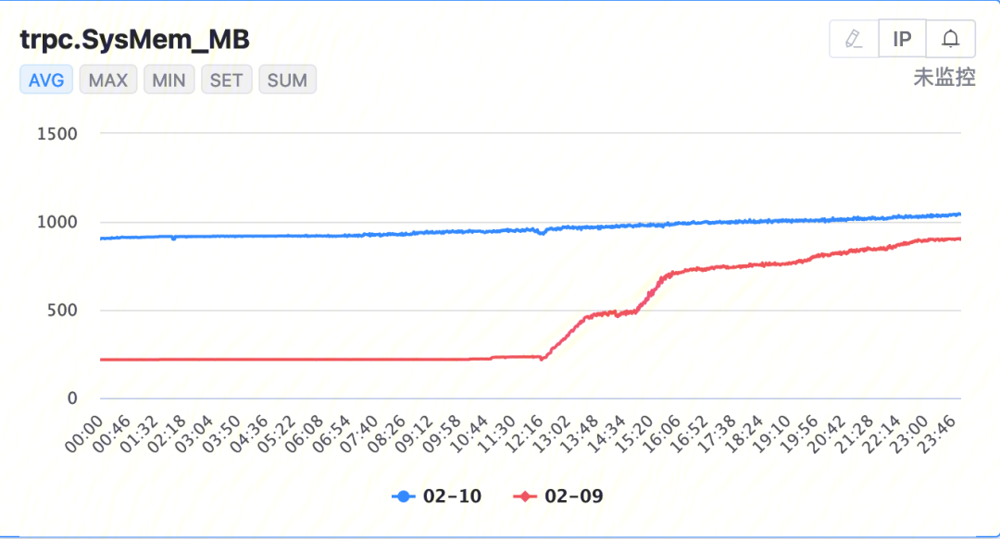

但是看着上面这个曲线有一直上升的趋势，好像还是不能放心的全量上线。

首先需要了解，这个一直上涨现象的原因并不是内存泄漏，而是因为随着程序的运行，某次 GC 后的 Live Data 可能会刚好比较大，所以这次的 NextGC 值也会变高。即使下一次 GC 后 LiveData 回到常规水平，Golang 并不会在 GC 之后就把申请的 SysMem 返还给 OS（避免下次用的时候还得从 OS 里申请），所以 SysMem 几乎必然是单调缓慢递增的。

但是这个现象也不是完全没有隐患。如果某次 GC 完成的时候，因为某种原因 Live Data 特别的大，比如到了 100MB，那么按照 GOGC 1600% 的配置，下次就会在 1700MB 时才会 GC，再加上操作系统本身使用的内存，有可能会导致 OOM。

为了避免这个问题，我们还需要设定一个内存占用的上限。

在很久之前，这还是个比较麻烦的问题（参见最后的参考资料部分），但随着时代的发展，Golang 在 2022 年 8 月 2 日发布的 1.19 版本增加了这个功能：`runtime/debug.SetMemoryLimit`。

内存限制的默认值是很大的值（MaxInt64 byte），基本就是不限制的意思。我们在 GOGC 设置为 1600 的基础上，将 Memory Limit 设置为 1600MB，来防止可能的 OOM。

```go
if rc.MemoryLimit != nil && *rc.MemoryLimit >= 0 {
	newValue := *rc.MemoryLimit * 1024 * 1024 // MB -> Byte
	oldValue := debug.SetMemoryLimit(newValue)
	log.Infof("Set memory limit from %d to %d", oldValue, newValue)
} else {
	log.Infof("No valid memory limit value, do nothing")
}
```
  


最后增加上 Memory Limit 的配置，就是我们的最终解决方案。

## 06 问题解决

理论上问题都解决了，Metrics 上看 GC 占比也下来了，那自然要全量上线看看效果：

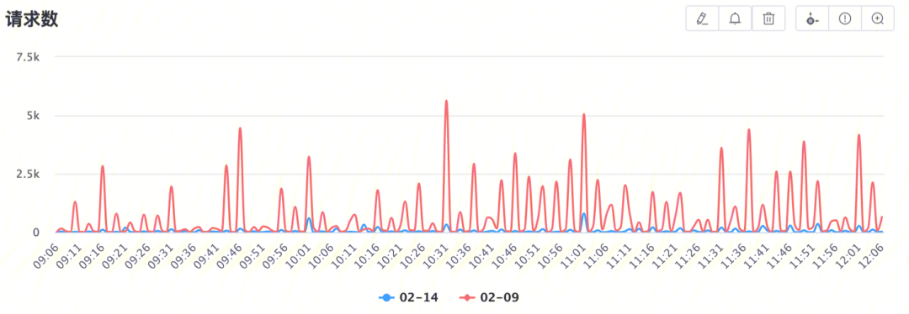

这张图就是文档写到这里的时候，刚刚去截的客户端主动断连监控，对比的是 2 月 9 号，优化上线之前。

可以看到客户端（认为请求超时）断开链接的数量明显比之前下降明显，整体曲线也更加平稳，毛刺更少。

PS：当然客户端断连不可能完全消失，必然存在一些请求确实是达不到客户端的超时要求

## 07 总结

本文档介绍了从发现到解决这个 Golang GC 问题的过程当中，排查问题的思路，观察的重要监控指标和含义，使用的调试工具和方法。

虽然最后只是用了两个简单的函数来解决问题，但上述资料对其他类型的问题排查也有一定价值，故记录下来。

单独看这个问题，因为 Web 类应用大多不存在很大量的全局数据，所以配合上 GOGC 的默认值 100，很多高 QPS 的在线服务可能都会存在 GC 过于频繁，没有利用上申请的 Pod 内存的问题。不过因为 Golang 的 GC 流程也越来越并行化，STW 几乎只会影响极端情况，带来的最多是毛刺而不是服务的整体性问题，所以这个问题可能大多数情况下都被忽略了。

但如果线上存在单节点流量比较大且内存申请几乎完全只与请求量有关，又对极端情况下的耗时有较高要求的服务，可以酌情调整下 GOGC 参数，降低 GC 消耗，提高稳定性。